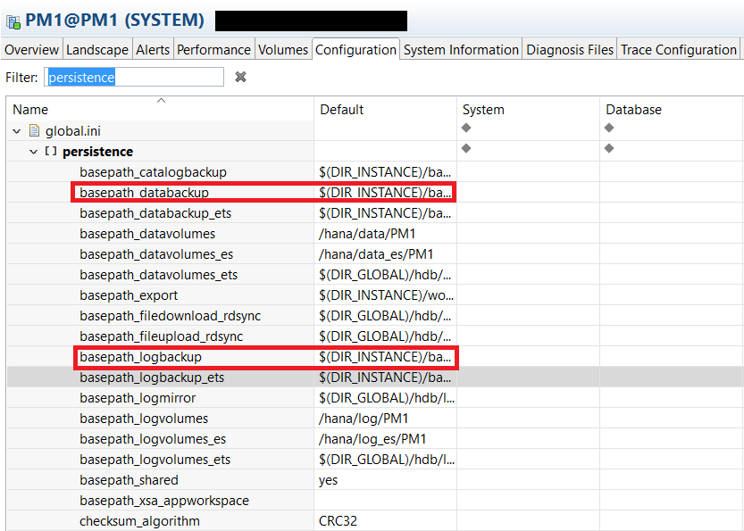
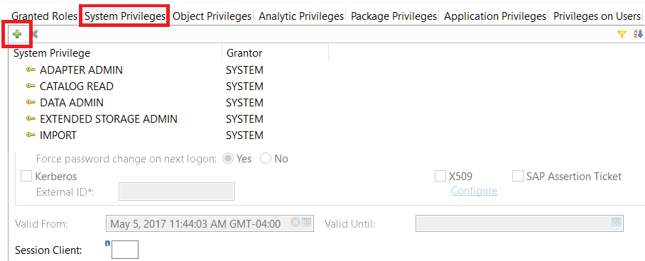

## Prerequisites
 - **System:** Access to an SAP HANA 2.0 system with the optional SAP HANA Dynamic Tiering component installed.
 - **Tutorial**: [Getting Started with SAP HANA Dynamic Tiering](group.dt-get-started) to set up your extended storage.
- **Credentials:** Have access to "`<SID>adm`" for a SSH session on the HANA hosts.

## Next Steps
 - **Tutorials** [Creating Database Backups](https://www.sap.com/)

## Details
### You will learn
  - Capabilities of SAP HANA Cockpit related to SAP HANA Dynamic Tiering
  - Checking the `Esserver` Status to see if Dynamic Tiering is active
  - Checking Coordinator Types to see if extended storage is running and created

 ---
[ACCORDION-BEGIN [Step 1: ](Introduction)]
The overall HANA system including Dynamic Tiering is a single database system which consists of both in-memory and on-disk data stores. In order to ensure data consistency across the entire database, HANA manages the backup and recovery of both the in-memory and on-disk Dynamic Tiering data stores through a single coordinated process. This means that both in-memory data and Dynamic Tiering data are always backed up and restored together.

- Backup and recovery with Dynamic Tiering configured works the same way as in regular HANA scale-out
- Cannot backup or restore a single host individually – You cannot restore just the core HANA part, or just the Dynamic Tiering part. If there is any restore to be done, it has to be done on all the hosts of the entire system
- Cannot create a data backup while one host is down – if a host is entirely down, and there is no stand by, HANA does not allow any data backup. Eg: if your Dynamic Tiering host is down, HANA will not allow you to create any data backup.
- The SAP HANA System is installed in Multiple-Container mode, meaning that it is a Multi-Tenant Database. A Multi-Tenant Database contains exactly one **System** database, and can have multiple **Tenant** databases.
- Backup and recoveries performed on the **Tenant** database can only be done through its **System** database.
- Your user should have the following system privileges (refer to [Create a New User and Assign Permissions](dt-create-schema-load-data-part2) to see how the privileges are assigned):
    - BACKUP ADMIN and BACKUP OPERATOR
    - CATALOG READ

In this set of tutorials, we will be backing up and recovering one of our Tenant databases, `PM1`.

[DONE]

[ACCORDION-END]

[ACCORDION-BEGIN [Step 2: ](Initializing Backup Parameters)]
The Dynamic Tiering data and log backup directory locations are the same as the core HANA data and log backup locations.

To view the currently configured directory paths for the HANA and Dynamic Tiering backups, navigate to the "**Configuration**" tab in the HANA Administration Console, go to "**`global.ini`**" > "**persistence**". These locations identify where the backups will be created. You can modify these locations if desired. Ensure the locations and paths are correct. Set the parameters for `log_mode` and `enable_auto_log_backup` as you like, under the persistence drop-down. The highlighted text shows where the Dynamic Tiering data and log backups are created.

> Note: The configuration parameters can be set at the Tenant level and System level, however the configurations in Tenant and System will be the same regardless of where the configuration parameters are set. In this tutorial, we set the configuration parameters at the Tenant level.

[VALIDATE_1]

[ACCORDION-END]

[ACCORDION-BEGIN [Step 3: ](Backup Permissions)]
You will need to assign the TPCH user the required roles and permissions to create a backup. If you need a quick refresh on how to assign permissions, refer to [Create a New User and Assign Permissions](https://developers.sap.com/tutorials/dt-create-schema-load-data-part2.html). Under the **System Privilege** tab, grant the following permissions to access the backup editor and to execute backup properly:

  - `BACKUP ADMIN`
  - `BACKUP OPERATOR`

Click the deploy button near the top right or the F8 key on your keyboard to execute the changes.

[DONE]

[ACCORDION-END]
