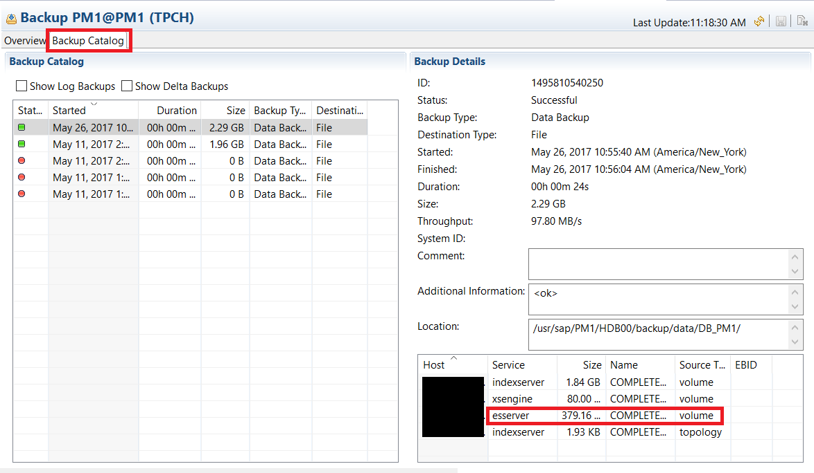
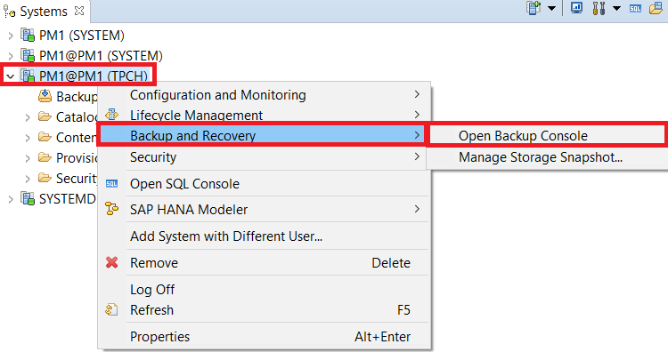
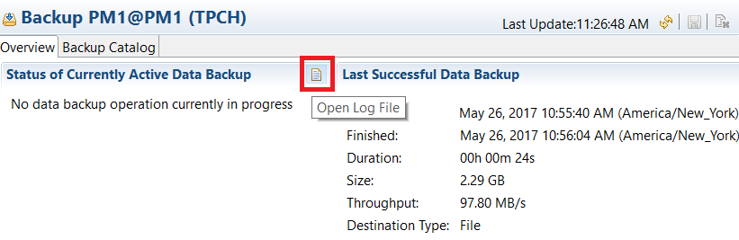
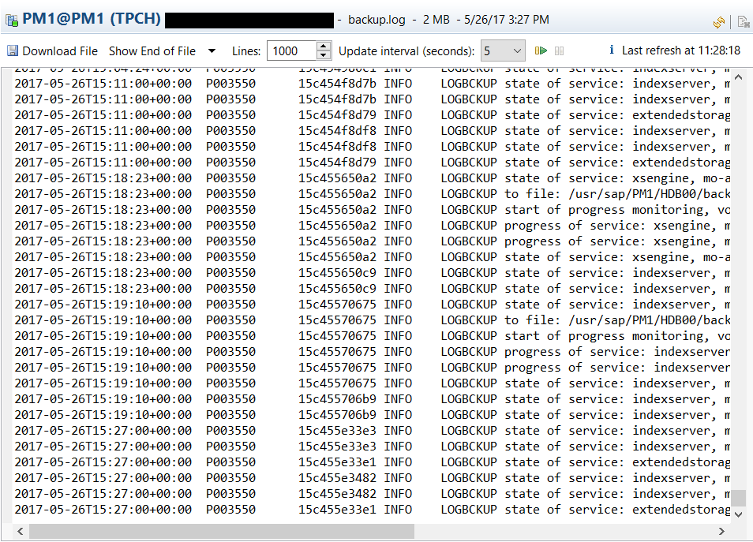

## Prerequisites
 - **Proficiency:** Beginner
 - **Tutorials** [Database Recovery With HANA Dynamic Tiering](https://www.sap.com/)

## Next Steps
 - **Tutorials** [Managing Backup Files](https://www.sap.com/)

## Details
### You will learn
- How to review all backups that have been performed
- How to view details of the backup process (in log files)

### Time to Complete
**10 Min**

---

[ACCORDION-BEGIN [Step 1: ](Introduction)]
HANA has a backup catalog that tracks all backups that have been performed. You can see that a Dynamic Tiering backup was performed by going to the Backup Catalog in the Backup Editor and clicking on the latest backup performed. In the bottom right of the screen, you can see if the service type `esserver` is listed. The `esserver` service component type contains all the data backup and log backup files related to the Dynamic Tiering Process.

> Note: Navigate to the Tenant Database's Backup Console (by right-clicking the System and selecting **Backup and Recovery** > **Open Backup Console**) if you want to see  backup information about the Tenant. If you want to see backup information about the System, right-click the System database instead.

> Additionally, we are using the `TPCH` user for this,

[DONE]

[ACCORDION-END]

[ACCORDION-BEGIN [Step 2: ](Logs of the Backup)]
HANA records the details of the backup process in a log file (not to be confused with the transaction log). The log of the backup is a single file which contains details of all the data and database log backups in the system. This file is contained in the `trace-drectory` of the configured master host (core HANA host).

You can open the log file to view the progress of the backup. First, navigate to the "**Backup Console**" of Database you want to view backup information of (I.e. Tenant or System). We will be navigating to our Tenant's Backup Console for this tutorial.

Select the "**Open Log File**" icon to access this log file.

Once you click this, you can view the log and data backups in the files.

[VALIDATE_1]

[ACCORDION-END]
