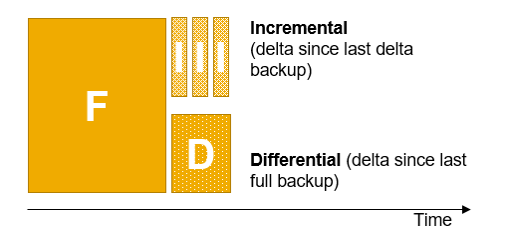
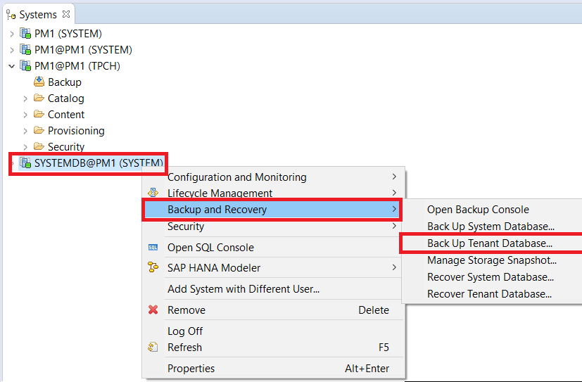
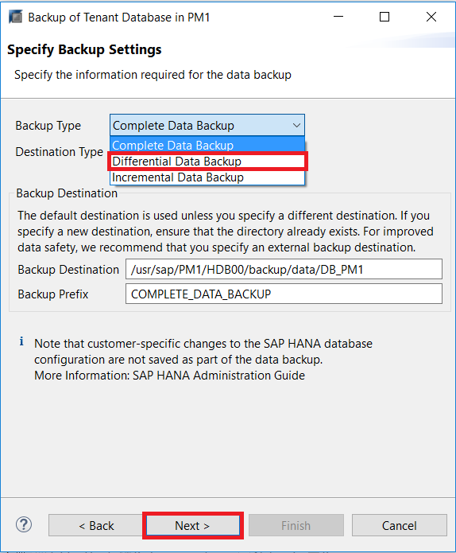
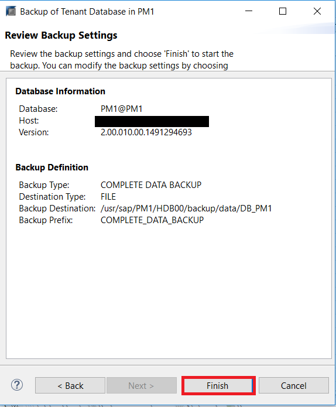
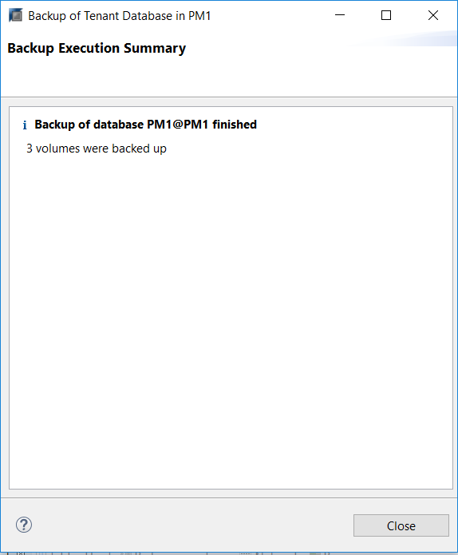
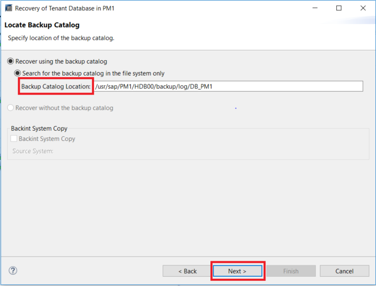
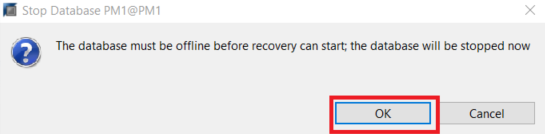
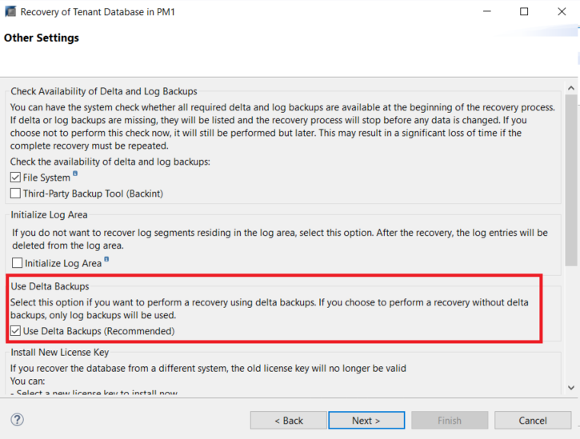
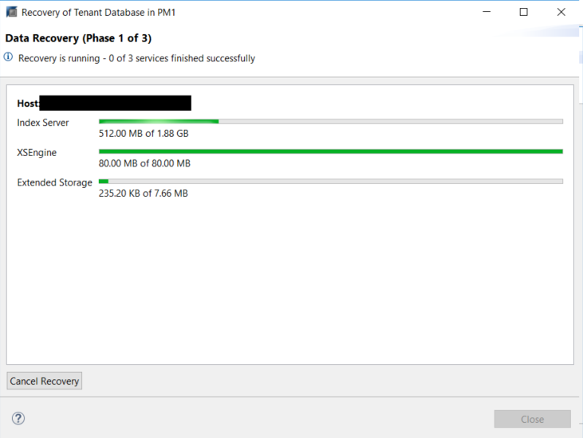

## Prerequisites
 - **Proficiency:** Beginner
 - **Tutorials** [Creating Database Backups](https://www.sap.com/) and [Database Recovery With HANA Dynamic Tiering](https://www.sap.com/)

## Details
### You will learn
- How delta backups are different than a full backup
- The difference between differential backup and incremental backup
- How to perform a delta backup
- How to perform recoveries with delta backups

### Time to Complete
**15 Min**
---

[ACCORDION-BEGIN [Step 1: ](Introduction)]
Delta backups is a feature in SAP HANA to perform backup and recoveries quicker, reducing the need for frequent full backups. Rather than completing a full backup of a system, delta backups enables you to optimize your backup strategy by only capturing the data changed since the last full backup or delta backup - meaning less log backups are read for a recovery. Delta backups can only be created if a full data backup, that is delta backup-enabled, has been performed.

There are **two types** of delta backups:
- **Incremental backups** only captures the data since the last **delta** backup, not the since the full Backups
- **Differential backups** captures the delta data since the last full backup, rather than from the last delta data.

[DONE]

[ACCORDION-END]

[ACCORDION-BEGIN [Step 2: ](Creating Delta Backups)]

Ensure you have chosen an user that has the authorizations described in the tutorial [Initializing Database Backup and Recovery](https://www.sap.com/) before creating the backup.

To perform a backup, navigate to the the Systems panel in your SAP HANA Administration Console, and right click the System database. For the purposes of this tutorial we will be performing a delta backup on a Tenant database. Recall from previous tutorials, that backups can only be performed through the `SystemDB` with a user with correct authorizations.

Select "Back Up Tenant Database".

You will then be prompted to specify the Tenant database you are backing up.

After ,You will then be prompted to specify your backup settings, which allows you to choose the the **Backup Type**. There are two different delta backups you can select, but for the purposes of this tutorial, we will be doing a **Differential Data Backup**.

You can also edit information such as the **Backup Destination** and **Backup Prefix**. The default destination will be shown, which you can accept.

Review the backup settings, and select **Finish**.

> Note: A delta backup cannot be performed unless a full backup was created prior to this delta backup. If a delta backup is created without a prior full backup, there will be an error.

After the backup is complete, the execution summary will show.

[VALIDATE_1]

[ACCORDION-END]

[ACCORDION-BEGIN [Step 3: ](Performing Recoveries)]

Recoveries are performed the same as a normal recovery, as seen in [Database Recovery With HANA Dynamic Tiering](https://www.sap.com/), with the additional step of enabling the delta backup option.

From the SAP HANA Administration Console, right clicking the system in the Systems panel, similar to Step 2, and select "**Backup and Recovery**" > "**Recover Tenant...**".

Once you select this, HANA will prepare the recovery wizard. Once ready, you can specify the recovery type. For the purpose of this lesson, we will recover the database to its most recent state. Select **Next**.

Specify the **Backup Catalog Location** that you wish to use to recover your database. After, select **Next**.

It will then tell you that the database must be offline before recovery can start. Select **OK**

After the database has been stopped (progress can be viewed in the bottom right), you will be prompted to select the data backup. After you have selected, press **Next**

Select the log backup, and press **Next**.

Select **Use Delta Backups** in the **Other Settings** Window.

Review the recovery settings, and select **Finish**. Recovery will done be performed.

The recovery is now complete.

[DONE]

[ACCORDION-END]
