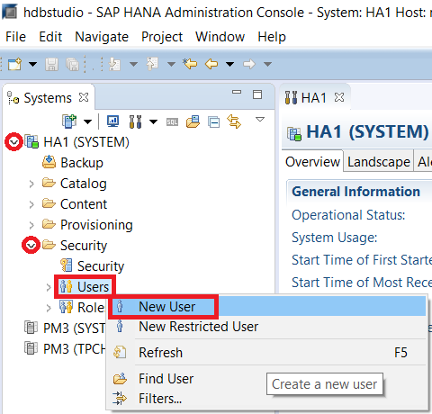
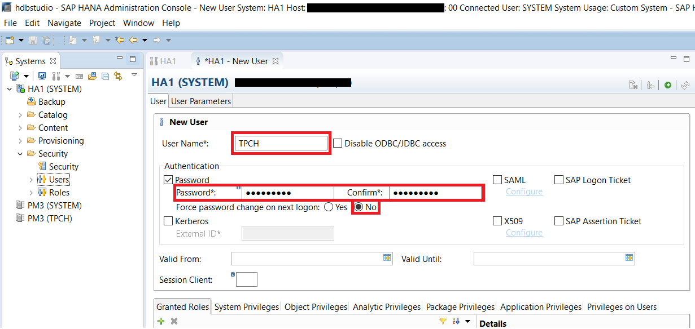
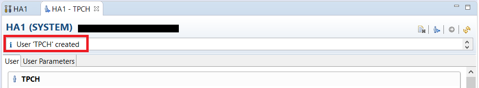
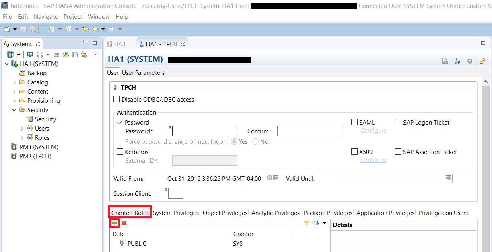
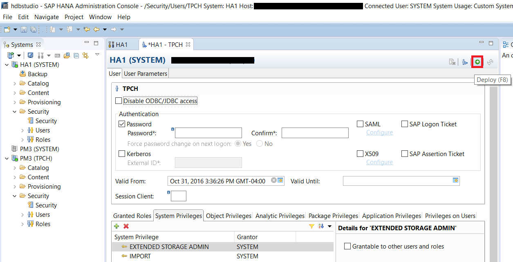
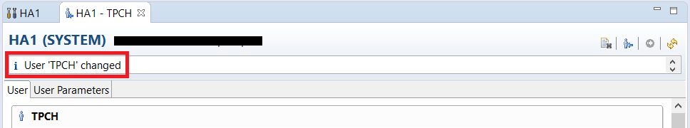
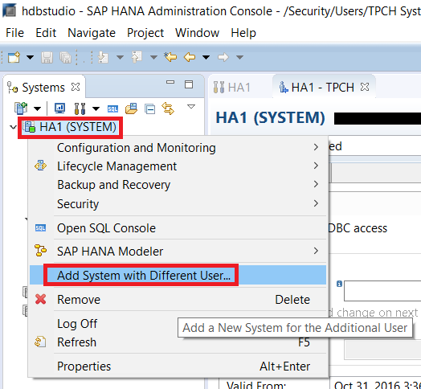
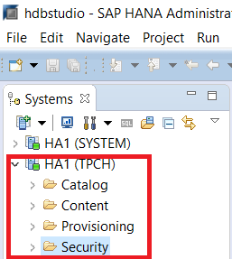

## Prerequisites
 - **Proficiency:** Beginner
 - **Tutorials:** [Create Extended Storage](https://developers.sap.com/tutorials/dt-create-schema-load-data-part1.html)

## Next Steps
 - **Tutorials:** [Create Tables and Import Data](https://developers.sap.com/tutorials/dt-create-schema-load-data-part3.html)

## Details
### You will learn
 - Creating users in the database (you will create the `TPCH` schema that is used throughout the guide).
 - Assigning roles and privileges(permissions) to users.

### Time to Complete
**10 Min**.

---

[ACCORDION-BEGIN [Step 1: ](Create the TPCH User)]
This tutorial is a continuation from the [Create Extended Storage](https://developers.sap.com/tutorials/dt-create-schema-load-data-part1.html) tutorial. You should be logged in as the SYSTEM user by default which has all the necessary roles and privileges assigned to it when you install Dynamic Tiering. Creating tables under the SYSTEM user is an option, but you will create a new user to organize the tables and permissions.

Go to **SAP HANA Administration Console**, then the **Systems** view on the left side. Click on the drop-down arrow of your system to expand the tree list. Then expand to **Security** > **Users**. Right click on the **Users** and select **New Users** to add a new user.

In the new user tab, enter "`TPCH`" for the **User Name**. Enter a password you desire. The requirement for the password is at least one capital letter, one lowercase letter and one digit. Select **No** for **Force password change on next logon** to avoid having to change your password in the future. Keep the other options as default.

> Note: Remember the password since you will need it to login as the `TPCH` user.

Click the green Deploy button near the top right to add the user. You will receive a confirmation message at the top of the tab indicating that the `TPCH` user has been created.

[DONE]

[ACCORDION-END]

[ACCORDION-BEGIN [Step 2: ](Assign Roles and Privileges to the TCPH User)]
In order to add roles and privileges, make sure you are still connected to the HANA system as the "SYSTEM" user. In the same TPCH user window you just added the new user, go to the **Granted Roles** tab on the bottom. Click the green plus sign to add new roles.

In the new window that popped up, search and add all the roles listed below. If you want to select multiple roles while the window is open, hold **Ctrl** and click on the desired roles to be added. Click **OK** after you are done.

  -	`AFLPM_CREATOR_ERASER_EXECUTE`
  -	`CONTENT_ADMIN`
  -	`MODELING`
  -	`sap.hana.uis.db::SITE_DESIGNER`
  -	`sap.hana.uis.db::SITE_USER`

Now go to the **System Privileges** tab and click on the green plus sign to add new privileges. Add the listed privileges the same way you did for the roles.

  - `EXTENDED STORAGE ADMIN`
  - `IMPORT`
  - `CATALOG READ`

In the roles and privileges tabs on the bottom, double check that you have all the items listed below.

  - **Granted Roles**
    -	`AFLPM_CREATOR_ERASER_EXECUTE`
    -	`CONTENT_ADMIN`
    -	`MODELING`
    -	`PUBLIC` (Automatically granted when the `TPCH` user is created)
    -	`sap.hana.uis.db::SITE_DESIGNER`
    -	`sap.hana.uis.db::SITE_USER`
  - **System Privileges**
    -	`EXTENDED STORAGE ADMIN`
    -	`IMPORT`
    - `CATALOG READ`
  - **Object Privileges**
    -	`TPCH` (automatically granted when user is created)

In order to save the changes you made, press the green Deploy button on the top right. You can also press **F8**. You will receive a confirmation message at the top of the tab indicating that the `TPCH` user has been changed.

[DONE]

[ACCORDION-END]

[ACCORDION-BEGIN [Step 3: ](Sign on as TCPH User)]
In the **SAP HANA Administration Console** perspective, right click on your system in the **Systems** view and select **Add System with Different User**.

Enter the `TPCH` user credentials. Check the **Store user name and password in secure storage** check box to have Studio remember your credentials. Then click **Finish**.

You should see another connection to your system show up under the **Systems** view on the left. Notice how this new connection has the "**(`TPCH`)**" user after the System ID to indicate it is logged on as the `TPCH` user.

[VALIDATE_1]

[ACCORDION-END]
