## Prerequisites
 - **Proficiency:** Beginner
 - **Tutorials:** [Create a New User and Assign Permissions](dt-create-schema-load-data-part2)
 - **Files:** Download the data files zip `https://s3.amazonaws.com/sapiq/Dynamic+Tiering+Quick+Start+Guide/SAP+HANA+Dynamic+Tiering+Quick+Start+Guide+-+Supporting+Files.zip` and decompress it to get the individual data files. These "`CSV`" data files contains the data for their respective tables and is needed for the import procedure. Copy all the data files into the "`/hana/shared/<SID>/HDB00/work/TPCH_DATA/`" directory on your HANA Dynamic Tiering host ("`<SID>`" is your system's System Id). This directory also assumes that you are using instance "00". The actual directory format is: "`/hana/shared/<SID>/HDB<instance_number>/<workspace_name>/TPCH_DATA`" and the typical workspace name is "default".

## Next Steps
 - **Tutorials:** [Converting Between an In-Memory Table and an Extended Table](dt-create-schema-load-data-part4)

## Details
### You will learn
 - Creating HANA in-memory column store and Dynamic Tiering extended store tables.
 - Loading data into the in-memory and extended tables.

### Time to Complete
**15 Min**.

---

[ACCORDION-BEGIN [Step 1: ](Create Tables)]
This tutorial is a continuation from previous tutorials. It assumes that you have created a "`TPCH`" user with the correct permissions and signed onto your system in Studio with the user. In **SAP HANA Administration Console** perspective, right click on your system connection signed on with the "`TPCH`" user (format: `<SID> (TPCH)`) and select **Open SQL Console**.

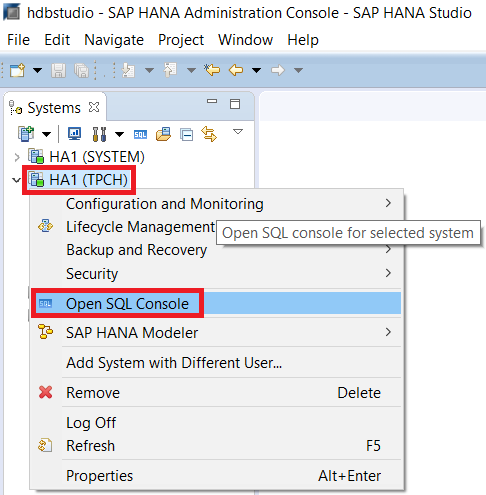

Copy and paste the script below into the SQL console, then click the Execute button to create the in-memory column store tables. You can also press **F8**.

``` sql
CREATE COLUMN TABLE "TPCH"."CUSTOMER_CS" (
   C_CUSTKEY            integer                        not null,
   C_NAME               varchar(25)                    not null,
   C_ADDRESS            varchar(40)                    not null,
   C_NATIONKEY          integer                        not null,
   C_PHONE              char(15)                       not null,
   C_ACCTBAL            decimal(15,2)                  not null,
   C_MKTSEGMENT         char(10)                       not null,
   C_COMMENT            varchar(117)                   not null,
   primary key (C_CUSTKEY)
);

CREATE COLUMN TABLE "TPCH"."LINEITEM_CS" (
    L_ORDERKEY           integer                        not null,
    L_PARTKEY            integer                        not null,
    L_SUPPKEY            integer                        not null,
    L_LINENUMBER         integer                        not null,
    L_QUANTITY           decimal(15,2)                  not null,
    L_EXTENDEDPRICE      decimal(15,2)                  not null,
    L_DISCOUNT           decimal(15,2)                  not null,
    L_TAX                decimal(15,2)                  not null,
    L_RETURNFLAG         char                           not null,
    L_LINESTATUS         char                           not null,
    L_SHIPDATE           date                           not null,
    L_COMMITDATE         date                           not null,
    L_RECEIPTDATE        date                           not null,
    L_SHIPINSTRUCT       char(25)                       not null,
    L_SHIPMODE           char(10)                       not null,
    L_COMMENT            varchar(44)                    not null,
    primary key (L_ORDERKEY, L_LINENUMBER)
);

CREATE COLUMN TABLE "TPCH"."NATION_CS" (
    N_NATIONKEY          integer                        not null,
    N_NAME               char(25)                       not null,
    N_REGIONKEY          integer                        not null,
    N_COMMENT            varchar(152)                   not null,
    primary key (N_NATIONKEY)
);

CREATE COLUMN TABLE "TPCH"."ORDERS_CS" (
    O_ORDERKEY           integer                        not null,
    O_CUSTKEY            integer                        not null,
    O_ORDERSTATUS        char                           not null,
    O_TOTALPRICE         decimal(15,2)                  not null,
    O_ORDERDATE          date                           not null,
    O_ORDERPRIORITY      char(15)                       not null,
    O_CLERK              char(15)                       not null,
    O_SHIPPRIORITY       integer                        not null,
    O_COMMENT            varchar(79)                    not null,
    primary key (O_ORDERKEY)
);

CREATE COLUMN TABLE "TPCH"."PART_CS" (
    P_PARTKEY            integer                        not null,
    P_NAME               varchar(55)                    not null,
    P_MFGR               char(25)                       not null,
    P_BRAND              char(10)                       not null,
    P_TYPE               varchar(25)                    not null,
    P_SIZE               integer                        not null,
    P_CONTAINER          char(10)                       not null,
    P_RETAILPRICE        decimal(15,2)                  not null,
    P_COMMENT            varchar(23)                    not null,
    primary key (P_PARTKEY)
);

CREATE COLUMN TABLE "TPCH"."PARTSUPP_CS" (
    PS_PARTKEY           integer                        not null,
    PS_SUPPKEY           integer                        not null,
    PS_AVAILQTY          integer                        not null,
    PS_SUPPLYCOST        decimal(15,2)                  not null,
    PS_COMMENT           varchar(199)                   not null,
    primary key (PS_PARTKEY, PS_SUPPKEY)
);

CREATE COLUMN TABLE "TPCH"."REGION_CS" (
    R_REGIONKEY          integer                        not null,
    R_NAME               char(25)                       not null,
    R_COMMENT            varchar(152)                   not null,
    primary key (R_REGIONKEY)
);

CREATE COLUMN TABLE "TPCH"."SUPPLIER_CS" (
    S_SUPPKEY            integer                        not null,
    S_NAME               char(25)                       not null,
    S_ADDRESS            varchar(40)                    not null,
    S_NATIONKEY          integer                        not null,
    S_PHONE              char(15)                       not null,
    S_ACCTBAL            decimal(15,2)                  not null,
    S_COMMENT            varchar(101)                   not null,
    primary key (S_SUPPKEY)
);

ALTER TABLE "TPCH"."CUSTOMER_CS"
  ADD CONSTRAINT FK_CUSTOMER_REFERENCE_NATION_CS FOREIGN KEY(C_NATIONKEY)
      REFERENCES "TPCH"."NATION_CS" (N_NATIONKEY)
      ON DELETE RESTRICT ON UPDATE RESTRICT;

ALTER TABLE "TPCH"."LINEITEM_CS"
    ADD CONSTRAINT FK_LINEITEM_REFERENCE_ORDERS_CS FOREIGN KEY(L_ORDERKEY)
      REFERENCES "TPCH"."ORDERS_CS" (O_ORDERKEY)
      ON DELETE RESTRICT ON UPDATE RESTRICT;

ALTER TABLE "TPCH"."LINEITEM_CS"
    ADD CONSTRAINT FK_LINEITEM_REFERENCE_PART_CS FOREIGN KEY(L_PARTKEY)
      REFERENCES "TPCH"."PART_CS" (P_PARTKEY)
      ON DELETE RESTRICT ON UPDATE RESTRICT;

ALTER TABLE "TPCH"."LINEITEM_CS"
    ADD CONSTRAINT FK_LINEITEM_REFERENCE_SUPPLIER_CS FOREIGN KEY  (L_SUPPKEY)
      REFERENCES "TPCH"."SUPPLIER_CS" (S_SUPPKEY)
      ON DELETE RESTRICT ON UPDATE RESTRICT;

ALTER TABLE "TPCH"."NATION_CS"
    ADD CONSTRAINT FK_NATION_REFERENCE_REGION_CS FOREIGN KEY (N_REGIONKEY)
    REFERENCES "TPCH"."REGION_CS" (R_REGIONKEY)
    ON DELETE RESTRICT ON UPDATE RESTRICT;

ALTER TABLE "TPCH"."ORDERS_CS"
    ADD CONSTRAINT FK_ORDERS_REFERENCE_CUSTOMER_CS FOREIGN KEY  (O_CUSTKEY)
      REFERENCES "TPCH"."CUSTOMER_CS" (C_CUSTKEY)
      ON DELETE RESTRICT ON UPDATE RESTRICT;

ALTER TABLE "TPCH"."PARTSUPP_CS"
    ADD CONSTRAINT FK_PARTSUPP_REFERENCE_PART_CS FOREIGN KEY  (PS_PARTKEY)
      REFERENCES "TPCH"."PART_CS" (P_PARTKEY)
      ON DELETE RESTRICT ON UPDATE RESTRICT;

ALTER TABLE "TPCH"."PARTSUPP_CS"
    ADD CONSTRAINT FK_PARTSUPP_REFERENCE_SUPPLIER_CS FOREIGN KEY  (PS_SUPPKEY)
      REFERENCES "TPCH"."SUPPLIER_CS" (S_SUPPKEY)
      ON DELETE RESTRICT ON UPDATE RESTRICT;

ALTER TABLE "TPCH"."SUPPLIER_CS"
    ADD CONSTRAINT FK_SUPPLIER_REFERENCE_NATION_CS FOREIGN KEY  (S_NATIONKEY)
      REFERENCES "TPCH"."NATION_CS" (N_NATIONKEY)
      ON DELETE RESTRICT ON UPDATE RESTRICT;
```

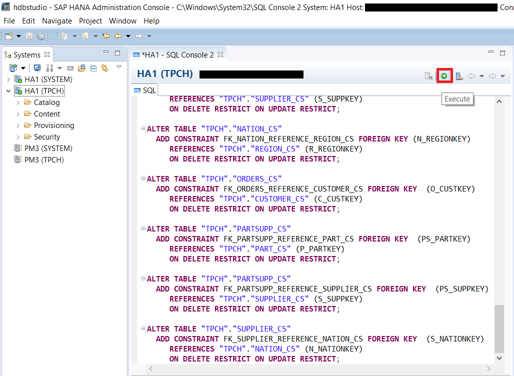

Verify that everything executed successfully without error.

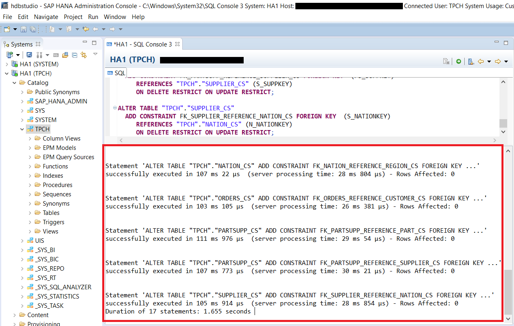

Now replace the code in the SQL console with the script below and then click the Execute button to create the Dynamic Tiering tables. You can also press **F8**.

``` sql
CREATE TABLE "TPCH"."CUSTOMER_DT" (
    C_CUSTKEY            integer                        not null,
    C_NAME               varchar(25)                    not null,
    C_ADDRESS            varchar(40)                    not null,
    C_NATIONKEY          integer                        not null,
    C_PHONE              char(15)                       not null,
    C_ACCTBAL            decimal(15,2)                  not null,
    C_MKTSEGMENT         char(10)                       not null,
    C_COMMENT            varchar(117)                   not null,
    primary key (C_CUSTKEY)
) USING EXTENDED STORAGE;

CREATE TABLE "TPCH"."LINEITEM_DT" (
    L_ORDERKEY           integer                        not null,
    L_PARTKEY            integer                        not null,
    L_SUPPKEY            integer                        not null,
    L_LINENUMBER         integer                        not null,
    L_QUANTITY           decimal(15,2)                  not null,
    L_EXTENDEDPRICE      decimal(15,2)                  not null,
    L_DISCOUNT           decimal(15,2)                  not null,
    L_TAX                decimal(15,2)                  not null,
    L_RETURNFLAG         char                           not null,
    L_LINESTATUS         char                           not null,
    L_SHIPDATE           date                           not null,
    L_COMMITDATE         date                           not null,
    L_RECEIPTDATE        date                           not null,
    L_SHIPINSTRUCT       char(25)                       not null,
    L_SHIPMODE           char(10)                       not null,
    L_COMMENT            varchar(44)                    not null,
    primary key (L_ORDERKEY, L_LINENUMBER)
) USING EXTENDED STORAGE;

CREATE TABLE "TPCH"."NATION_DT" (
    N_NATIONKEY          integer                        not null,
    N_NAME               char(25)                       not null,
    N_REGIONKEY          integer                        not null,
    N_COMMENT            varchar(152)                   not null,
    primary key (N_NATIONKEY)
) USING EXTENDED STORAGE;

CREATE TABLE "TPCH"."ORDERS_DT" (
    O_ORDERKEY           integer                        not null,
    O_CUSTKEY            integer                        not null,
    O_ORDERSTATUS        char                           not null,
    O_TOTALPRICE         decimal(15,2)                  not null,
    O_ORDERDATE          date                           not null,
    O_ORDERPRIORITY      char(15)                       not null,
    O_CLERK              char(15)                       not null,
    O_SHIPPRIORITY       integer                        not null,
    O_COMMENT            varchar(79)                    not null,
    primary key (O_ORDERKEY)
) USING EXTENDED STORAGE;

CREATE TABLE "TPCH"."PART_DT" (
    P_PARTKEY            integer                        not null,
    P_NAME               varchar(55)                    not null,
    P_MFGR               char(25)                       not null,
    P_BRAND              char(10)                       not null,
    P_TYPE               varchar(25)                    not null,
    P_SIZE               integer                        not null,
    P_CONTAINER          char(10)                       not null,
    P_RETAILPRICE        decimal(15,2)                  not null,
    P_COMMENT            varchar(23)                    not null,
    primary key (P_PARTKEY)
) USING EXTENDED STORAGE;

CREATE TABLE "TPCH"."PARTSUPP_DT" (
    PS_PARTKEY           integer                        not null,
    PS_SUPPKEY           integer                        not null,
    PS_AVAILQTY          integer                        not null,
    PS_SUPPLYCOST        decimal(15,2)                  not null,
    PS_COMMENT           varchar(199)                   not null,
    primary key (PS_PARTKEY, PS_SUPPKEY)
) USING EXTENDED STORAGE;

CREATE TABLE "TPCH"."REGION_DT" (
    R_REGIONKEY          integer                        not null,
    R_NAME               char(25)                       not null,
    R_COMMENT            varchar(152)                   not null,
    primary key (R_REGIONKEY)
) USING EXTENDED STORAGE;

CREATE TABLE "TPCH"."SUPPLIER_DT" (
    S_SUPPKEY            integer                        not null,
    S_NAME               char(25)                       not null,
    S_ADDRESS            varchar(40)                    not null,
    S_NATIONKEY          integer                        not null,
    S_PHONE              char(15)                       not null,
    S_ACCTBAL            decimal(15,2)                  not null,
    S_COMMENT            varchar(101)                   not null,
    primary key (S_SUPPKEY)
) USING EXTENDED STORAGE;
```

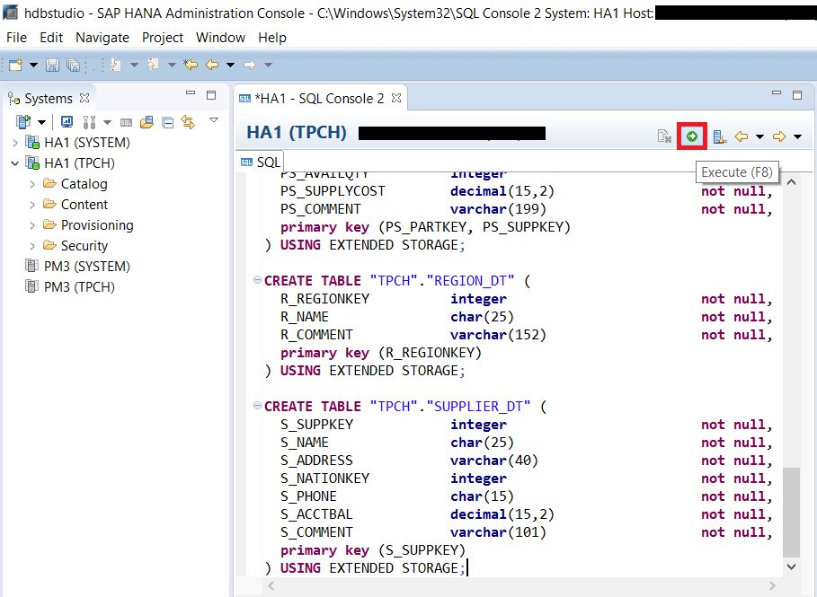

Again, verify everything executed correctly.

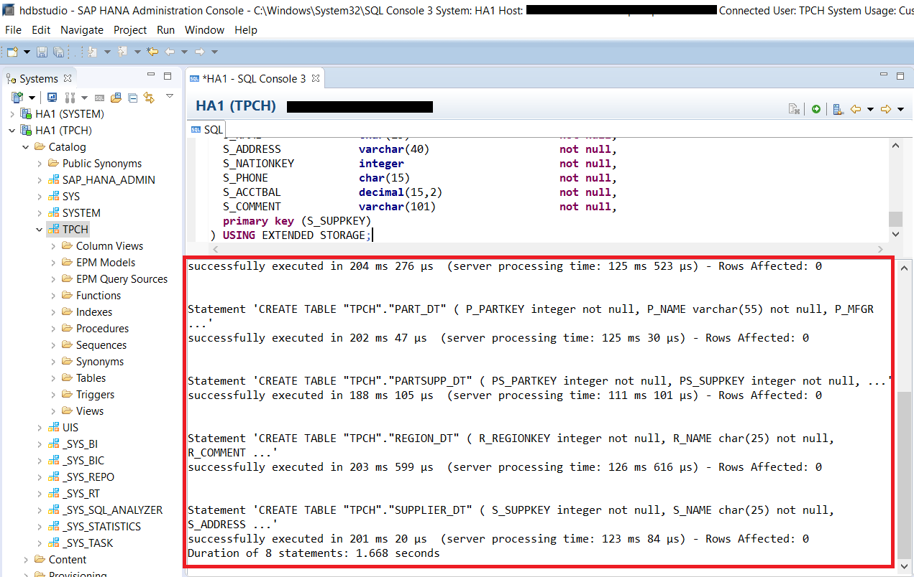

In the **Systems** view on the left hand side, expand to **Catalog** > **TPCH** > **Tables**. Right click on table and select **Refresh**. You can also press **F5**.

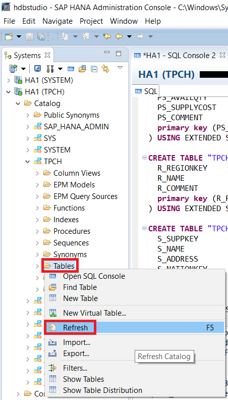

After Studio finishes refreshing, you should see the tables listed below under the **Tables** folder. The Dynamic Tiering tables (suffix "DT") will also have "EXTENDED" displayed after the table name, while the in-memory column store tables (suffix "CS") will not.


[VALIDATE_1]

[ACCORDION-END]

[ACCORDION-BEGIN [Step 2: ](Script Explanation)]
The key syntax difference when creating a Dynamic Tiering table is the addition of the "USING EXTENDED STORAGE" clause to the "CREATE TABLE" statement as seen in the picture below. You may also notice that it did not explicitly state that the Dynamic Tiering tables should be "COLUMN" tables. All Dynamic Tiering tables are stored as columnar tables, so the use of "CREATE COLUMN TABLE" vs "CREATE TABLE" is optional.

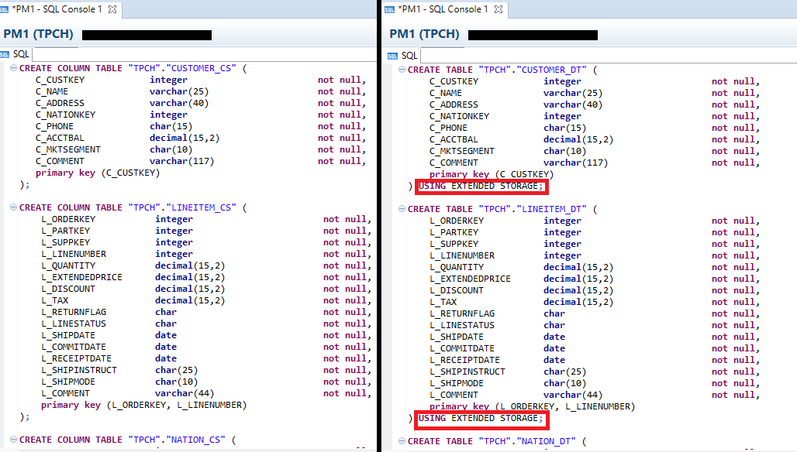

[DONE]

[ACCORDION-END]

[ACCORDION-BEGIN [Step 3: ](Download Data Files and Copy to HANA Directory)]
One of the prerequisites of this tutorial is that you have copied the data files onto your SAP HANA system. Before proceeding, please download the [Data Files](https://s3.amazonaws.com/sapiq/Dynamic+Tiering+Quick+Start+Guide/SAP+HANA+Dynamic+Tiering+Quick+Start+Guide+-+Supporting+Files.zip) zip and decompress it to get the individual data files. These "`CSV`" data files contains the data for their respective tables and is needed for the import procedure. Copy all the data files into the "`/hana/shared/<SID>/HDB00/work/TPCH_DATA/`" directory on your HANA Dynamic Tiering host. "`<SID>`" is your system's System ID. For example, the `<SID>` as seen in the pictures in step 1 is `HA1` This directory also assumes that you are using instance "00". The actual directory format is: "`/hana/shared/<SID>/HDB<instance_number>/<workspace_name>/TPCH_DATA`" and the typical workspace name is "default".

[DONE]

[ACCORDION-END]

[ACCORDION-BEGIN [Step 4: ](Import Data into Tables)]
In **SAP HANA Administration Console** perspective, right click on your system signed on with the TPCH user (format: `<sid> (TPCH)`) and select **Open SQL Console**.


Copy and paste the script below in to the SQL console. Replace "`<SID>`" with your system's System Id. Then press the Execute button to import data from the "`CSV`" files in to the in-memory tables. You can also press **F8**. Verify everything executed successfully.

``` sql
IMPORT FROM CSV FILE '/hana/shared/<SID>/HDB00/work/TPCH_DATA/Region.csv'
INTO TPCH.REGION_CS;

IMPORT FROM CSV FILE '/hana/shared/<SID>/HDB00/work/TPCH_DATA/Nation.csv'
INTO TPCH.NATION_CS;

IMPORT FROM CSV FILE '/hana/shared/<SID>/HDB00/work/TPCH_DATA/Supplier.csv'
INTO TPCH.SUPPLIER_CS
  WITH THREADS 4 BATCH 10000;

IMPORT FROM CSV FILE '/hana/shared/<SID>/HDB00/work/TPCH_DATA/Customer.csv'
INTO TPCH.CUSTOMER_CS
  WITH THREADS 4 BATCH 10000;

IMPORT FROM CSV FILE '/hana/shared/<SID>/HDB00/work/TPCH_DATA/Orders.csv'
INTO TPCH.ORDERS_CS
  WITH THREADS 8 BATCH 10000;

IMPORT FROM CSV FILE '/hana/shared/<SID>/HDB00/work/TPCH_DATA/Part.csv'
INTO TPCH.PART_CS
  WITH THREADS 4 BATCH 10000;

IMPORT FROM CSV FILE '/hana/shared/<SID>/HDB00/work/TPCH_DATA/LineItem.csv'
INTO TPCH.LINEITEM_CS
  WITH THREADS 8 BATCH 10000;

IMPORT FROM CSV FILE '/hana/shared/<SID>/HDB00/work/TPCH_DATA/PartSupp.csv'
INTO TPCH.PARTSUPP_CS
  WITH THREADS 4 BATCH 10000;
```

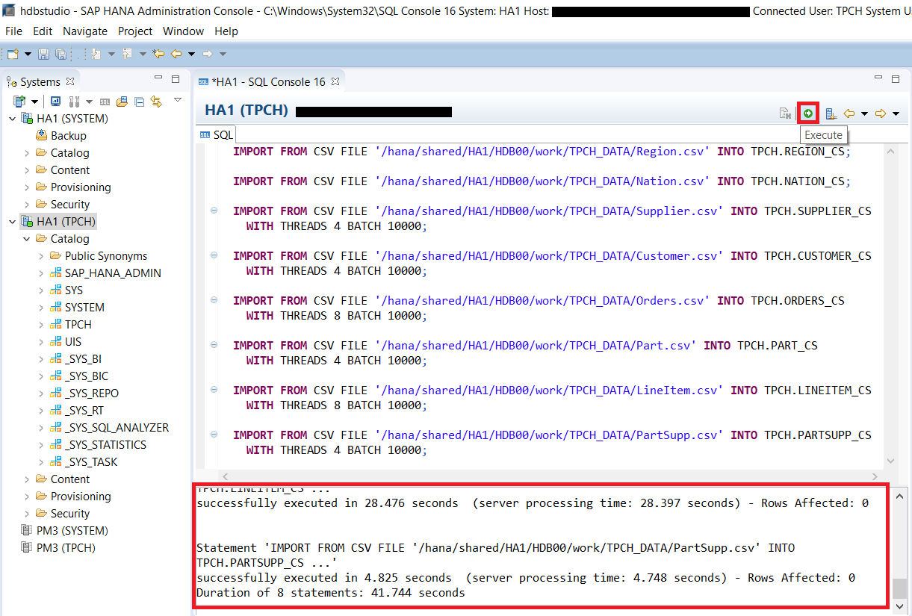

>Note: If you encounter an error stating "`Could not execute 'import…''… Please check configuration: csv_import_path_filter.`", then in the **Systems** tab,  double click your system (`<sid> (SYSTEM)`) to open the Administration screen. Navigate to the **Configuration** tab and enter "`enable_csv_import_path_filter`" in the **Filter** search bar. Change both values under the **System** column to "`false`" (either double click the cell or right click and choose **Change…**). The Default column values will be true. Follow the numbered steps in the following picture for more clarification.

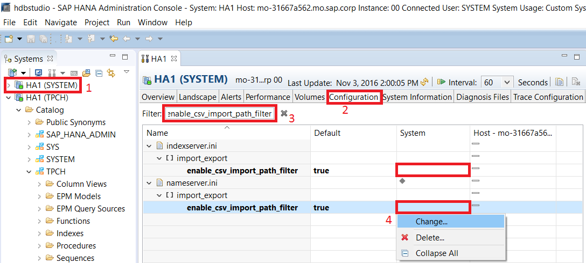

Delete the code in the SQL Console. Then copy and paste the script below into the SQL console. Replace "`<SID>`" with your system's System Id. Then press the Execute button to import data from the "`CSV`" files in to the extended tables. Verify everything executed successfully.

``` sql
IMPORT FROM CSV FILE '/hana/shared/<SID>/HDB00/work/TPCH_DATA/Region.csv'
INTO TPCH.REGION_DT;

IMPORT FROM CSV FILE '/hana/shared/<SID>/HDB00/work/TPCH_DATA/Nation.csv'
INTO TPCH.NATION_DT;

IMPORT FROM CSV FILE '/hana/shared/<SID>/HDB00/work/TPCH_DATA/Supplier.csv'
INTO TPCH.SUPPLIER_DT;

IMPORT FROM CSV FILE '/hana/shared/<SID>/HDB00/work/TPCH_DATA/Customer.csv'
 INTO TPCH.CUSTOMER_DT;

IMPORT FROM CSV FILE '/hana/shared/<SID>/HDB00/work/TPCH_DATA/Orders.csv'
INTO TPCH.ORDERS_DT;

IMPORT FROM CSV FILE '/hana/shared/<SID>/HDB00/work/TPCH_DATA/Part.csv'
INTO TPCH.PART_DT;

IMPORT FROM CSV FILE '/hana/shared/<SID>/HDB00/work/TPCH_DATA/LineItem.csv'
INTO TPCH.LINEITEM_DT;

IMPORT FROM CSV FILE '/hana/shared/<SID>/HDB00/work/TPCH_DATA/PartSupp.csv'
 INTO TPCH.PARTSUPP_DT;
```

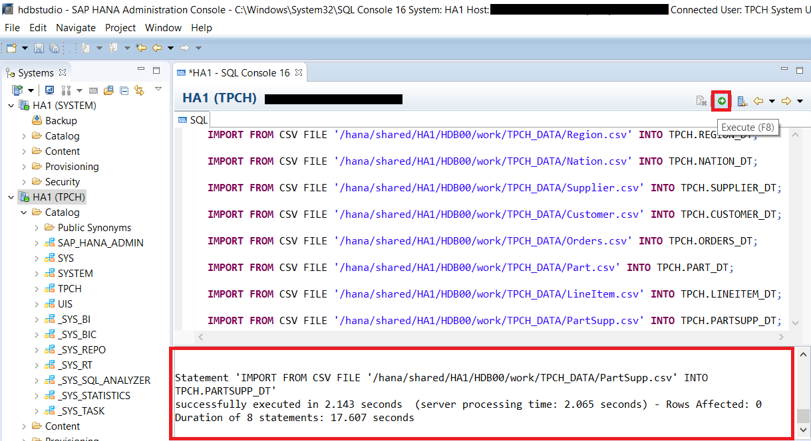

Go to the **System** tab on the left side. By clicking the drop down arrow,  expand **Catalog** > **TPCH** > **Tables**. Right click on any table (e.g. **`CUSTOMER_CS`**) and select **Open Data Preview** to query data from that table. You should be able to see that the table is not empty and that the table has been successfully imported. Repeat the check for all tables in the Tables folder.

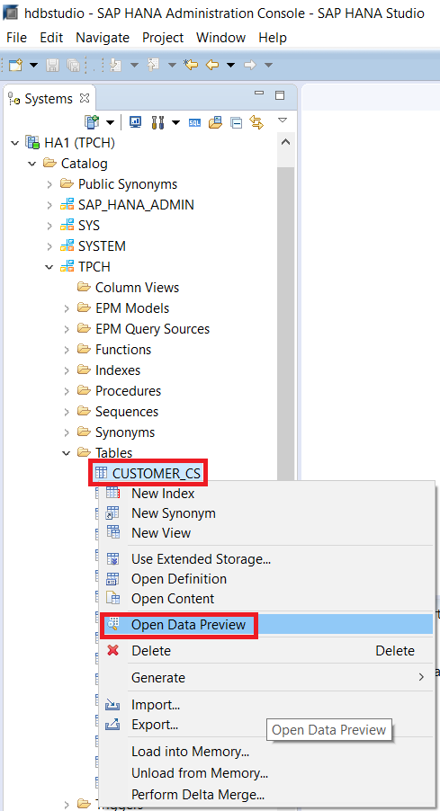

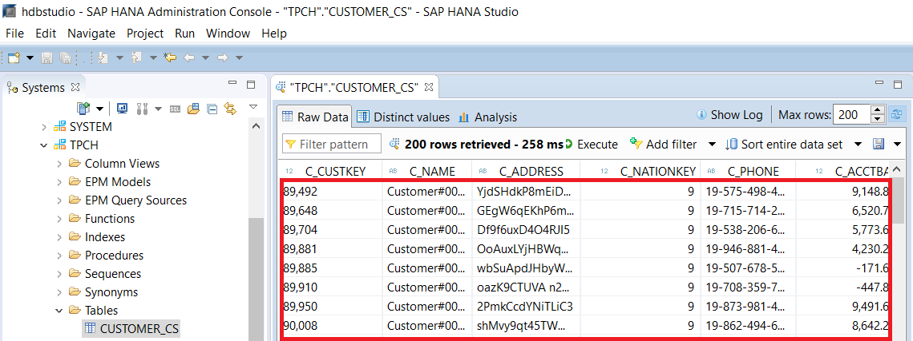

[DONE]

[ACCORDION-END]
