## Prerequisites
 - **Proficiency:** Beginner
 - **Tutorials:** [Create Tables and Import Data](https://developers.sap.com/tutorials/dt-create-schema-load-data-part3.html)

## Next Steps
 - **Tutorials:** [Selectively Move Data Between In-Memory and Extended Tables](https://developers.sap.com/tutorials/dt-create-schema-load-data-part5.html)

## Details
### You will learn
 - Converting between an in-memory and an extended table using SAP HANA Studio.
 - Converting between an in-memory and an extended table using SQL scripts.

### Time to Complete
**15 Min**.

---

[ACCORDION-BEGIN [Step 1: ](Convert to an In-Memory Table Using Studio)]
In **SAP HANA Administration Console** perspective, go to the **System** view on the left side. By clicking the drop down arrow, expand **Catalog** > **TPCH** > **Tables**. Right click on the table **`NATION_DT`** and select **Do Not Use Extended Storage** to convert the table into an in-memory table.

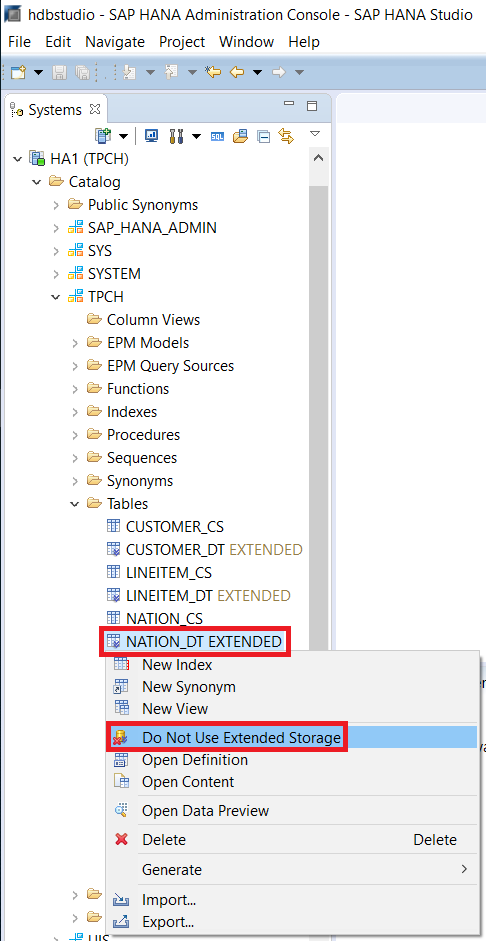

When prompted to confirm the action, click **Yes**.


Once the conversion is complete, a pop up window will appear verifying that the change has been made, click **OK** to close the window.

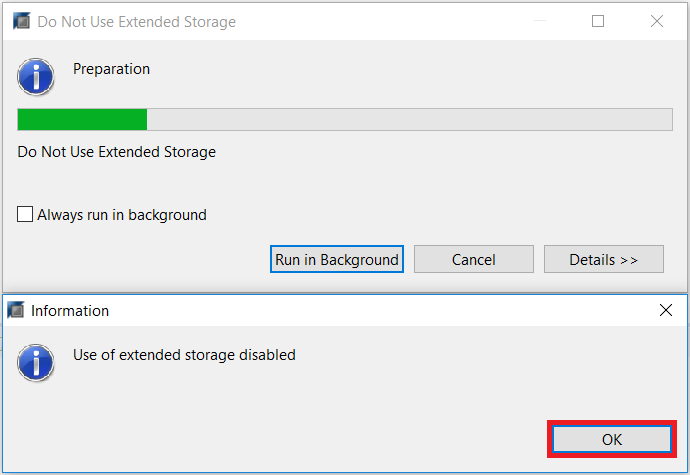

Verify the table has been correctly converted. You should see that the **`NATION_DT`** table no longer has the "`EXTENDED`" attribute and is now an in-memory table.

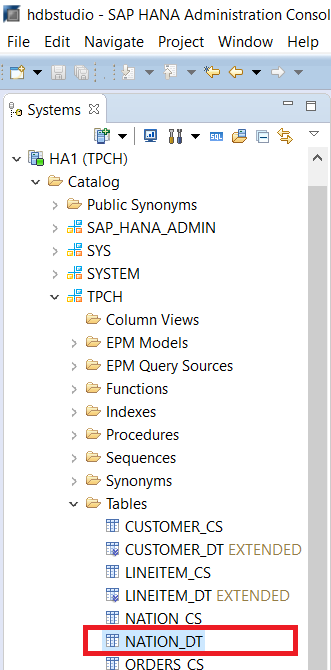

[DONE]

[ACCORDION-END]

[ACCORDION-BEGIN [Step 2: ](Convert to an Extended Table Using Studio)]
Right click on the table **`NATION_DT`**, which is now an in-memory table, and select **Use Extended Storage**.

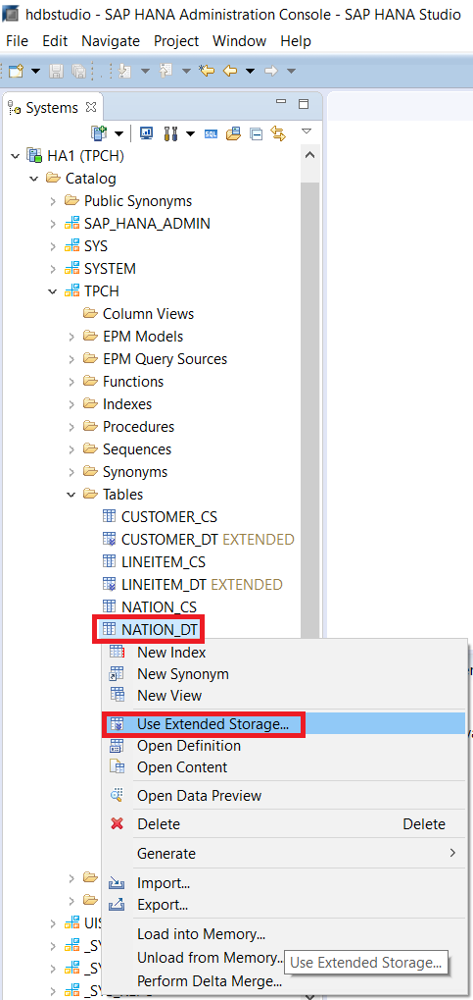

In the "Use Extended Storage" pop up window, keep all the options as default. Click the **Move** button to proceed.


Once the conversion is complete, a pop up window will appear verifying that the change has been made, click **OK** to close the window.

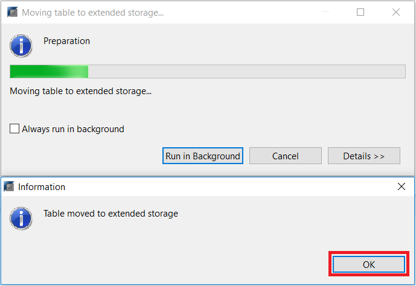

Verify the table has been correctly converted. You should see that the **`NATION_DT`** table has the "`EXTENDED`" attribute and is now an extended table.

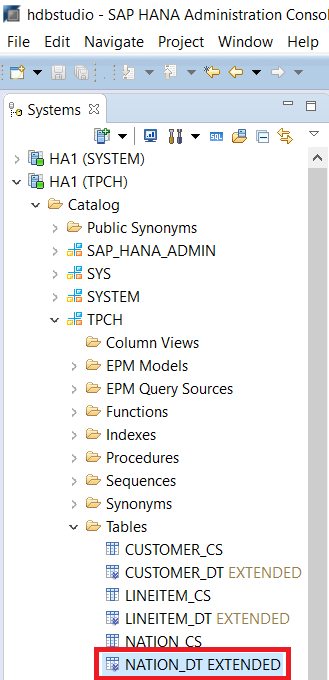

[DONE]

[ACCORDION-END]

[ACCORDION-BEGIN [Step 3: ](Convert to an In-Memory Table Using SQL script)]
Right click on your system and select **Open SQL Console** to open a new SQL console.

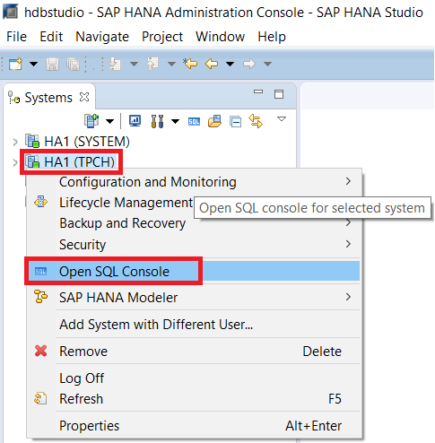

Copy and paste the script below into the console. Then press the Execute button to run the script.

``` sql
ALTER TABLE "TPCH"."NATION_DT" NOT USING EXTENDED STORAGE
```

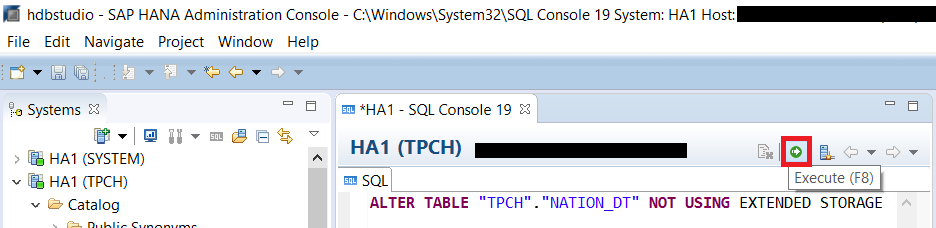

Refresh the **Tables** folder by right clicking on it and then selecting **Refresh**. You can also press **F5**.

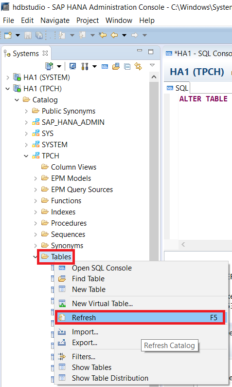

After the refresh is completed, you should see that the **`NATION_DT`** table no longer has the "`EXTENDED`" attribute and is now an in-memory table.


[DONE]

[ACCORDION-END]

[ACCORDION-BEGIN [Step 4: ](Convert to an Extended Table Using SQL script)]
Open a new SQL console and paste the script below into the console. Then press the Execute button to run.

``` sql
ALTER TABLE "TPCH"."NATION_DT" USING EXTENDED STORAGE
```
Notice that the difference between the "`ALTER TABLE`" statement here and the previous section is the removal of "`NOT`".

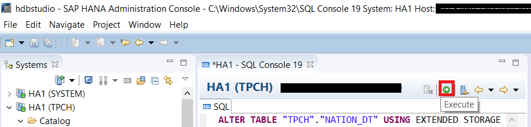

Refresh the **Tables** folder and you should see that the **`NATION_DT`** table has the "`EXTENDED`" attribute and is now an extended table.


[DONE]

[ACCORDION-END]

[ACCORDION-BEGIN [Step 5: ](Foreign Key Considerations)]
In SAP HANA 2.0, Dynamic Tiering tables do not support foreign keys between two extended tables or between an extended table and an in-memory table. This means that if an in-memory table is part of a foreign key relationship, then it cannot be converted to an extended table in Dynamic Tiering until the foreign key relationship has been dropped.

Since Dynamic Tiering tables do not support foreign keys yet, the change from an extended table to in-memory is always possible (because extended tables would not have any foreign key attached to them), but in-memory to extended storage might be restricted due to foreign key constraints.

You can verify which tables in the `TPCH` schema are part of a foreign key constraint by executing the following statement in a SQL Console:

``` sql
SELECT * FROM "SYS"."REFERENTIAL_CONSTRAINTS"
  WHERE SCHEMA_NAME='TPCH'
```

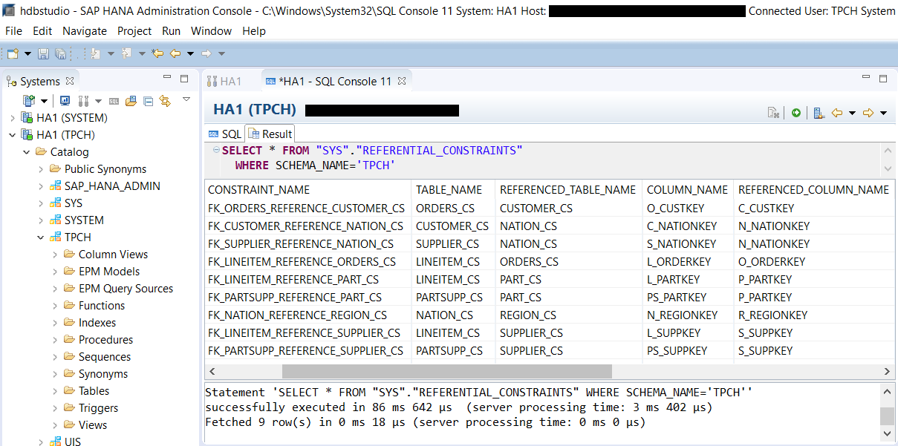

You can look at the columns: `TABLE_NAME`, `REFERENCED_TABLE_NAME` and `CONSTRAINT_NAME` to identify which tables have the foreign key constraint on them and what the constraint is. Examples of tables that hold a foreign key constraint in this schema are `ORDERS_CS`, `CUSTOMER_CS`, `SUPPLIER_CS`, `LINEITEM_CS`, `NATION_CS` and `REGION_CS`. Therefore, these tables cannot be converted to extended tables, unless the foreign key is dropped.

[VALIDATE_1]

[ACCORDION-END]
