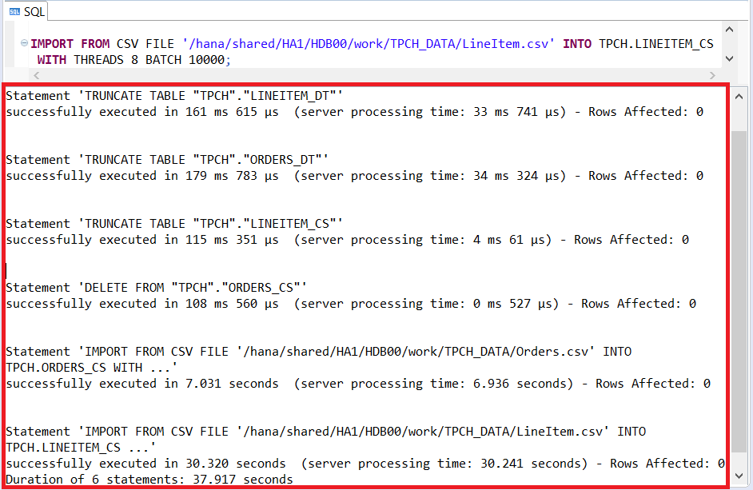
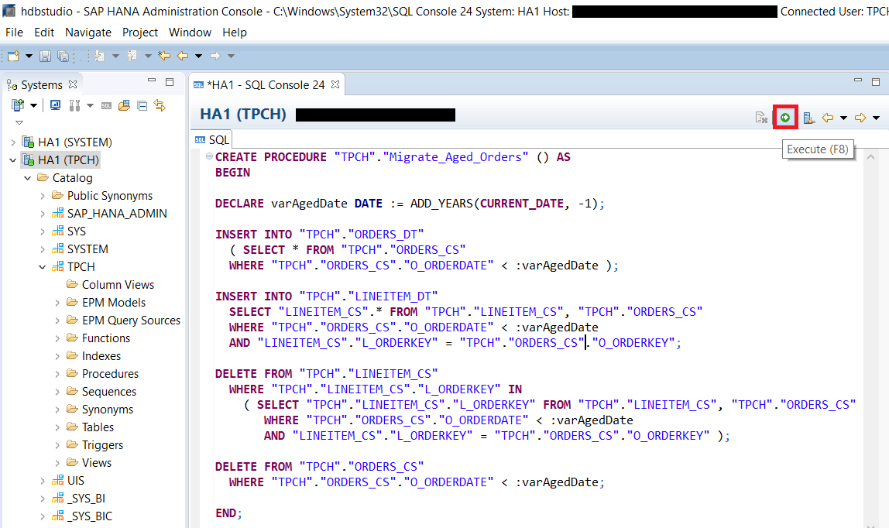
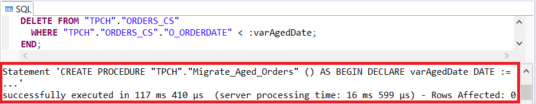
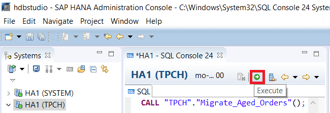
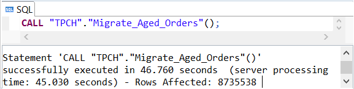
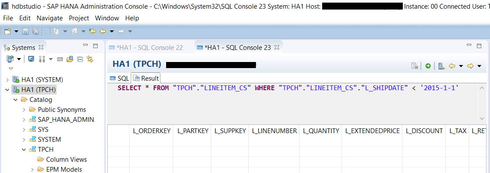

## Prerequisites
 - **Proficiency:** Beginner
 - **Tutorials:** [Selectively Move Data Between In-Memory and Extended Tables](https://developers.sap.com/tutorials/dt-create-schema-load-data-part5.html)

## Next Steps
 - **Tutorials:** [View Data Across Both In-Memory and Dynamic Tiering Tables Using a SQL View](https://developers.sap.com/tutorials/dt-create-schema-load-data-part7.html)

## Details
### You will learn
 - Creating a stored procedure to migrate records in related tables as a single transaction.
 - Calling a stored procedure.

### Time to Complete
**10 Min**.

---

[ACCORDION-BEGIN [Step 1: ](Prepare Data)]
In order to ensure that the migration script runs correctly, we will start by refreshing the data in the tables that will be used in this tutorial section. Run the script below to restore data. Replace "`<SID>`" with your system's System Id.

``` sql
TRUNCATE TABLE "TPCH"."LINEITEM_DT";
TRUNCATE TABLE "TPCH"."ORDERS_DT";
TRUNCATE TABLE "TPCH"."LINEITEM_CS";
DELETE FROM "TPCH"."ORDERS_CS";

IMPORT FROM CSV FILE '/hana/shared/<SID>/HDB00/work/TPCH_DATA/Orders.csv'
INTO TPCH.ORDERS_CS
  WITH THREADS 8 BATCH 10000;

IMPORT FROM CSV FILE '/hana/shared/<SID>/HDB00/work/TPCH_DATA/LineItem.csv'
INTO TPCH.LINEITEM_CS
  WITH THREADS 8 BATCH 10000;
```

`ORDERS_CS` cannot be truncated unlike the other tables due to foreign key constraints. Therefore a "`DELETE`" statement is used instead.


Verify everything executed correctly.



[VALIDATE_1]

[ACCORDION-END]

[ACCORDION-BEGIN [Step 2: ](Create Migration Stored Procedure)]
In the last tutorial section [Selectively Move Data Between In-Memory and Extended Tables](https://developers.sap.com/tutorials/dt-create-schema-load-data-part5.html) we manually created a transaction that executed the "`INSERT`" and "`DELETE`" statements as an atomic operation to migrate the data between a single in-memory and a single extended table. We are now going to go a step further and use a stored procedure to execute the required statements to migrate data for 2 related tables as a single transaction. Using a stored procedure simplifies the process of migrating the data and also ensures that the full migration process of inserting and deleting is consistently executed.

Now you will create a stored procedure to migrate data older than a year, from the in-memory tables over to the Dynamic Tiering tables. The `Migrate_Aged_Orders()` stored procedure migrates historical data from in-memory `ORDERS_CS` and `LINEITEM_CS` tables to the Dynamic Tiering tables `ORDERS_DT` and `LINEITEM_DT` respectively. Copy and paste the script below into a SQL console. Then press the Execute button to create the procedure and verify it executed correctly.

``` sql
CREATE PROCEDURE "TPCH"."Migrate_Aged_Orders" () AS
BEGIN

DECLARE varAgedDate DATE := ADD_YEARS(CURRENT_DATE, -1);

INSERT INTO "TPCH"."ORDERS_DT"
    ( SELECT * FROM "TPCH"."ORDERS_CS"
    WHERE "TPCH"."ORDERS_CS"."O_ORDERDATE" < :varAgedDate );

INSERT INTO "TPCH"."LINEITEM_DT"
    SELECT "LINEITEM_CS".* FROM "TPCH"."LINEITEM_CS", "TPCH"."ORDERS_CS"
    WHERE "TPCH"."ORDERS_CS"."O_ORDERDATE" < :varAgedDate
    AND "LINEITEM_CS"."L_ORDERKEY" = "TPCH"."ORDERS_CS"."O_ORDERKEY";

DELETE FROM "TPCH"."LINEITEM_CS"
    WHERE "TPCH"."LINEITEM_CS"."L_ORDERKEY" IN
      ( SELECT "TPCH"."LINEITEM_CS"."L_ORDERKEY" FROM "TPCH"."LINEITEM_CS", "TPCH"."ORDERS_CS"
        WHERE "TPCH"."ORDERS_CS"."O_ORDERDATE" < :varAgedDate
        AND "LINEITEM_CS"."L_ORDERKEY" = "TPCH"."ORDERS_CS"."O_ORDERKEY" );

DELETE FROM "TPCH"."ORDERS_CS"
    WHERE "TPCH"."ORDERS_CS"."O_ORDERDATE" < :varAgedDate;

END;
```

>The declaration of "`varAgedDate`" at the beginning ensures that each data modification statement is referencing the same date value and does not change through out the execution of the stored procedure. Otherwise, an execution during midnight might produce unexpected results.
>The `INSERT` and `DELETE` statements are executed in a specific order to comply with the declared foreign key relationship between the in-memory `ORDERS_CS` and `LINEITEM_CS` tables.





[DONE]

[ACCORDION-END]

[ACCORDION-BEGIN [Step 3: ](Call Migration Store Procedure)]
Now that the store procedure is created. You can execute the stored procedure by calling it. Run the script below in a SQL console and make sure it executed correctly.

``` sql
CALL "TPCH"."Migrate_Aged_Orders"();
```

Since calling the stored procedure is a single statement, the entire store procedure will execute as a single atomic transaction even-though the procedure itself contains multiple statements.





Verify that the data has been inserted into the **`LINEITEM_DT`** table either by executing the query below or by right clicking on the table in the catalogue and choosing **Open Data Preview**.

``` sql
 SELECT * FROM "TPCH"."LINEITEM_DT";
```


Verify that the data has been deleted from the **`LINEITEM_CS`** table by executing the query below and confirming that no records are returned.

``` sql
SELECT * FROM "TPCH"."LINEITEM_CS" WHERE "TPCH"."LINEITEM_CS"."L_SHIPDATE" < '2015-1-1';
```



[DONE]

[ACCORDION-END]
