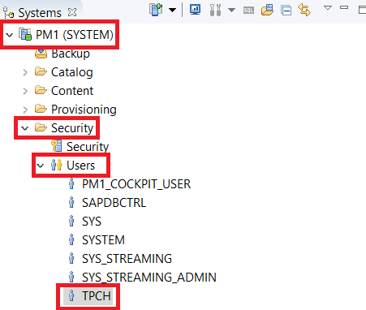
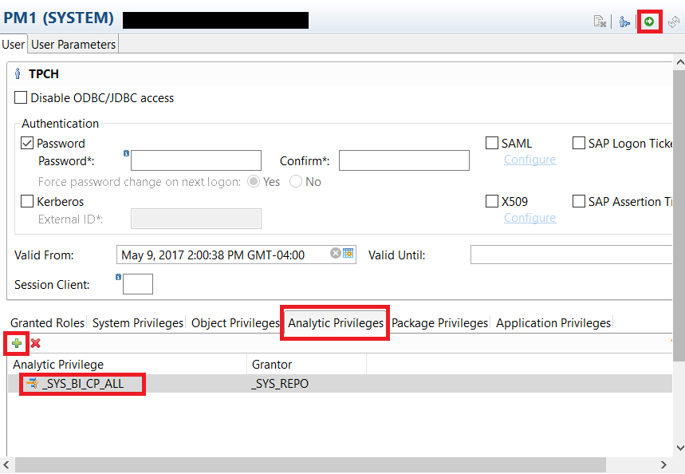
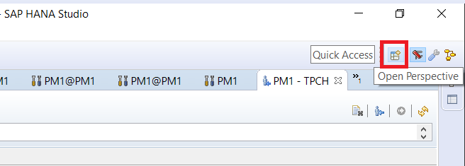
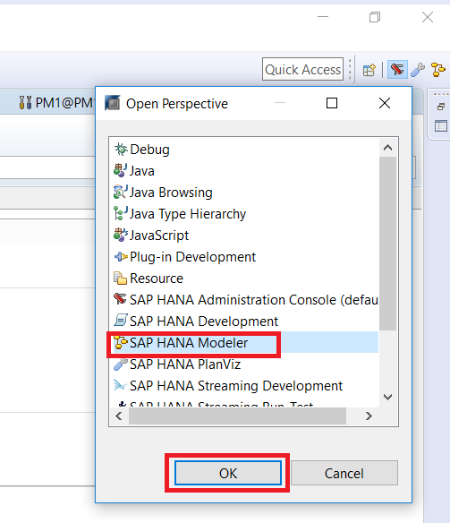

## Prerequisites
 - **Proficiency:** Beginner
 - **System:** Access to an SAP HANA 2.0 system with the optional SAP HANA Dynamic Tiering component installed. If not, refer to the lesson starting from [Creating and Removing Extended Storage](https://developers.sap.com/group.dt-get-started.html) to set up your extended storage.

## Details
### You will learn
  - How to add the Analytic Privilege to users
  - The various types of information views available
  - How to open the SAP HANA Modeler perspective

### Time to Complete
 **15 Min**

 ---
[ACCORDION-BEGIN [Step 1: ](Adding an Analytic Privilege)]

We will be adding an analytic privilege to your TPCH user. This will give TPCH access to read all information views.

Open your `<SID> (SYSTEM)` and navigate to Security. Select `TPCH` under **Users**.

The window will open on the right. Navigate to the bottom, and select "**Analytic Privileges**". Select the green `+` button and add `_SYS_BI_CP_ALL`.

Once you add the privilege for the `TPCH` user, click the green execution arrow at the top right.

[DONE]

[ACCORDION-END]

[ACCORDION-BEGIN [Step 2: ](Information Modelling and Calculation Views)]

Information views, or information modeling, is used by SAP HANA to create meaningful reports and provide decision making for various scenarios using database tables. Information views can be categorized into 3 types:

- Attribute views
- Analytic views
- Calculation Views

Information views have column data which can be generally lumped into 2 categories, which will help define the differences between the types of views listed above:

- Attributes
- Measures

Attributes are categories involving non-measurable descriptive data. This can include ID, Product Category, Country, etc. Measures are quantifiable data, including profits, revenue, units sold etc.

**Attribute Views**
Attribute views are created using attributes as dimensions. THey model the attributes of the master data, and can be further used in both analytic and calculation views. These views are queried by the SAP HANA Join Engine.

**Analytic Views**
Analytic views define relationships between attributes and measures, and also perform aggregations on measures. They are fact tables surrounded by attribute views, resembling a star schema. Analytic views can use SAP HANA's computational power to aggregate mass data, and can be further used by calculation views. Analytic views without derived/calculated columns are queried by the SAP HANA OLAP Engine. If the view does have derived/calculated columns, it is processed by the SAP HANA Calculation Engine.

**Calculation Views**
Calculation views can be a combination of analytical views, attribute views, calculation views, and tables. Calculation views, as their name suggests, are capable of performing complete calculations which are not possible with other views. Among other tools, they provide `Union`, `Join`, `Projection` and `Aggregation` nodes, which are used to combine and aggregate other information views. Calculation views are processed by the SAP HANA Calculation Engine.

These calculation views can be either graphical or scripted, depending on how they are created in HANA Studio. The SAP HANA Modeler Perspective provides a graphical environment to create all types of information views without the need for SQL or `SQLScript`. `SQLScript` is a `HANA-specific` language built on SQL (custom pre-defined functions, etc.), and can be used to create calculation views.

For simplicity, in the upcoming set of tutorials, we will only be developing in the graphical environment.

[VALIDATE_1]

[ACCORDION-END]

[ACCORDION-BEGIN [Step 3: ](SAP HANA Modeler Perspective)]

To open the SAP HANA Modeler perspective, click the **Open Perspective** icon located on the toolbar, show in the screenshot below.

Select "**SAP HANA Modeler**" from the pop-up window, and click **OK**. The system will then open the Modeler perspective tab.

[DONE]

[ACCORDION-END]
