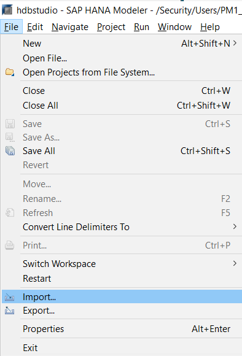
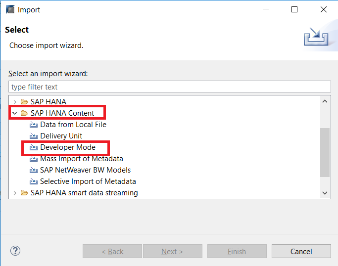
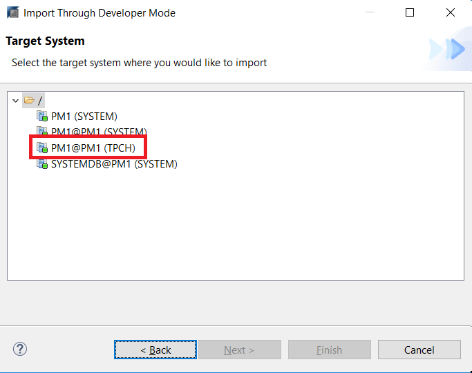
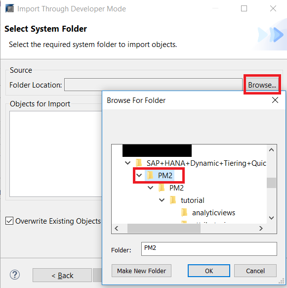
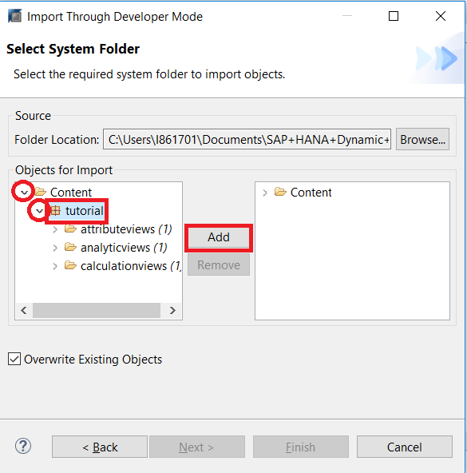
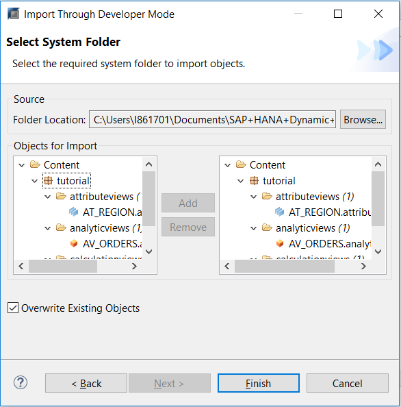
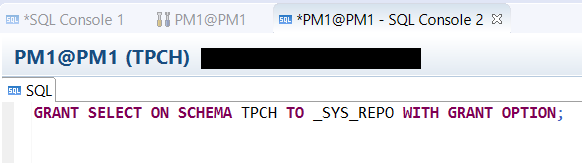
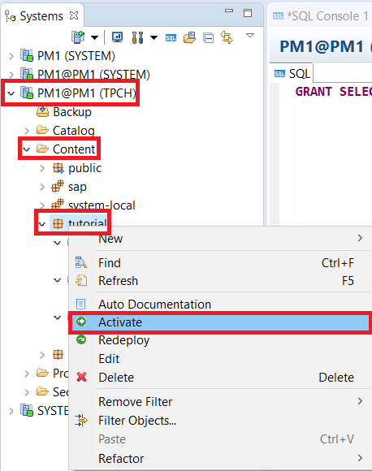
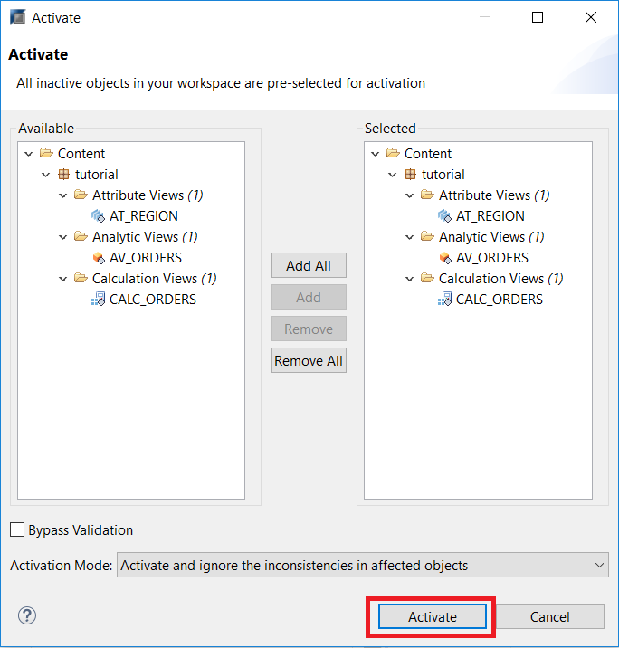
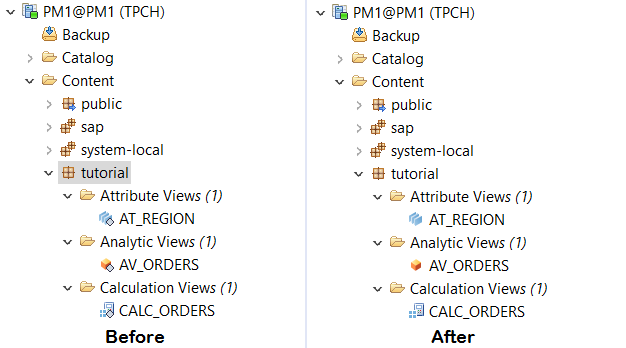

## Prerequisites
 - **Tutorials:** [Adding Analytic Privileges and the SAP HANA Modeler Perspective]
 - **Files:** Download the Data Files zip: `https://s3.amazonaws.com/sapiq/Dynamic+Tiering+Quick+Start+Guide/SAP+HANA+Dynamic+Tiering+Quick+Start+Guide+-+Supporting+Files.zip` and decompress it to get the individual data files. These "`CSV`" data files contains the data for their respective tables and is needed for the import procedure. Copy all the data files into the "`/hana/shared/<SID>/HDB00/work/TPCH_DATA/`" directory on your HANA Dynamic Tiering host ("`<SID>`" is your system's System Id). This directory also assumes that you are using instance "00". The actual directory format is: "`/hana/shared/<SID>/HDB<instance_number>/<workspace_name>/TPCH_DATA`" and the typical workspace name is "default".

## Details
Extended Tables in Dynamic Tiering can only be used in information models that consist solely of calculation views. If you have an existing data model that is built from the three classical HANA information view types (attribute views, analytic views and calculation views), you will have to convert the data models to a representation that consists only of calculation views.

SAP HANA studio offers a migration wizard for this task. We will guide you through this process.

### You will learn
  - How to import information views to SAP HANA Studio
  - How to activate your imported views

### Time to Complete
 **10 Min**

 ---
[ACCORDION-BEGIN [Step 1: ](Importing Required Views)]

We will need to import some pre-defined views. Click **File** in the top-right corner, and then **Import**.



Next, under the SAP HANA Content, select **Developer Mode**. Then, click **Next**.



Choose the HANA system that you used for the tutorial in the Prerequisite section, and click **Next**. In this tutorial, we selected the `PM1@PM1 (TPCH)` system - your selection will match your HANA system ID.



We will now choose the files to import. Click on Browse, and select the PM2 folder.  If you haven't already extracted the `PM2` folder to the machine where you are running HANA Studio, which is located in the supplementary file package found under the prerequisites, you will need to do so now in order to import the required views. Click **OK**.



Confirm that you have successfully selected the required package. Expand the drop down arrow for both "**Content**" and "**tutorial**". You should see 3 folders of each information view type, with a total of 4 files. Select the package "**tutorial**" and click **Add**.



The files should now appear in the right hand window. **Finish** to import these views.


It may take a while to import. Once it is complete, go over to your Systems navigation panel, and refresh the Content directory, by right-clicking the Content folder and selecting **Refresh**.

Open it up, and you should be able to see the attribute, analytic, and calculation views you have just imported.


[DONE]

[ACCORDION-END]

[ACCORDION-BEGIN [Step 2: ](Activate Imported Views)]
These newly imported views will have grey icons in the bottom-right corner, which means they are not yet active. We will need to activate them. However, before we do that, we will need to open up a SQL console and run the following command:

```sql
GRANT SELECT ON SCHEMA TPCH TO _SYS_REPO WITH GRANT OPTION;
```

This grants `SYS_REPO` access to the schemas inside of our `TPCH` user, and will prevent an "insufficient privilege" error when we activate our views.



We now activate our views by right clicking on the tutorial package, and then selecting **Activate**. When views are activates, a run time object is created and the view becomes available for reporting and analysis.



On the next screen, ensure that all views to be activated are present in the right panel, and click **Activate**.



When activated, the grey diamond, in the bottom right corner, beside each view will disappear.



[VALIDATE_1]

[ACCORDION-END]
