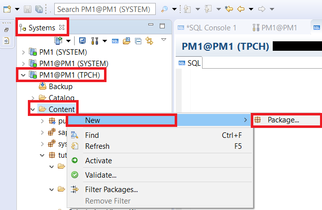
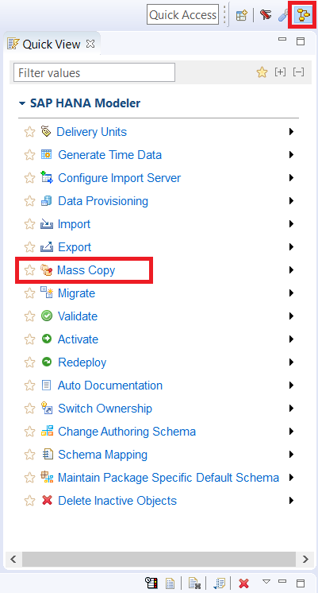
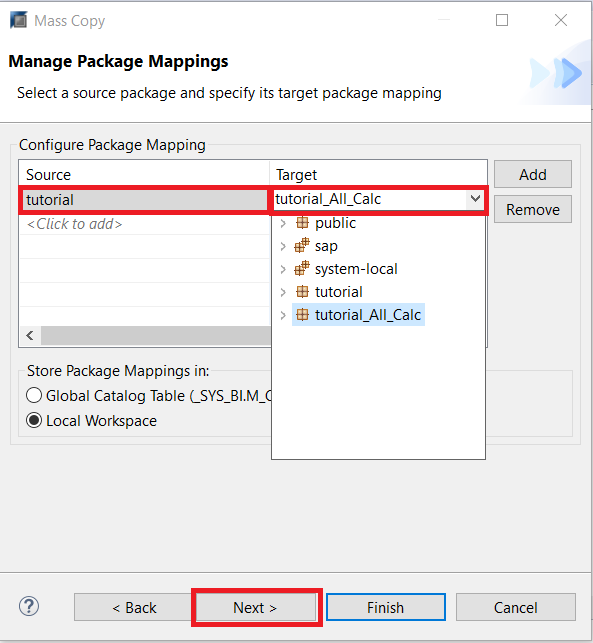
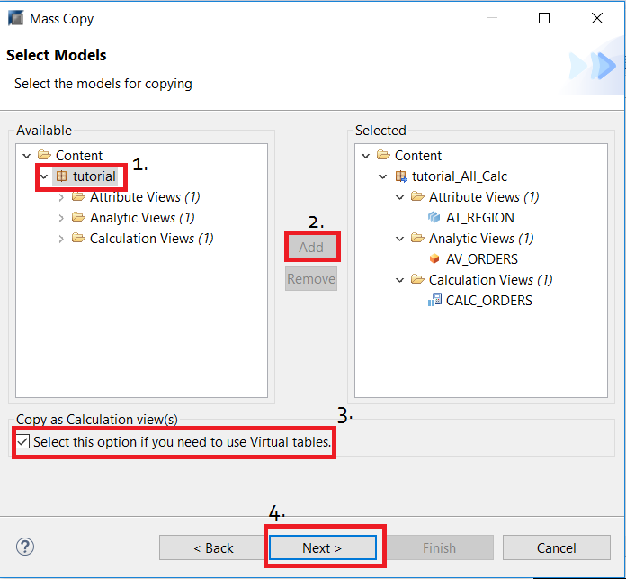
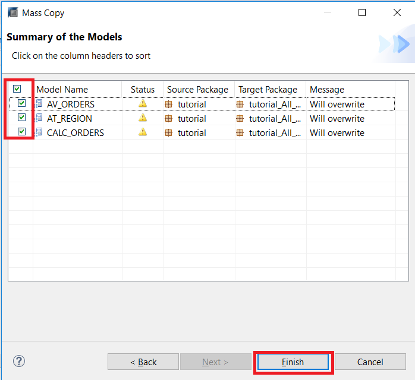
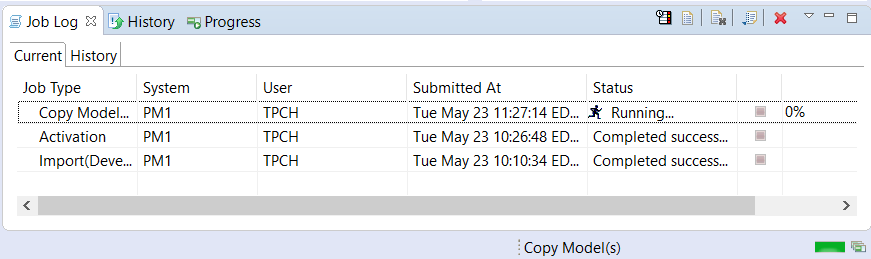
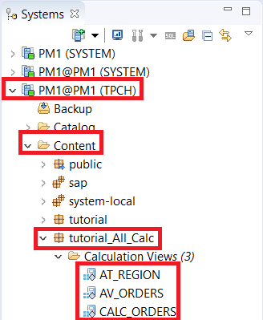
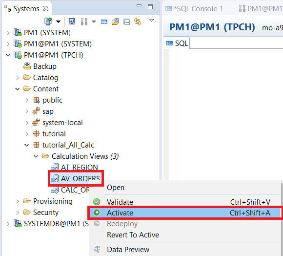
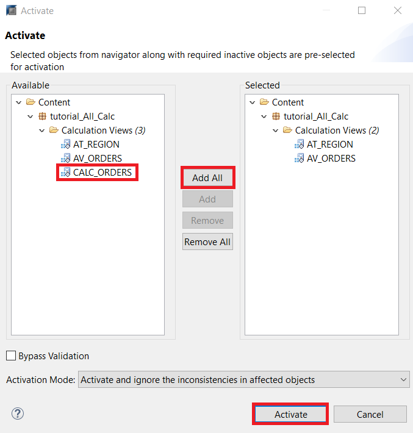

## Prerequisites
 - **Proficiency:** Beginner
 - **Tutorials:**: Importing Required Calculation Views

## Details
### You will learn
  - How to create new packages
  - How to convert information models

### Time to Complete
 **15 Min**

 ---
[ACCORDION-BEGIN [Step 1: ](Information View Conversion)]

 After completing the previous tutorial, create a new package called "`tutorial_All_Calc`". To do this, right click on **Content** inside the left **Systems** panel, and select **New** > **Package** .

Enter the new package name, "`tutorial_All_Calc`", and click **`Ok`**.

We now have a new package called `tutorial_All_Calc`. This will be the destination package for our information model conversion.

To convert our information model, navigate to the left side of the interface. Under `SAP HANA Modeler - Quick View`, click `Mass Copy`.

> Note: If you cannot find the Quick View, you can bring it back by clicking **Window** > **Reset Perspective** in the menu bar.

After you have clicked Mass Copy, select your system and click **Next**.

In the next screen, we will select our source and target packages for the mass copy. Under source, click the cell and select "**`tutorial`**" from the drop down menu. Under target, click the cell and select **`tutorial_All_Calc`** from the drop down menu. Click **Next**.

Select tutorial from the left panel, and click **Add** to select all views for copying. Make sure to check off the "**Copy as Calculation views**" box. This is *crucial*. Finally, click **Next**.

You will see all the views with green check-marks on the next screen. Click **Finish** to mass copy the views, which will also convert them all to Calculation views. You can check the progress using the **Job Log** at the bottom right of the screen.

Once that is complete, you can find your calculation views inside the tutorial.

[VALIDATE_1]

[ACCORDION-END]

[ACCORDION-BEGIN [Step 2: ](Activating New Calculation Views)]

Now that you have created the calculation views, you will need to activate them. Right click `AV_ORDERS`and click **Activate**.

A wizard will pop up, in which you can select further objects to activate. Dependencies are automatically selected. Note how `AT_REGION`, which `AV_ORDERS` depends on, was added automatically.

Add `CALC_ORDERS` from the package to the list of selected models as well. Then, click **Activate**.

After they have been activated (you can check the Job Log for progress), the will lose the grey diamond beside their icon.

You have now successfully converted all views from the original information model into calculation views.

Here's what each view does:

**`AT_REGION`**
This view takes in 3 tables, and combines their attributes to create a table of region names with corresponding customer keys. It takes the customer key column from the `CUSTOMER_CS`, the region name column from `REGION_CS`, and combines them using mutually inclusive columns located in `NATION_CS`.

**`AV_ORDERS`**
This view takes the attribute view created before (`AT_REGION`) and joins it with 4 columns from `ORDERS_CS`. The result is a table showing each customer key, and the corresponding region name, order status, order date, and total price.

**`CALC_ORDERS`**
This view performs the same functionality as `AV_ORDERS`, but is created as a calculation view type. It uses a union node to join `AT_REGION` and `ORDERS_CS`, to output a table showing each customer key, and the corresponding region name, order status, order date, and total price.

[DONE]

[ACCORDION-END]
