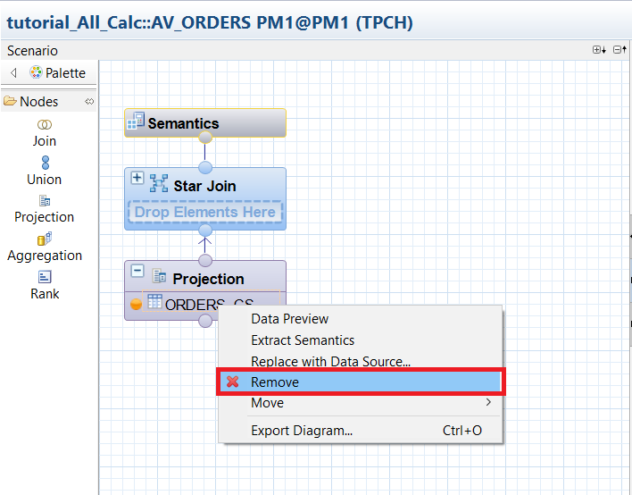
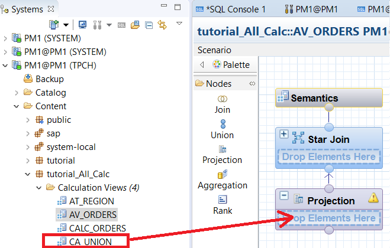
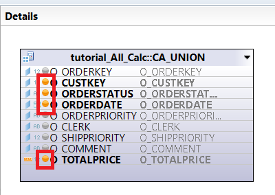
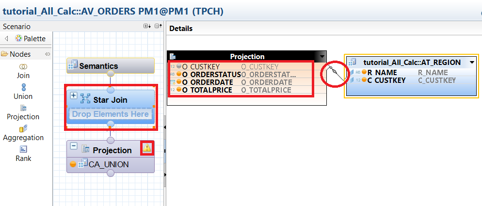
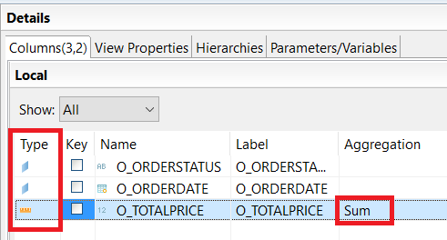

## Prerequisites
 - **Tutorials**: "Creating a Calculation View from the Union of In-Memory and Extended Tables"

## Details
### You will learn
  - How to add extended tables to an existing information model

### Time to Complete
 **15 Min**

 ---
[ACCORDION-BEGIN [Step 1: ](Adding Our Union Calculation View into the Converted Data Model)]

We have converted the original information into all calculation views so that they can support other calculation views. We then created a new calculation view which was a union between hot and warm data. Now we will replace `ORDERS_CS` with the new calculation view inside of `AV_ORDERS`.

Under the `tutorial_All_Calc` package, open up `AV_ORDERS` in the graphical viewer. Under **Projection**, right click `ORDERS_CS` and click **Remove**.

> Note: You may need to expand **Projection** by clicking the `+` button beside its name.

You will receive a warning that column references will get removed because of this action. Click **Yes** and **OK** to confirm.

Similar to the previous tutorial, we will drag `CA_UNION` view over from the **Systems** panel, and drop it into the **Projection** node.

Afterwards, select the **Projection** node to edit its details in the **Details** panel. Click the gray dots for `O_CUSTERKEY`, `O_ORDERSTATUS`, `O_TOTALPRICE`, and `O_ORDERDATE`. This will add them to the output and the color of the dots will change to orange to indicate that they are now included in the output.

Now, select the **Star Join** node to edit it. Toggle all the gray circles to become orange, except for the `O_CUSTKEY` from **Projection**. Then, connect `O_CUSTKEY` with `C_CUSTKEY`. This is done by clicking anywhere on one row, and dragging your cursor to another row.

You may see a warning sign above the **Projection** node. If it reads "No columns added to the output" when you have already done so (denoted by the orange dots), you may ignore this warning.

Next, we will select the **Semantics**, to ensure each column is set as the right type. Toggle the type so that `O_ORDERDATE` and `ORDERSTATUS` are attributes (denoted by a blue diamond), and `O_TOTALPRICE` is a measure (denoted by an orange bar) with a "Sum" aggregation.

[VALIDATE_1]

[ACCORDION-END]

[ACCORDION-BEGIN [Step 2: ](Activate View)]
Navigate to `tutorial_All_Calc` in **Systems**. Under `tutorial_All_Calc` > Calculation Views, right click `AV_ORDERS` and click **Activate**.

We have successfully added extended tables to an existing information model! In summary, we took the old `AV_ORDERS` used the in-memory table called `ORDERS_CS`, and combined it with `AT_REGION` to create a result set showing each customer key with its corresponding region name, order status, order data, and total price from the last year. This new `AV_ORDERS` view combines the new `CA_UNION` view (which is a union of `ORDERS_CS` and `ORDERS_DT`) with `AT_REGION`, creating a result with the same fields as before, but now includes data from all years, including the data that has been aged out to the extended table in Dynamic Tiering.

[DONE]

[ACCORDION-END]
