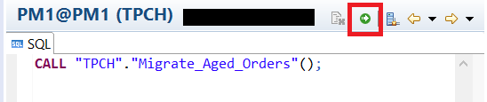
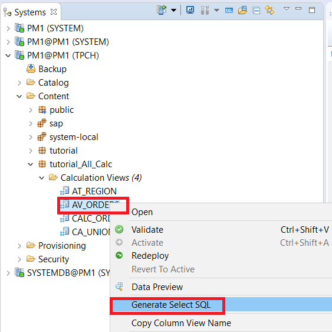
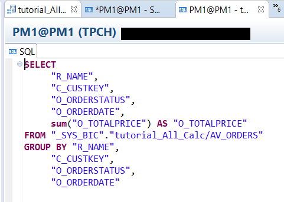
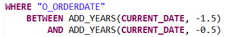
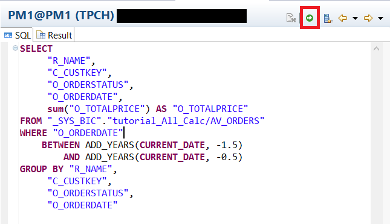
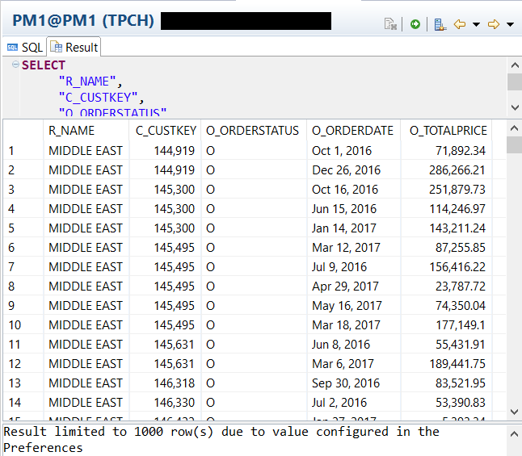
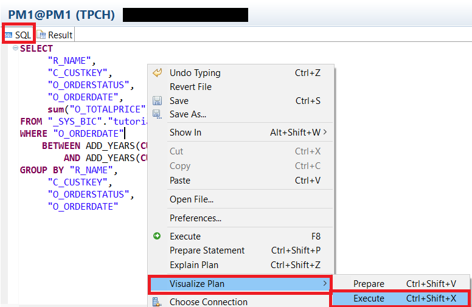
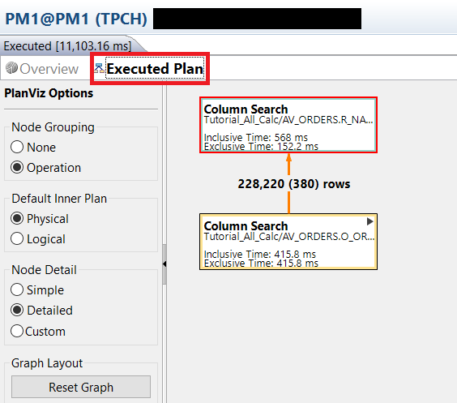
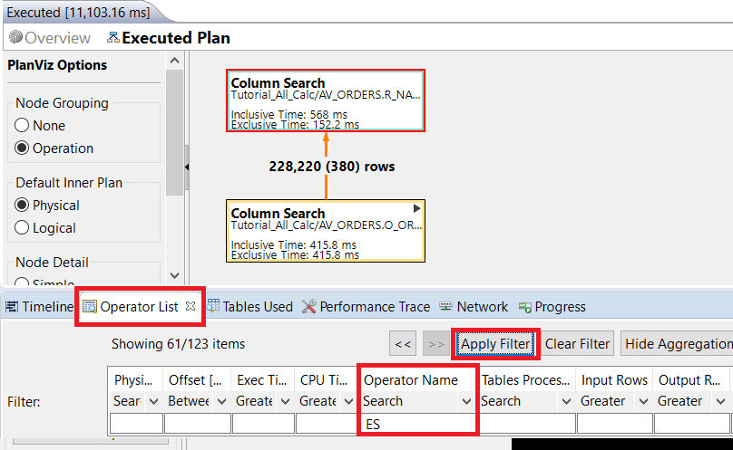
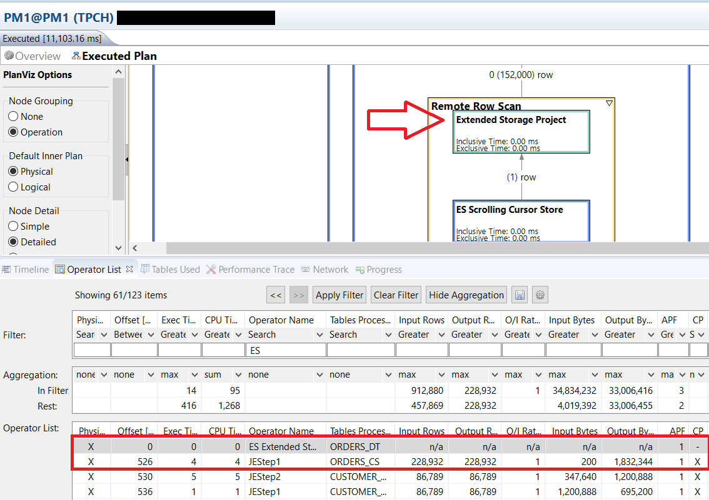

## Prerequisites
 - **Tutorials**: "Adding Our Union Calculation View into the Converted Data Model" and "Migrate Records in Related Tables Using Stored Procedure"

## Details
### You will learn
  - How to generate a `SQL` Select Statement for a Calculation View
  - How to Visualize Queries

 ---
[ACCORDION-BEGIN [Step 1: ](Seeing Results)]
We will now generate a `SQL` select statement for our `AV_ORDERS` calculation view. It will be editted to query all rows between 6 months and 18 months ago. Since `ORDERS_CS` contains all data from the current year and `ORDERS_DT` contains all data older than a year, the result set will span both the in-memory table instance and the extended table instance.

We will then visualize the plan, and show again that data is being queried from both in-memory and extended storage.

Before we begin, open a SQL console, and run our `Migrate_Aged_Orders()` function created from our previous tutorial, [Migrate Records in Related Tables Using Stored Procedure](https://developers.sap.com/tutorials/dt-create-schema-load-data-part6.html). This will ensure that all data older than one year is moved from `ORDERS_CS` into `ORDERS_DT`.

Click execute, to run the statement.



```sql
CALL "TPCH"."Migrate_Aged_Orders"();
```

Now, right click on the calculation view `AV_ORDERS` and click **Generate Select SQL**.



The result:



We will add a `WHERE` statement, so the query only returns results between 6 to 18 months ago. This is done to ensure that it is collecting data from both `ORDERS_CS` and `ORDERS_DT`. Add the following between the `FROM` and `GROUP BY` lines:



```sql
WHERE "O_ORDERDATE"
	BETWEEN ADD_YEARS(CURRENT_DATE, -1.5)
		AND ADD_YEARS(CURRENT_DATE, -0.5)
```

Click execute.



The results should look like the following image:



[DONE]

[ACCORDION-END]

[ACCORDION-BEGIN [Step 2: ](Visualizing Queries)]
We can also visualize the query, by going back to the `SQL` tab, right clicking, and selecting **Visualize Plan** > **Execute**.



After it executes, navigate to the **Executed Plan** tab.



On the bottom panel, navigate to the **Operator List** tab, and search for the operator name **ES**.



Double click one of the results, and it will zoom into the selected operator. As you can see by the **Remote Row Scan** box, the query accessed the extended table.



[VALIDATE_1]

[ACCORDION-END]
