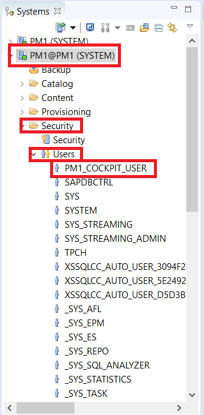
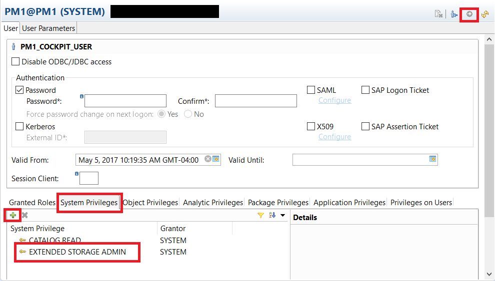
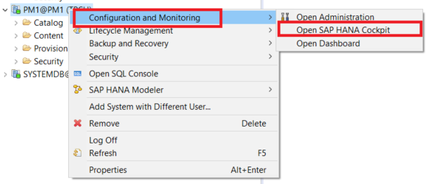
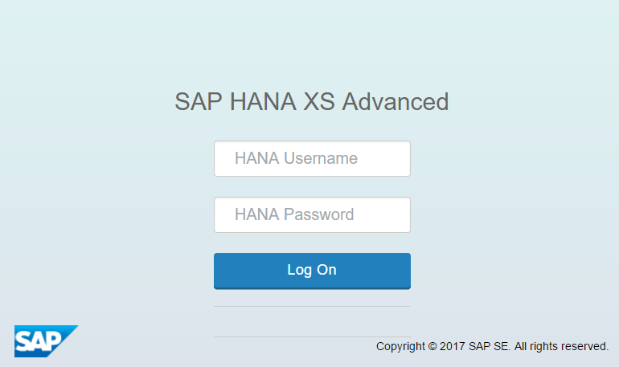
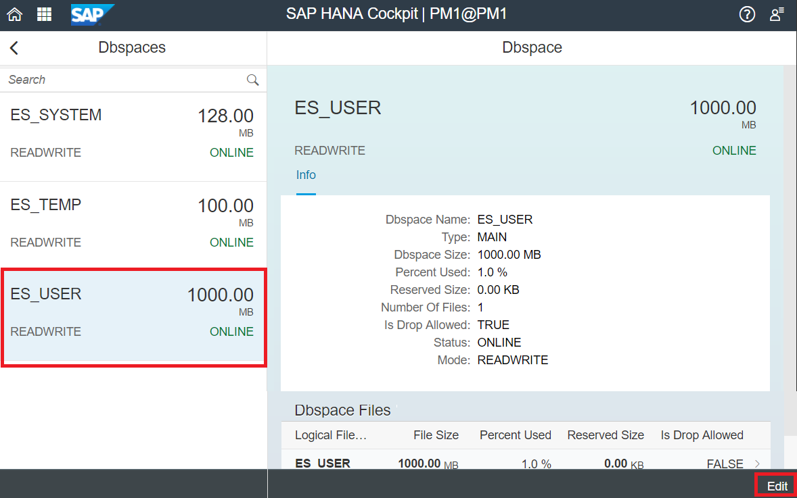
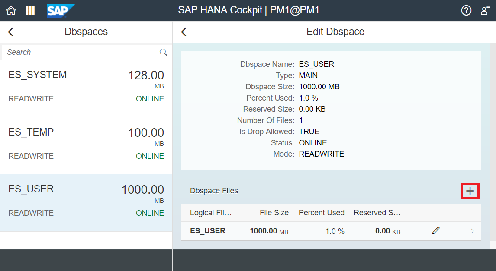
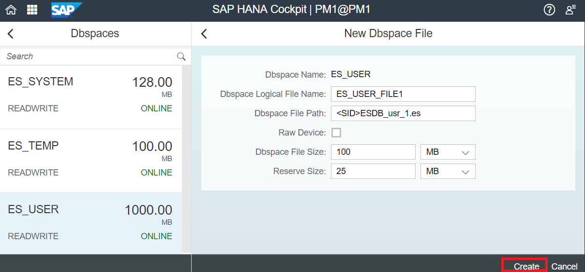
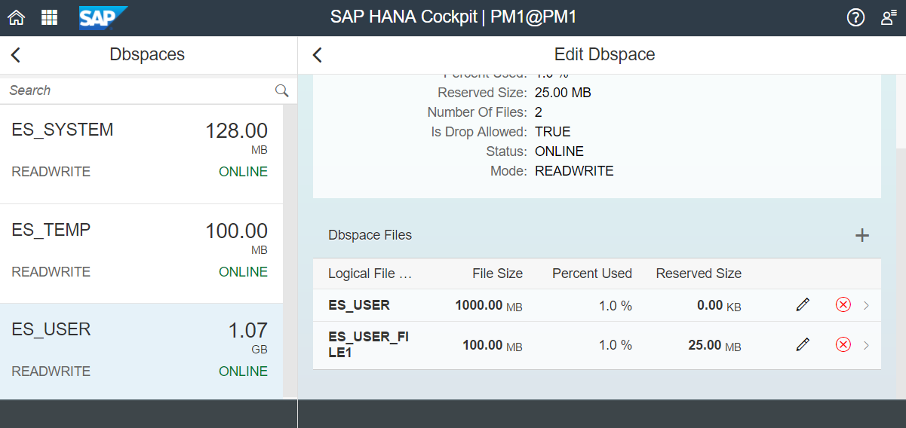

## Prerequisites
 - **Proficiency:** Beginner
 - **System:** Access to an SAP HANA 2.0 system with the optional SAP HANA Dynamic Tiering component installed. If not, refer to the lesson starting from [Creating and Removing Extended Storage](https://developers.sap.com/group.dt-get-started.html) to set up your extended storage.
 - **Web Applications:** Ensure you have access to HANA Cockpit and its URL. Also ensure you have access to a Cockpit user separate from your `TPCH` user.

## Details
### You will learn
  - The importance of managing disk storage
  - Which privileges the Cockpit user will need, and how to add the privileges
  - How to add a `Dbspace` File

### Time to Complete
 **15 Min**

 ---
[ACCORDION-BEGIN [Step 1: ](Introduction)]
In contrast to the core HANA in-memory data store, the Dynamic Tiering data store requires the database administrator to proactively allocate and manage disk storage space in the form of a `Dbspace`. This lesson will explain how to monitor and manage the `Dbspace`.

Initially your extended storage will have adequate space to create objects. However, as your data volume grows, you may need to add additional storage space in which case you will need to know how to add more.

[DONE]

[ACCORDION-END]

[ACCORDION-BEGIN [Step 2: ](Add Extended Storage Privileges to your Cockpit User)]

In your HANA Studio, open up your `<SID> (SYSTEM)`. Navigate to to **Security** > **Users**.

Select your Cockpit user's `<name>`, i.e. in our example we used the naming convention `<SID>_COCKPIT_USER.`



This will open up the user window on the right. Navigate to **System Privileges**. Using the green `+` button located under **Granted Roles**, add `EXTENDED STORAGE ADMIN` as a privilege.



Once you add this, click the green execute button at the top right to save these changes.

[DONE]

[ACCORDION-END]

[ACCORDION-BEGIN [Step 3: ](Adding a Dbspace File)]
To add space, we navigate to HANA cockpit. To access Cockpit, use the URL given during installation, in the form `https://<hostname>:<port>`.

>Note: Note: If this is the first time you are using cockpit, start by opening the Cockpit Manager located at port 51023.



This will open the HANA Cockpit login page in your browser. For this lesson, you should log with your Cockpit user.



Once you have logged onto HANA Cockpit, scroll through the tiles and navigate to the Dynamic Tiering section of your cockpit.


In this example, we will be working with "**Manage Dynamic Tiering `Dbspace`s**" within the Dynamic Tiering links.

Once you select that option, you will see the existing `Dbspace's`. The `ES_USER Dbspace` is where the extended table data is stored and where you will need to add storage space as your data set grows. Select the `ES_USER Dbspace` and click the **Edit** button located at the bottom right of the window.



This opens the "**Edit `Dbspace`**" detail panel on the right of the screen. To add a new `Dbspace` file, click the `+` button located above the `Dbspace Files` table.


This will pop up a dialogue where you can add information such as the file name, file path, reserve size, etc.

Replace the `<SID>` in the `Dbspace` File Path with your `<SID>` of your System.



Some options to be noted while filling this dialogue

- "**Raw Device**" - This specifies a raw partition where the size is automatically set to the maximum raw partition size. This means that the extended store will use the entire raw device. For this tutorial, uncheck the Raw Device option.
- "**Reserve Size**" - This applies to the File System files only and not raw devices. This still creates a file of full size on the File system but the extended store does not track the logs of additional space until the reserve space is added. the benefit of specifying a Reserve Size is to protect the contiguous storage space on disk, preventing or minimizing file fragmentation.

Once you have filled in the required information, you can click the "**Create**" button located on the bottom right of the window. The new `Dbspace` file should appear as below.



> Note: You can also add a file using HANA Studio (through the System DB) by running a SQL command and changing parameters as required:
``` sql
ALTER EXTENDED STORAGE ALTER DBSPACE ES_USER ADD FILE "ES_USER_FILE1" '<SID>ESDB_usr_1.es' SIZE 100 MB RESERVE 25 MB;
```

[VALIDATE_1]

[ACCORDION-END]
