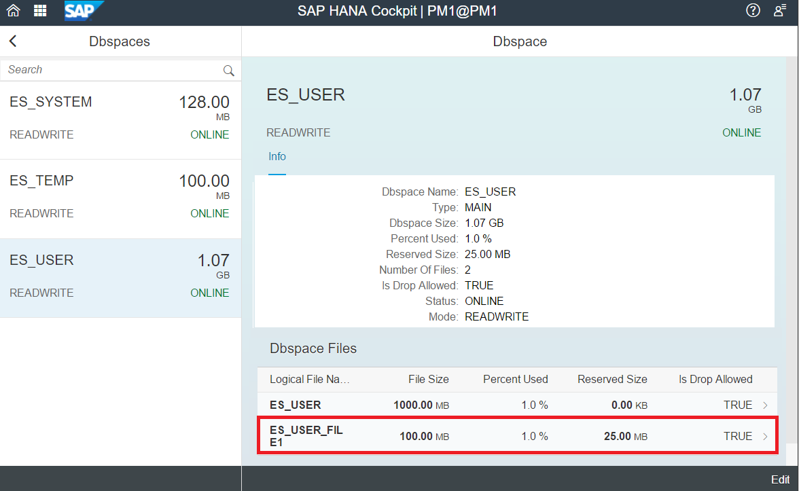
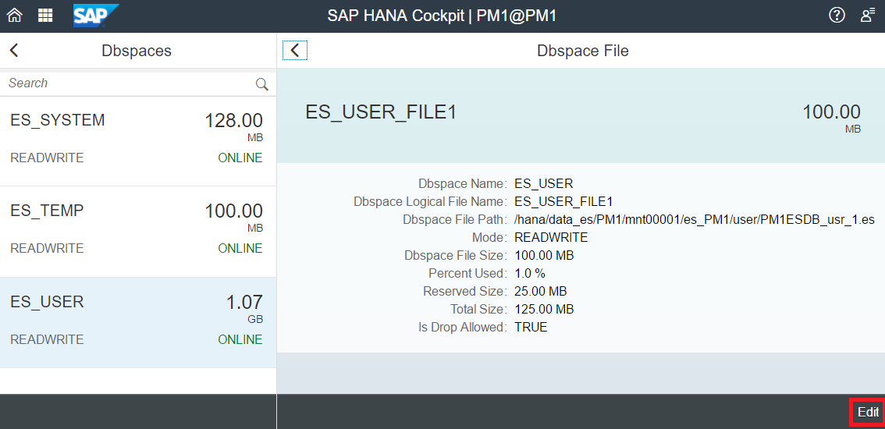
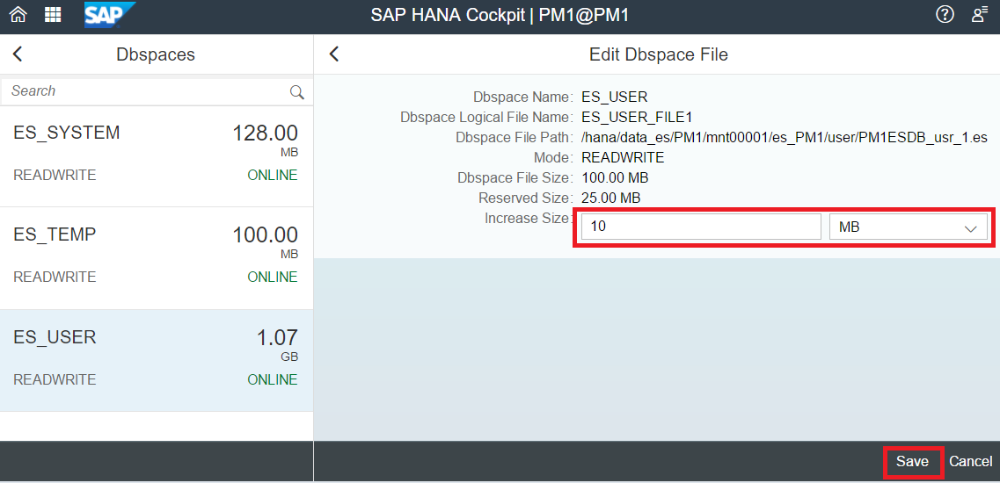
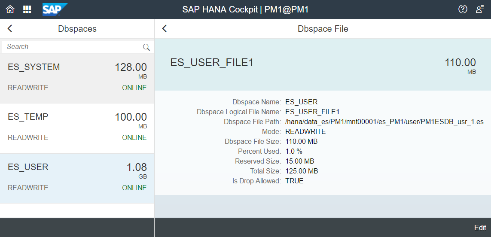

## Prerequisites
 - **Proficiency:** Beginner
 - **Tutorials** Adding a `Dbspace` File

## Details
### You will learn
  - How to enlarge a `Dbspace` file using reserved space in HANA Cockpit
  - How to enlarge a `Dbspace` file using a SQL command

### Time to Complete
 **10 Min**

 ---
[ACCORDION-BEGIN [Step 1: ](Enlarging a Dbspace File Using Reserved Space)]
When you are ready to use the reserve space you may do it in increments rather than using all of the reserved space at once. Thus, you can enlarge the `Dbspace` file only by what you need.

Navigate to **Manage Dynamic Tiering `Dbspaces`** on your Cockpit. Click on the "**`ES_USER_FILE1`**" created in the last tutorial.



This will open a detail panel for the `**ES_USER_FILE1** Dbspace` file. To edit this individual `Dbspace` file, click on the "**Edit**" button in the bottom right corner of the page.



You can now increase the `Dbspace` File Size by adding volume from the **Reserved Size**. To increase the size, enter the amount you wish to take from the Reserved Size in the Increase Size field. For this lesson we will use `10MB` of the available `25MB` of Reserved Size.



After entering in "10" in the **Increase Size** field, click **Save** in the bottom right of the window to complete the operation.

Once the save completes, the updated `Dbspace` File details for the `ES_USER_FILE1 dbspace` file will show that the `Dbspace` file size has increased from `100MB` to `110MB` while the Reserved Size has decreased from `25MB` to `15MB`.



[VALIDATE_1]

[ACCORDION-END]

[ACCORDION-BEGIN [Step 2: ](Enlarging Dbspace File through HANA Studio SQL Console)]
In HANA Studio through the System Database, you may also enlarge a file via the SQL command:

```sql
ALTER EXTENDED STORAGE ALTER DBSPACE ES_USER ALTER FILE "ES_USER_FILE1" ADD 10 MB;
```

[DONE]

[ACCORDION-END]
