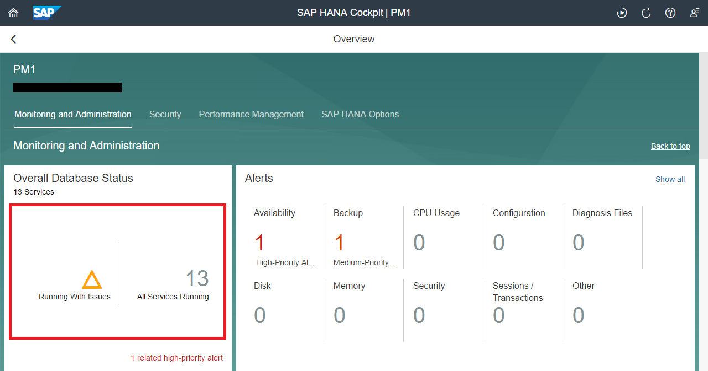
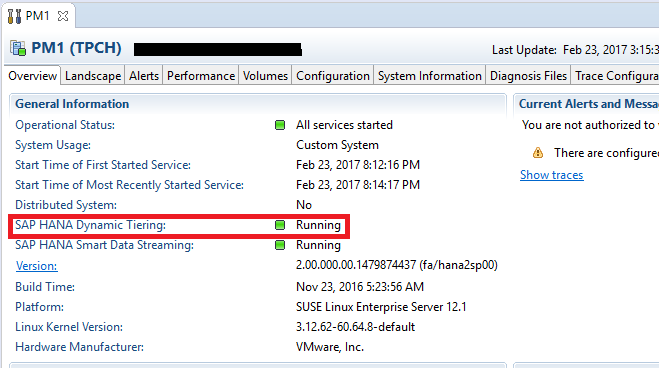
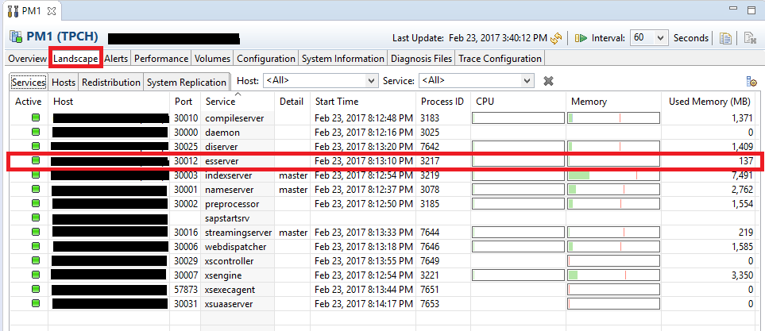
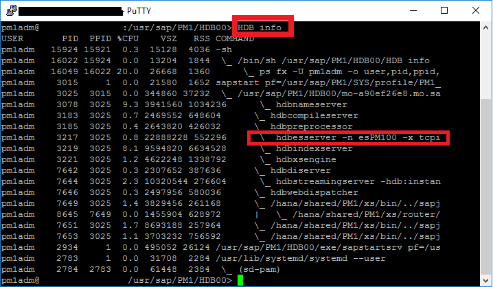
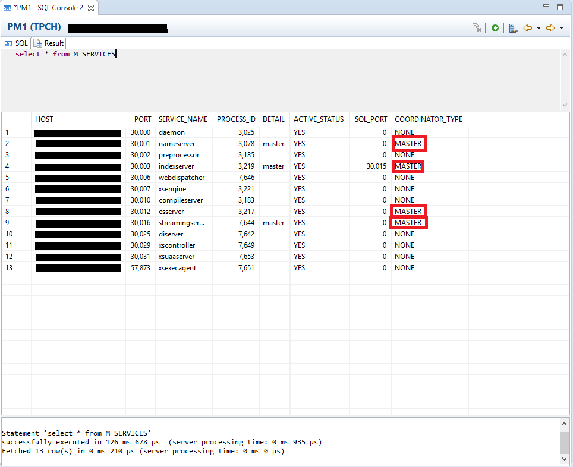

## Prerequisites  
- **Proficiency:** Beginner
- **System:** Access to an SAP HANA 2.0 system with the optional SAP HANA Dynamic Tiering component installed. For older systems, please refer to [SAP HANA Dynamic Tiering – Quick Start Guide - Lesson 3: Monitoring SAP HANA Dynamic Tiering Using HANA Studio and HANA Cockpit](https://www.sap.com/documents/2016/06/309a2320-757c-0010-82c7-eda71af511fa.html) for instructions.
- **Integrated Development Environment:** Cockpit is already installed and configured. Basic working knowledge of SAP HANA Studio and SAP HANA Cockpit. E.g. You should be able to connect to your HANA instance from SAP HANA Studio and feel comfortable with executing simple queries.
- **Credentials:** Have a cockpit admin user and password with access to your HANA system and access to "`<SID>adm`" for a SSH session

## Next Steps
 - **Tutorials:** [Creating and Removing Extended Storage](https://www.sap.com/developer/tutorials/dt-monitoring-hana-part2.html)

## Details
### You will learn
 - Capabilities of SAP HANA Cockpit related to SAP HANA Dynamic Tiering
 - Checking the `Esserver` Status to see if Dynamic Tiering is active
 - Checking Coordinator Types to see if extended storage is running and created

### Time to Complete
**10 Min**

---
SAP HANA cockpit provides a single point of access to a range of SAP HANA administration and monitoring tasks. It is used to monitor and ensure the overall health of the system. It enables a user to configure tasks such as:

  - Checking the status of the system i.e. verifying if it's active and running, and configuring system properties
  - How to stop and start extended storage
  - How to add and remove additional space for extended storage

SAP HANA cockpit is also used for monitoring and managing checks which include:

  - Analyzing usage of CPU, memory and tables i.e. how much memory is being used
  - Used to monitor the percentage of `DBspace` in use and view alerts for `DBspaces` nearing their capacity
  - Ability to view and search for various server logs and custom traces

SAP HANA Studio is a rich client tool based on an Eclipse platform. SAP HANA Studio is the central development environment and a key administration and monitoring tool for SAP HANA. There are a several tabs providing detailed status information for the HANA system. For example, the "Overview" tab in the HANA Studio displays the overall status of the HANA system including the Dynamic Tiering component. More detailed status information for each process on a per host basis is then provided under the "Landscape" tab. We will explain the contents of these tabs in more detail later on in this lesson.

[ACCORDION-BEGIN [Step 1: ](Checking the Status of the Esserver)]
One of the most important things to be validated once your Dynamic Tiering node is installed is to see whether everything is up and running. The `esserver` is the Dynamic Tiering server process. If the `esserver` is running, it means the Dynamic Tiering environment is active and running.

One way to check the status of the `esserver` is through SAP HANA Cockpit. Navigate to your system on SAP HANA Cockpit and the click under "**Overall Database Status**".


You will be taken to the following page where you can see the status of the `esserver`.


> Note: This page allows you to view all the hosts along with various details such as the host's status, service, role, etc.

Ignore this line. It is used for format purposes.

Another way to check the status of the `esserver` is through SAP HANA Studio. In the **SAP HANA Administration Console** perspective, right click on "**<SID>(TPCH)**", hover over "**Configuration and Monitoring**" and click on "**Open Administration**".


Under the "**Overview**" tab you can see that the Dynamic Tiering system is running under "**Distributed System**"



Now to view the `esserver`, click on the "**Landscape**" tab. You should see whether the `esserver` is active or not by looking under the "**Active**" column as seen below.


> Note: Under this tab you can also check how much memory each host is using.

For format purposes. Ignore this Line.

The third way to view the status of the `esserver` is through a SSH session. Open up a SSH session for your Dynamic Tiering host and switch from the original user to `<sid>adm` using the `su - <sid>adm` command. Make sure to replace `<sid>` with your system id.

Once you are logged in as `<sid>adm` you may run the command "**`HDB info`**" to view whether the `esserver` is running or not. If you see the highlighted part from the picture below in your SSH session, this means the `esserver` is running.



[DONE]
[ACCORDION-END]


[ACCORDION-BEGIN [Step 2: ](Checking Different Services)]
The `M_SERVICES` view enables a user to identify the coordinator type for the `esserver`. There are three different coordinator types that you might see beside your `esserver`.

  - None -This means that your extended storage service is running, however you have not yet added/created any extended storage as yet. If your Dynamic Tiering host is causing a problem, then you know that you need to add the extended storage in order to fix the possible issue
  - Master (as in our case) -Your extended storage is running and it is created/added. Therefore, the Dynamic Tiering host should be completely operational. Since we had created extended storage in the previous lesson (creating tables and loading data) the coordinator type for us is "Master"
  - Standby -This means your `esserver` is on your standby node and Dynamic Tiering is not active.

To view the coordinator types in SAP HANA Studio, execute the following in a SQL console:

``` sql
select * from M_SERVICES
```


[DONE]
[ACCORDION-END]


## Next Steps
- **Tutorials:** [Creating and Removing Extended Storage](https://www.sap.com/developer/tutorials/dt-monitoring-hana-part2.html)
