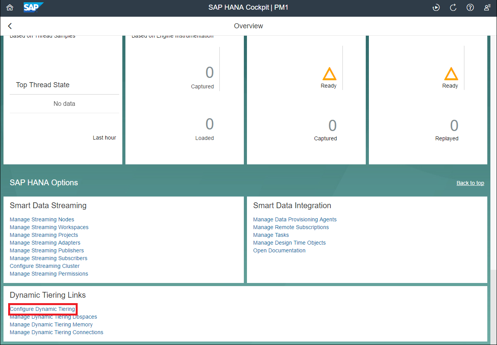
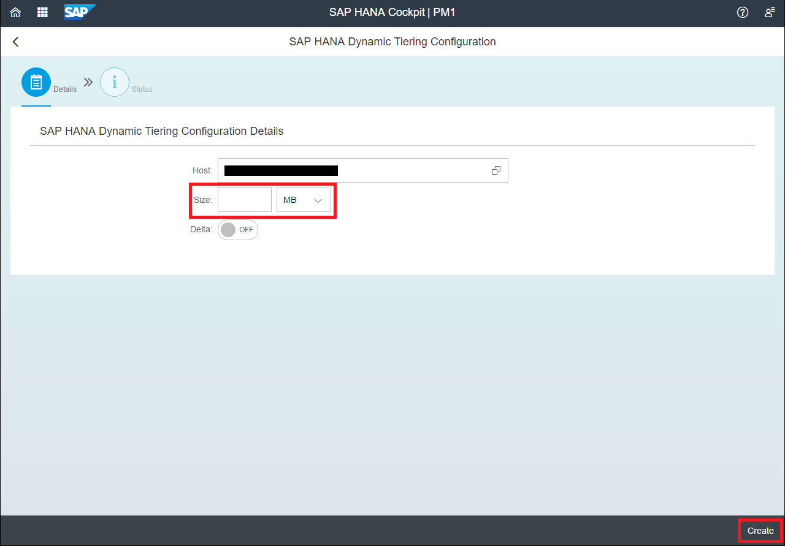
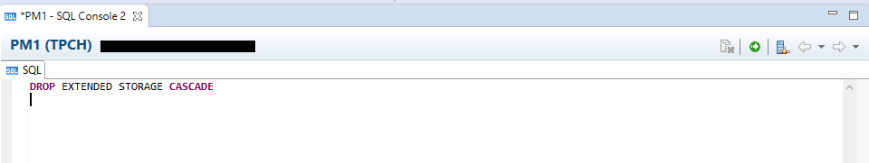
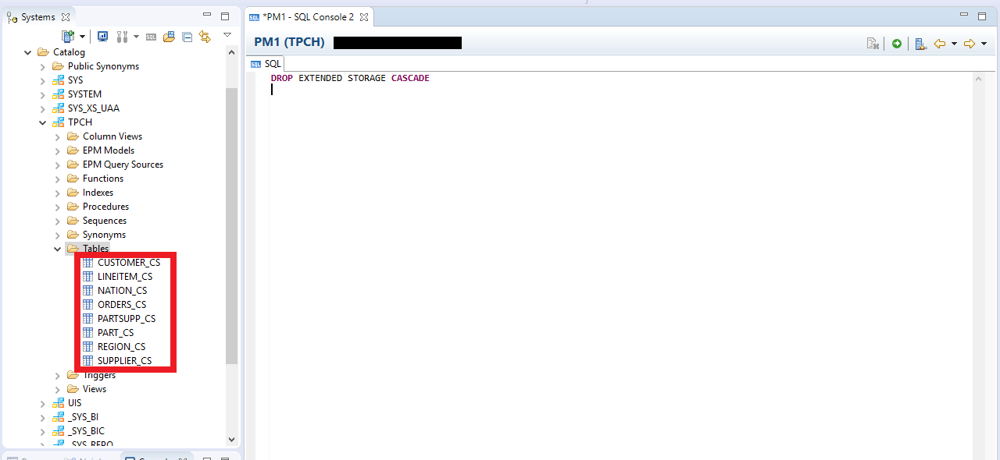
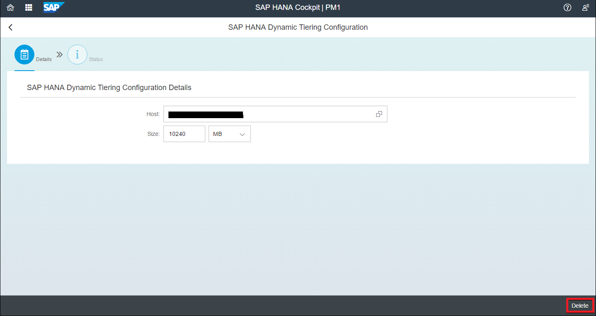
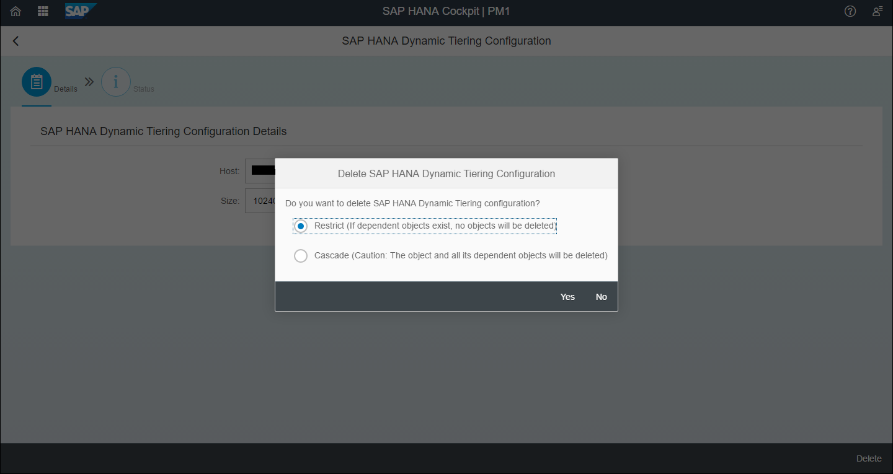

## Prerequisites  
 - **Proficiency:** Beginner
 - **Tutorials:** [Monitoring HANA Using SAP HANA Cockpit for SAP HANA Dynamic Tiering](https://www.sap.com/developer/tutorials/dt-monitoring-hana-part1.html)


## Next Steps
 - **Proficiency:** Beginner
 - **Tutorials:** [Stopping and Restarting the Extended Storage Service](https://www.sap.com/developer/tutorials/dt-monitoring-hana-part3.html)

## Details
### You will learn  
 - Creating Extended Storage using SAP HANA Studio, SAP HANA Cockpit
 - Removing Extended Storage using SAP HANA Studio, SAP HANA Cockpit

### Time to Complete
**10 Min**

---

[ACCORDION-BEGIN [Step 1: ](Creating Extended Storage)]
The first step after you have installed Dynamic Tiering system on your SAP HANA is to create an extended storage `dbspace`. After installation you have the `esserver` running but the extended storage is not created yet.

As discussed in [Create Extended Storage](http://www.sap.com/developer/tutorials/dt-create-schema-load-data-part1.html), you can create the extended storage in SAP HANA Studio using a SQL console by executing the following:

```sql
CREATE EXTENDED STORAGE AT '<your.machine.name>' size 1000 MB;
```
Make sure to replace "`<your.machine.name>`" with your Dynamic Tiering hostname in the statement above.

To create extended storage in SAP HANA Cockpit first navigate to your resource. Then scroll down to "**Dynamic Tiering Links**" and click on "**Configure Dynamic Tiering**".



You will be taken to a page where you can enter the size and the host name for the extended storage. You can enter the Dynamic Tiering host name and set the size as desired. Once the fields are populated, you can click the "**Create**" button on the bottom right to add the extended storage.



The "Delta" store option is also available here. If you want a delta enabled store, you must create the extended storage with the "Delta" option as "ON". This is how you are able to create delta enabled extended tables as well.

>Note: If you have created the extended storage without delta enabled, you will not be able to create delta enabled extended tables. You will need to drop and re-add the extended storage with the delta option switched "ON".

[DONE]
[ACCORDION-END]

[ACCORDION-BEGIN [Step 2: ](Removing Extended Storage)]

To remove extended storage in SAP HANA Studio, simply execute the following in a SQL console:

```sql
DROP EXTENDED STORAGE CASCADE
```



Once you have executed the above statement, under the **Systems** view, refresh "`<SID>`(TPCH)". Then click on the drop down arrows in the following order: **`<SID>`(TPCH)** > **Catalog** > **TPCH** > **Tables**. You should notice how there no longer exist any extended storage tables.



>Note: The term "`CASCADE`" means that any dependent object on the extended storage will also be deleted. Therefore, if you have any extended tables, they will be deleted along with their data.

Ignore this line. it is used for formatting.

To remove extended storage in SAP HANA Cockpit, Navigate again to "**Configure Dynamic Tiering**".


You should see the following and locate the "**Delete**" button in the bottom right of the window.



Once you click on "**Delete**", you should see the following show up. The "Restrict" option checks if there are any objects relying on the extended storage. If there are any, the delete will not occur. On the other hand, the "Cascade" option will delete all dependencies of the extended storage(the extended tables).



[DONE]
[ACCORDION-END]


## Next Steps
- **Tutorials:** [Stopping and Restarting the Extended Storage Service](https://www.sap.com/developer/tutorials/dt-monitoring-hana-part3.html)
