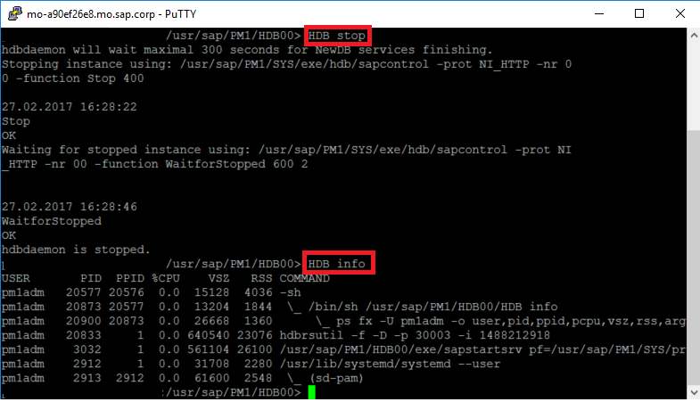
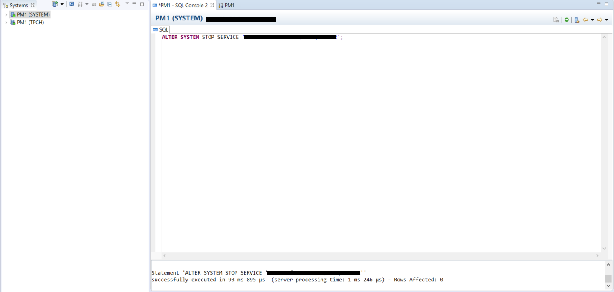
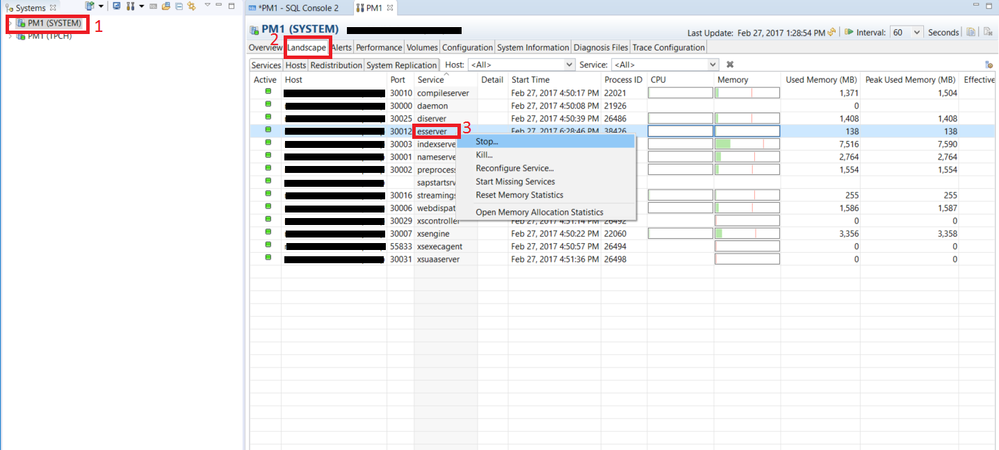
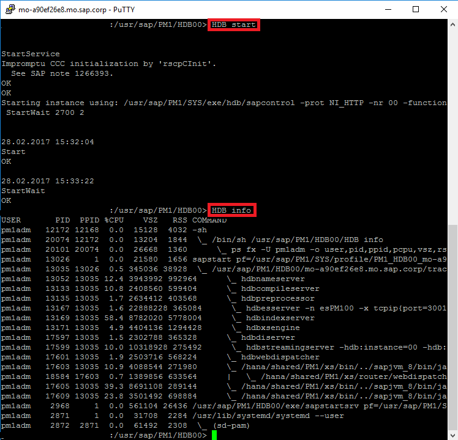

## Prerequisites  
 - **Proficiency:** Beginner
 - **Tutorials:** [Creating and Removing Extended Storage](https://www.sap.com/developer/tutorials/dt-monitoring-hana-part2.html)
 - **Credentials:** Connection details to initially connect as the "SYSTEM" user and access to "`<SID>adm`" for a SSH session

## Next Steps
 - **Tutorials:** [Additional checks in SAP HANA Cockpit and SAP HANA Studio](https://www.sap.com/developer/tutorials/dt-monitoring-hana-part4.html)

## Details
### You will learn  
 - Stopping the Extended Storage Service using SAP HANA Studio and a SSH session
 - Restarting the Extended Storage Service using a SSH session

### Time to Complete
**10 Min**

---

[ACCORDION-BEGIN [Step 1: ](Stopping the Extended Storage Service)]

The easiest way to stop the `esserver` process is to use the "`HDB stop`" command from a SSH session. The "`HDB stop`" command will not just shut down the `esserver`/Dynamic Tiering process but it will shut down the entire HANA system. After the "`HDB stop`" command completes, you can verify the status of the `esserver` process by using the "`HDB info`" command. One benefit of this method is that you know immediately when the stop operation has completed.



Another way to stop the extended storage service is through SAP HANA Studio. Open a SQL console and execute the following:

```sql
ALTER SYSTEM STOP SERVICE '<your.machine.name:port.number>';
```



Another way to stop the extended storage service is by double clicking on "**<SID>(SYSTEM)**" and then navigating to the "**Landscape**" tab. Right click on the `esserver` and click "**Stop**".



> Note: The screenshots above illustrate stopping the `esserver` process when connected through SAP HANA Studio as the `SYSTEM` user. You would need to allocate an additional permission (SERVICE ADMIN) for the TPCH user to have the same privilege. Make sure to close the Administration window for the TPCH user if you already had it open and then open the Administration window again after you assign the new permissions. This is an example where a database developer would typically not have the same permissions as an administrator and hence cannot do the same functionality. So it is better to stop the services by the SYSTEM user, if you are using Studio to stop the service.

[DONE]
[ACCORDION-END]

[ACCORDION-BEGIN [Step 2: ](Restarting the Extended Storage Service)]
To restart the extended storage service from a SSH session, use the "`HDB start`" command. After the command completes, use the "`HDB info`" command to verify the status of the `esserver` process. Just as with using a SSH session to stop the extended storage service, this method lets you immediately know when the start operation has completed.



With SAP HANA Studio, there is no need to manually restart the extended storage service since it automatically restarts after you stop it.

[DONE]
[ACCORDION-END]

## Next Steps
- **Tutorials:** [Additional checks in SAP HANA Cockpit and SAP HANA Studio](https://www.sap.com/developer/tutorials/dt-monitoring-hana-part4.html)
