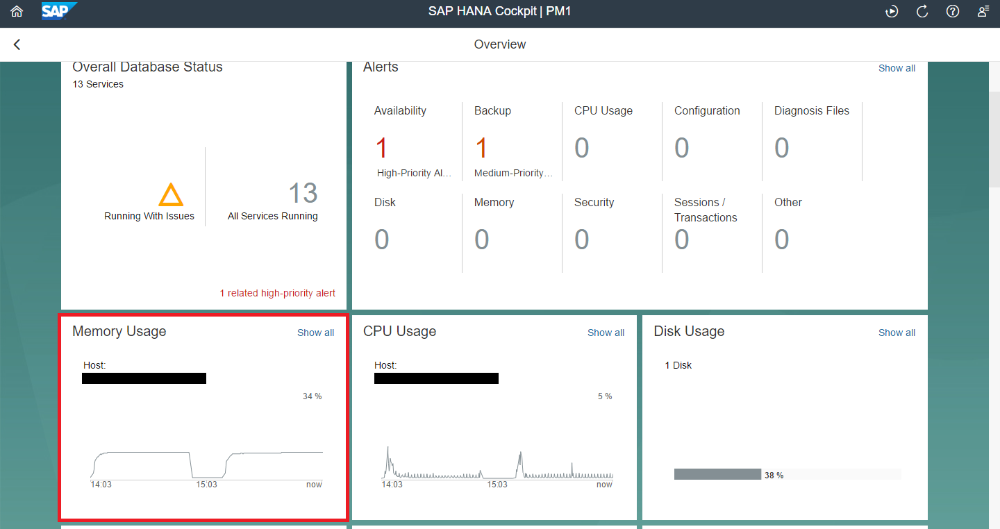
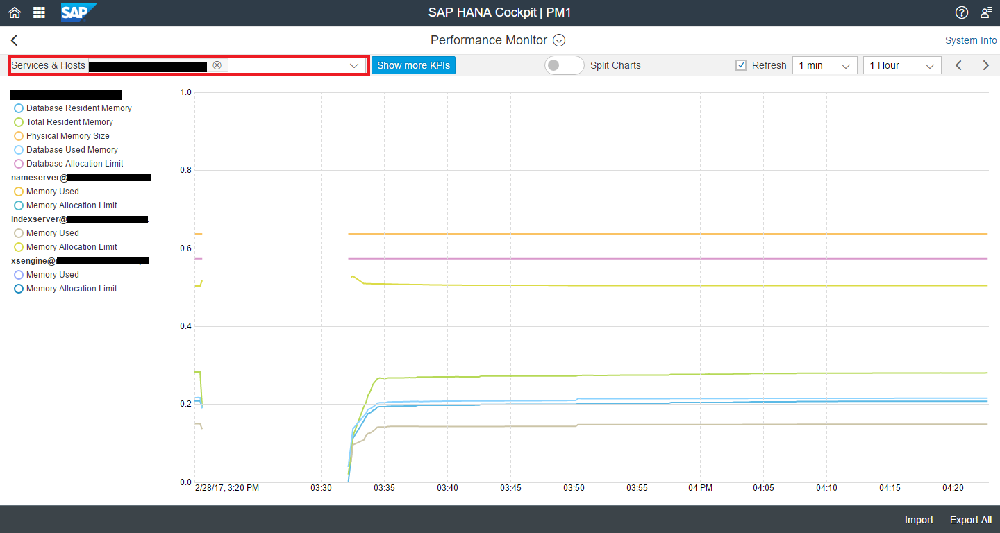
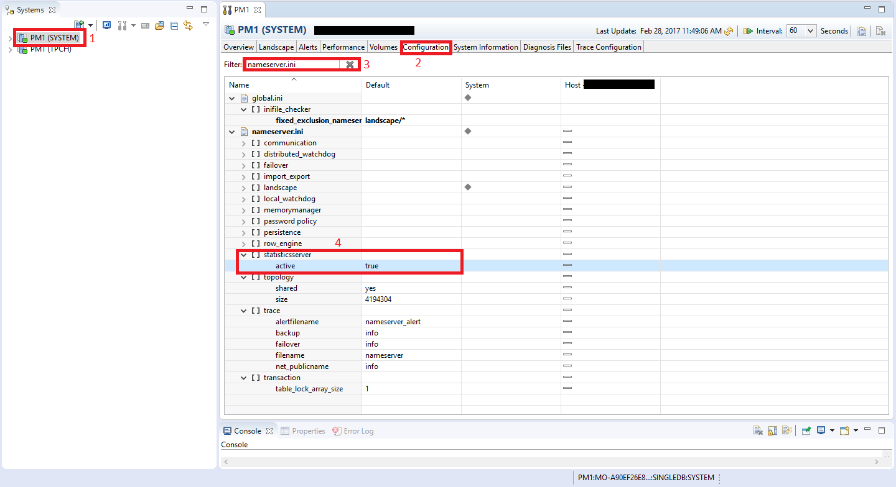
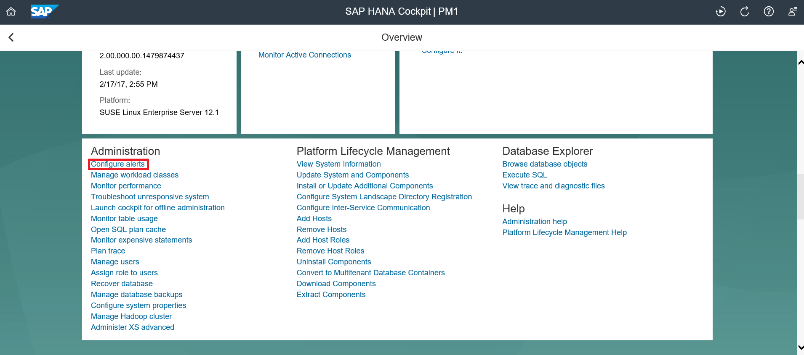
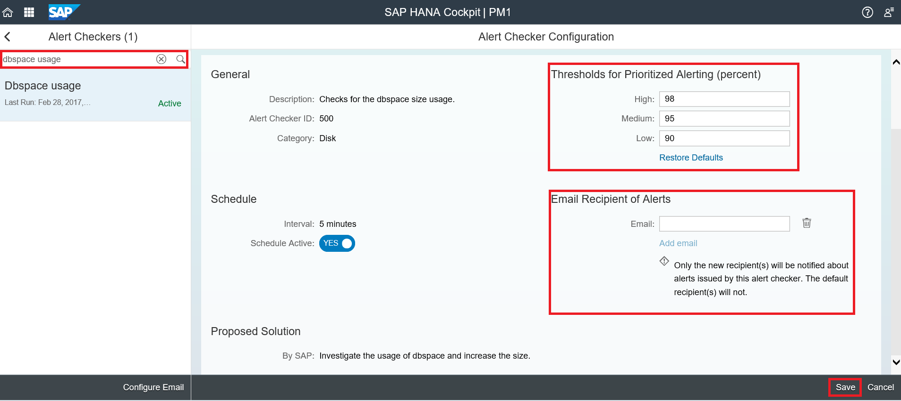

## Prerequisites  
 - **Proficiency:** Beginner
 - **Tutorials:** [Stopping and Restarting the Extended Storage Service](https://www.sap.com/developer/tutorials/dt-monitoring-hana-part3.html)

## Details
### You will learn  
 - Check used memory and set alerts
 - Perform `Dbspace` checks
 - Check which extended storage/dynamic tiering tables have been created

### Time to Complete
**10 Min**

---

[ACCORDION-BEGIN [Step 1: ](Check Used Memory and Set Alerts)]
In SAP HANA Cockpit, you can view some of the statistics for each host that you are running. Navigate to your resource and then click on "**Memory Usage**" as shown below.



You will be taken to the following screen where you can see how much memory is being used. You can also choose which services and hosts you want to see used memory for by selecting them in the "**Services & Hosts**" section.



Furthermore, as an administrator, you can also manipulate the thresholds of various alerts. Alerts are already predefined in the system, and you can adjust the threshold of these alerts as desired. There is a pre-requisite step that needs to be done for such authority. You need to go to SAP HANA Studio, open "Administration" and go to the "Configuration" tab. Click on the drop down of "`nameserver.ini`" followed by "`statisticsserver`". Double click on "**active**" and you can set the new value to be "**true**". Click "**Save**".

> Note: If you are unable to edit the value of "active" by double clicking then make the change using the `SYSTEM` user.



Next navigate back to your resource on SAP HANA Cockpit and click on "**Configure Alerts**".



In the search bar on the left side, search for the Dynamic Tiering "`Dbspace usage`" alert type. Click on "**Edit**" in the bottom right corner in order to modify the alert. You have the option of configuring the threshold, setting up the schedule to see how often that phase is checked, and adding email recipients for the alerts. Once you have changed the settings, you can click "**Save**" on the bottom right corner.



As a test case, you can click on "**Run Check Now**" beside the "**Edit**" button to ensure the alert is working.

[DONE]
[ACCORDION-END]

[ACCORDION-BEGIN [Step 2: ](Additional Queries to use in SAP HANA Studio)]
There are some queries that aid you to see what is up and working and identify if there is anything missing.

To see all the `Dbspaces`, their sizes, whether additional reserve size was added and some additional information, use the following:

```sql
SELECT * FROM "SYS"."M_ES_DBSPACES"
```
To see the inside of a `Dbspace` and identify what files are added to them, use the following:

```sql
SELECT * FROM "SYS"."M_ES_DBSPACE_FILES"
```
To identify what extended tables/Dynamic Tiering tables have been created in your system along with some of their properties, use the following:

```sql
SELECT * FROM "SYS"."M_ES_TABLES"
```

[DONE]
[ACCORDION-END]
