## Prerequisites
 - **Proficiency:** Intermediate
 - **Tutorials:** [Visualize a Graphical Query Plan](https://developers.sap.com/tutorials/dt-query-processing-part1.html)

## Next Steps
 - **Tutorials:** [Table Statistics and its Effect on Query Plans](https://developers.sap.com/tutorials/dt-query-processing-part3.html)

## Details
### You will learn
 - Generating Prepared and Executed Query Plans.
 - Knowing the difference between a Prepared and Executed Query Plans.

### Time to Complete
**20 Min**.

---

[ACCORDION-BEGIN [Step 1: ](Generate a Prepared Plan)]
In this tutorial you will be learning the differences between a Prepared and Executed plan. In brief, The key difference between the two plans is that a Prepared Plan is less detailed than an Executed Plan due to the fact that an Executed Plan has more information to work with.

Lets start off by creating a Prepared Plan. In SAP HANA Studio, go to **SAP HANA Administration Console** perspective. In the **Systems** tab on the left hand side, right click on the system you are working with, and select **Open SQL Console**.


Copy and paste the script below into the SQL console.

> Note: This script is different from the script used in the previous tutorial

``` sql
SELECT
  SUM(L_EXTENDEDPRICE * (1 - L_DISCOUNT)) as revenue
FROM
  "TPCH"."LINEITEM_DT",
  "TPCH"."PART_CS"
WHERE
  (
    P_PARTKEY = L_PARTKEY
    AND P_BRAND = 'Brand#54'
    AND P_CONTAINER IN ('SM CASE', 'SM BOX', 'SM PACK', 'SM PKG')
    AND L_QUANTITY >= 6 AND L_QUANTITY <= 6 + 10
    AND P_SIZE BETWEEN 1 AND 5
    AND L_SHIPMODE IN ('AIR', 'REG AIR')
    AND L_SHIPINSTRUCT = 'DELIVER IN PERSON'
  )
  OR
  (
    P_PARTKEY = L_PARTKEY
    AND P_BRAND = 'Brand#13'
    AND P_CONTAINER IN ('MED BAG', 'MED BOX', 'MED PKG', 'MED PACK')
    AND L_QUANTITY >= 10 AND L_QUANTITY <= 10 + 10
    AND P_SIZE BETWEEN 1 AND 10
    AND L_SHIPMODE IN ('AIR', 'REG AIR')
    AND L_SHIPINSTRUCT = 'DELIVER IN PERSON'
  )
  OR
  (
    P_PARTKEY = L_PARTKEY
    AND P_BRAND = 'Brand#54'
    AND P_CONTAINER IN ('LG CASE', 'LG BOX', 'LG PACK', 'LG PKG')
    AND L_QUANTITY >= 29 AND L_QUANTITY <= 29 + 10
    AND P_SIZE BETWEEN 1 AND 15
    AND L_SHIPMODE IN ('AIR', 'REG AIR')
    AND L_SHIPINSTRUCT = 'DELIVER IN PERSON'
  );
```

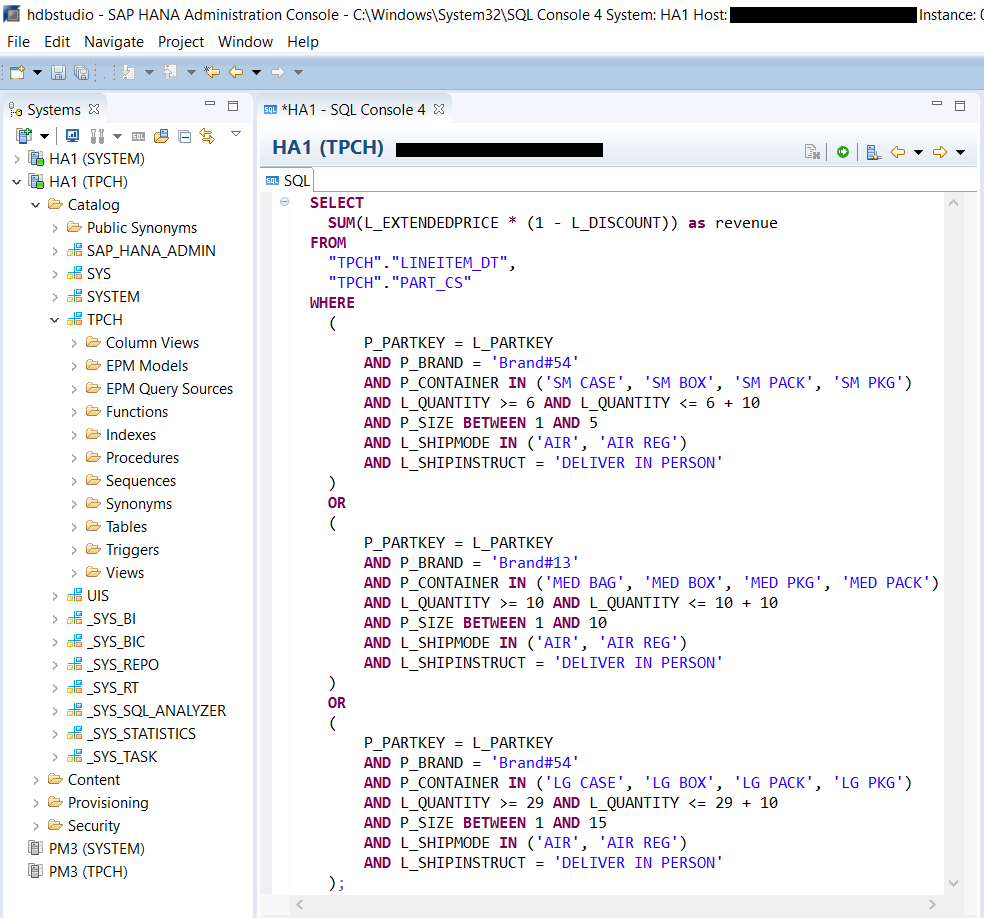

Right click inside the SQL console, then select **Visualize Plan** > **Prepare**. You can also press **Ctrl** + **Shift** + **V**.

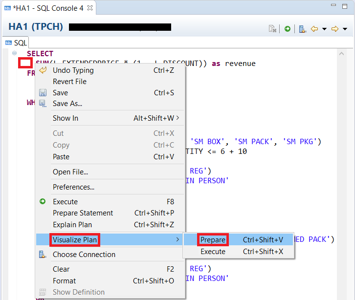

Click on the drop down arrow to fully expand the query plan. Keep the Prepared Plan window open for future comparison. Then go back to the SQL console tab by click on it.


> Note: Notice how you cannot expand "Remote Row Scan". The reason for this is because the Prepared Plan does not include detailed plan information from Dynamic Tiering and as such the "Remote Row Scan" does not have any information to present.

[DONE]

[ACCORDION-END]

[ACCORDION-BEGIN [Step 2: ](Generate an Executed Plan)]
Next you will open the Executed Plan for the same query using the script provided in the previous step. Right click inside the SQL console, then select **Visualize Plan** > **Execute**. You can also press **Ctrl** + **Shift** + **X**.

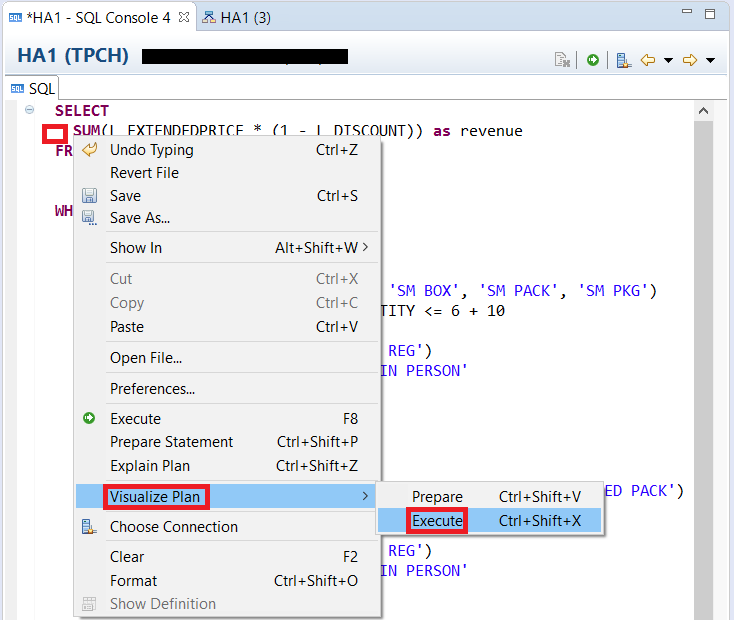

An overview of the Executed Query Plan will open up. This tab contains general information like compilation time, execution time, operators used etc. Select the **Executed Plan** sub-tab to open the graphical view of the Executed Plan.

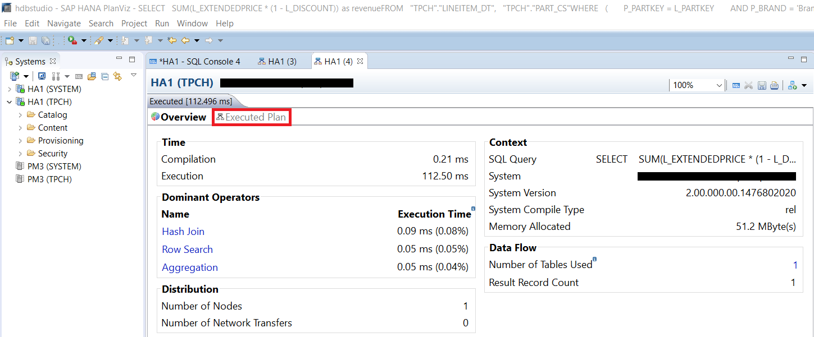

Click on the arrow in the "Remote Row Scan" box to fully expand it. Keep the Executed Plan window open for future comparison. Then go back to the SQL console tab by clicking on it.

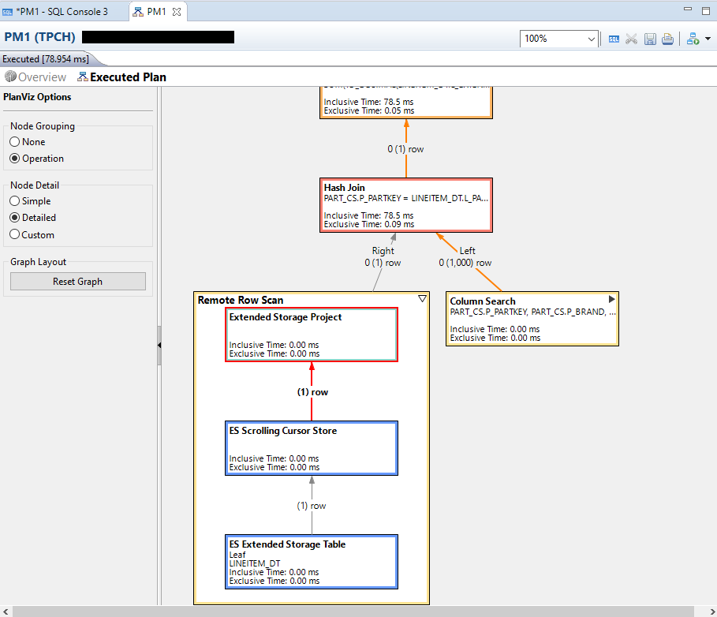
> Note: Notice how for the Executed Plan, you can expand "Remote Row Scan". The reason for this is because the Executed Plan actually does include detailed plan information from Dynamic Tiering and as such the "Remote Row Scan" does have information to present.

Try expanding "Column Search" by clicking on the arrow in the "Column Search" box. You may notice that you get the following pop up if you try expanding the "Column Search".

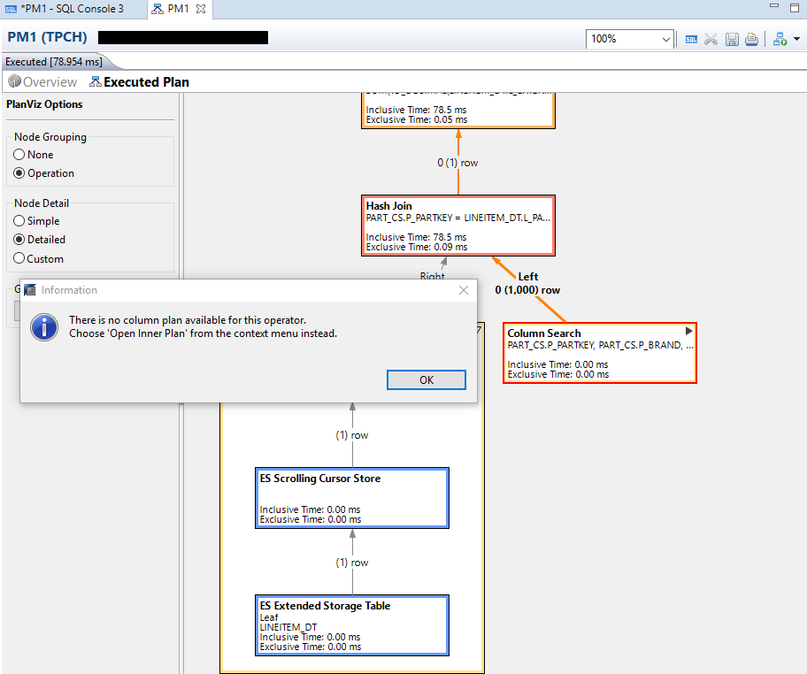

Right click on inside the Executed Plan tab and then click on **Open Inner Plan** > **Logical**.

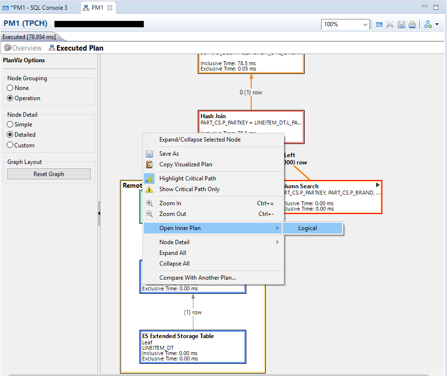

Once the Inner Plan has been opened, you will see the following showing what operations took place under Column Search.

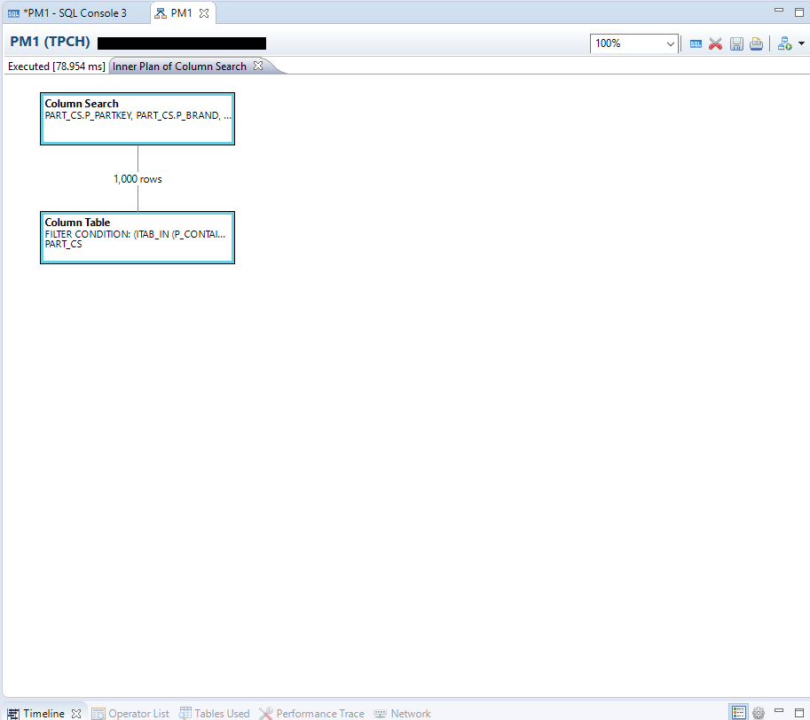

[VALIDATE_1]

[ACCORDION-END]

[ACCORDION-BEGIN [Step 3: ](Comparing Prepared and Executed Plans)]
Left click and hold on the newly created Executed Plan tab. Then drag the tab slightly down and release in order to place the Prepared and Executed Plan side by side to compare them. When dragging the Executed Plan tab, you will see guide lines that indicates how the tab will be displayed after rearrangement.


You should see that the center window has been rearranged to show two tabs on the left side and one tab on the right side. Select the Prepared Plan tab on the left side to show the Prepared Plan.

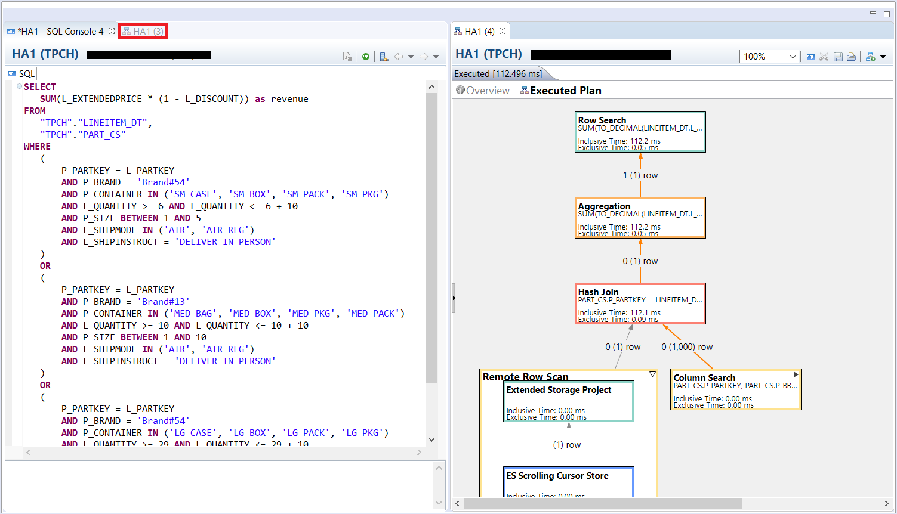

You should now have both the Prepared and Executed Plan side by side for comparison. One thing to notice is that the Executed plan shows the estimated row counts from the Prepared Plan next to the actual row counts. For example, in the Executed plan under "**Remote Row Scan**", there is a "1" in brackets indicating the Prepared Plan estimated that one row would be returned from the "Remote Row Scan". However, if you look at the number beside the "1" in brackets, it says 0 rows were actually returned from the "Remote Row Scan".

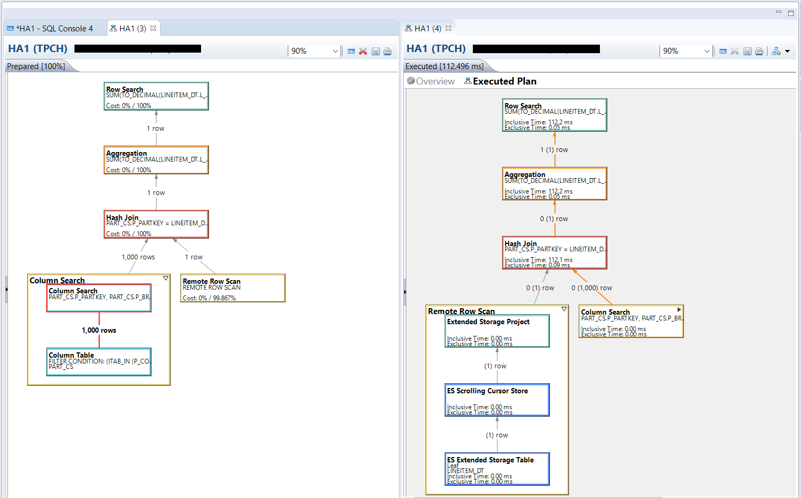

> Note: Notice that the Executed Plan is much more detailed than the Prepared Plan. Moreover, the operators showing in the Executed Plan on the right-hand side of the screen above include the detailed operations falling within the Remote Row Scan operator. In the Prepared Plan the Remote Row Scan indicates that work is being delegated to the Dynamic Tiering engine but does not give any additional detail on how the work may be executed within Dynamic Tiering and thus there is no drop down arrow. In the Executed Plan the Remote Row Scan actually shows the portion of the query that was delegated to the Dynamic Tiering engine and how that work was executed.

Ignore this line. Used for format purposes.

You can get more detailed information by hovering over an element in the plan as seen below.

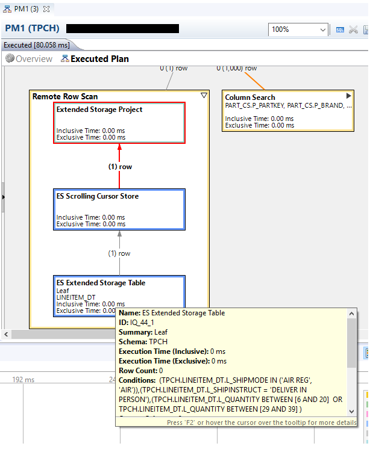

[DONE]

[ACCORDION-END]
