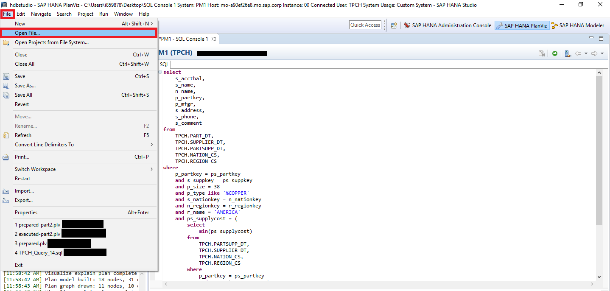
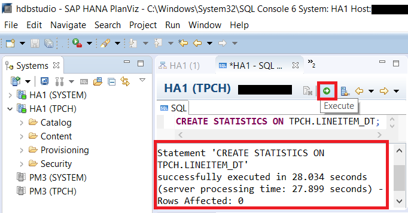
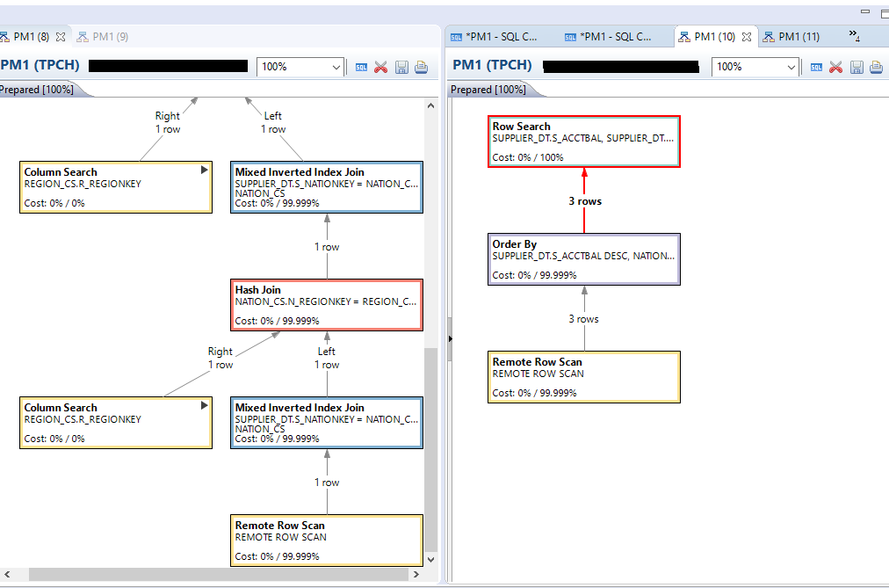

## Prerequisites
 - **Proficiency:** Intermediate
 - **Tutorials:** [Compare Prepared and Executed Plan](https://developers.sap.com/tutorials/dt-query-processing-part2.html)

## Next Steps
 - **Tutorials:** [Detailed Query Plan and Indexes](https://developers.sap.com/tutorials/dt-query-processing-part4.html)

## Details
### You will learn
 - Creating table statistics.
 - Analyzing the effect of table statistics on query plans.

### Time to Complete
**20 Min**.

---

SAP HANA and Dynamic Tiering relies on statistics in order to help the optimizer choose the most effective access plan. Creating statistics is particularly important for queries involving Dynamic Tiering as they help SAP HANA determine when it is appropriate to use optimizations like `joinRelocation` or `SemiJoin` rules. These query operators help SAP HANA and Dynamic Tiering minimize the volume of data (# of rows & column values) transferred between the core SAP HANA and Dynamic Tiering nodes.

[ACCORDION-BEGIN [Step 1: ](Create Prepared and Executed Query Plans)]
During this tutorial we will be creating statistics for the `TPCH.PART_DT` table. In order to see the effect of creating statistics, we first want to generate and save the Prepared and Executed plans for a query on the `TPCH.PART_DT` table before the statistics get created. Use the following script to create the Prepared and Executed Plans:

``` sql
select
	s_acctbal,
	s_name,
	n_name,
	p_partkey,
	p_mfgr,
	s_address,
	s_phone,
	s_comment
from
	TPCH.PART_DT,
	TPCH.SUPPLIER_DT,
	TPCH.PARTSUPP_DT,
	TPCH.NATION_CS,
	TPCH.REGION_CS
where
	p_partkey = ps_partkey
	and s_suppkey = ps_suppkey
	and p_size = 38
	and p_type like '%COPPER'
	and s_nationkey = n_nationkey
	and n_regionkey = r_regionkey
	and r_name = 'AMERICA'
	and ps_supplycost = (
		select
			min(ps_supplycost)
		from
			TPCH.PARTSUPP_DT,
			TPCH.SUPPLIER_DT,
			TPCH.NATION_CS,
			TPCH.REGION_CS
		where
			p_partkey = ps_partkey
			and s_suppkey = ps_suppkey
			and s_nationkey = n_nationkey
			and n_regionkey = r_regionkey
			and r_name = 'AMERICA'
	)
order by
	s_acctbal desc,
	n_name,
	s_name,
	p_partkey;
```

You could also save the plans if you choose to by clicking on the "Save As" icon in the Prepared/Executed Plan window.


To open a saved plan, click on **File** > **Open File...** and then browse to where you saved the plan.



[DONE]

[ACCORDION-END]

[ACCORDION-BEGIN [Step 2: ](Create Statistics and Opening Prepared and Executed Query Plans After Running Statistics)]
Now that we have captured the Prepared and Executed query plans showing how the query is handled without having created statistics, we are ready to go ahead and create the statistics for the `TPCH.PART_DT` table to see if we can improve the query plans. To create the statistics, go to the **SAP HANA Administration Console** and open a new SQL console.


Copy and run the script below to create statistics on the table "`PART_DT`". Ensure the script executed successfully.

``` sql
CREATE STATISTICS ON TPCH.PART_DT;
```



Open another set of Prepared and Executed Query Plans after running statistics for comparison with the previous Prepared and Executed Plans that were created in step one before running statistics.

Left click on one of the tabs and drag them down slightly in order to display two tabs side by side.

[DONE]

[ACCORDION-END]

[ACCORDION-BEGIN [Step 3: ](Analyze the Impact of Statistics on Prepared Plans)]
Put the Prepared Plan generated before creating the statistics  on the left side of the screen and the Prepared Plan generated after creating the statistics on the right side of the screen in order to compare them.



The left screenshot shows the Prepared Query Plan prior to running the "`CREATE STATISTICS`" statement. The screenshot on the right shows the Prepared Query Plan after running the "`CREATE STATISTICS`" statement.

One of the major benefits to creating statistics is that the optimizer receives more information to work with resulting in a more refined search. For example, before creating statistics, the optimizer estimated that 1 row would be returned from the "Remote Row Search". After creating the statistics, the optimizer was able to more accurately estimate that 3 rows would be returned from the "Remote Row Search".

>These results are based on SAP HANA Dynamic Tiering 2.0 SPS00 Rev 00. You may see a different query plan with a different version of HANA and/or Dynamic Tiering. Regardless of the version, the benefit of the statistics is providing the query optimizer with additional information to use in generating the query plan.

[VALIDATE_1]

[ACCORDION-END]

[ACCORDION-BEGIN [Step 4: ](Analyze the Impact of Statistics on Executed Plans)]
Put the Executed Plan generated before creating the statistics on the left side of the screen and the Executed Plan generated after creating the statistics on the right side of the screen in order to compare them.


The left screenshot shows the executed query plan prior to running the "`CREATE STATISTICS`" statement. The screenshot on the right shows the executed query plan after running the "`CREATE STATISTICS`" statement.

Looking at the output in this example, you will notice that both the estimated # of rows to be returned from the Remote Row Scan operator (shown in brackets in the query plan) and the actual # of rows being returned have changed. For example, the actual number of rows that were returned from the "Remote Row Scan" operator before creating statistics was 13,248 rows compared to the estimate of 1 row. After creating statistics, 497 rows were actually returned from the "Remote Row Scan" operator compared to the estimate of 3 rows. While the estimated # of rows to be returned still doesn't perfectly match the actual # of rows, the estimated and actual #s of rows are now much closer to each other than before creating statistics which means that with the statistics SAP HANA is better able to choose an optimal query execution plan.

>These results are based on SAP HANA Dynamic Tiering 2.0 SPS00 Rev 00. You may see a different query plan with a different version of HANA and/or Dynamic Tiering. Regardless of the version, the benefit of the statistics is providing the query optimizer with additional information to use in generating the query plan.

[DONE]

[ACCORDION-END]
