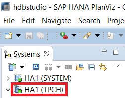
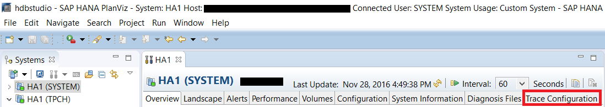
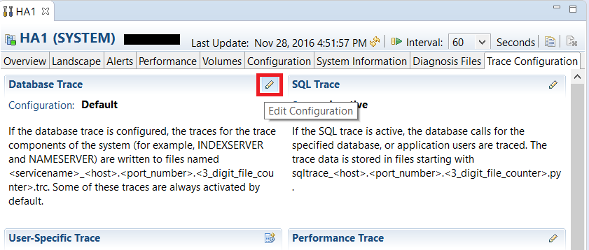
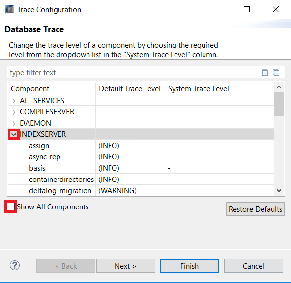
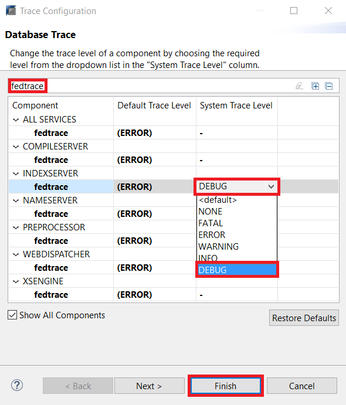
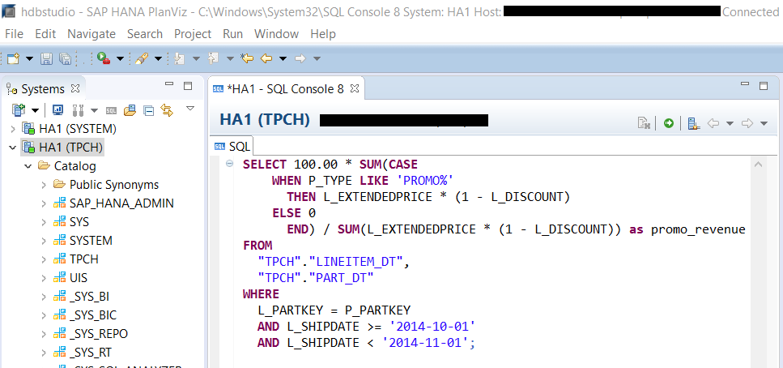
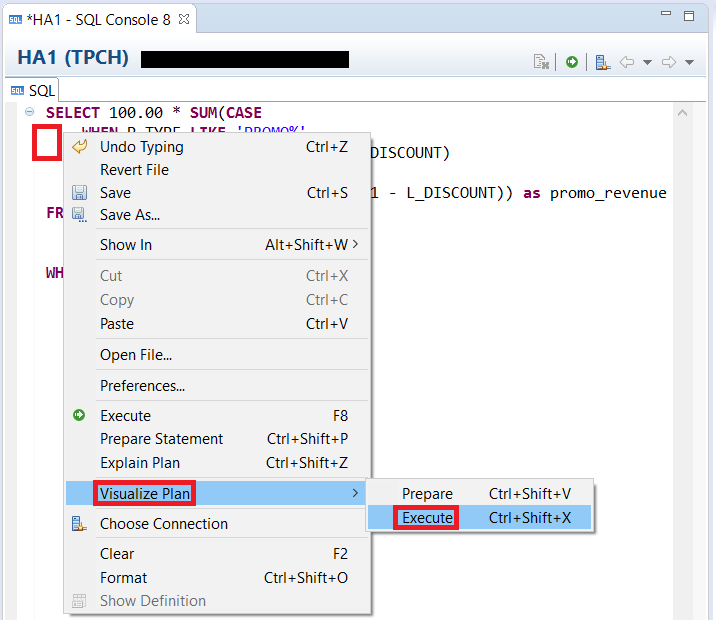
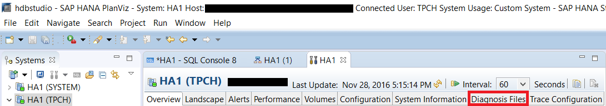
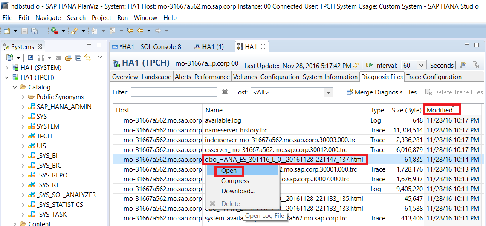
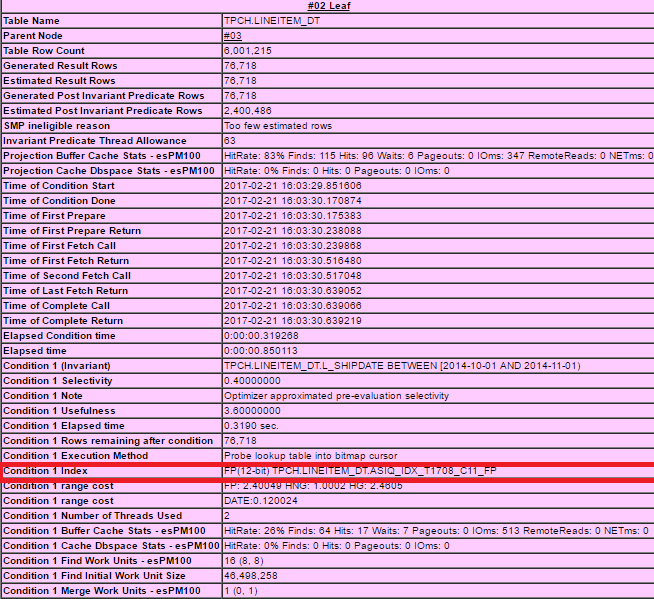

## Prerequisites
 - **Proficiency:** Intermediate
 - **Tutorials:** [Table Statistics and its Effect on Query Plans](https://developers.sap.com/tutorials/dt-query-processing-part3.html)

## Next Steps
 - **Tutorials:**

## Details
### You will learn
 - Accessing a more detailed HTML query plan through SAP HANA Studio.
 - Creating indexes on table columns to improve query performance.
 - Analyzing the impact of indexes on query plans.

### Time to Complete
**20 Min**.

---

[ACCORDION-BEGIN [Step 1: ](Enabling the Generation of a Query Plan)]
In addition to the graphical query plan available through the `PlanViz` perspective, you can access an even more detailed query plan for the Dynamic Tiering portion of the query. In order to do this we will need to turn on a debug level of tracing.

In SAP HANA Studio, go to **SAP HANA Administration Console**. In the **Systems** tab on the left, double click on the system you are working with.



After the administration console opens, go to the **Trace Configuration** tab.



Click on the pencil icon under **Database Trace** to edit debug level.



A window should pop up where you need to click on the drop-down icon beside **INDEXSERVER**. Check the box for **Show All Components** on the bottom left.



You should now be able to see the field **`fedtrace`** under **INDEXSERVER**. Alternatively, you can also enter "`fedtrace`" in the type filter search box to find the field. In this row, click under the **System Trace Level** and select the option **DEBUG** and then click **Finish**.



[VALIDATE_1]

[ACCORDION-END]

[ACCORDION-BEGIN [Step 2: ](Generate and Open a Detailed Plan by Running a Query)]
In **SAP HANA Administration Console**, open a new SQL console.


Copy and paste the script below into the SQL console.

```sql
SELECT 100.00 * SUM(CASE
    WHEN P_TYPE LIKE 'PROMO%'
      THEN L_EXTENDEDPRICE * (1 - L_DISCOUNT)
    ELSE 0
  END) / SUM(L_EXTENDEDPRICE * (1 - L_DISCOUNT)) as promo_revenue
FROM
  "TPCH"."LINEITEM_DT",
  "TPCH"."PART_DT"
WHERE
  L_PARTKEY = P_PARTKEY
  AND L_SHIPDATE >= '2014-10-01'
  AND L_SHIPDATE < '2014-11-01';
```



Right click inside the SQL console, then select **Visualize Plan** > **Execute**. You can also press **Ctrl** + **Shift** + **X**.



In SAP HANA Studio, go to **SAP HANA Administration Console**. In the **Systems** tab on the left, double click on the system you are working with.


After the administration console opens, go to the **Diagnosis Files** tab.



The detailed plan file would have your Dynamic Tiering node as host. You can sort the entries by clicking on the **Host** header. Click on the **Modified** header to sort the files by modified date. Find the most recent HTML file with the name similar to "`dbo_HANA_ES_###...##.html`". You can also enter "`dbo_HANA_ES_*.html`" into the **Filter** box. Right click on the file and select **Download...** to download the file.



In the "Save As" pop up window, select where you want the file to be saved. Then click **Save** to save the file.

Navigate to the directory where the detailed query plan file is saved and double click to open it using your default web browser.

You should now see the detailed query plan. Scroll toward the end to find **Condition 1 Index**.

The highlighted index in the query plan below is the Fast Projection (FP) index. The FP indexes are automatically generated for each column in a Dynamic Tiering table. This FP index optimizes projections and enables certain kinds of search conditions to be evaluated. In the absence of any other index, the query plan will normally reference the FP index for the specific column.



[DONE]

[ACCORDION-END]

[ACCORDION-BEGIN [Step 3: ](Creating an Index)]
Go to **SAP HANA Administration Console** and open a new SQL console.

Copy and paste the script into the console. Then run the script to create a new index.
``` sql
CREATE INDEX L_SHIPDATE_INDEX ON LINEITEM_DT (L_SHIPDATE);
```

Repeat the **Generate and Open a Detailed Plan by Running a Query** section to generate another detailed plan.

See how it is faster...
As you can see, after creating the index, if we run the query again and view the detailed query plan generated from the `fedtrace`, we can see that the created index `L_SHIPDATE` is being used. The type of index used here is the High Group (HG) index which is commonly used for join columns with integer data types. When we create the index, HANA is smart enough to coordinate and figure out which index would be the best choice. In this case, the query optimizer has determined that the HG index will be more effective than the FP index and chosen the HG index for the query execution.


[DONE]

[ACCORDION-END]
