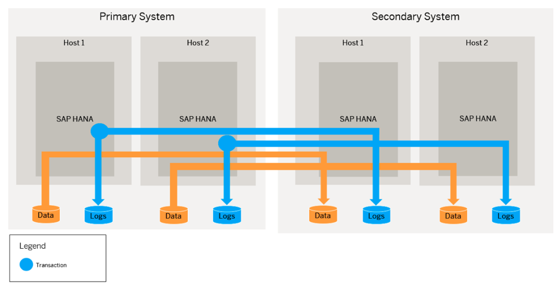
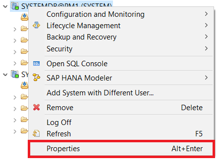
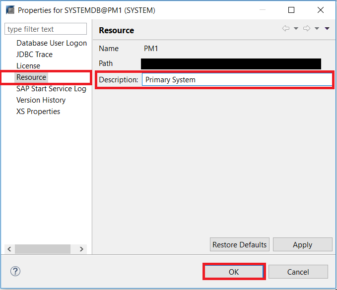
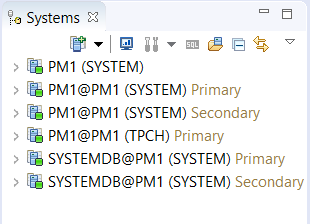
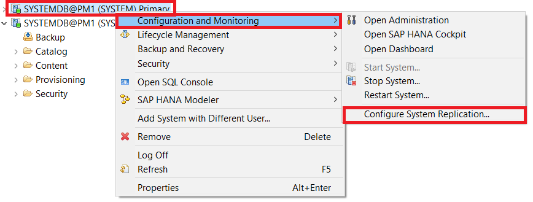
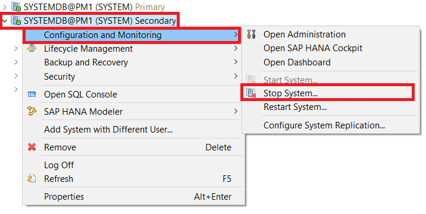
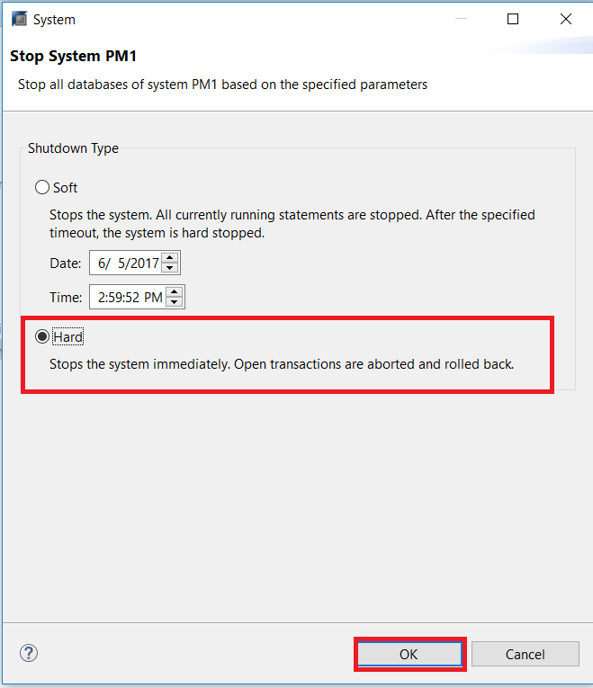
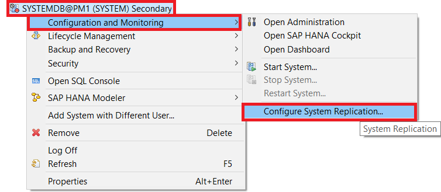
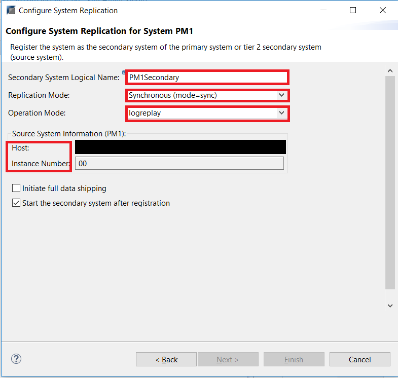
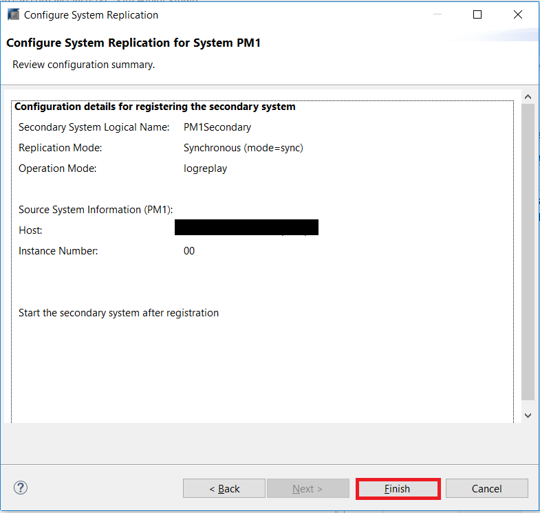

## Prerequisites
 - **Proficiency:** Advanced
 - **Tutorials** [Getting Started with SAP HANA Dynamic Tiering](https://developers.sap.com/group.dt-get-started.html) to set up your extended storage and [Creating Database Backups](https://developers.sap.com/group.dt-backup-recovery.html)
 - **Credentials:** Have access to the SYSTEM user of  `SystemDB` and "`<SID>adm`" for a SSH session on the HANA hosts.

## Details
### You will learn
- The prerequisites needed to set up System Replication between the Primary and Secondary System
- How to enable System Replication on the Primary System
- How to register the Secondary System

### Time to Complete
**15 Min**

---

[ACCORDION-BEGIN [Step 1: ](Introduction)]

System replication is a high-availability feature in every SAP HANA installation, offering an inherent disaster recovery support. It is a mirroring configuration where you set up a secondary system that is an exact copy of the main, primary system.

The instances in the secondary system operate in recovery mode, which means all secondary system services constantly communicate with their primary counterparts, replicate and persist data and logs, and load data to memory to build a shadow database. The secondary system is passive until the primary system becomes unavailable and a takeover is performed.

[DONE]

[ACCORDION-END]

[ACCORDION-BEGIN [Step 2: ](Pre-requisites)]

System Replication enables recovery from a data center outage by switching to a secondary site, in which the following prerequisites need to be met:

- The primary and secondary system are both installed and configured. You have verified that both are independently up and running. Ensure that Dynamic Tiering is created for the secondary system; if it is not enabled, follow the tutorial series: [Getting Started with SAP HANA Dynamic Tiering](https://developers.sap.com/group.dt-get-started.html) to enable the extended storage.
- The number of hosts must be the same in the primary and secondary systems.
- Multiple services of the same kind (for example, index servers) on one host are not supported.
- The software version of the secondary has to be equal or newer to the version on the primary system.
- The secondary system must have the same SAP system ID, `<SID>` and instance number as the primary system.
> Note: To make identifying between the primary and secondary system easier, navigate to the primary system in the Systems Panel. Right-click on the **System** > **Properties**.

> In the **Properties Window**, select **Resource**. In this window, you can edit the **Description** for your system, which will appear next to its name in the SAP Systems Panel. Edit the description to help you identify that it is the primary system.

> Repeat the process for the Secondary System and any tenants in the Primary System . Your Systems Panel should now appear similar to the one below.

- System replication between two systems on the same host is not supported.
- You have performed a data backup or storage snapshot on the primary system. In multiple-container systems, the system database and all tenant databases must be backed up. This is necessary to start creating log backups. If you have not yet backed up your primary system, follow [Creating Database Backups](https://developers.sap.com/tutorials/dt-backup-recovery-part2.html).
- Prepare the secondary system for authentication by copying the system `PKI SSFS` .key and the .dat file from the primary system to the secondary system.
> Note: To copy system `PKI SSFS` key and dat file from the primary site to the secondary site, you can find the files at the following locations.
> `/usr/sap/<SID>/SYS/global/security/rsecssfs/data/SSFS_<SID>.DAT`
> `/usr/sap/<SID>/SYS/global/security/rsecssfs/key/SSFS_<SID>.KEY`
> The copied files will become active during system restart, therefore it is recommended to copy them when the secondary HANA system is offline.

[VALIDATE_1]

[ACCORDION-END]

[ACCORDION-BEGIN [Step 3: ](Set Up System Replication with HANA Studio)]

With both the Primary and Secondary System added in your SAP HANA studio, navigate to the Systems Panel. Right-click the Primary System's `SystemDB`. Ensure you select a user with the `DATA ADMIN` privileges (Refer to [Create a New User and Assign Permissions](https://developers.sap.com/tutorials/dt-create-schema-load-data-part2.html) for help on assigning permissions) - for the purposes of this tutorial, we will use the SYSTEM user. Select **Configuration and Monitoring*** > **Configure System Replication**.

You may be prompted to enter the `<SID>adm` credentials. Enter and click **OK**.

The **Configure System Replication** window will open. By default, the **Enable System Replication** option is selected. Choose **Next**.

Enter in a Logical Name for the Primary System and click **Finish**.
> Note: The Logical Name is used to represent the Primary System. It can only contain characters `Aa-Zz` and numbers `0-9`.
For the purposes of our tutorial, we chose the Logical Name `PM1Primary`.

Now, to register the secondary system, the system must be stopped if it is running. Right-click the secondary system's System Database in the Systems Panel, with a user that has `DATA ADMIN` privileges. Select to **Configuration and Monitoring** > **Stop System**.

Select the **Hard** shutdown type, which stops the system immediately. You may be prompted for the `<sid>adm` credentials. Enter them and click **OK**.

> Note: If you have running statements, select the **Soft** shutdown type and select a time to perform a hard shutdown.

Now, in the Systems Panel, right-click the Secondary System and choose **Configuration and Monitoring** > **Configure System Replication**.

After the **Configure System Replication** dialog opens, select **Register Secondary System**, which will be the default option, and click **Next**.

Enter in the Logical Name, Primary System's Host Name and Instance Number. For Dynamic Tiering, it only supports `logreplay` operation mode and you can only enable 2-tier synchronous mode replication. Select the **Operation Mode** to be `logreplay` and the **Replication Mode** to be `Synchronous (mode=sync)`.

>Note: In 2-tier replication, there is only one secondary system per primary system. Synchronous mode means that the primary system waits for confirmation that the log is persisted in the secondary before committing a transaction.
> In `logreplay` operation mode, a redo log shipping is done after system replication was initially configured with one full data shipping. The redo log is continuously replayed on the secondary site immediately after arrival making this step superfluous during takeover. This mode does not require delta data shipping. Because of this the amount of data, which needs to be transferred to the secondary system is reduced.

Review the configuration summary and click **Finish**.

The secondary system will now start automatically.

You have enabled system replication and registered the secondary system with the primary system. The secondary system operates in recovery mode. All secondary system services constantly communicate with their primary counterparts, replicate and persist data and logs, and load data to memory. However, the secondary system does not accept SQL connections.

[DONE]

[ACCORDION-END]
