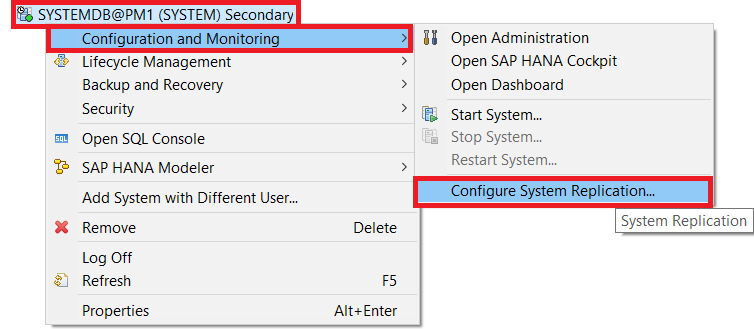
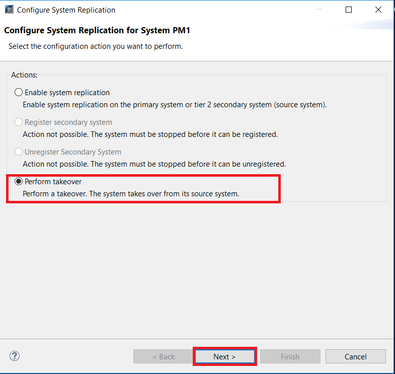
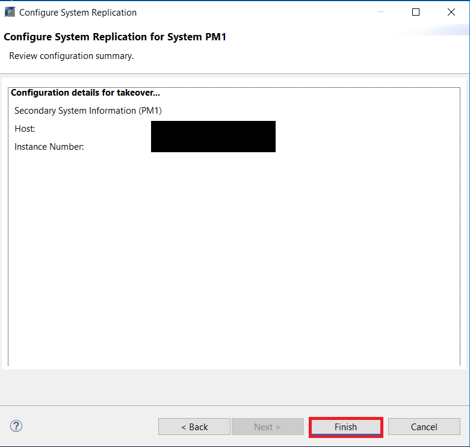
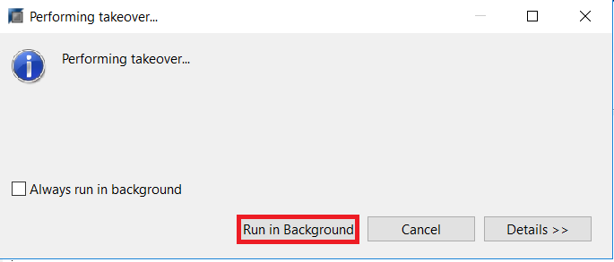

## Prerequisites
 - **Proficiency:** Advanced
 - **Tutorials** Setting Up SAP HANA System Replication with HANA Studio
 - **Credentials:** Have access to the SYSTEM user of  `SystemDB` and "`<SID>adm`" for a SSH session on the HANA hosts.

## Details
### You will learn
- When you should perform a takeover
- How to perform a takeover with HANA Studio

### Time to Complete
**10 Min**

---

[ACCORDION-BEGIN [Step 1: ](Performing a Takeover with HANA Studio)]
During a takeover you switch your active system from the current primary system to the secondary system.

If your primary data center is not available, due to a disaster or for planned downtime for example, and a decision has been made to fail over to the secondary data center, you can perform a takeover on your secondary system. Consider questions like:

A. **Can a takeover help at all?**
YES: Proceed to question B.
NO:  Do not perform a takeover.

B. **Can a takeover reduce downtime duration?**
YES: Proceed to question C.
NO:  Do not perform a takeover.

C. **Can it be guaranteed that no data loss will result from the takeover?**
YES: Perform a takeover.
NO:  Evaluate the risk of data loss in case of takeover against that of data loss in case of no takeover (total hardware failure in primary could result in a much bigger data loss), and against the impact of a longer downtime if you attempt to bring back the primary site instead of performing a takeover.

You can perform a takeover on your secondary system using the SAP HANA studio.

In the Systems Panel, right-click the secondary system and choose **Configuration and Monitoring** > **Configure System Replication**.

Choose **Perform Takeover** and click **Next**.

Confirm the default details of your Secondary System's host. Click **Next**.

You can review the overall configuration details. If they match what you entered/left default, click **Finish**.

The takeover will now proceed. You can select **Run in background** while the takeover is happening.

The secondary system is now the production system. If the system is already running, it comes out of recovery mode and becomes fully operational immediately: it replays the last transaction logs and starts to accept queries. If the system is offline, it takes over production operation when you start it.

[VALIDATE_1]

[ACCORDION-END]
