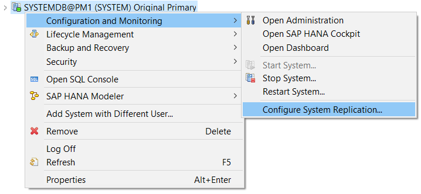
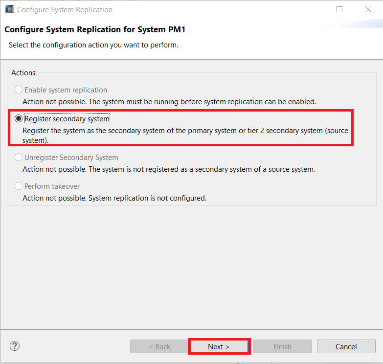
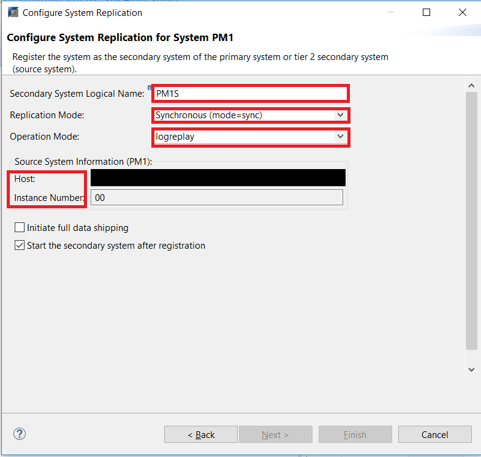
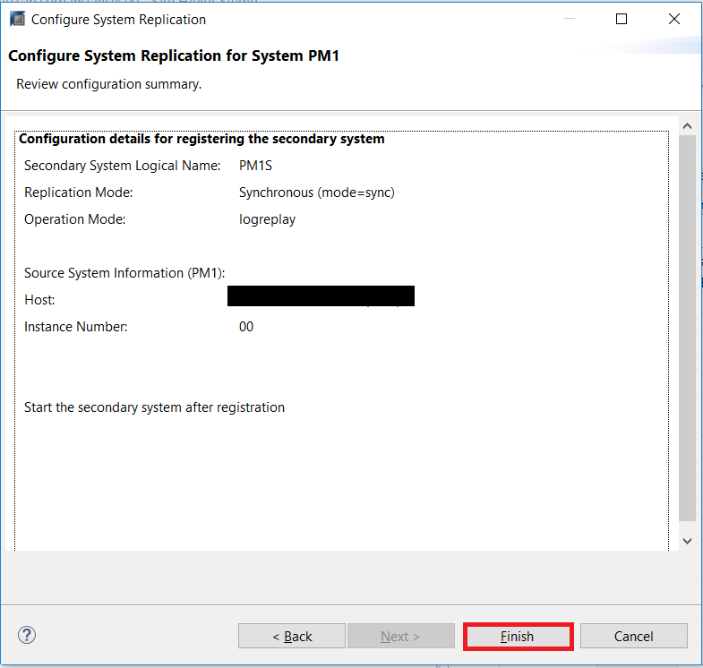
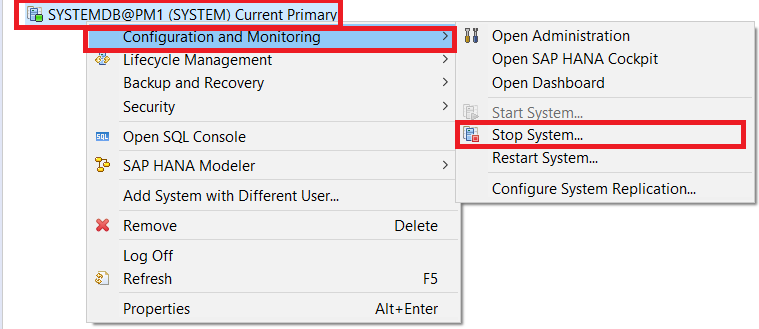
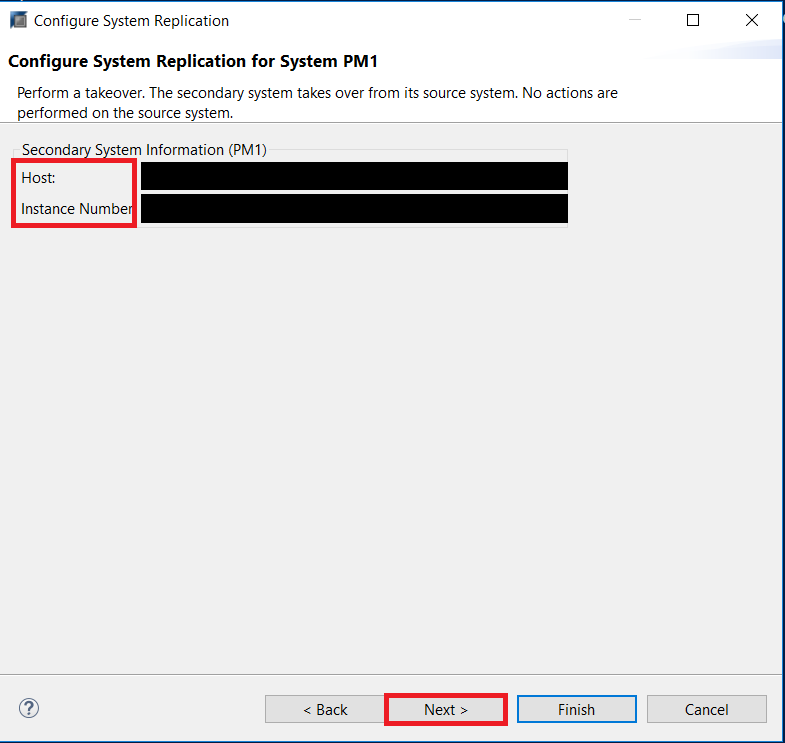

## Prerequisites
 - **Proficiency:** Advanced
 - **Tutorials** Performing a Takeover
 - **Credentials:** Have access to the SYSTEM user of  `SystemDB` and "`<SID>adm`" for a SSH session on the HANA hosts.

## Details
### You will learn
- The prerequisites needed to set up a Fail-back
- How to perform a fail-back in HANA Studio

### Time to Complete
**15 Min**

---

[ACCORDION-BEGIN [Step 1: ](Introduction)]
To fail-back to your original primary system, you must switch the roles of your systems back to their original configuration. To do so, the original primary system will have to be started as a secondary system. After both systems are back in sync, you can perform a takeover on the original primary system.

Before you perform a fail-back, ensure that the following pre-requisites are met:

- You are logged on to both systems as the operating system user (user `<sid>adm`) or are able to enter these credentials when prompted.
- You have performed a data backup or storage snapshot on the current primary system. In multiple-container systems, the system database and all tenant databases must be backed up.
- The original primary system is not running.
- The current primary system is running.

[DONE]

[ACCORDION-END]

[ACCORDION-BEGIN [Step 2: ](Performing a Failback)]
After a takeover has been carried out the roles between primary and secondary can be switched over.

In the case of a failover, the former primary has to be registered as the secondary with the now active primary system. The roles are switched compared to the original setup.

Register the original primary system as the secondary system as follows:

In the Systems Panel, right-click the primary system and choose **Configuration and Monitoring** > **Configure System Replication**.

The **Configure System Replication** dialog will open. Choose **Register Secondary System** and then **Next**.

Enter the required system information and the logical name used to represent the system.
> Note: You cannot use the logical name you used for your original secondary system. For the purposes of this tutorial, we choose the name `PM1S`.
> Ensure you select the replication mode as `Synchronous (mode=sync)` and the operation mode as `logreplay` as that is the only mode Dynamic Tiering supports

Review the configured information and choose **Finish**.

Start the original primary system.

The original primary system is now registered as the secondary system with the current primary system (that is, the original secondary system). As the data that is already available in the original primary system cannot be reused, a complete initialization is carried out. This means that a full data replication takes place until the original primary system is fully in sync.

Now, we will fail back to the original primary system.

In the **Systems** view, right-click the current primary system and choose **Stop System**.

Then, navigate to the **original** primary system, and choose **Configure System Replication**.

Choose **Perform Takeover** and **Next**.

Confirm the details by accepting the default, and click **Finish**

The takeover will now be performed.

Finally, to re-register the original secondary system, right-click the original secondary system and choose **Configuration and Monitoring** > **Configure System Replication**. After the dialog open, choose **Register Secondary System** and then **Next**.

Enter the required system information and the logical name used to represent the system.
> Ensure you select the replication mode as `Synchronous (mode=sync)` and the operation mode as `logreplay` as that is the only mode Dynamic Tiering supports

Review the details, and click **Finish**.

The primary system and secondary system have their original roles again.

[VALIDATE_1]

[ACCORDION-END]
