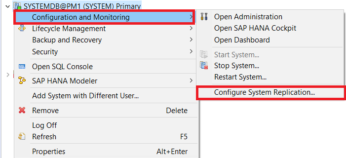
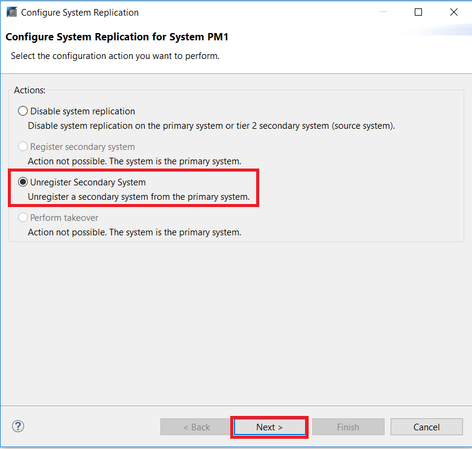
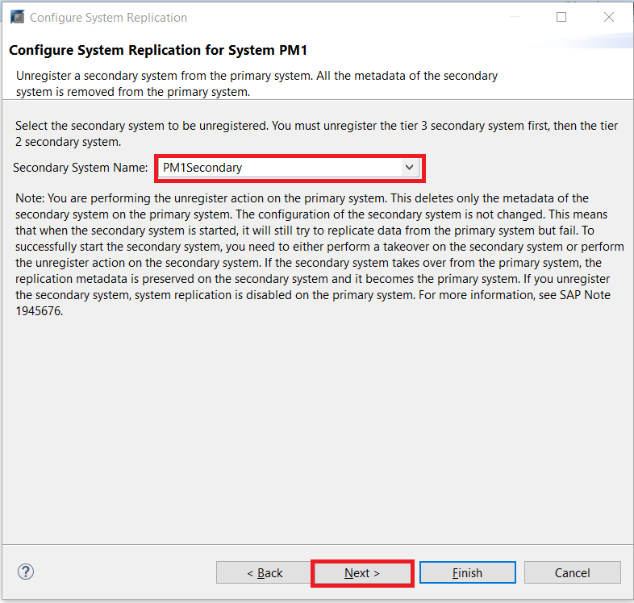
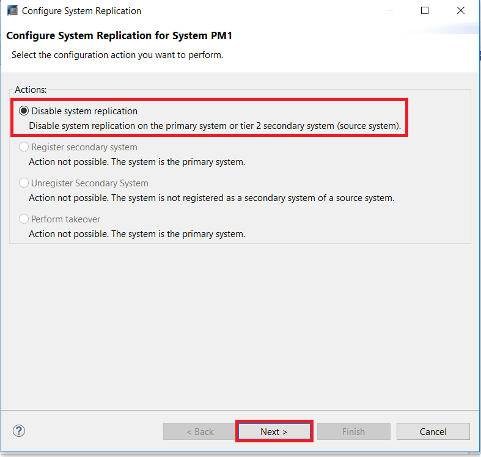

## Prerequisites
 - **Proficiency:** Advanced
 - **Tutorials** Performing a Fail-back
 - **Credentials:** Have access to the SYSTEM user of  `SystemDB` and "`<SID>adm`" for a SSH session on the HANA hosts.

## Details
### You will learn
- How to disable system replication with SAP HANA Studio

### Time to Complete
**10 Min**

---

[ACCORDION-BEGIN [Step 1: ](Disabling System Replication)]

You can disable SAP HANA system replication for an SAP HANA system by first `unregistering` the secondary system and then disabling system replication on the primary system.

Before we begin to disable system replication, ensure that the Secondary System has been stopped, and that the Primary System is online.

First, we will `unregister` the secondary system.
In the Systems Panel, right-click the **Primary System** and choose **Configuration and Monitoring** > **Configure System Replication**.

In the pop-up dialog, select **`Unregister` secondary system** and then **Next**.

Select the **Secondary System Name**. Since Dynamic Tiering only support two-tier system replication, you can leave the default option. Click **Next**.

Review the configuration details and click **Finish**.

Now, to disable system replication on the primary system, right-click the **Primary System** again, and choose **Configuration and Monitoring** > **Configure System Replication**.

Choose **Disable system replication** and click **Next**.

Leave the **Ignore secondary system** unchecked, which will remove all secondary system's metadata, and click **Finish**.

System Replication has now been disabled.

[DONE]
[ACCORDION-END]

[ACCORDION-BEGIN [Step 2: ](Test yourself)]

[VALIDATE_1]
[ACCORDION-END]
