## Prerequisites
 - **Development environment:** Apple Mac running macOS Catalina or higher with Xcode 13 or higher
 - **Device**: You need an iPad or iPhone in order to run and test the app
 - **Knowledge**: You should have a basic understanding of the Swift programming language and iOS Development with Xcode.
 - **Tutorial**: [Access SAP Mobile Services](fiori-ios-hcpms-setup)
 - **Optional: Group:** [Set Up the SAP BTP SDK for iOS](group.ios-sdk-setup)
 - **Optional: SAP BTP SDK for iOS:** Version 7.0 or higher

## Details
### You will learn
  - How to add the `FioriAR` Swift package to your Xcode project using the Swift Package Manager
  - How to use the `FioriAR` APIs and SwiftUI screens to build an AR Scene Authoring View and AR Scene Display View

This tutorial is based on SwiftUI and will only reference to the use of `FioriAR` within a `UIKit` based app, hence the above mentioned prerequisites of setting up the SAP BTP SDK for iOS and downloading the SAP BTP SDK for iOS Assistant is optional. You can install the SDK and the assistant if you want to implement the app with `UIKit`.

The project can be found in the SAP Samples on GitHub: [Mobile Augmented Reality GitHub](https://github.com/SAP-samples/mobile-augmented-reality)

---

[ACCORDION-BEGIN [Step 1: ](Create a New SwiftUI Xcode Project)]
> Before you start following the first step, notice that if you want to go the `UIKit` based approach, go and follow the [Set Up the SAP BTP SDK for iOS](group.ios-sdk-setup) tutorials in order to generate an app using the SAP BTP SDK for iOS Assistant. The first step is solely for the `SwiftUI` based approach!

In this step you will use the Xcode Project creation flow to create a SwiftUI based app project.

1. Open up your instance of Xcode, here using Xcode Version 13.2.1 (13C100).

    !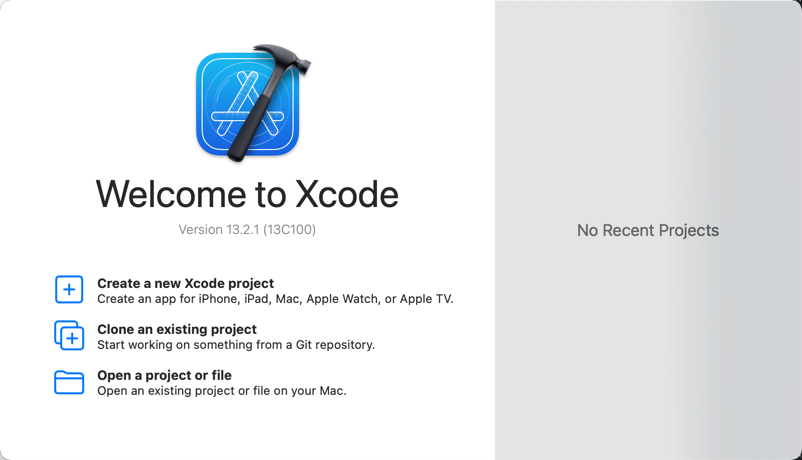

2. Create a new **App** project.

    !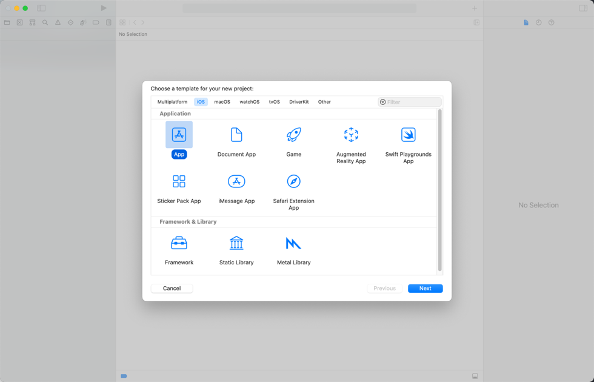

3. Give the app project a name and make sure you've selected **SwiftUI** as the **Interface**. You can choose the name freely.

    !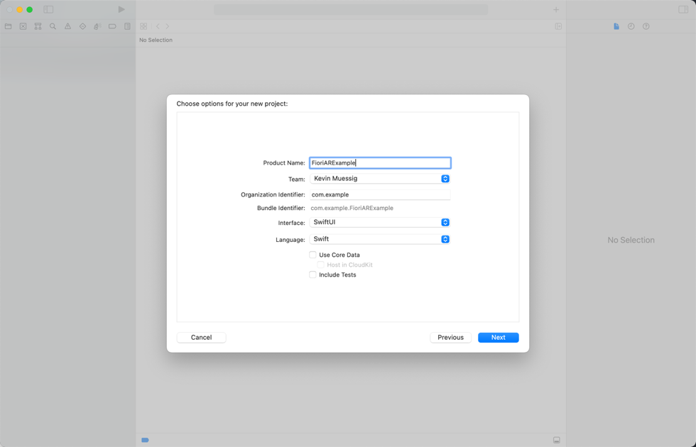

4. Create the project in a directory of your choice.

    !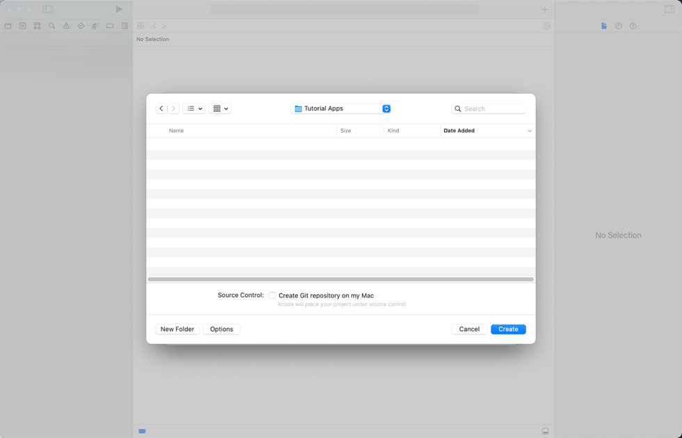

5. After you've created the project you should see the project opening up.

    !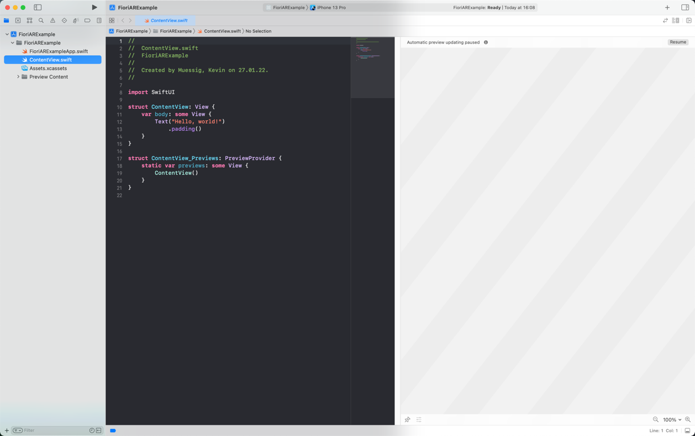


[DONE]
[ACCORDION-END]

[ACCORDION-BEGIN [Step 2: ](Add the FioriAR Swift Package to the Project)]
The [`FioriAR` GitHub Repository](https://github.com/SAP/cloud-sdk-ios-fiori-ar) package is open-source and available to you in the `SAP-Samples` on GitHub. You can not only consume the package through the Swift Package Manager but also contribute to the project yourself by forking the repository. For more information on contribution check the [Contributing guide](https://github.com/SAP/cloud-sdk-ios-fiori-ar/blob/main/CONTRIBUTING.md).

You will use the Swift Package Manager within Xcode to pull and embed the `FioriAR` package.

1. In your Xcode project, open the **Add Swift package...** menu item under **File** in the **Menu Bar**.

    !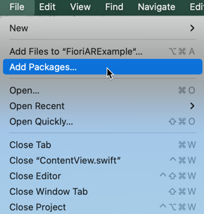

2. Use the **Search Field** to paste in the GitHub repository address **(1)**:

    ```
    https://github.com/SAP/cloud-sdk-ios-fiori-ar.git
    ```

3. The Swift package should show up **(2)**, make sure to change the **Dependency Rule** to **Up to Next Major Version (3)** in order to use the latest release.

    !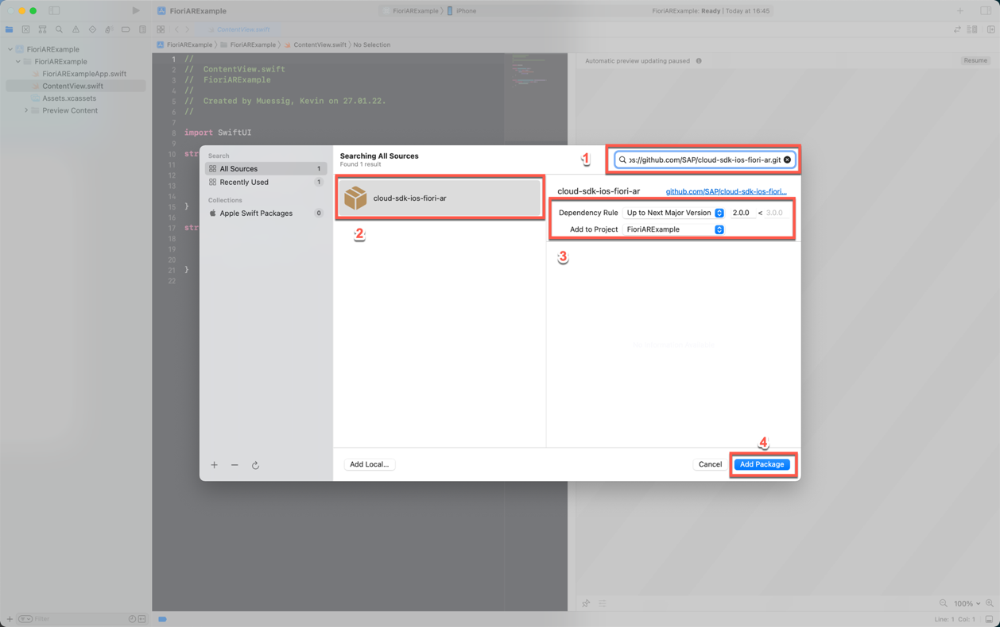

4. Click on **Add Package**. This will start the fetching of the Swift package.

    !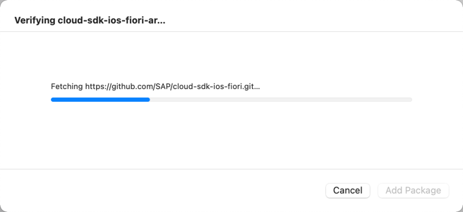

5. After the fetching progress has finished, select the **`FioriAR`** package product and click on **Add Package**.

    !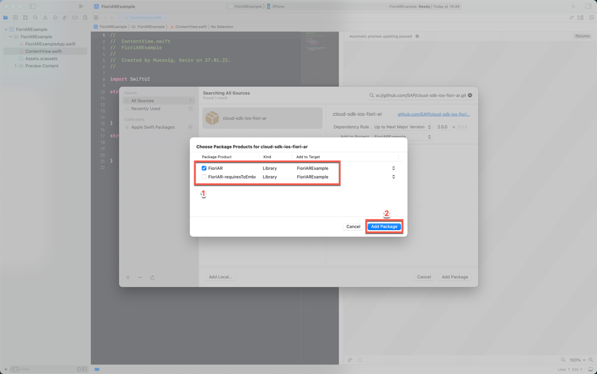

You can choose between two options when embedding the `FioriAR` Swift package to your project. The one you have select for this tutorial will also fetch and embed all of `FioriAR's` package dependencies for you including the SAP BTP SDK for iOS packages. If you choose the **`FioriAR-requiresToEmbedXCFrameworks`**, you need to embed the SAP BTP SDK for iOS packages yourself using the SAP BTP SDK for iOS Assistant.

If you click on **Package Dependencies** in the project file, you can see that the `FioriAR` Swift package got added to your project. If you look on the left-hand side you can see the dependencies of the `FioriAR` package.

!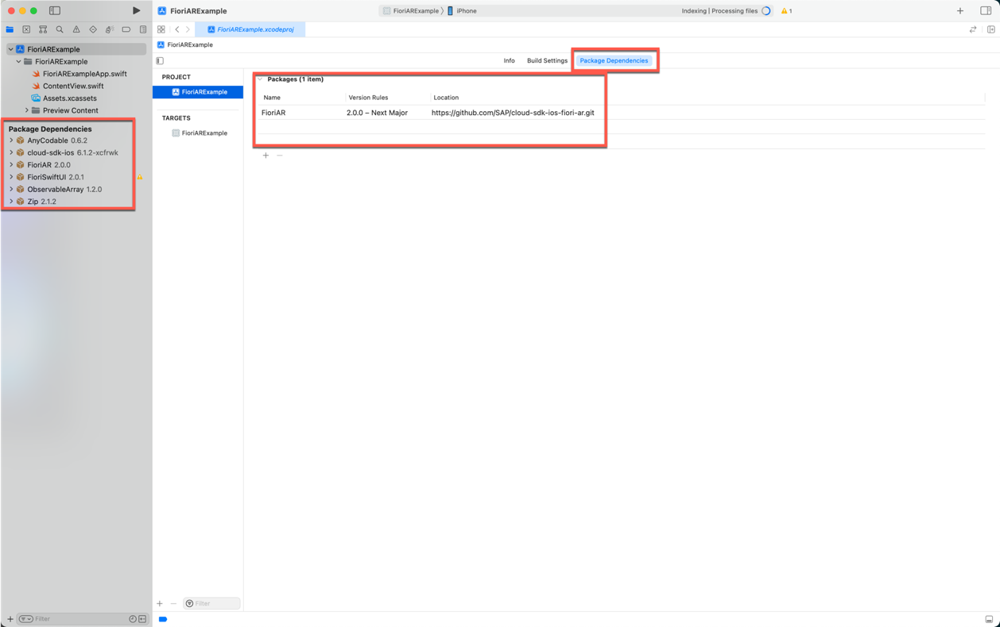

[DONE]
[ACCORDION-END]

[ACCORDION-BEGIN [Step 3: ](Implement the Needed Data Models)]
The way the `FioriAR` package and it's APIs work is through providing a generic `ARCard` model conforming to the `CardItemModel` protocol. The `CardItemModel` protocol is there to be implemented by a model to represent an AR annotation card.

**So what is an AR annotation card?**

AR annotation cards are UI elements being rendered in an AR Scene on your iOS mobile devices. These UI elements are provided by the `FioriAR` package to make your life easier and take the burden away to create these yourself with Reality Composer and other 2D/3D modeling tools.

!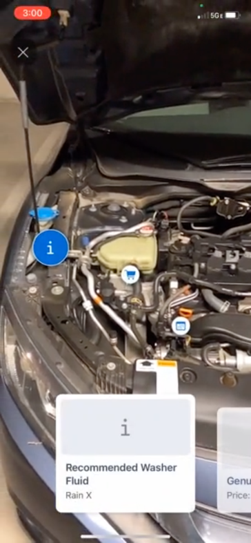

1. Create a new **Group** in the Project Navigator. Name it **Models**.

2. Add **3** new Swift files and call them:

    - `ExampleCardItem`
    - `StringIdentifyingCardItem`
    - `ARScene`

    !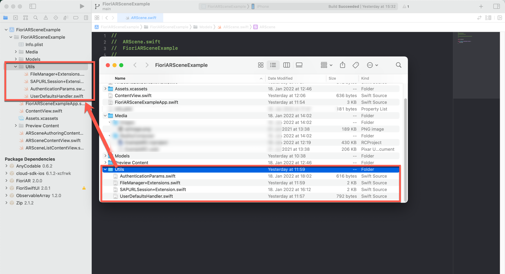

The tutorial will go into detail on what these files will individually take responsibility of.

Both, the `ExampleCardItem` as well as the `StringIdentifyingCardItem` models must conform to `CardItemModel`. The difference between them is that the `ExampleCardItem` has an Integer based ID property and the `StringIdentifyingCardItem` uses a String based ID. For your implementation you are free to use either depending on your implementation. For this tutorial you will rely on the Integer based model because the SAP Mobile Services service you will be calling supports Integer based models.

1. Open the `ExampleCardItem`.

2. Make it conform to the `CardItemModel` protocol:

    ```Swift
    public struct ExampleCardItem: CardItemModel { }
    ```

5. Add import statements for SwiftUI and `FioriAR`:

    ```Swift
    import SwiftUI
    import FioriAR
    ```

> The `import Foundation` is not needed in this model implementation.

Usually, model implementations in Swift and SwiftUI are done using `structs`. The reason is that `structs` are Value Types which means they are created as true copies of the original when being initialized, copied or mutated. This comes in handy when working with data models. If you want to learn more about the differences between `structs` and classes visit the official documentation [Classes and `Structs` - The Swift Programming Language](https://docs.swift.org/swift-book/LanguageGuide/ClassesAndStructures.html).

1. Implement the model's properties:

    ```Swift
        public var id: Int
        public var title_: String
        public var subtitle_: String?
        public var detailImage_: Data?
        public var image_: CardImage?
        public var actionText_: String?
        public var actionContentURL_: URL?
        public var icon_: String?
        public var position_: SIMD3<Float>?
    ```

    As you can see the ID is of type Int for the `ExampleCardItem`.

7. Repeat the process **3-6** for the `StringIdentifyingCardItem`:

    ```Swift
    public struct StringIdentifyingCardItem: CardItemModel {
        public var id: String
        public var title_: String
        public var subtitle_: String?
        public var detailImage_: Data?
        public var image_: CardImage?
        public var actionText_: String?
        public var actionContentURL_: URL?
        public var icon_: String?
        public var position_: SIMD3<Float>?
    }
    ```

8. Safe both Swift files.

[DONE]
[ACCORDION-END]

[ACCORDION-BEGIN [Step 4: ](Implement the ARScene Model)]

Each time, the user creates a new AR Scene it gets an ID assign automatically after it has been published to SAP Mobile Services. In a productive environment you want to have the AR Scene as an Entity in your Database holding the Scene information. You should make sure to have an relationship between the Scene entity and some other entity it refers to. Imagine an `ARScene` might be displayed in case a user wants to see how a product from a product catalogue might look like. The user wants to place an augmented version of the product on a table. In that case your AR Scene entity as an 1-1 relationship to the Product entity. And there might be many cases where this is true for other entities.

In this tutorial you will use the `ARScene` model to store, the ID which is getting returned by the SAP Mobile Services API, in the `UserDefaults`. Of course this is not suitable for a production use case as the `UserDefaults` only exist in memory as long as the app is alive. But it is an easy persistence for this tutorial.

1. Open the `ARScene` Swift file.

2. Make the `ARScene` conform to `Identifiable` and `Codable`:

    ```Swift
    struct ARScene: Identifiable, Codable { }
    ```

    For SwiftUI to do proper data binding you need to conform to the protocol Identifiable. The codable `typealias`, is needed for you to encode and decode an object which we need for persisting the `ARScene`. In the case of Codable, the `typealias` combines both, the Decodable and Encodable protocols.

    Please read the official documentation for more information.

    - [Identifiable - Apple Developers](https://developer.apple.com/documentation/swift/identifiable)
    - [`Codable` - Apple Developers](https://developer.apple.com/documentation/swift/codable)

3. Implement a property needed for storing the `ARScene` ID from SAP Mobile Services:

    ```Swift
    var id: Int
    ```

[DONE]
[ACCORDION-END]

[ACCORDION-BEGIN [Step 5: ](Add the Provided Util Files)]
This tutorial uses a number of `utils` used to do different type of tasks for your app. The `util` Swift files are provided in this tutorial:

1. Download the Swift Util files:

    - [`AuthenticationParams`](https://raw.githubusercontent.com/sap-tutorials/Tutorials/master/tutorials/fiori-ios-btp-fioriar/Utils/AuthenticationParams.swift)
    - [`FileManager+Extensions`](https://raw.githubusercontent.com/sap-tutorials/Tutorials/master/tutorials/fiori-ios-btp-fioriar/Utils/FileManager+Extensions.swift)
    - [`SAPURLSession+Extension`](https://raw.githubusercontent.com/sap-tutorials/Tutorials/master/tutorials/fiori-ios-btp-fioriar/Utils/SAPURLSession+Extension.swift)
    - [`UserDefaultsHandler`](https://raw.githubusercontent.com/sap-tutorials/Tutorials/master/tutorials/fiori-ios-btp-fioriar/Utils/UserDefaultsHandler.swift)

2. Extract the files into your project folder and drag them into the File Navigator of Xcode.

    Here you get a quick overview of what the different `utils` are there for:

- **`FileManager+Extension.swift`**

  A simple extension on [`FileManager` - Apple Developers](https://developer.apple.com/documentation/foundation/filemanager) taking care of retrieving the documents directory, creating a directory in the documents directory and saving data to a directory. These are necessary to load, save and retrieve reality files stored within your app project.

- **`SAPURLSession+Extension`**

  An extension written to create an OAuth session with the `SAPURLSession`. Also the extension contains a method for attaching an OAuth Observer to the `SAPURLSession` in case you want to do deeper debugging on the network traffic.

- **`AuthenticationParams`**

  There are many ways to work with static information in your iOS apps, one way would be to use a `property list (plist)`, another is having an enum. For this tutorial, because it is easier, you're using an enum to store static information for establishing an OAuth connection challenge.

- **`UserDefaultsHandler`**

  This tutorial doesn't use a true persistence layer for persisting information, here you will use the [`UserDefaults` - Apple Developers](https://developer.apple.com/documentation/foundation/userdefaults). The `UserDefaults` give you an interface to interact with the defaults system of the OS. Now you can store, at runtime, information within the `UserDefaults`. Usually used for storing user preferences but in this tutorial a welcome alternative for using a true database. A static array would've done the job too but using the `UserDefaults` is just a bit smoother.

> NOTE: Make sure that the above mentioned files are added correctly to your project and are included in the build target.

[DONE]
[ACCORDION-END]

[ACCORDION-BEGIN [Step 6: ](Create a Mobile App Configuration)]

In the last step you learned about the different types of `utils` being used in this tutorial. One of the `util` files is the `AuthenticationParams` holding static information about the authentication parameters used to establish an OAuth challenge against SAP Mobile Services. These parameters are provided through SAP Mobile Services and can be simply copied and pasted into the `AuthenticationParams` enum.

1. Open SAP Mobile Services.

    !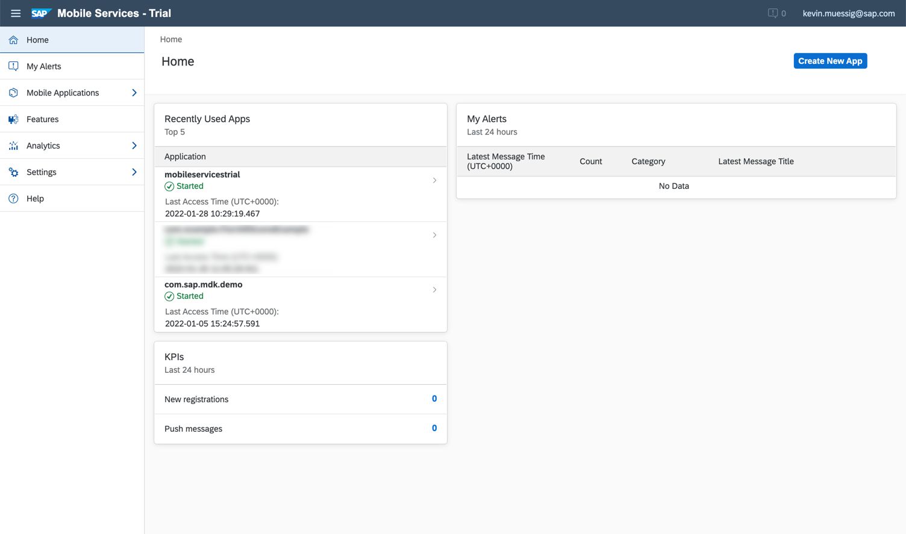

2. Navigate to **Mobile Applications** and **Native/Hybrid**.

3. Click on **New** to create a new mobile app definition.

    !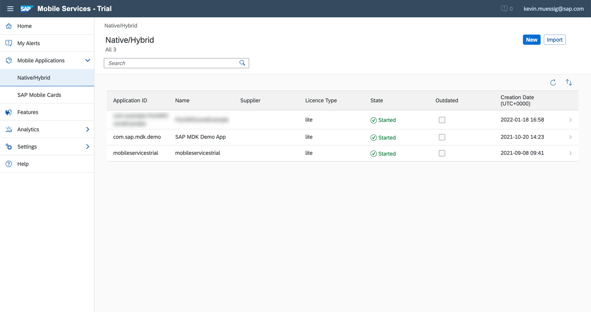

4. Enter an **ID** and **Name**. Click on **Next**.

    !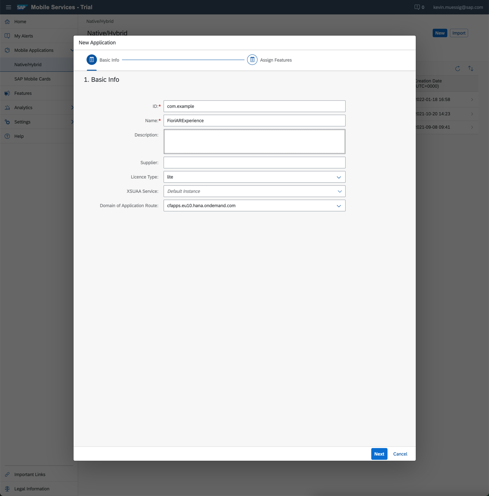

5. Assign the **Mobile Augmented Reality** feature. Click on **Finish**.

    !

  The creation process might take a minute.

[DONE]
[ACCORDION-END]

[ACCORDION-BEGIN [Step 7: ](Add the Authentication Parameters to the Project)]
If the creation was successful you can access the mobile app definition to retrieve the OAuth information you need for the app implementation.

1. Open the created mobile app definition.

    !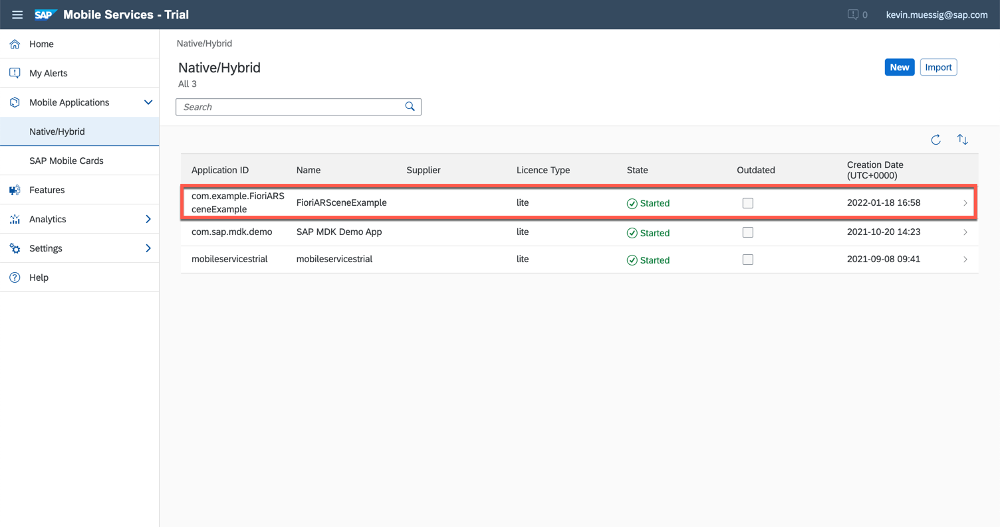

2. Navigate to **Security**.

    !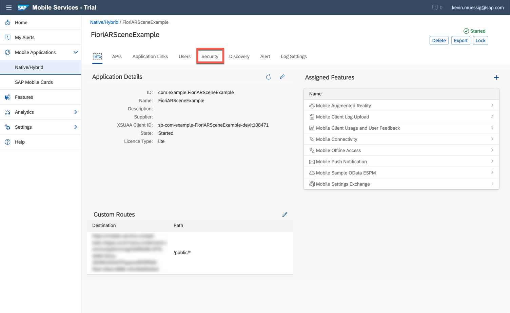

    In the Security tab you have all information needed to copy them in the `AuthenticationParams`.

    !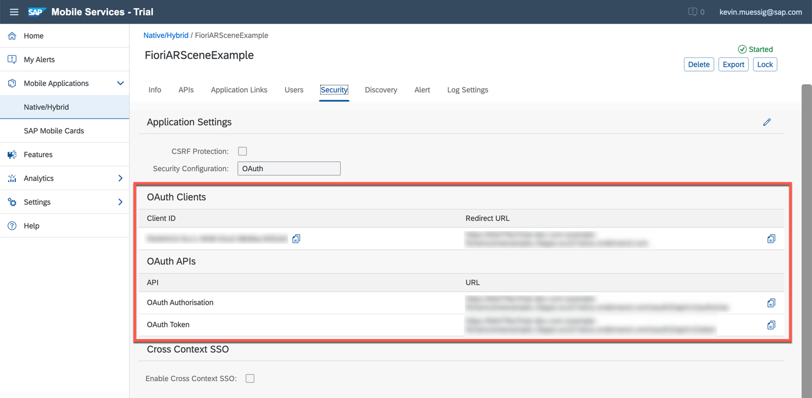

3. Copy the following fields to the matching enum cases within `AuthenticationParams`:

     - Client ID
     - Redirect URL
     - OAuth Authorization
     - OAuth Token

    ```Swift
      static let clientID = "<Your-Client-ID>"
      static let redirectURL = "<Your-Redirect-URL"
      static let authURL = "Your-Auth-URL"
      static let tokenURL = "Your-Token-URL"
    ```

4. Save the `AuthenticationParams`.

[DONE]
[ACCORDION-END]

[ACCORDION-BEGIN [Step 8: ](Create a View for Displaying the SceneAuthoringView)]
The Scene Authoring View is a SwiftUI view provided by the `FioriAR` package and it is there for the user to create AR Annotation cards and add them to a AR Scene. This is usually done through an app called Reality Composer provided by Apple. If you want to enable your users to create such scenes directly from within your app or make it possible for you to create scenes without using Reality Composer the `FioriAR` package got you covered.

If you look at the initializer of the `SceneAuthoringView(_ title:, serviceURL:, sapURLSession:)`, it expects a String title for the `NavigationBar`, a service URL which is the SAP Mobile Services API endpoint and the same as the redirect URL, and a `SAPURLSession` in order to establish the connection.

[OPTION BEGIN [SwiftUI]]

1. Create a new SwiftUI view and name it `ARSceneAuthoringContentView`.

2. Add the following import statements above the `struct` definition:

    ```Swift
    import SwiftUI
    import FioriAR
    import SAPFoundation
    ```

3. Add a `@State` property and call it `sceneIDs`:

    ```Swift
    @State private var sceneIDs = [ARScene]()
    ```

    The `sceneIDs` is an array of `ARScene` which will hold the IDs of the created AR Scenes. The [State](https://developer.apple.com/documentation/swiftui/state) annotation is necessary because SwiftUI manages the storage of properties declared as State. That allows you to mutate the property in SwiftUI and helps the UI to update itself depending on the state of the property.

4. In the body add the `SceneAuthoringView` with the following code:

    ```Swift
    SceneAuthoringView(title: "Annotations",
                              serviceURL: URL(string: AuthenticationParams.redirectURL)!,
                              sapURLSession: AppDelegate.sapURLSession)
                .onSceneEdit { sceneEdit in
                    switch sceneEdit {
                    case .created(card: let card):
                        print("Created: \(card.title_)")
                    case .updated(card: let card):
                        print("Updated: \(card.title_)")
                    case .deleted(card: let card):
                        print("Deleted: \(card.title_)")
                    case .published(sceneID: let sceneID):
                        sceneIDs.append(ARScene(id: sceneID))
                        UserDefaults.standard.set(UserDefaultsHandler.encode(scenes: sceneIDs), forKey: ScenePersistence.key.rawValue)
                        print("From SceneEdit:", sceneID)
    ```

    With the `.onSceneEdit` you get a callback and depending on what case it is you can react. For most of these cases you just print the card title in this tutorial. The case which needs more attention is the `published` as it returns the scene ID after publishing of the created scene was successful. There you append the scene ID to the `sceneIDs` property and store it to the `UserDefaults`. Using the `UserDefaultsHandler` to encode the property and storing it with something called the `ScenePersistence` enum. That enum needs to be implemented by you.

5. Add an enum right above the `struct` definition and below the import statements:

    ```Swift
    enum ScenePersistence: String {
        case key = "ScenePersistence"
    }
    ```

    Of course, you can also just use a String instead of the enum but it makes sense to utilize an enum for a centralized place of holding keys in case you want to change them.

[OPTION END]

[OPTION BEGIN [`UIKit`]]
In order to create the `SceneAuthoringView` within a `UIKit` based project you can use the following View Controller implementation to do so. The SwiftUI based `SceneAuthoringView` of the `FioriAR` package can be wrapped with the [`UIViewControllerRepresentable` - Apple Developer](https://developer.apple.com/documentation/swiftui/uiviewcontrollerrepresentable) protocol. The implementation code can also be found in the `FioriAR` sample app in the GitHub repository.

```Swift
  import FioriAR
  import SAPFoundation
  import SwiftUI
  import UIKit

  struct SceneAuthoringWithUIKitView: View {
      var body: some View {
          SceneAuthoringControllerContainer()
              .navigationBarTitle("Using UIKit")
      }
  }

  // Implemented just to present SceneAuthoringController in Test App which is SwiftUI based
  struct SceneAuthoringControllerContainer: UIViewControllerRepresentable {
      func makeUIViewController(context: Context) -> ARCardsAuthoringControllerVC {
          ARCardsAuthoringControllerVC()
      }

      func updateUIViewController(_ uiViewController: ARCardsAuthoringControllerVC, context: Context) {}
  }

  class ARCardsAuthoringControllerVC: UIViewController {
      var presentSceneAuthoring: UIButton!

      private var sapURLSession = SAPURLSession.createOAuthURLSession(
          clientID: IntegrationTest.System.clientID,
          authURL: IntegrationTest.System.authURL,
          redirectURL: IntegrationTest.System.redirectURL,
          tokenURL: IntegrationTest.System.tokenURL
      )

      override func viewDidLoad() {
          super.viewDidLoad()

          self.presentSceneAuthoring = UIButton()
          self.presentSceneAuthoring.setTitle("Present Scene Authoring", for: .normal)
          self.presentSceneAuthoring.setTitleColor(.white, for: .normal)
          self.presentSceneAuthoring.layer.cornerRadius = 10
          self.presentSceneAuthoring.backgroundColor = .systemBlue

          view.addSubview(self.presentSceneAuthoring)
          self.presentSceneAuthoring.translatesAutoresizingMaskIntoConstraints = false
          self.presentSceneAuthoring.centerXAnchor.constraint(equalTo: view.centerXAnchor).isActive = true
          self.presentSceneAuthoring.centerYAnchor.constraint(equalTo: view.centerYAnchor, constant: -100).isActive = true
          self.presentSceneAuthoring.widthAnchor.constraint(equalToConstant: 250).isActive = true
          self.presentSceneAuthoring.heightAnchor.constraint(equalToConstant: 60).isActive = true
          self.presentSceneAuthoring.addTarget(self, action: #selector(self.presentSceneAuthoringAction), for: .touchUpInside)
      }

      // Use navigationController?.pushViewController()
      // Modal presenting not supported
      @objc func presentSceneAuthoringAction(sender: UIButton) {
          let sceneAuthoringController = SceneAuthoringController(title: "Annotations",
                                                                  serviceURL: URL(string: IntegrationTest.System.redirectURL)!,
                                                                  sapURLSession: self.sapURLSession,
                                                                  sceneIdentifier: SceneIdentifyingAttribute.id(IntegrationTest.TestData.sceneId),
                                                                  onSceneEdit: self.onSceneEdit)
          self.navigationController?.pushViewController(sceneAuthoringController, animated: true)
      }

      func onSceneEdit(sceneEdit: SceneEditing) {
          switch sceneEdit {
          case .created(card: let card):
              print("Created: \(card.title_)")
          case .updated(card: let card):
              print("Updated: \(card.title_)")
          case .deleted(card: let card):
              print("Deleted: \(card.title_)")
          case .published(sceneID: let sceneID):
              print("From SceneEdit:", sceneID)
          }
      }
  }
```

[OPTION END]

[DONE]
[ACCORDION-END]

[ACCORDION-BEGIN [Step 9: ](Make the SAPURLSession available throughout the app)]
There is no instance of the `SAPURLSession` being created within the app, for the connection to SAP Mobile Services this needs to be created. Because it is nice to have one centralized session available to the whole app, a good approach can be to initialize the session in the `AppDelegate`. In SwiftUI there is no `AppDelegate` available from the get go but you can add one, SwiftUI knows how to handle it. Where you would usually implement the `AppDelegate` would be the `App.swift` file.

1. Open the `FioriARSceneExampleApp.swift` file.

    > If you have named your app differently, the name of the app file is named after the project. The name displayed in this tutorial might not match with what you have.

2. In the app file, add the `AppDelegate` class definition below the app `struct`:

    ```Swift
      class AppDelegate: NSObject, UIApplicationDelegate {
          static var sapURLSession = SAPURLSession.createOAuthURLSession(clientID: AuthenticationParams.clientID,
                                                                  authURL: AuthenticationParams.authURL,
                                                                  redirectURL: AuthenticationParams.redirectURL,
                                                                  tokenURL: AuthenticationParams.tokenURL)

          func application(_ application: UIApplication, didFinishLaunchingWithOptions launchOptions: [UIApplication.LaunchOptionsKey: Any]? = nil) -> Bool {
              // Register FioriNext Fonts

              Font.registerFioriFonts()

              // activate logging either for FioriAR specific logger or for all loggers (incl. SAPFoundation)
              // Logger.shared(named: "FioriAR").logLevel = .debug

              Logger.root.logLevel = .debug // all loggers, incl. SAPFoundation

              return true
          }
    ```

If you look closer, you can see that in the `application(_ didFinishWithOptions:)` method the Fiori fonts are set and the root level of the SAP logger is being set. That makes the logger more detailed and let's you see a lot which is happening within your app. You can set this to error or warning at a later point if you want to.

The `SAPURLSession` is being initialized using the extension util you have added to the project. This creates an OAuth session for you which can be used within your app because the session being static.

[DONE]
[ACCORDION-END]

[ACCORDION-BEGIN [Step 10: ](Add Navigation to the ARSceneAuthoringContentView)]
At the moment the `ARSceneAuthoringContentView` is not being called onto the navigation stack. You need to make the view reachable within your app. A good place to do this is from the `ContentView` as it is already hooked into the navigation flow of the app, to be precise, it is the initial view being displayed by any SwiftUI app.

1. Open the `ContentView.swift` file.

2. Add the `FioriAR` import to it:

    ```Swift
    import FioriAR

    ```

3. Within the body, add the following code in order to add a `NavigationView` and the navigation link to the `ARSceneAuthoringContentView`:

    ```Swift
    NavigationView {
                List {
                    NavigationLink(destination: ARSceneAuthoringContentView()) {
                        Text("Create a new AR Scene")
                    }
                }.navigationBarTitle("AR Cards Example")
            }.navigationViewStyle(StackNavigationViewStyle())
    ```

    The reason why this is embedded in a List view is because you will add another navigation later on. Your initial view is a stack navigation view pointing to two views later on.

4. Compile and run the app on your physical iOS device and try out the navigation flow.

[DONE]
[ACCORDION-END]

[ACCORDION-BEGIN [Step 11: ](Inspect Created Augmented Reality Scenes on SAP Mobile Services)]
As previously mentioned the AR scenes the user creates are being published to SAP Mobile Services. On SAP Mobile Services these scenes can be edited or you can create additional localizations if needed.

> Important to know is that if you're using 1SAP BTP Trial version1, your SAP Mobile Services instance will get stopped over night and you need to restart it before using your app.

1. Open the app on your iOS device and create a AR Scene.

    1.1 Create a new AR Card and fill out the form fields.

    !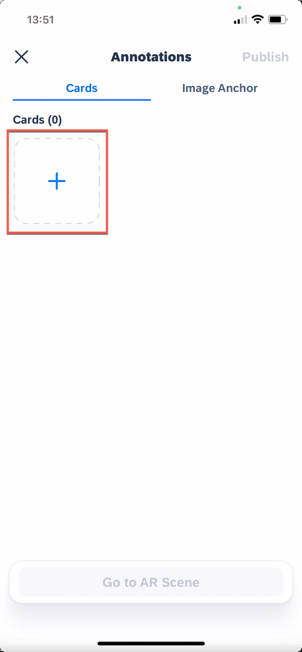

    !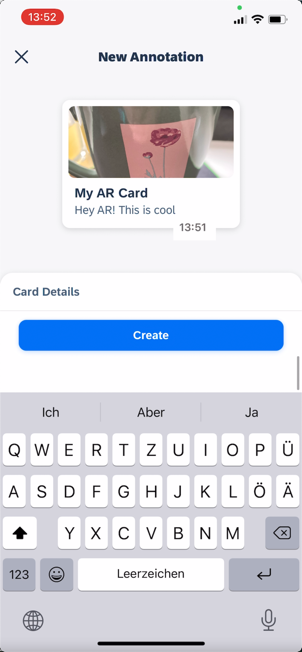

    !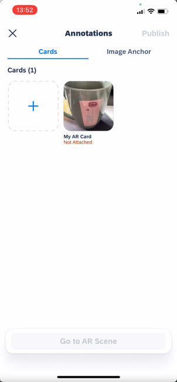

    1.2 Add an image anchor. Download the [QR Code](https://raw.githubusercontent.com/SAPDocuments/Tutorials/master/tutorials/fiori-ios-btp-fioriar/Utils/qrImage.png) code included but you can use anything you want as an image anchor e.g. a gaming controller.

    !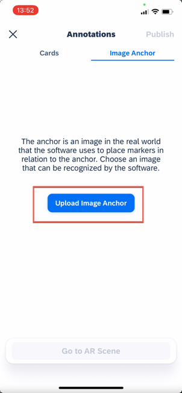            

    !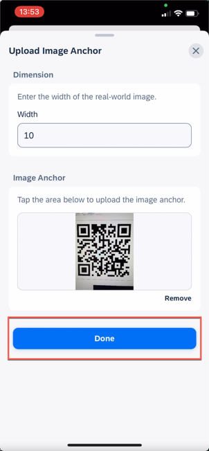

    1.3 Tap on **Go to AR Scene**.

    !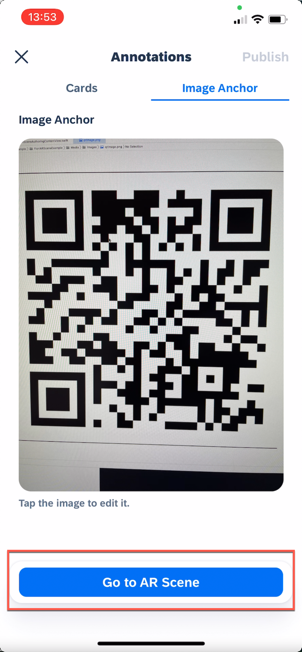

    1.4 Scan the image anchor, and add your AR Card anchor. With pinching you can in-/decrease the size of the anchor.

    1.5 Save the changes.

    1.6 Return to the main view.

2. Publish it to SAP Mobile Services using the **Publish** button on the `SceneAuthoringView`.

    !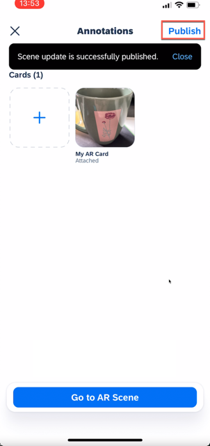

3. Open SAP Mobile Services.

4. Navigate to your mobile app configuration.

5. Open the **Mobile Augmented Reality** feature.

    !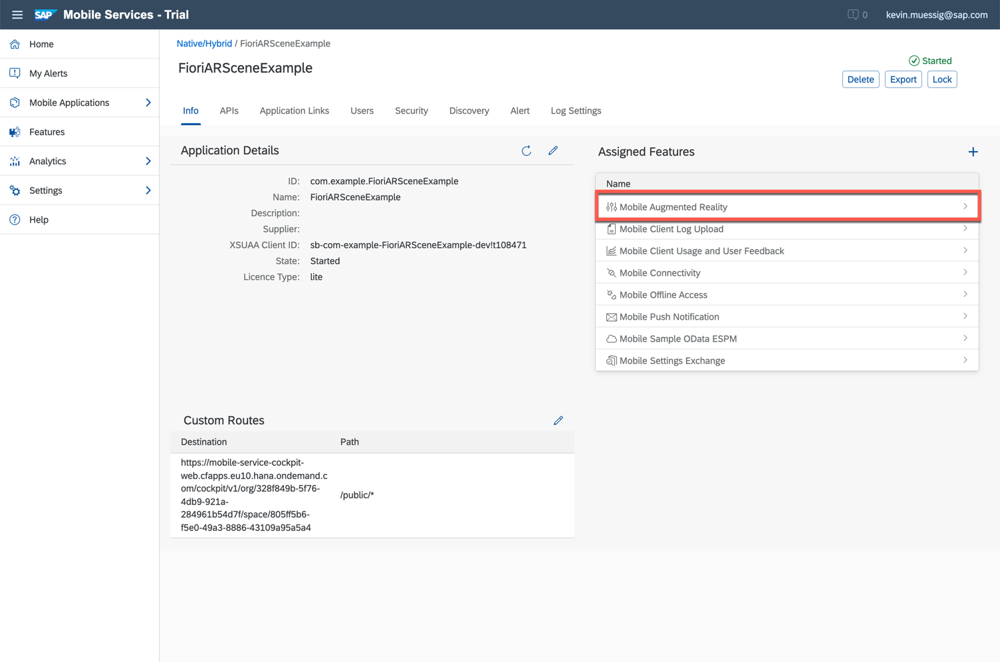

6. You should see your published AR scene there. Click on **Details**.

    !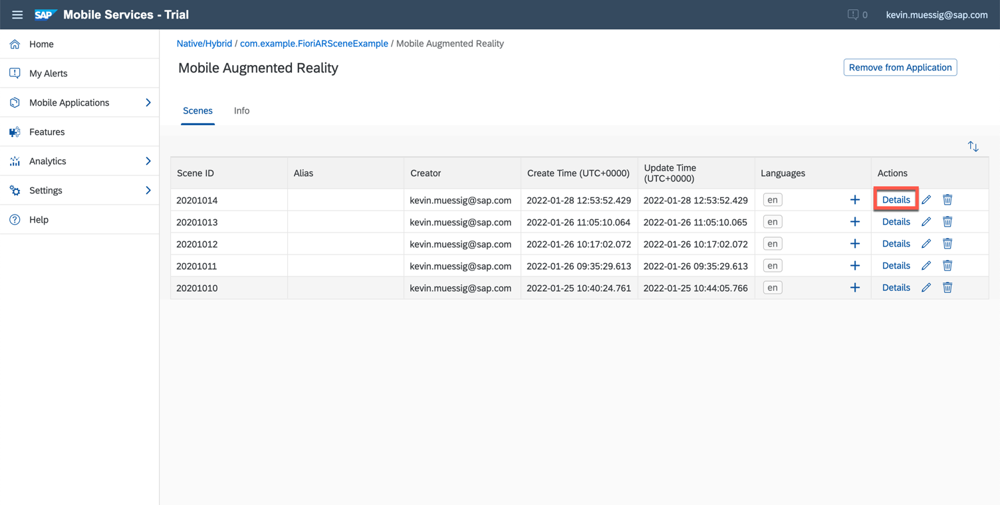

  You can see all information added to the scene through the `SceneAuthoringView`.

[VALIDATE_11]
[ACCORDION-END]

[ACCORDION-BEGIN [Step 12: ](Implement the ARSceneListContentView)]
To further enhance the app, you will implement additional views to display the created scenes per session and display a selected scene as well.

> NOTE: There is no API provided to fetch all created AR scenes from SAP Mobile Services because it is recommended to store the scene information within a database on your backend.

1. Open up your Xcode project.

2. Create **2** new SwiftUI views. Call them:

     - `ARSceneListContentView`
     - `ARSceneContentView`

3. Open the `ARSceneListContentView`.

    The `ARSceneListContentView` is a simple list view displaying the AR scenes the user has created during a session. Remember, the scenes are stored in the `UserDefaults` and might not be available anymore after you have taken the app out of memory.

4. Add a new view called `SceneRow` above the `ARSceneListContentView` `struct` declaration and below the import statement:

    ```Swift
    struct SceneRow: View {
        var scene: ARScene

        var body: some View {
            NavigationLink(destination: ARSceneContentView(sceneID: scene.id)) {
                Text(String(scene.id))   
            }
        }
    }
    ```

    This is the row view you will display in a list view.

5. In the body of the `ARSceneListContentView`, add a navigation view and a list view:

    ```Swift
    NavigationView {
            if let sceneIDs = UserDefaultsHandler.decodeSceneIDs() {
                List(sceneIDs) { sceneID in
                    SceneRow(scene: sceneID)
                }
                .navigationBarTitle("Available AR Scenes")
            } else {
                Text("No scenes available")
            }
        }.navigationViewStyle(StackNavigationViewStyle())
    ```

    It is important to check if a scene is stored in the `UserDefaults` in order to inform the user if there is not. In that case you display a simple Text view.

6. Save the file.

[DONE]
[ACCORDION-END]

[ACCORDION-BEGIN [Step 13: ](Implement the ARSceneContentView)]

The `ARSceneContentView` is the actual view displaying the AR scene. To do so, the `FioriAR` package provides you a view taking care of this. To load the AR scene, using the static `SAPURLSession` is being used to connect against SAP Mobile Services.

1. Open the `ARSceneContentView`.

2. Add the following import statements:

    ```Swift
    import SwiftUI
    import FioriAR
    import SAPFoundation
    ```

3. Add a new view `struct` definition:

    ```Swift
    struct ARSceneContentView: View { }
    ```

4. In the view add **2** [`StateObject` - Apple Developer](https://developer.apple.com/documentation/swiftui/stateobject) and a `sceneID` property:

    ```Swift
    @StateObject var arModel = ARAnnotationViewModel<CodableCardItem>()
    @StateObject private var asyncStrategy: ServiceStrategy<CodableCardItem>
    var sceneID: Int
    ```

5. Create an initializer with the `sceneID` as a parameter:

    ```Swift
    init(sceneID: Int) {
        self.sceneID = sceneID
        self._asyncStrategy = StateObject(wrappedValue: ServiceStrategy<CodableCardItem>(
          serviceURL: URL(string: AuthenticationParams.redirectURL)!,
          sapURLSession: AppDelegate.sapURLSession,
          sceneIdentifier: SceneIdentifyingAttribute.id(sceneID)))
    }
    ```

6. In the view's body, initialize the `ARAnnotationsView`, and on appearance of the view, load the initial data:

    ```Swift
    ARAnnotationsView(arModel: arModel,
                    cardAction: { id in
                    // set the card action for id corresponding to the CardItemModel

                    print(id)
    })
    .onAppear(perform: loadInitialData)
    ```

7. Implement the `loadInitialData()` method:

    ```Swift
    func loadInitialData() {
        do {
            try self.arModel.loadAsync(loadingStrategy: asyncStrategy)
        } catch {
            print(error)
        }
    }
    ```

[DONE]
[ACCORDION-END]

[ACCORDION-BEGIN [Step 14: ](Add the ARSceneListContentView to the Navigation Flow)]

1. Open the `ContentView`.

2. Add another navigation link to the list view:

    ```Swift
    NavigationLink(destination: ARSceneListContentView()) {
        Text("Show available AR Scene(s)")
    }
    ```

3. Save the project.

[DONE]
[ACCORDION-END]

[ACCORDION-BEGIN [Step 15: ](Display a created AR Scene)]
In case you've killed your app in-between steps your `UserDefaults` are probably gone which means you need to create another scene.

You can check if there are available scenes by navigating to the `ARSceneContentView`. If there are none, create one.

1. Tap on the available scene to display the AR scene.

The scene gets loaded from SAP Mobile Service into your app.

Congratulations, you've successfully implemented an AR ready app.

[DONE]
[ACCORDION-END]

[ACCORDION-BEGIN [Step 16: ](Add Additional Code in Order to View local Reality Files)]
What you have learned in this tutorial is to use the `FioriAR` Swift package to create and display AR scenes and communicate with the AR service of SAP Mobile Services.

What you might be interested in, is the implementation for locally stored AR scenes in form of a Reality File. The project you have as a result of this tutorial is suitable to be extended with that functionality. If you're interested in going a step further and implement that feature, go to the **SAP TechEd YouTube channel** and watch the **Developer Keynote** section where this is explained or read the available blog post. Of course all of this is documented in the GitHub repository above mentioned and there is even a sample app available for you to test.

<iframe width="560" height="315" src="https://youtu.be/OmEx598qAI8?t=894" frameborder="0" allowfullscreen></iframe>

**Links:**

- [SAP TechEd Developer Keynote](https://youtu.be/OmEx598qAI8?t=894)
- [Building modern business `ARKit` ready iOS apps with `FioriAR`](https://blogs.sap.com/2021/07/19/building-modern-business-arkit-ready-ios-apps-with-sap-fiori-for-ios-arkit/)

[DONE]
[ACCORDION-END]

---
