## Prerequisites
- You have [Set Up a BTP Account for Tutorials](group.btp-setup). Follow the instructions to get an account, and then to set up entitlements and service instances for the following BTP services.
    - **SAP Mobile Services**
- You have [created your first application with SAP BTP SDK for iOS](group.ios-sdk-setup).

## Details
### You will learn
- How to create a native iOS application that supports multiple users on the same device
- How to modify the SAP BTP SDK for iOS assistant generated application


---

[ACCORDION-BEGIN [Step 1: ](The real world use case)]
An air carrier organisation uses an iOS application built using SAP BTP SDK for iOS to keep a track of an aircraft's vital information (Fuel Level, Tyre Pressure, etc.) before each flight. The application must support offline use-case to comply with the network regulations at the airport. Since the airline has flights departing round the clock, it deploys ground staff in three 8-hour shifts. To maximise efficiency, the organisation wants ground staff to share mobile devices.

The ground staff members want a solution that is reliable even in the absence of network. They also aren't keen on logging out and logging in every time a shift ends, as they believe this could lead to erroneous data.

In this tutorial, you will learn how to enhance your [SAP BTP SDK for iOS Assistant](https://developers.sap.com/trials-downloads.html?search=SAP+BTP+SDK+for+iOS) generated application to create an offline enabled application that supports multiple users.

[DONE]
[ACCORDION-END]

[ACCORDION-BEGIN [Step 2: ](Enable multi-user mode in mobile services cockpit)]

1. In your mobile services account, click Mobile Applications &rarr; Native/Hybrid &rarr; **<Your Mobile Application configuration>**.

    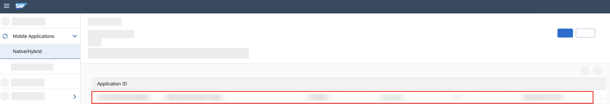

2. Under Assigned Features, click **Mobile Settings Exchange**.

    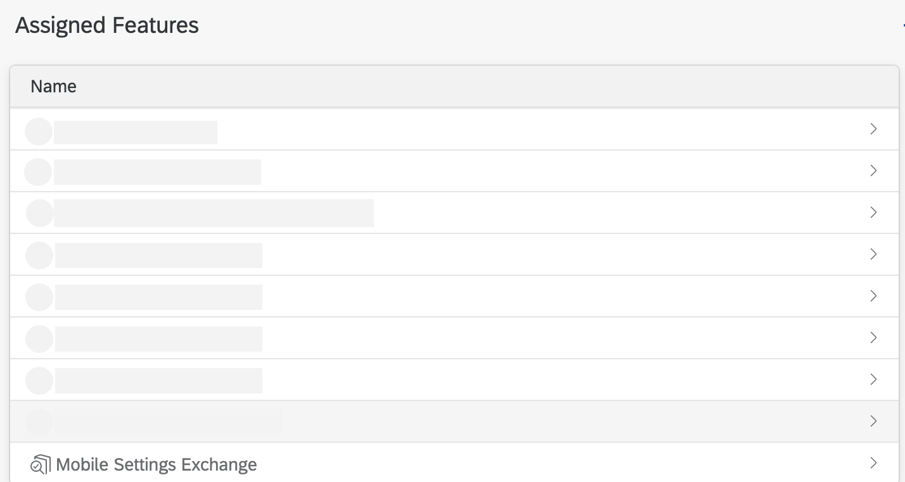

    > Assigned features can be found under the Info tab.

3. Under Shared Devices section, enable the *Allow Upload of Pending Changes from Previous User (Enable Multiple User Mode):* checkbox.

    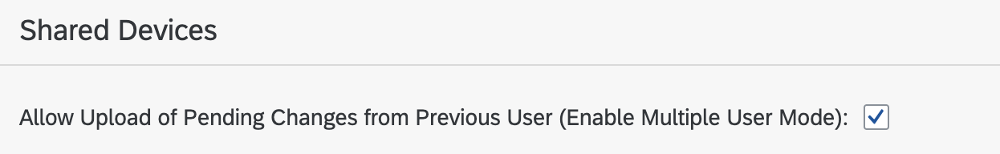

    > You must enable this checkbox if you are building an offline capable multi-user application.

[VALIDATE_1]
[ACCORDION-END]

[ACCORDION-BEGIN [Step 3: ](Configure trust)]

In the given scenario any pending changes done by a user should be uploaded before another user signs in. Thus, you must configure trust to enable upload of pending changes from previous users of mobile applications.

1. Open your mobile services account.

    

2. In the Side Navigation Bar, click Settings &rarr; **Security**.

    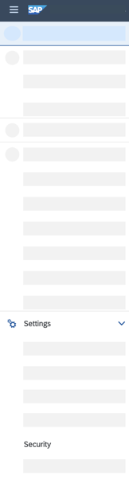

3. Click **Metadata Download**.

    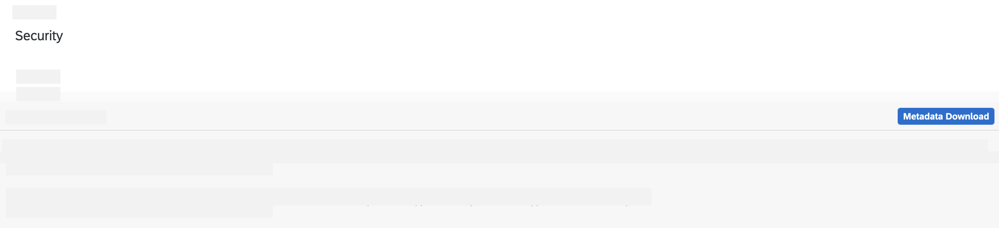

    > `NoAuth` authentication type is not supported. Even if multi-user mode is turned on, an application using the `NoAuth` authentication type will revert to single user mode.

4. Go to your sub account on SAP BTP.

    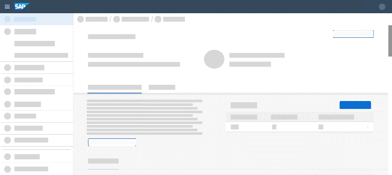

5. In the Side Navigation Bar, click Security &rarr; **Trust Configuration**.

    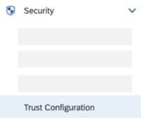

6. Click **New Trust Configuration**.

    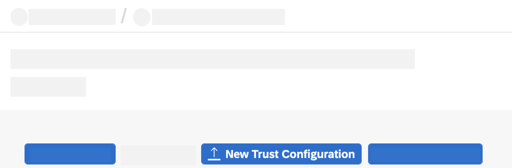

7. Click **Upload**, and select the XML file downloaded in the earlier step.

    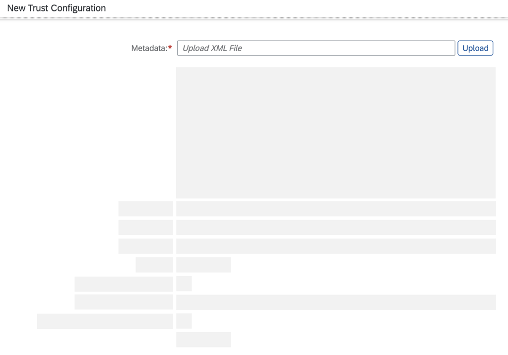

8. Enter a name, and click **Save**.

    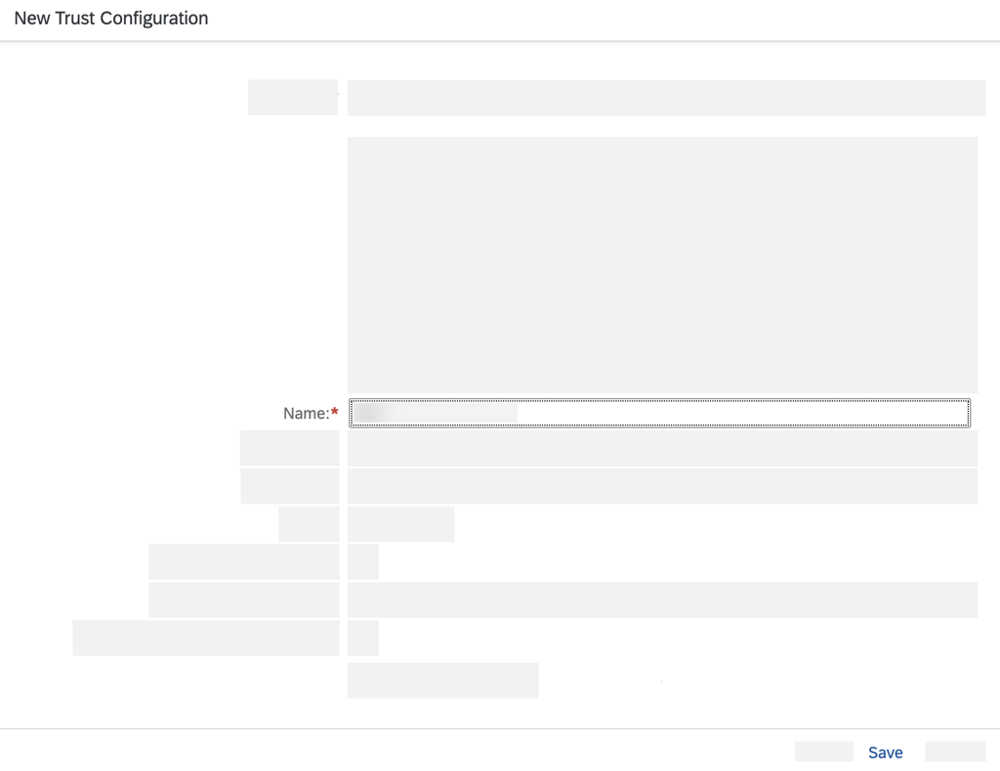

[DONE]
[ACCORDION-END]

[ACCORDION-BEGIN [Step 4: ](Configure app parameters)]

1. In Xcode, Open **`AppParameters.plist`**.

    > Ensure that you have completed the prerequisites before starting this step.

2. Add a new parameter by providing the following key/value.

    |  Key   | Type | Value |
    |  :------------- | :------------- | :------------- |
    |  User Mode | String | Multiple |

      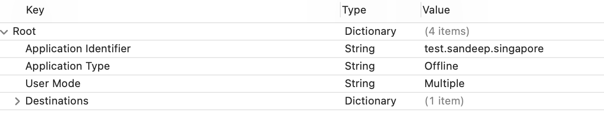  

[DONE]
[ACCORDION-END]

[ACCORDION-BEGIN [Step 5: ](Modify AppDelegate for multi-user onboarding flow)]

1. Open `AppDelegate.swift`.

2. Add a public variable to track user change status.

    ```swift
    public var userDidChange = false
    ```
3. Update `applicationWillEnterForeground` function to trigger multi-user flow.

    ```Swift
    func applicationWillEnterForeground(_: UIApplication) {
        // Triggers to show the multi-user passcode screen
        OnboardingSessionManager.shared.unlock() { error in
            guard let error = error else {
                if self.userDidChange {
                    self.afterOnboard()
                    self.userDidChange = false
                }
                return
            }

            self.onboardingErrorHandler?.handleUnlockingError(error)
        }
    }
    ```

    > Replace the `applicationWillEnterForeground` function with the given code.

4. Update `initializeOnboarding` to configure `OnboardingSessionManager` to include `MultiUserOnboardingIDManager`.

    ```Swift
    func initializeOnboarding() {
        let presentationDelegate = ApplicationUIManager(window: self.window!)
        self.onboardingErrorHandler = OnboardingErrorHandler()
        self.sessionManager = OnboardingSessionManager(presentationDelegate: presentationDelegate, flowProvider: self.flowProvider, onboardingIDManager: MultiUserOnboardingIDManager(), delegate: self.onboardingErrorHandler)
        presentationDelegate.showSplashScreenForOnboarding { _ in }

        self.onboardUser()
    }
    ```
    > Replace the `initializeOnboarding` function with the given code.

[DONE]
[ACCORDION-END]

[ACCORDION-BEGIN [Step 6: ](Configure multi-user callbacks)]

1. Open **`OnboardingFlowProvider`**.

2. In `OnboardingFlowProvider`, add the following code block for multi-user callbacks:

    ```Swift
    extension OnboardingFlowProvider: FUIPasscodeControllerDelegate {
        public func shouldTryPasscode(_ passcode: String, forInputMode inputMode: FUIPasscodeInputMode, fromController passcodeController: FUIPasscodeController) throws {
            print("Called shouldTryPasscode")
        }

        public func shouldResetPasscode(fromController passcodeController: FUIPasscodeController) {
            print("Called shouldResetPasscode")
        }


        public func addNewUser(_ passcodeController: FUIPasscodeController) {
            print("Called addNewUser")
            AppDelegate.shared.userDidChange = true
        }

        public func switchUser(_ newUserId: String, passcodeController: FUIPasscodeController) {
            print("Called switchUser")
            AppDelegate.shared.userDidChange = true
        }
    }
    ```

[VALIDATE_2]
[ACCORDION-END]

[ACCORDION-BEGIN [Step 7: ](Modify onboarding and restore steps)]

1. In `OnboardingFlowProvider`, replace `StoreManagerStep()` with **`configuredStoreManagerStep`**.

    ```Swift
    private func configuredStoreManagerStep() -> StoreManagerStep {
        let st = StoreManagerStep()
        st.userPasscodeControllerDelegate = self
        return st
    }
    ```

2. Trigger the `configuredStoreManagerStep` function while onboarding a new user or restoring the session of a previously logged in user.

    ```Swift
    public var onboardingSteps: [OnboardingStep] {
            return [
                self.configuredWelcomeScreenStep(),
                CompositeStep(steps: SAPcpmsDefaultSteps.configuration),
                OAuth2AuthenticationStep(),
                CompositeStep(steps: SAPcpmsDefaultSteps.settingsDownload),
                CompositeStep(steps: SAPcpmsDefaultSteps.applyDuringOnboard),
                self.configuredUserConsentStep(),
                self.configuredDataCollectionConsentStep(),
                configuredStoreManagerStep(),
                ODataOnboardingStep(),
            ]
        }

        public var restoringSteps: [OnboardingStep] {
            return [
                configuredStoreManagerStep(),
                self.configuredWelcomeScreenStep(),
                CompositeStep(steps: SAPcpmsDefaultSteps.configuration),
                OAuth2AuthenticationStep(),
                CompositeStep(steps: SAPcpmsDefaultSteps.settingsDownload),
                CompositeStep(steps: SAPcpmsDefaultSteps.applyDuringRestore),
                self.configuredDataCollectionConsentStep(),
                ODataOnboardingStep(),
            ]
        }
    ```
    > Replace `onboardingSteps` & `restoringSteps` with the given code.

[DONE]
[ACCORDION-END]


[ACCORDION-BEGIN [Step 8: ](Configure OData controller for offline scenarios)]

1. Open **`ODataControlling.Swift`**.

2. Import `SAPOfflineOdata`

    ```Swift
        import SAPOfflineOData
    ```

3. Add a new protocol for `configureOData` function:

    ```Swift
    func configureOData(sapURLSession: SAPURLSession, serviceRoot: URL, onboardingID: UUID, offlineParameters: OfflineODataParameters) throws
    ```

4. Open **`ODataOnboardingStep.Swift`**.

5. Import `SAPOfflineOdata`

    ```Swift
        import SAPOfflineOData
    ```

6. Add offline store name's key value.

    ```Swift
        let offlineStoreNameKey: String = "SAP.OfflineOData.MultiUser"
    ```

7. Add a new function **`offlineStoreID`** that generates a UUID if the offline store name is nil.

    ```Swift
      private func offlineStoreID() -> UUID {
         var offlineStoreName: String? = UserDefaults.standard.value(forKey: self.offlineStoreNameKey) as? String
         if offlineStoreName == nil {
             offlineStoreName = UUID().uuidString
             UserDefaults.standard.set(offlineStoreName, forKey: self.offlineStoreNameKey)
         }
         let offlineStoreNameID: UUID = UUID(uuidString: offlineStoreName!)!
         return offlineStoreNameID
     }
    ```

8. Update the `reset` function to pass the `offlineStoreID()`.

    ```Swift
    public func reset(context: OnboardingContext, completionHandler: @escaping () -> Void) {
        defer { completionHandler() }
        do {
            try ESPMContainerOfflineODataController.removeStore(for: offlineStoreID())
        } catch {
            self.logger.error("Remove Offline Store failed", error: error)
        }
    }
    ```

    > Replace the `reset` function with the given code.

9. Add a new function **`getOfflineODataParameters`** to determine the user who is logging in.

    ```Swift
      private func getOfflineODataParameters(using context: OnboardingContext, completionnHandler: @escaping (OfflineODataParameters) -> Void) {
          var currentUser: String? = nil
          var forceUploadOnUserSwitch: Bool = false
          var storeEncryptionKey: String? = nil

          if let onboardedUser = UserManager().get(forKey: context.onboardingID), let userId = onboardedUser.infoString {
              currentUser = userId
              storeEncryptionKey = try? context.credentialStore.get(String.self, for: EncryptionConfigLoader.encryptionKeyID)
              if let enabled = (context.info[.sapcpmsSharedDeviceSettings] as? SAPcpmsSharedDeviceSettings)?.allowUploadPendingChangesFromPreviousUser {
                  forceUploadOnUserSwitch = enabled
              }
              let offlineParameters = OfflineODataParameters()
              offlineParameters.currentUser = currentUser
              offlineParameters.forceUploadOnUserSwitch = forceUploadOnUserSwitch
              offlineParameters.storeEncryptionKey = storeEncryptionKey
              completionnHandler(offlineParameters)
          } else {
              fatalError("Failed to fetch user information!")
          }
      }
    ```

10. Update the `configureOData` function to determine the user mode, and configure parameters accordingly.

    ```Swift
    private func configureOData(using context: OnboardingContext, completionHandler: @escaping (OnboardingResult) -> Void) {
      let semaphore: DispatchSemaphore =  DispatchSemaphore(value: 0)

      var offlineParameters: OfflineODataParameters = OfflineODataParameters()
      if UserManager.userMode == .multiUser {
          self.getOfflineODataParameters(using: context) { parameters in
              offlineParameters = parameters
              semaphore.signal()
          }
      }
      semaphore.wait()
      let banner = topBanner()
      let group = DispatchGroup()
      var odataControllers = [String: ODataControlling]()
      let destinations = FileConfigurationProvider("AppParameters").provideConfiguration().configuration["Destinations"] as! NSDictionary

      let eSPMContainerOfflineODataDelegateSample = OfflineODataDelegateSample(for: "ESPMContainer", with: banner)
      odataControllers[ODataContainerType.eSPMContainer.description] = ESPMContainerOfflineODataController(delegate: eSPMContainerOfflineODataDelegateSample)

      for (odataServiceName, odataController) in odataControllers {
          group.enter()
          let destinationId = destinations[odataServiceName] as! String
          // Adjust this path so it can be called after authentication and returns an HTTP 200 code. This is used to validate the authentication was successful.
          let configurationURL = URL(string: (context.info[.sapcpmsSettingsParameters] as! SAPcpmsSettingsParameters).backendURL.appendingPathComponent(destinationId).absoluteString)!

          do {
              try odataController.configureOData(sapURLSession: context.sapURLSession, serviceRoot: configurationURL, onboardingID: offlineStoreID(), offlineParameters: offlineParameters)
              let connectivityStatus = ConnectivityUtils.isConnected()
              self.logger.info("Network connectivity status: \(connectivityStatus)")
              odataController.openOfflineStore(synchronize: connectivityStatus) { error in
                  if let error = error {
                      completionHandler(.failed(error))
                      return
                  }
                  self.controllers[odataServiceName] = odataController
                  group.leave()
              }
          } catch {
              completionHandler(.failed(error))
          }
      }
      group.notify(queue: .main) {
          completionHandler(.success(context))
      }
    }
    ```

    > Replace the `configureOData` function with the given code.


[VALIDATE_3]
[ACCORDION-END]

[ACCORDION-BEGIN [Step 9: ](Handle offline OData sync failure)]

1. Open `ESPMContainerOfflineODataController.Swift`

2. Update the error cases to include `syncFailed`

    ```Swift
      public enum Error: Swift.Error {
          case cannotCreateOfflinePath
          case storeClosed
          case syncFailed
      }
    ```

3. Update `configureOData` function to accept `OfflineODataParameters`.

    ```Swift
    public func configureOData(sapURLSession: SAPURLSession, serviceRoot: URL, onboardingID: UUID, offlineParameters: OfflineODataParameters = OfflineODataParameters()) throws {
        offlineParameters.enableRepeatableRequests = true

        // Configure the path of the Offline Store
        let offlinePath = try ESPMContainerOfflineODataController.offlineStorePath(for: onboardingID)
        try FileManager.default.createDirectory(at: offlinePath, withIntermediateDirectories: true)
        offlineParameters.storePath = offlinePath

        // Setup an instance of delegate. See sample code below for definition of OfflineODataDelegateSample class.
        let offlineODataProvider = try! OfflineODataProvider(serviceRoot: serviceRoot, parameters: offlineParameters, sapURLSession: sapURLSession, delegate: delegate)
        try configureDefiningQueries(on: offlineODataProvider)
        self.dataService = ESPMContainer(provider: offlineODataProvider)
    }
    ```

    > Replace the `configureOData` function with the given code.

4. Update `openOfflineStore` function to catch the sync error.

    ```Swift
      public func openOfflineStore(synchronize: Bool, completionHandler: @escaping (Swift.Error?) -> Void) {
        if !self.isOfflineStoreOpened {
            // The OfflineODataProvider needs to be opened before performing any operations.
            self.dataService.open { error in
                if let error = error {
                    self.logger.error("Could not open offline store.", error: error)
                    if (error.code == -10425 || error.code == -10426) {
                        completionHandler(Error.syncFailed)
                    } else {
                        completionHandler(error)
                    }
                    return
                }
                self.isOfflineStoreOpened = true
                self.logger.info("Offline store opened.")
                if synchronize {
                    // You might want to consider doing the synchronization based on an explicit user interaction instead of automatically synchronizing during startup
                    self.synchronize(completionHandler: completionHandler)
                } else {
                    completionHandler(nil)
                }
            }
        } else if synchronize {
            // You might want to consider doing the synchronization based on an explicit user interaction instead of automatically synchronizing during startup
            self.synchronize(completionHandler: completionHandler)
        } else {
            completionHandler(nil)
        }
      }
    ```

    > Replace the `openOfflineStore` function with the given code.


[DONE]
[ACCORDION-END]

[ACCORDION-BEGIN [Step 10: ](Multi-user error handling)]

1. `OnboardingErrorHandler.swift`.

2. Update `onboardingController` function to handle application specific error handling.

    ```Swift
    public func onboardingController(_ controller: OnboardingControlling, didFail flow: OnboardingFlow, with error: Error, completionHandler: @escaping (OnboardingErrorDisposition) -> Void) {
        switch flow.flowType {
        case .onboard:
            self.onboardFailed(with: error, completionHandler: completionHandler)
        case .restore:
            self.restoreFailed(with: error, controller: controller, context: flow.context, completionHandler: completionHandler)
        default:
            completionHandler(.retry)
        }
    }

    public func onboardingController(_: OnboardingControlling, didComplete flow: OnboardingFlow, completionHandler: @escaping (OnboardingFlow?, Error?) -> Void) {
        //flow.flowType
        completionHandler(flow,nil)
    }
    ```

    > Replace the `onboardingController` function with the given code.


3. Update `handleUnlockingError` function to handle reset passcode error.

    ```Swift
    public func handleUnlockingError(_ error: Error) {
        switch error {
        // We reset the OnboardingSessionManager if the user has chosen to reset their passcode
        case OnboardingError.cancelled:
            self.resetOnboardingSessionManager()
        case StoreManagerError.resetPasscode:
            self.addNewUserDuringUnlock()
        // We reset the OnboardingSessionManager if the user has exceeded the maximum retry limit
        case StoreManagerError.passcodeRetryLimitReached:
            let alertController = UIAlertController(title: LocalizedStrings.Onboarding.passcodeRetryLimitReachedTitle, message: LocalizedStrings.Onboarding.passcodeRetryLimitReachedMessage, preferredStyle: .alert)
            alertController.addAction(UIAlertAction(title: LocalizedStrings.Onboarding.resetTitle, style: .destructive) { _ in
                self.resetOnboardingSessionManager()
            })

            DispatchQueue.main.async {
                guard let topViewController = ModalUIViewControllerPresenter.topPresentedViewController() else {
                    fatalError("Invalid UI state")
                }
                topViewController.present(alertController, animated: true)
            }
        default:
            return
        }
    }
    ```

    > Replace the `handleUnlockingError` function with the given code.

4. Add a new function **`addNewUserDuringUnlock`** to handle reset passcode error.

    ```Swift
      private func addNewUserDuringUnlock() {
          OnboardingSessionManager.shared.close()
          let controller = OnboardingSessionManager.shared.onboardingController
          let onboardingIdManager = (controller as? OnboardingController)?.onboardingIDManager
          (onboardingIdManager as? MultiUserOnboardingIDManager)?.selectedUserID = nil

          AppDelegate.shared.onboardUser()
      }
    ```

5. Update `onboardFailed` function to handle duplicate user case.

    ```Swift
    private func onboardFailed(with error: Error, completionHandler: @escaping (OnboardingErrorDisposition) -> Void) {
        switch error {
        case WelcomeScreenError.demoModeRequested:
            completionHandler(.stop(error))
            return
        case UserManagerError.userAlreadyExists(with: let onboardingID):
            let alertController = UIAlertController(
                title: LocalizedStrings.Onboarding.failedToLogonTitle,
                message: error.localizedDescription,
                preferredStyle: .alert
            )
            alertController.addAction(UIAlertAction(title: "Continue", style: .default) { _ in
                self.switchToDuplicateUserWith(onboardingID: onboardingID, completionHandler: completionHandler)
            })

            DispatchQueue.main.async {
                guard let topViewController = ModalUIViewControllerPresenter.topPresentedViewController() else {
                    fatalError("Invalid UI state")
                }
                topViewController.present(alertController, animated: true)
            }
            return
        default:
            let alertController = UIAlertController(
                title: LocalizedStrings.Onboarding.failedToLogonTitle,
                message: error.localizedDescription,
                preferredStyle: .alert
            )
            alertController.addAction(UIAlertAction(title: LocalizedStrings.Onboarding.retryTitle, style: .default) { _ in
                completionHandler(.retry)
            })

            DispatchQueue.main.async {
                guard let topViewController = ModalUIViewControllerPresenter.topPresentedViewController() else {
                    fatalError("Invalid UI state")
                }
                topViewController.present(alertController, animated: true)
            }
        }
    }
    ```

    > Replace the `onboardFailed` function with the given code.


6. Add a new function **`switchToDuplicateUserWith`** to handle duplicate user error.

    ```Swift
    private func switchToDuplicateUserWith(onboardingID: String, completionHandler: @escaping (OnboardingErrorDisposition) -> Void) {
        let controller = OnboardingSessionManager.shared.onboardingController
        let onboardingIdManager = (controller as? OnboardingController)?.onboardingIDManager
        (onboardingIdManager as? MultiUserOnboardingIDManager)?.selectedUserID = UUID(uuidString: onboardingID)
        completionHandler(.retry)
    }
```

7. Update `restoreFailed` function to handle errors possible due to multi-user feature.

    ```Swift
    private func restoreFailed(with error: Error, controller: OnboardingControlling, context: OnboardingContext, completionHandler: @escaping (OnboardingErrorDisposition) -> Void) {
        let alertController = UIAlertController(title: nil, message: nil, preferredStyle: .alert)
        guard let topViewController = ModalUIViewControllerPresenter.topPresentedViewController() else {
            fatalError("Invalid UI state")
        }
        let feedbackScreen = FUIFeedbackScreen.createInstanceFromStoryboard()
        feedbackScreen.messageNameLabel.text = "Sample Error Screen"
        feedbackScreen.messageDetailLabel.text = "Sample Label"
        feedbackScreen.messageActionButton.setTitle("Sample Button Name", for: UIControlState.normal)
        feedbackScreen.navigationController?.navigationBar.topItem?.title = "Error"
        feedbackScreen.didTapActionButton = {
            context.presentationDelegate.dismiss { error in
                if let error = error {
                    print(error.localizedDescription)
                }
            }
        }

        switch error {
        case StoreManagerError.cancelPasscodeEntry, StoreManagerError.skipPasscodeSetup:
            self.resetOnboarding(context.onboardingID, controller: controller, completionHandler: completionHandler)
            return
        case StoreManagerError.resetPasscode:
            self.addNewUserDuringRestoreFlow(controller: controller, completionHandler: completionHandler)
            return
        case StoreManagerError.passcodeRetryLimitReached:
            alertController.title = LocalizedStrings.Onboarding.passcodeRetryLimitReachedTitle
            alertController.message = LocalizedStrings.Onboarding.passcodeRetryLimitReachedMessage
        case ESPMContainerOfflineODataController.Error.syncFailed:
            context.presentationDelegate.present(feedbackScreen) { error in
                if let error = error {
                    print(error.localizedDescription)
                }

            }
            return
        default:
            alertController.title = LocalizedStrings.Onboarding.failedToLogonTitle
            alertController.message = error.localizedDescription
            alertController.addAction(UIAlertAction(title: LocalizedStrings.Onboarding.retryTitle, style: .default) { _ in
                completionHandler(.retry)
            })
        }

        alertController.addAction(UIAlertAction(title: LocalizedStrings.Onboarding.resetTitle, style: .destructive) { _ in
            self.resetOnboarding(context.onboardingID, controller: controller, completionHandler: completionHandler)
        })

        DispatchQueue.main.async {
            guard let topViewController = ModalUIViewControllerPresenter.topPresentedViewController() else {
                fatalError("Invalid UI state")
            }
            topViewController.present(alertController, animated: true)
        }
    }
    ```

    > Replace the `restoreFailed` function with the given code.

8. Add a new function **`addNewUserDuringRestoreFlow`** to handle onboarding of a new user during restore flow.

    ```Swift
    private func addNewUserDuringRestoreFlow(controller: OnboardingControlling, completionHandler: @escaping (OnboardingErrorDisposition) -> Void) {
      let onboardingIdManager = (controller as? OnboardingController)?.onboardingIDManager
      (onboardingIdManager as? MultiUserOnboardingIDManager)?.selectedUserID = nil

      completionHandler(.retry)
    }
    ```

[DONE]
[ACCORDION-END]


[ACCORDION-BEGIN [Step 11: ](Build and run the application)]

1. In the menu bar, click Product &rarr; **Build**.

    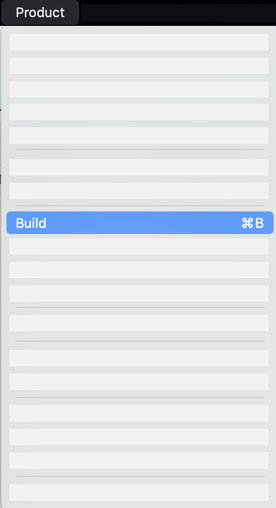

    > Any errors you see will be cleared after building the project.

2. Select a suitable simulator/device and run your project.

    


[DONE]
[ACCORDION-END]

[ACCORDION-BEGIN [Step 12: ](Onboard multiple users)]

1. Click **Start**.

    

2. Select **Default Identity Provider**.

    

3. Enter *username* and *password*, and click **Log On**.

    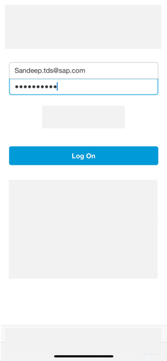

4. Click **Allow Data**.

    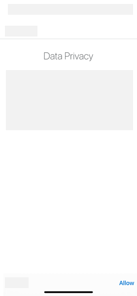

5. Click **Allow Usage**.

    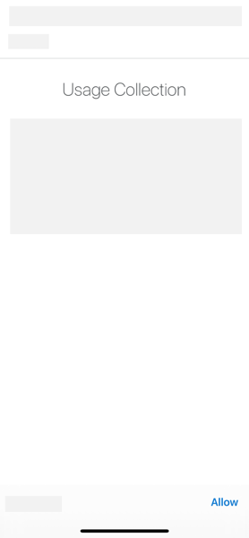

6. Choose a *passcode*, and click **Next**.

    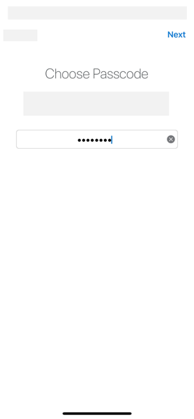

    > Biometric authentication is not supported. The biometric screen will not be shown in the onboarding or unlock processes.

    > No passcode policy is not supported. A default passcode policy will be used if the server has disabled it.

7. Enter the *passcode* again, and click **Done**.

    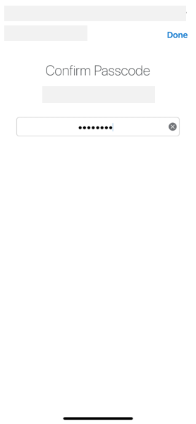

8. Terminate the app or Send the app to background.

    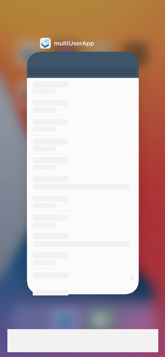

9. In the sign in screen, click **Switch or Add User**.

    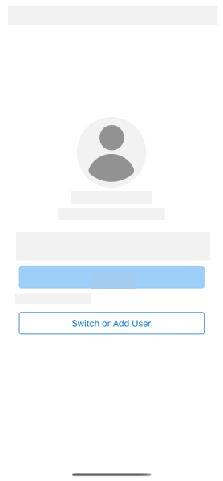

10. Click  to add a new user.
    > Ensure all users being onboarded have access to the BTP account. You can configure this in the users section under security on your SAP BTP sub-account.
    > 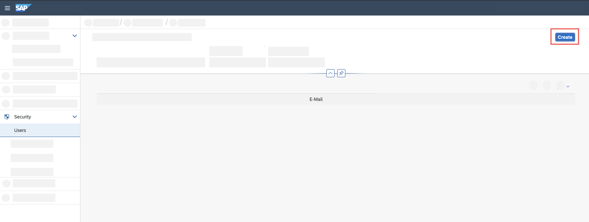

11. Follow the onboarding flow for the second user.

    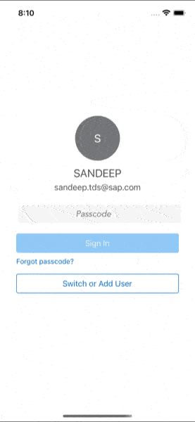

12. Terminate the app or Send the app to background.

    

13. In the sign in screen, click **Switch or Add User**.

    

14. Select a different user.

    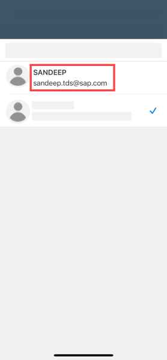

15. Enter the selected user's passcode.

    

[VALIDATE_4]
[ACCORDION-END]

[ACCORDION-BEGIN [Step 13: ](Try offline scenarios)]

1. Sign into User A's account.

    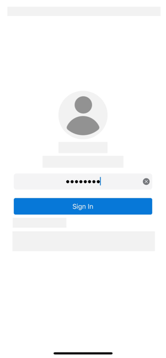

2. Turn off your network.

    > If you are running a simulator, turn off your parent system's WiFi.

3. Update an entry.

    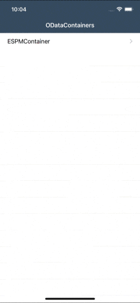

4. Turn on your network.

5. Sign in using User B's account.

    

6. Verify the change done by user A.

    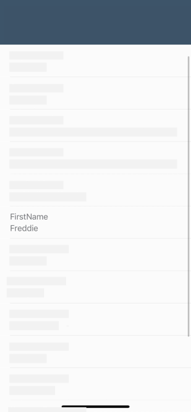

In this step you've seen how the changes done by User A are not lost even when they were done in the absence of network.

Congratulations on completing the tutorial!

[DONE]
[ACCORDION-END]


---
