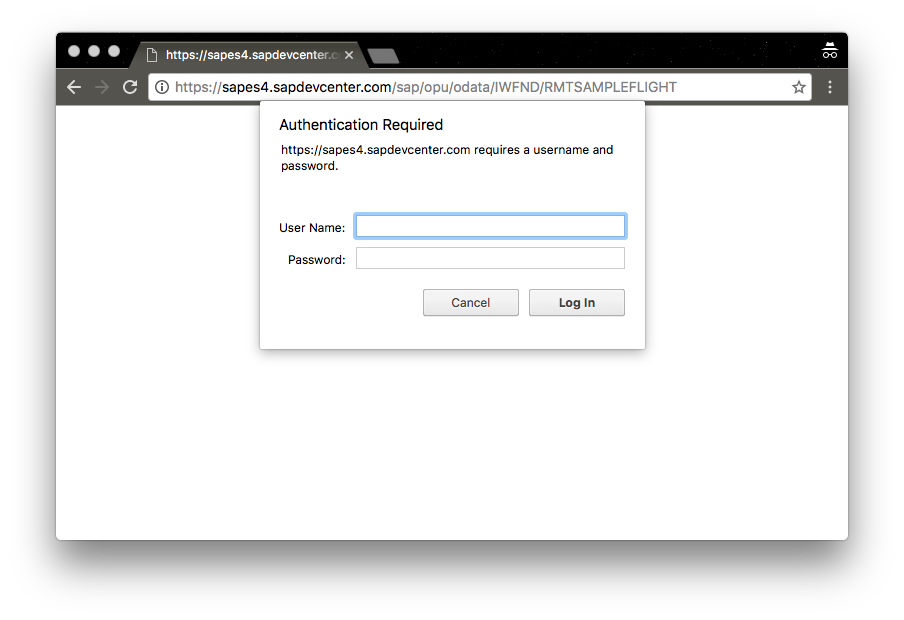
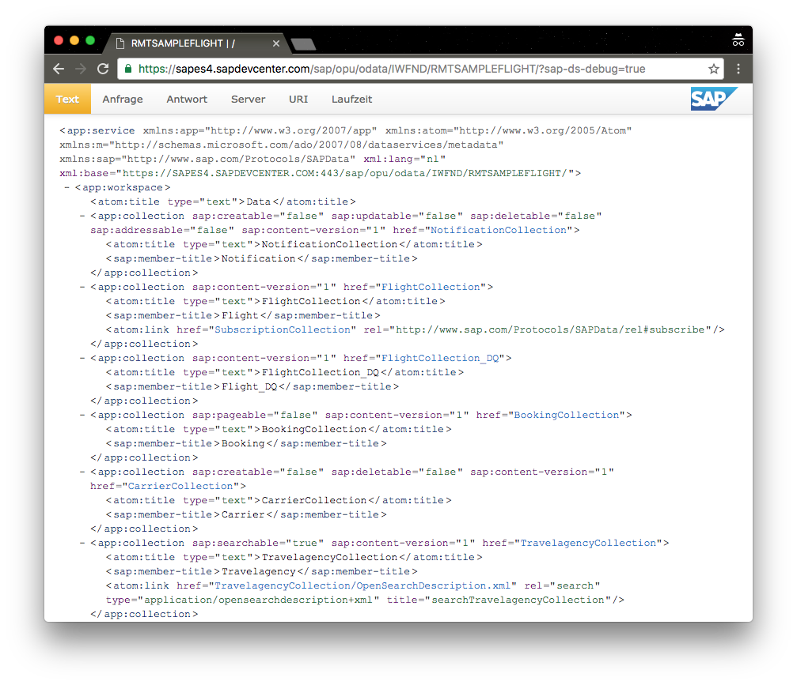
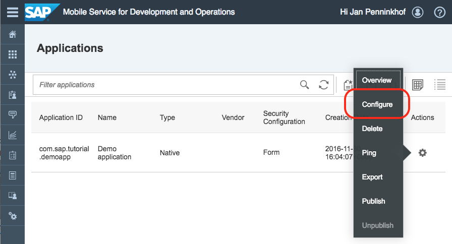
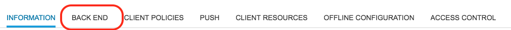
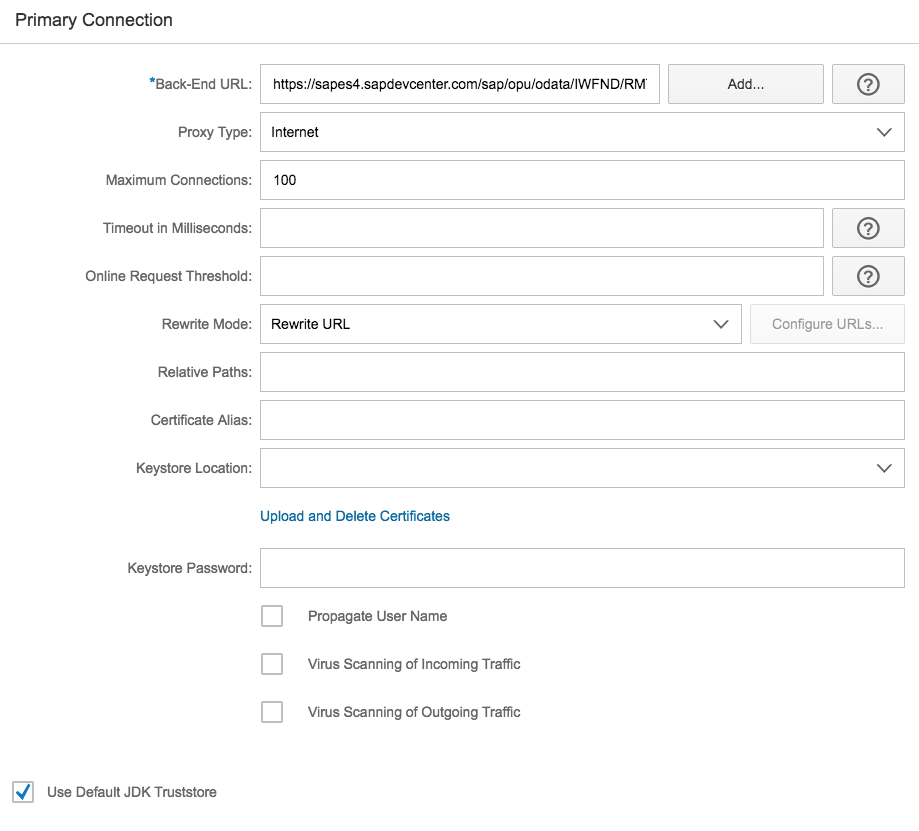
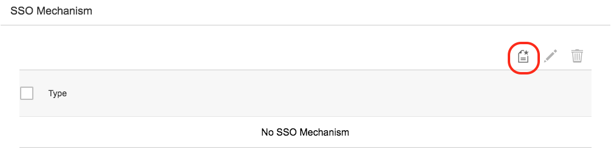
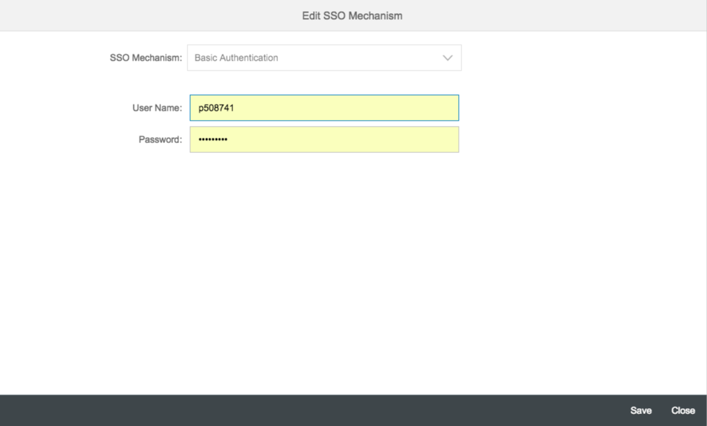
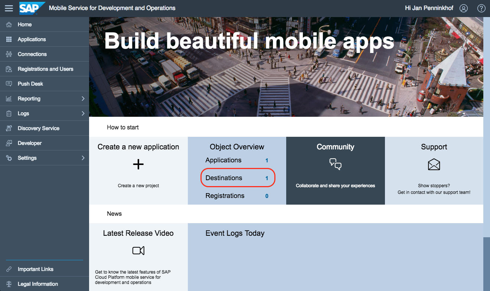

## Prerequisites  
- **Proficiency:** Beginner
- **ES4 Account:** You need to have an account on the ES4 system. Read [this document](https://archive.sap.com/documents/docs/DOC-40986) on how to get one.
- **Tutorials:** [Administer application configuration and security](http://go.sap.com/developer/tutorials.html?fiori-ios-hcpms-application-setup)

## Next Steps
- Select a tutorial from the [Tutorial Navigator](http://go.sap.com/developer/tutorial-navigator.html) or the [Tutorial Catalog](http://go.sap.com/developer/tutorials.html)

## Details
### You will learn  
You will learn how to create configure a back-end connection in your SAP Cloud Platform Mobile Services account, which will allow you to securely connect to your back-end service from your mobile application.

### Time to Complete
**15 Min**.

---

[ACCORDION-BEGIN [Step 1: ](Test your ES4 account)]

Fiori iOS apps communicate with backend enterprise systems primarily by using OData. SAP provides a publicly available OData endpoint at SAP Gateway Demo System, also known as ES4. As a requirement for this tutorial you should have already created and account on ES4. To test whether your ES4 account works properly, use your browser to go to https://sapes4.sapdevcenter.com/sap/opu/odata/IWFND/RMTSAMPLEFLIGHT/?sap-ds-debug=true.

> Note: If you don't have an account yet, follow the instructions in [this document](https://archive.sap.com/documents/docs/DOC-40986) to get one.

Once you are at this URL, the browser will prompt you for a user-ID and password. Enter your ES4 user-ID and password here.

When you have logged in, you should see an XML structure appear on your screen:

> You may have noticed the `?sap-ds-debug=true parameter` in the URL. This parameter can be used with SAP Gateway OData sources. This causes HTML to be returned to the browser enabling the content to be displayed in an easier to read format. On top of that, the links become clickable.

[DONE]
[ACCORDION-END]

[ACCORDION-BEGIN [Step 2: ](Edit the application)]

To edit the mobile application, go to the Mobile Service for Development and Operation cockpit, which you bookmarked in the previous tutorial. In the cockpit select the **Applications** tile to retrieve the list of applications. In the list, click on the **cog-icon** towards the right of the `Demo application` created in the previous tutorial. When you press the cog icon, a menu will appear, from which you can select **Configure**:

After you clicked the **Configure** menu-option, you should see the application details:

[DONE]
[ACCORDION-END]

[ACCORDION-BEGIN [Step 3: ](Enter back-end configuration)]

To edit the back-end configuration, click on the **Back End** option in the Tab

After selecting the **Back End** option, you will be able to configure the back-end connection. You can use the URL that you have tested before as Back-end URL. As it is not necessary to connect to it using the cloud connector, the Proxy Type should be set to `Internet`.

Please find the configuration details below:

Field Name                | Value
:-------------            | :-------------
Back-End URL              | `https://sapes4.sapdevcenter.com/sap/opu/odata/IWFND/RMTSAMPLEFLIGHT/`
Proxy Type                | `Internet`

[DONE]
[ACCORDION-END]

[ACCORDION-BEGIN [Step 4: ](Configure SSO mechanisms)]

When you were testing the ES4 service, you noticed that you needed to login before you had access to the service. Because the ES4 service is a protected service, credentials need to be provided before it gives you a valid response.

> Note: Both SAP Cloud Platform as well as the ES4 system is using SAP Cloud Identity to verify users. Theoretically this would make it very easy to implement single-sign-on. However, because there is no trust setup between your SAP Cloud Platform(trial) account and ES4, `Application-to-Application SSO` can not be used. Instead, `Basic Authentication` needs to be used.

To add an SSO mechanism, click on the **Add** button in the SSO Mechanism section:

After clicking the add-button a pop-up will appear, allowing you to enter the SSO mechanism details:

Please find the configuration details below:

Field Name                | Value
:-------------            | :-------------
SSO Mechanism             | `Basic Authentication`
User Name                 | *&lt;your ES4 username&gt;*
Password                  | *&lt;your ES4 password&gt;*

> Note: Please check the prerequisites in the introduction of this tutorial on how to get your ES4 credentials.

After entering the SSO mechanism details, press **Save** to store them. You should now see that you have 1 SSO Mechanism in your list. Press **Save** again, to save the back-end connection details.

After saving the connection details, you should see a message toast saying that the configuration details have been saved.

[DONE]
[ACCORDION-END]

[ACCORDION-BEGIN [Step 5: ](Go back to the cockpit and check the result)]

You can now press the **Home** button to go back to the cockpit. In the cockpit, you will see that the number of connections is now 1:

[DONE]
[ACCORDION-END]

## Next Steps
- Select a tutorial from the [Tutorial Navigator](http://go.sap.com/developer/tutorial-navigator.html) or the [Tutorial Catalog](http://go.sap.com/developer/tutorials.html)
