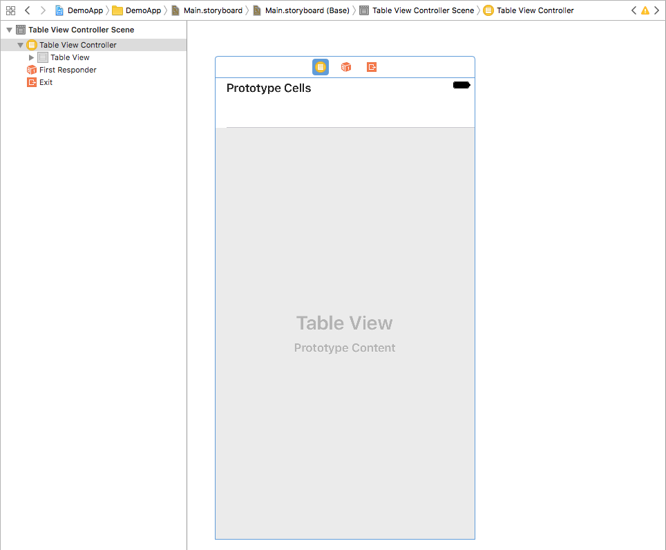
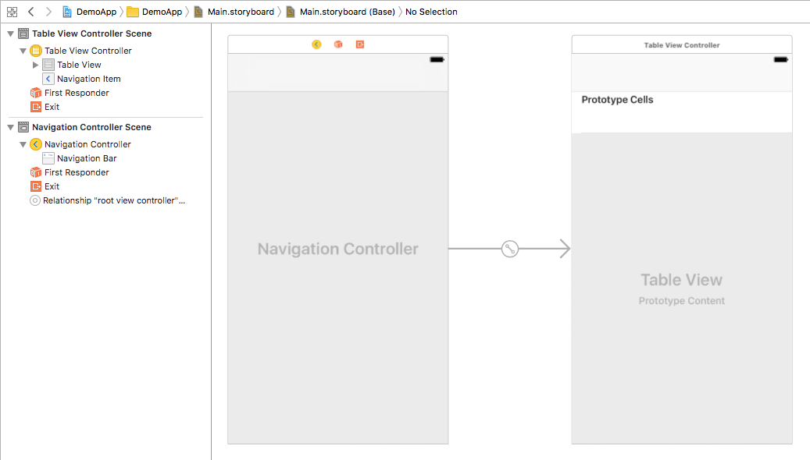
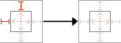
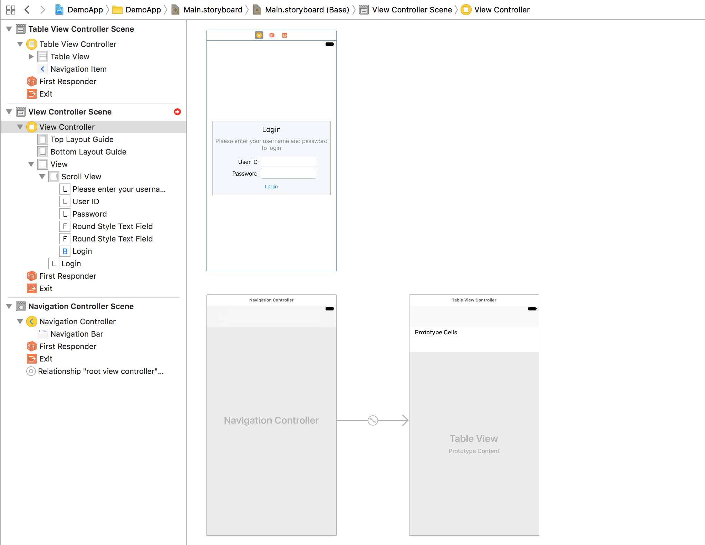
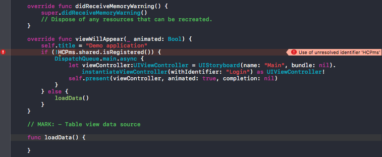
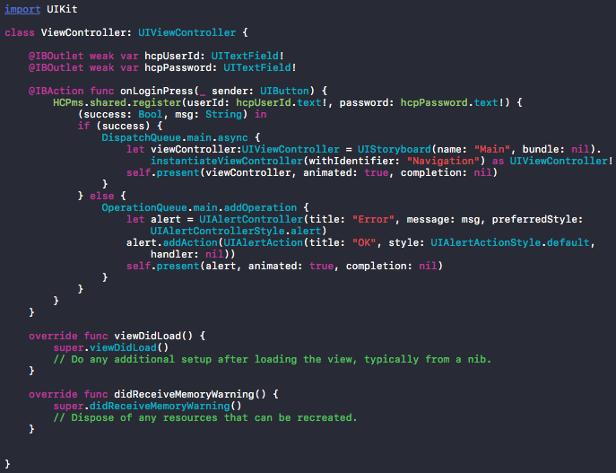
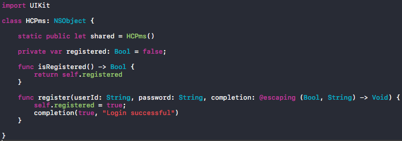
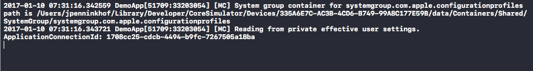
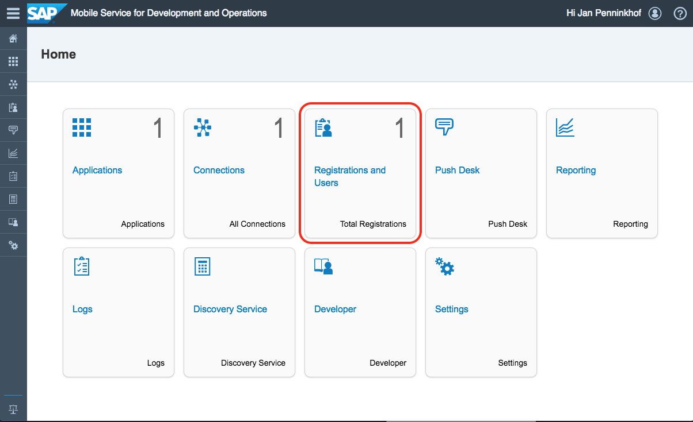
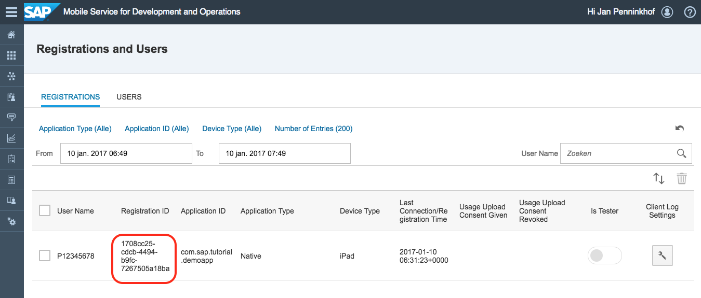

## Prerequisites  
 - [Configure back-end connection](http://www.sap.com/developer/tutorials.html?fiori-ios-hcpms-backend-connection.html)

## Next Steps
 - [Securely store User Credentials and Application Connection ID in the iOS keychain](http://go.sap.com/developer/tutorials.html?fiori-ios-hcpms-secure-credentials-keychain.html)

## Details
### You will learn  
You will learn how to build an application that allows a user to log-in and performs device registration on the SAP Cloud Platform mobile services.

### Time to Complete
**30 Min**

---

[ACCORDION-BEGIN [Introduction: ](Goal)]

The application that you will create in this and the following set of tutorials will be an application that shows a table of traveling agencies that is exposed as an OData services on the ES4 system.

Before the application can show these traveling agencies, the user needs to be authenticated and the application needs to register itself with the SAP Cloud Platform Mobile Services. Only once an application is registered, the SAP Cloud Platform Mobile Services will allow access to the configured back-end connections.

Please find a schematic overview of how this work in the image below:


1. The user enters credentials in the application
2. Once the user has entered his credentials, the app will register the app with the SAP Cloud Platform Mobile Services.
3. When the registration was carried out successfully, the SAP Cloud Platform Mobile Services will return an application connection ID (`appcid` in short).
4. When the application send a request for back-end data to the SAP Cloud Platform, the `appcid` should be include in the header of the request. If the `appcid` is missing, the app will not get access to the back-end data.
5. If a valid `appcid` is present and correct authentication details are passed in the request, SAP Cloud Platform's mobile services will work as a proxy and retrieve the requested data from ES4.
6. When the response from ES4 has been received, it will be passed to the application. With this data, the application can then show a table containing the retrieved details.

> Note: This tutorial will not be leveraging the Fiori iOS SDK, but is intended to get a better understanding of the internals of the SAP Cloud Platform Mobile Services and how they should interact with a native mobile application.

Please follow the steps below to build the registration portion of this app.

[DONE]
[ACCORDION-END]

[ACCORDION-BEGIN [Step 1: ](Create an Xcode application)]

If you haven't done so, create an empty application using Xcode. While setting up your application, please pick *Single View Application* from the application templates, and use the details below:

Field Name                  | Value
:-------------              | :-------------
Product Name                | `DemoApp`
Organization Identifier     | `com.sap.tutorial.swift`
Language                    | `Swift`
Devices                     | `Universal`

> Note: There is a full tutorial on how to setup your application available on http://www.sap.com/developer/tutorials.html?Xcode-introduction.html

[DONE]
[ACCORDION-END]

[ACCORDION-BEGIN [Step 2: ](Create the application view)]

Instead of the `UIView` that is generated when the project was created, a `UITableView` would be desired as the result of the service call should be shown in a table. To replace the `UIView` with a `UITableView`, the `UIView` should be removed first. This works very similar to what you have already learned in tutorial [Build a basic Swift app with Xcode](http://www.sap.com/developer/tutorials.html?Xcode-build-swift-app.html).

To replace the `UIView` with the `UITableView`:

- Use the navigator to navigate to the `Main.storyboard`
- Click on the **View Controller Scene** and press the **Delete** key on your keyboard (or select **Edit** | **Delete** from the menu).
- From the **Object Library** in the lower right, drag and drop a **Table View Controller** onto the Storyboard.

Your storyboard should now look like the image below:



[DONE]
[ACCORDION-END]

[ACCORDION-BEGIN [Step 3: ](Add a Navigation controller)]

A **Navigation Controller** manages **Segues** (transitions) from one **View Controller** to another.

To add a navigation controller:

- From the **Scene Dock**, select the **Table View Controller**
- With the **Table View Controller** selected, from the top-menu select **Editor &gt; Embed in &gt; Navigation Controller**
- The Navigation controller is going to be the entry point of the app. To set the navigation controller as entry point, select the **Navigation Controller** and make sure the **Is Initial View Controller** attribute is ticked in the **Attributes Inspector**.
- To be able to navigate to this view, use the **Identity Inspector** to set the storyboard ID to `Navigation`. Also make sure **Use Storyboard ID** is ticked under **Restoration ID**.

Your storyboard should now look like the image below:



[DONE]
[ACCORDION-END]

[ACCORDION-BEGIN [Step 4: ](Add a login view)]

The user cannot make any calls to the back-end without logging in an registering. Hence, a login screen would be necessary to perform authentication with the SAP Cloud Platform Mobile Services back-end.

To add the login view:

- From the **Object Library** in the lower right, drag and drop a **View Controller** onto the Storyboard.
- From the **Object Library**, drag and drop a **Scroll View** into the middle of the new View. This *Scroll View* will contain all UI elements necessary for the user to authenticate.
- From the **Object Library**, drag and drop a **Label** into the top of the **Scroll View** and resize it so that it covers the entire width. Using the **Attributes Inspector** on the right, set the **Text** attribute to `Login` and **Alignment** to `Centered`. To make the text stand out as a header, set the font-size to `22pt`.
- From the **Object Library**, drag and drop a second **Label** just below the **Login label** and resize it so that it covers the entire width. Using the **Attributes Inspector**, set the **Text** attribute to `Please enter your username and password to login` and **Alignment** to `Centered`. To make the text stand out as an explanatory text, change the font color to 50% grey. As the text may not fit the designated area, set attribute **Line Break** to `Word Wrap` and **Lines** to `0`. After the text has reformatted, adjust the label's height until the text fits.
- Below the explanatory text, add a label `User ID` and `Password` from the **Object Library** and position them below the explanatory text, slightly to the left.
- Next to the two labels add corresponding **Text Fields**. Make sure the password text field has attribute **Secure Text Entry** ticked.
- Below the text entry fields add a button `Login`
- To make sure that the **Scroll View** is always in the middle of your device's screen, select the **Size inspector** and select the **Scroll View** from the **Scene Dock** and remove the left and top constraints:

- To be able to navigate to this view, use the **Identity Inspector** to set the storyboard ID to `Login`. Also make sure **Use Storyboard ID** is ticked under **Restoration ID**.

Your storyboard should now look like the image below:



[DONE]
[ACCORDION-END]

[ACCORDION-BEGIN [Step 5: ](Launch the application to see what happens)]

When you launch the application using the **Build and Run** button at the top left section of the toolbar, the simulator will start and will show you application. When your application is visible, an empty table grid is shown. The *Table View* is the default view when the application is started as it is marked as the **Root view**.

When a user is not registered yet, the application should navigate to the login-view. To accomplish this, navigation code should be added to the **Table View**, which is done in step 6.

[DONE]
[ACCORDION-END]

[ACCORDION-BEGIN [Step 6: ](Create custom UITableViewController)]

The current `UITableView` is using the default `UITableViewController`. If you want to add additional code to the `UITableViewController`, a subclass of the default `UITableViewController` should be created and extended. To accomplish this, from the top menu, select **File > New > File...** and from the dialog, select Cocoa Touch Class. Click Next.
In the dialog that appears, enter the following:

Field Name                  | Value
:-------------              | :-------------
class                       | `TableViewController`
Subclass of                 | `UITableViewController`

Click **Next** and **Create** to finish. Your project structure in the **Project Navigator** should now include `TableViewController.swift`.

To see the code in this new file, click on it. When you clicked on it, an editor will open showing the generated template code.

To execute some code when the view is about to be displayed, function `viewWillAppear` can be overridden. When the user has not been registered yet, the application should navigate to the login view. If the user has been registered, the app should go ahead and load the traveling agencies from the OData service.

Add the code in the section below just below the `didReceiveMemoryWarning` function:

```swift
override func viewWillAppear(_ animated: Bool) {
    self.title = "Demo application"
    if (!HCPms.shared.isRegistered()) {
        DispatchQueue.main.async {
            let viewController:UIViewController = UIStoryboard(name: "Main", bundle: nil).instantiateViewController(withIdentifier: "Login") as UIViewController!
            self.present(viewController, animated: true, completion: nil)
        }
    } else {
        loadData()
    }
}
```

After inserting the code above you will notice that two exclamation marks are appearing. Class `HCPms` doesn't exist yet, and function `loadData` is also not present yet.

to implement `loadData`, just insert the code below just below the `Table view data source` marking:

```swift
func loadData() {

}
```

After pressing **⌘+B** to build the application, the exclamation mark in front of the `loadData()` line should have disappeared. The `loadData` will be implemented in follow-up tutorial [Read data from the ES4 back-end and present it in the iOS app](http://www.sap.com/developer/tutorials.html?fiori-ios-hcpms-retrieve-odata-service.html)



[DONE]
[ACCORDION-END]

[ACCORDION-BEGIN [Step 7: ](Link the UITableViewController to the Table View)]

Now a subclass of `UITableViewController` has been created, the **Table View Controller** needs to use the subclass you just created instead of the original class. To override the class being used for the **Table View Controller**, select the **Table View Controller** from the **Scene Dock**, and open the **Identity Inspector** in the right section of the screen. Under custom class select `TableViewController` in attribute **Class**.

[DONE]
[ACCORDION-END]

[ACCORDION-BEGIN [Step 8: ](Implement the HCPms class)]

In the previous step, you already saw the reference to the HCPms class. This class needs to be implemented before our new code will be able to run.

To implement this new class, from the top menu, select **File > New > File...** and from the dialog, select Cocoa Touch Class. Click Next.
In the dialog that appears, enter the following:

Field Name                  | Value
:-------------              | :-------------
class                       | `HCPms`
Subclass of                 | `NSObject`

Once the class `HCPms.swift` file is visible in the **Project Navigator**, click it to view it's content. Replace the content with the content below:

```swift
import UIKit

class HCPms: NSObject {

    static public let shared = HCPms()

    private var registered: Bool = false;

    func isRegistered() -> Bool {
        return self.registered
    }
}
```

The code above will pretend the user is not registered yet and always return false.

After implementing the `HCPms` class, switch back to the `TableViewController` using the **Project Navigator**. Make sure there are no exclamation marks anymore after building the project (**⌘+B**).

[DONE]
[ACCORDION-END]

[ACCORDION-BEGIN [Step 9: ](Launch the application check whether the login screen appears)]

With the new code in place that redirects users to the login screen if they are not registered, launch the app again.

After very briefly showing the table view, it should almost immediately display the login screen.

[DONE]
[ACCORDION-END]

[ACCORDION-BEGIN [Step 10: ](Implement the Login view logic)]

To wire up the Login view, open the *Main storyboard* in the **Project Navigator** and select the **View Controller** containing the login screen. Check the **Identity inspector** panel on the right, and make sure that the view is linked to custom class `ViewController`. If it isn't, select `ViewController` from the **Class** drop-down box in the **Custom class** section.

Once you are sure that the Login view is connected to class `ViewController` click on the **Assistant Editor** button (the button containing two circles in the upper right toolbar), to show the source code linked to the Login view, while showing the login view at the same time.

- To link the controls on the login view to the source code, hold down the **Ctrl** key while dragging the `User ID` text control to the view controller logic, just below the `class ViewController: UIViewController {` line. In the pop-up dialog, set the name of the Outlet to `hcpUserId`.
- Do the same for the Password field and place it just below the `hcpUserId` section. Set it's name to `hcpPassword`.
- To connect the login button to the source code, hold down the **Ctrl** key while dragging the `Login` button to the view controller logic, just below the `hcpPassword` outlet. In the pop-up dialog, set connection to `Action`, name to `onLoginPress` and type to `UIButton`.

With this, the controls of the login screen are connected to the source code. When the login button is pressed, the app should attempt to login. On successful login, the app should navigate back to the table view controller and when an error occurred, the error should be displayed.

This logic is implemented by implementing function `onLoginPress`:

```swift
@IBAction func onLoginPress(_ sender: UIButton) {
    HCPms.shared.register(userId: hcpUserId.text!, password: hcpPassword.text!) {
        (success: Bool, msg: String) in
        if (success) {
            DispatchQueue.main.async {
                let viewController:UIViewController = UIStoryboard(name: "Main", bundle: nil).instantiateViewController(withIdentifier: "Navigation") as UIViewController!
                self.present(viewController, animated: true, completion: nil)
            }
        } else {
            OperationQueue.main.addOperation {
                let alert = UIAlertController(title: "Error", message: msg, preferredStyle: UIAlertControllerStyle.alert)
                alert.addAction(UIAlertAction(title: "OK", style: UIAlertActionStyle.default, handler: nil))
                self.present(alert, animated: true, completion: nil)
            }
        }
    }
}
```

The code above will call the register function in the HCPms class and will pass the entered user ID and password. It will also pass a closure to the register function implementing the functionality that should be executed on success or error.

> Note: To learn more about closures in Swift 3 please refer to the [Closures chapter](https://developer.apple.com/library/content/documentation/Swift/Conceptual/Swift_Programming_Language/Closures.html) in the The Swift Programming Language.

The `ViewController` should now look like this:



After inserting the code above you will notice that an exclamation marks is appearing in front of line `HCPms.shared.register`. Class `HCPms` doesn't contain function `register` yet.

This function needs to be implemented, but first switch back to the **Standard editor** by clicking on the button in right section of the toolbar containing five horizontal lines. When you are back in the storyboard editor, click `HCPms.swift` from the **Project Navigator** to see the source code of the HCPms class. In the `HCPms` class add the `register` function below the `isRegistered` function:

```swift
func register(userId: String, password: String, completion: @escaping (Bool, String) -> Void) {
    self.registered = true;
    completion(true, "Login successful")
}
```

This function will pretend that the registration was successful and will mediately call the `completion` call-back function after it has set class variable `registered` to true. The latter will prevent the table view to navigate back to the login view again.

The `HCPms` class should now look like this:



[DONE]
[ACCORDION-END]

[ACCORDION-BEGIN [Step 11: ](Launch the application check whether the login flow logic works)]

When you launch the application, you should very briefly see the table view. Once the app finds out that the user isn't registered yet, it will show the login view.

When you click the login button (user ID and password aren't relevant yet), the `register` function in the `HCPms` class is launched and after successful completion the app will navigate back to to table view.

With this the navigation flow of the app is ready, but the mocked-up functions in the `HCPms` class still need work.

[DONE]
[ACCORDION-END]

[ACCORDION-BEGIN [Step 12: ](Registration URL composition)]

The URL that needs to be used to register the device is a composition of:

- Account ID
- SAP Cloud Platform landscape URL (e.g. `hanatrial.ondemand.com`)
- Application ID (`com.sap.tutorial.demoapp`)

To compose the URL in the HCPms class, add following code just below the line `static public let shared = HCPms()`:

```swift
private let hcpAccountId = "<your account ID, e.g. p12345678trial>"
private let hcpLandscape = "hanatrial.ondemand.com"
private let hcpAppId = "com.sap.tutorial.demoapp"

private lazy var connectionRoot: String = {
    return "https://hcpms-\(self.hcpAccountId).\(self.hcpLandscape)/odata/applications/latest/\(self.hcpAppId)/Connections"
}()
```

> Note: Please do replace the `hcpAccountId` string with your own account ID.

This section will allow you to use `connectionRoot` similar to a variable in your code. Once the variable is being used, it is quickly calculated.

[DONE]
[ACCORDION-END]

[ACCORDION-BEGIN [Step 13: ](Determining registration payload)]

When the app registers itself with the SAP Cloud Platform mobile services, it needs to pass the device type, model and username in the payload of the request.

For the payload a similar approach is taken as for the `connectionRoot`, in which a variable is prepared containing the data in the payload:

```swift
private let registrationInfo = [
    "DeviceType": UIDevice.current.model,
    "DeviceModel": "\(UIDevice.current.systemName) \(UIDevice.current.systemVersion)",
    "UserName": UIDevice.current.name
]
```

This section should be inserted just after the previously inserted section.

[DONE]
[ACCORDION-END]

[ACCORDION-BEGIN [Step 14: ](Define the variables that hold the user ID and password)]

To define variables that hold the user ID and password add the section below right underneath the previously inserted section:

```swift
private var userId:String? = nil
private var password:String? = nil
```

[DONE]
[ACCORDION-END]

[ACCORDION-BEGIN [Step 15: ](Define helper functions)]

While registering the device the payload should be sent JSON formatted body and the request should contain a basic authentication header. To facilitate the creation of the JSON payload and basic authentication header a few helper functions that assemble the JSON body and authentication header would be convenient.

Please add the following code just above the `isRegistered` function:

```swift
func createBasicAuthString() -> String? {
    if (userId != nil && password != nil) {
        let loginString = String(format: "%@:%@", userId!, password!)
        let loginData = loginString.data(using: String.Encoding.utf8)!
        return loginData.base64EncodedString()
    }
    return nil
}

func dicToJson(dic: Dictionary<String, String>) -> Data {
    do {
        let jsonData = try JSONSerialization.data(withJSONObject: dic, options: .prettyPrinted)
        return jsonData
    } catch {
        print(error.localizedDescription)
        return "{}".data(using: .utf8)!
    }
}
```

Function `createBasicAuthString` takes the `userId` and `password` from the HCPms object instance and turns them into a Basic Authentication string. Function `dicToJson` turns the `registrationInfo` dictionary object and turns it into a JSON structure. This function is used to convert the payload from a swift dictionary object to a JSON string that can be sent in the payload of the registration request.

[DONE]
[ACCORDION-END]

[ACCORDION-BEGIN [Step 16: ](Implement register function)]

replace the `register` function with the code below:

```swift
func register(userId: String, password: String, completion: @escaping (Bool, String) -> Void) {
    self.registered = true
    self.userId = userId
    self.password = password
    var request = URLRequest(url: URL(string: connectionRoot)!)
    request.httpMethod = "POST"
    let authString = createBasicAuthString()
    if (authString != nil) {
        request.setValue("Basic \(authString!)", forHTTPHeaderField: "Authorization")
    }
    request.setValue("application/json", forHTTPHeaderField: "Content-Type")
    request.setValue("application/json", forHTTPHeaderField: "Accept")
    request.httpBody = dicToJson(dic: registrationInfo)
    let task = URLSession.shared.dataTask(with: request) { data, response, error in
        guard let data = data, error == nil else {
            completion(false, "error=\(error)")
            return
        }

        if let httpStatus = response as? HTTPURLResponse, httpStatus.statusCode != 201 {
            print("statusCode should be 201, but is \(httpStatus.statusCode)")
            let responseString = String(data: data, encoding: .utf8)
            print("responseString = \(responseString!)")
            switch httpStatus.statusCode {
            case 401: completion(false, "The credentials you entered are incorrect")
            default: completion(false, "An unknown error occurred")
            }
        }

        let json = try? JSONSerialization.jsonObject(with: data, options: .allowFragments)
        guard let root = json as? [String: Any], let d = root["d"] as? [String: Any], let appcid = d["ApplicationConnectionId"] as? String else {
            return
        }
        print("ApplicationConnectionId: \(appcid)")
        completion(true, "Login successful")

    }
    task.resume()
}
```

With this implementation of the `register` function, the registration process will now perform a registration on the SAP Cloud Platform Mobile Services back-end by:

- Setting the object instance variables `userId` and `password` to the `userId` and `password` that have been provided as function parameters. These will be used by the function that creates the basic authentication header string.
- Setting up the request, including the basic authentication string if it can be assembled successfully.
- Setting the `Content-Type` and `Accept` headers to JSON, indicating that the request payload is formatted as JSON, but also that the requested response should be formatted as a JSON structure.
- Converting the `registrationInfo` to a JSON structure and inserting it into the body of the request.
- A `dataTask` (`task`) is created with the request as parameter, but also with a completion handler as closure.
- The data task is then executed
- Once the data task calls the completion closure the guard statement checks whether data has been returned and the error parameter is nil. If it isn't, the register function will call it's completion closure indicating that an error occurred.
- Next, the the http response status is checked. On registration status 201 (Created) is expected. Anything else should result in an error and call the completion closure accordingly.
- In the last section of the closure, the JSON response is being read and an attempt will be made to read the application connection ID (`appcid`) that has been assigned by the SAP Cloud Platform Mobile Services. The application connection Id, is found in the JSON structure as `d.ApplicationConnectionId`. You may note here that the guard statement has multiple conditions. Guard will check only one condition at a time. Only if first is true then it will check next otherwise it will executes else part.

Please find an example of a JSON response returned by the SAP Cloud Platform Mobile services below for reference:

```json
{
   "d":{
      "__metadata":{
         "uri":"https://hcpms-p12345678trial.hanatrial.ondemand.com/odata/applications/latest/com.sap.tutorial.demoapp/Connections('d0646014-2fdc-4461-8ebf-58adbc799050')",
         "type":"applications.Connection"
      },
      "ETag":"2017-01-10 06:10:33.0",
      "ApplicationConnectionId":"d0646014-2fdc-4461-8ebf-58adbc799050",
      "UserName":"P12345678",
      "AndroidGcmPushEnabled":false,
      "AndroidGcmRegistrationId":null,
      "AndroidGcmSenderId":" ",
      "ApnsPushEnable":false,
      "ApnsDeviceToken":null,
      "ApplicationVersion":"1.0",
      "BlackberryPushEnabled":false,
      "BlackberryDevicePin":null,
      "BlackberryBESListenerPort":0,
      "BlackberryPushAppID":null,
      "BlackberryPushBaseURL":null,
      "BlackberryPushListenerPort":0,
      "BlackberryListenerType":0,
      "CollectClientUsageReports":false,
      "ConnectionLogLevel":"NONE",
      "CustomizationBundleId":null,
      "CustomCustom1":" ",
      "CustomCustom2":" ",
      "CustomCustom3":" ",
      "CustomCustom4":" ",
      "DeviceModel":"iOS 10.2",
      "DeviceType":"iPad",
      "DeviceSubType":null,
      "DevicePhoneNumber":null,
      "DeviceIMSI":null,
      "E2ETraceLevel":"Low",
      "EnableAppSpecificClientUsageKeys":false,
      "FeatureVectorPolicyAllEnabled":true,
      "FormFactor":null,
      "LogEntryExpiry":7,
      "MaxConnectionWaitTimeForClientUsage":30,
      "MpnsChannelURI":null,
      "MpnsPushEnable":false,
      "PasswordPolicyEnabled":false,
      "PasswordPolicyDefaultPasswordAllowed":true,
      "PasswordPolicyMinLength":8,
      "PasswordPolicyDigitRequired":false,
      "PasswordPolicyUpperRequired":false,
      "PasswordPolicyLowerRequired":false,
      "PasswordPolicySpecialRequired":false,
      "PasswordPolicyExpiresInNDays":0,
      "PasswordPolicyMinUniqueChars":0,
      "PasswordPolicyLockTimeout":300,
      "PasswordPolicyRetryLimit":10,
      "PasswordPolicyFingerprintEnabled":true,
      "ProxyApplicationEndpoint":"https://sapes4.sapdevcenter.com/sap/opu/odata/IWFND/RMTSAMPLEFLIGHT/",
      "ProxyPushEndpoint":null,
      "PublishedToMobilePlace":false,
      "UploadLogs":false,
      "WnsChannelURI":null,
      "WnsPushEnable":false,
      "InAppMessaging":false,
      "UserLocale":null,
      "TimeZone":null,
      "LastKnownLocation":null,
      "CreatedAt":"\/Date(1484028633406)\/",
      "PushGroup":null,
      "Email":null,
      "Capability":{
         "results":[

         ]
      },
      "FeatureVectorPolicy":{
         "results":[

         ]
      }
   }
}
```

[DONE]
[ACCORDION-END]

[ACCORDION-BEGIN [Step 17: ](Test the registration routines)]

To check whether registration works properly, launch the application by clicking the **Build and Run** button in the toolbar in the upper left. The similar should start up and show the login screen. In the login screen, enter your SAP Cloud Platform credentials and press the **Login** button.

When the **Login** button is pressed, you should see that a few lines are added to the debug console in Xcode:



In the last line you should see the connection ID that has been assigned by the SAP Cloud Platform Mobile Services.

If you now go to the cockpit of SAP Cloud Platform Mobile Service for Development and Operations, you should see that the **Registrations and User** tile has increased:



When you click on the tile, you should see the list of registrations. The registration that has just been created should have a connection ID as the connection ID that was returned in the debug console in Xcode.



[DONE]
[ACCORDION-END]

## Next Steps
- [Securely store User Credentials and Application Connection ID in the iOS keychain](http://go.sap.com/developer/tutorials.html?fiori-ios-hcpms-secure-credentials-keychain.html)
