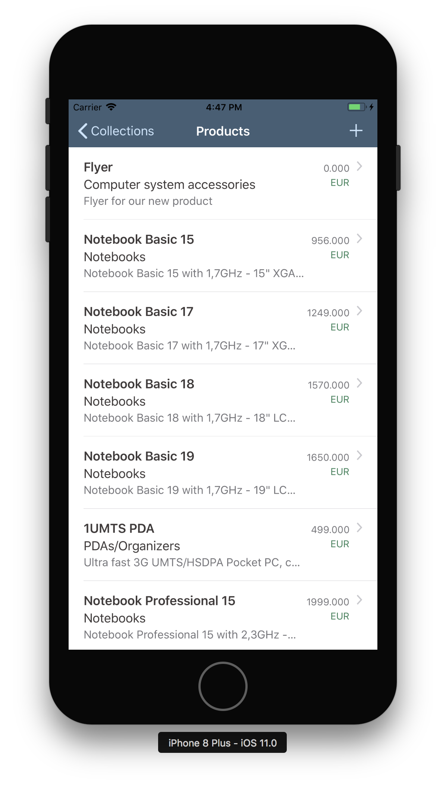
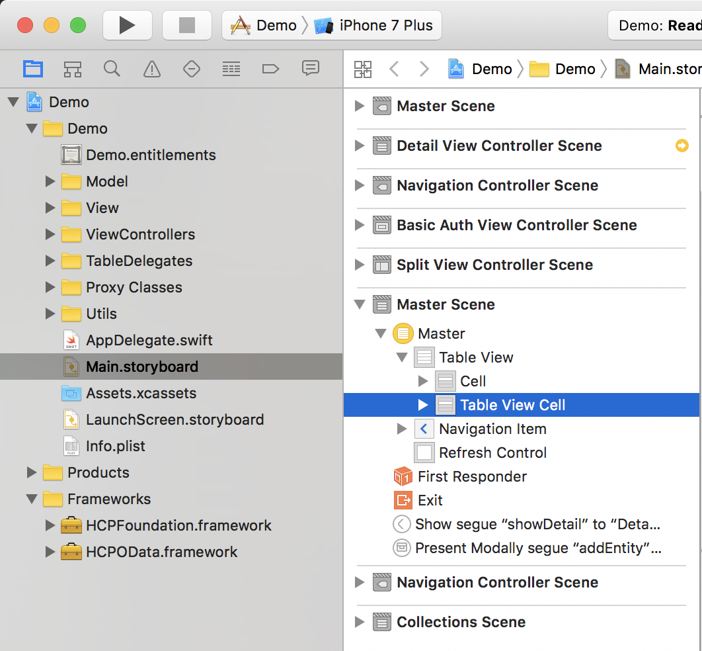

## Prerequisites  
 - **Proficiency:** Intermediate
 - **Development environment:** Apple iMac, MacBook or MacBook Pro running Xcode 9 or higher
 - **SAP Cloud Platform SDK for iOS:** Version 2.0
 - **Tutorials:** [Create an app using the SDK Assistant](https://www.sap.com/developer/tutorials/fiori-ios-hcpms-sdk-assistant.html)

## Next Steps
 - [Using the SAP Fiori for iOS Mentor app](https://www.sap.com/developer/tutorials/fiori-ios-scpms-mentor.html)

## Details
### You will learn  
You will learn to implement SAP Fiori for iOS controls, and style your application according to the SAP Fiori for iOS guidelines.

### Time to Complete
**10 Min**.

---

In the previous tutorials, you created and build upon an application which utilized the technical parts of the SAP Cloud Platform SDK for iOS. The application itself still had the 'traditional' iOS look and feel.

In this tutorial, you will implement the use of a Fiori for iOS control (the **Object Cell**), as well as change the general appearance of the application conform the SAP Fiori for iOS standards. When finished, your application will look like this:



[ACCORDION-BEGIN [Step 1: ](Examining the Master Table View)]

Open the project's `Products.storyboard` in `Demo > ViewControllers > Products`. Locate the **Master Scene** Table View and select the `FUIObjectTableViewCell` cell:



[DONE]
[ACCORDION-END]

[ACCORDION-BEGIN [Step 2: ](Bind model data to Object Cell)]

Now, you need to implement logic to bind the **Object Cell**'s display properties to the model data.

Open the file `ProductsMasterViewController.swift` under `Demo > ViewControllers > Products`.

Locate the following function:

```swift
override func tableView(_ tableView: UITableView, cellForRowAt indexPath: IndexPath) -> UITableViewCell {
    let product = self.entities[indexPath.row]
    let cell = CellCreationHelper.objectCellWithNonEditableContent(tableView: tableView, indexPath: indexPath, key: "ProductId", value: "\(product.productID!)")
    return cell
}
```

Replace this function with the following code:

```swift
override func tableView(_ tableView: UITableView, cellForRowAt indexPath: IndexPath) -> UITableViewCell {
    let product = self.entities[indexPath.row]

    tableView.estimatedRowHeight = 80
    tableView.rowHeight = UITableViewAutomaticDimension

    let cell = tableView.dequeueReusableCell(withIdentifier: "FUIObjectTableViewCell",
                                             for: indexPath as IndexPath)
    guard let objectCell = cell as? FUIObjectTableViewCell else {
        return cell
    }

    objectCell.headlineText = product.name!
    objectCell.subheadlineText = product.categoryName!
    objectCell.footnoteText = product.shortDescription!
    objectCell.descriptionText = product.longDescription!
    objectCell.statusText = String(describing: product.price!)
    objectCell.substatusText = product.currencyCode!
    objectCell.substatusLabel.textColor = UIColor.preferredFioriColor(forStyle: .positive)
    objectCell.accessoryType = .disclosureIndicator

    return objectCell
}
```

The above code does the following:

First, increase the row height since the Object Cell is higher than the standard table cell.

Then a reference is created to the Object Cell with identifier `FUIObjectTableViewCell`.

Finally, now you have the reference to the Fiori Object Cell control, you then bind the model properties to the control properties and return the instance of that control.

[VALIDATE_2]
[ACCORDION-END]

[ACCORDION-BEGIN [Step 3: ](Build and run the application)]

The Master Table View for the Products entity is now prepared to use a custom Object Cell from the `SAPFiori` module. Build and run the application.

Click the **Products** item. You should now see the master list with **Object Cell** items displaying the various properties of the **Product** entities:


[DONE]
[ACCORDION-END]

