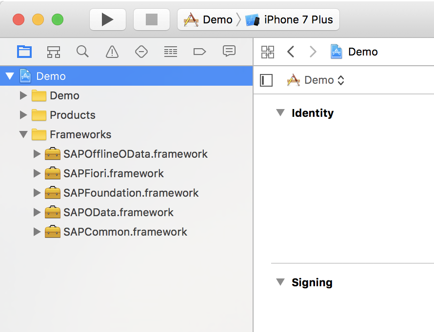
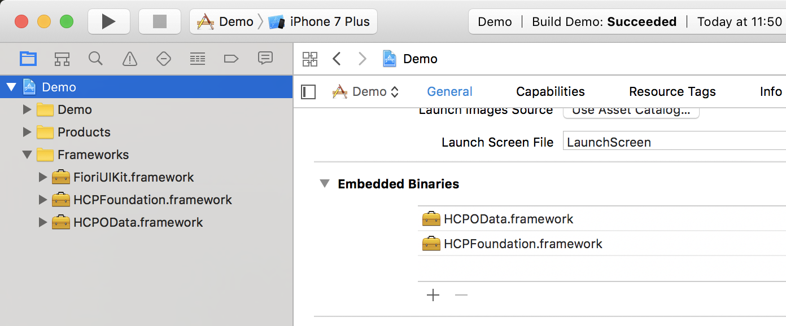
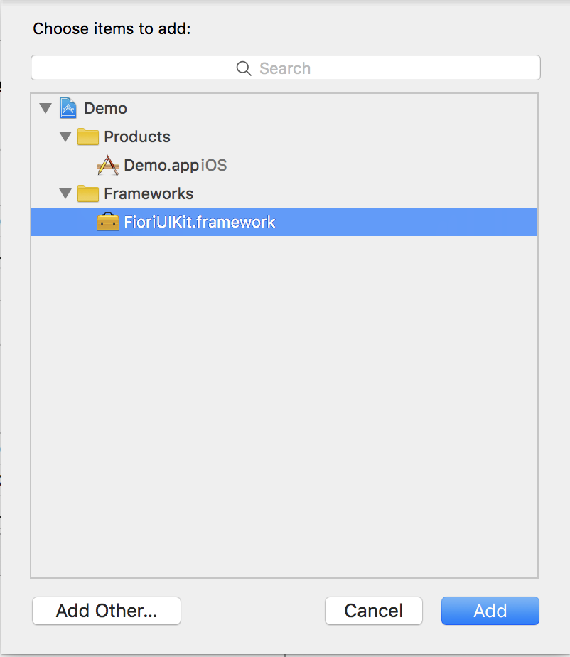
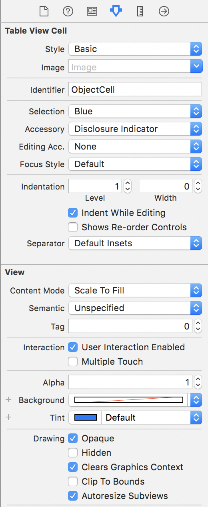
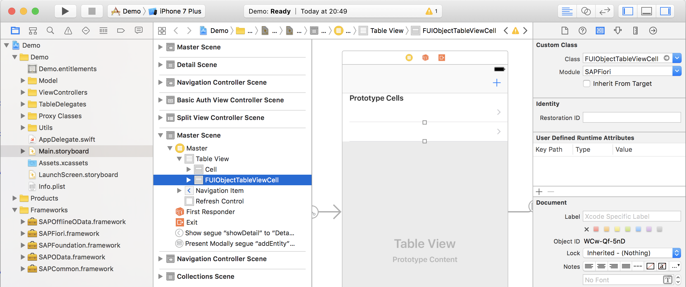
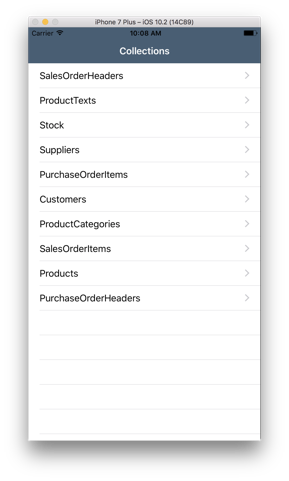
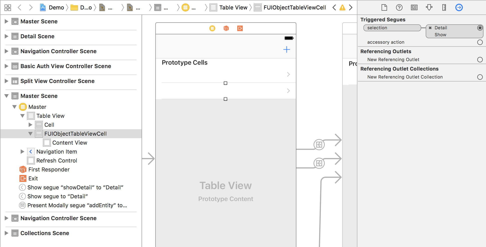
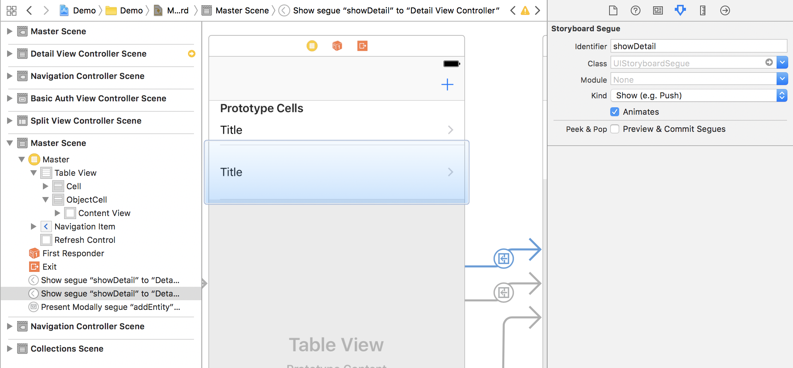

## Prerequisites  
 - **Proficiency:** Intermediate
 - **Development machine:** Access to a Mac computer
 - **Tutorials:** [SAML and OAuth 2 authentication](https://www.sap.com/developer/tutorials/fiori-ios-hcpms-saml-oauth.html)

## Next Steps
 - [Using the SAP Fiori for iOS Mentor app](https://www.sap.com/developer/tutorials/fiori-ios-scpms-mentor.html)

## Details
### You will learn  
You will learn to implement SAP Fiori for iOS controls, and style your application according to the SAP Fiori for iOS guidelines.

### Time to Complete
**10 Min**.

---

In the previous tutorials, you created and build upon an application which utilized the technical parts of the SAP HCP for iOS SDK. The application itself still had the 'traditional' iOS look and feel.

In this tutorial, you will implement the use of a Fiori for iOS control (the **Object Cell**), as well as change the general appearance of the application conform the SAP Fiori for iOS standards. When finished, your application will look like this:


[ACCORDION-BEGIN [Step 1: ](Add FioriUIKit to your project)]

Open the Xcode project, and locate the **Demo > Frameworks** group. Expand the group.

Switch to **Finder**, and navigate to the `Debug-fat` location which contain the stored framework files. Drag the `FioriUIKit.framework` file to the expanded **Frameworks** folder.

In the dialog, make sure to select **Copy items if needed** and click **Finish**



[DONE]
[ACCORDION-END]

[ACCORDION-BEGIN [Step 2: ](Add framework file to Embedded Binaries)]

Navigate to `Demo` and from the **General** tab, scroll down to **Embedded Binaries**. Click the **+** button.



In the dialog, select the `FioriUIKit.framework` file.



> If, after adding it to the **Embedded Libraries**, two `FioriUIKit` entries are visible under **Linked Frameworks and Libraries**, then remove that second entry.

[DONE]
[ACCORDION-END]

[ACCORDION-BEGIN [Step 3: ](Add Tablle View Cell to Table View)]

Open the project's **Storyboard**. Locate the **Master** Table View and drag a new **Table View Cell** control from the **Object Library** to the **Table View**:


[DONE]
[ACCORDION-END]

[ACCORDION-BEGIN [Step 4: ](Change Table View Cell properties)]

With the newly added **Table View Cell** selected, switch to it's **Attributes Inspector**.

Set the following properties:

| Property | Value |
|----|----|
| Style | Basic |
| Identifier | `ObjectCell` |
| Selection | Blue |
| Accessory | Disclosure Indicator |
| Indentation Level | 1 |
| Indentation Width | 0 |
| Clip to bounds | Unchecked |



> Since you specified an **Identifier** name `ObjectCell`, you will notice this name is now reflected in the Storyboard designer's **Document Outline**.

[DONE]
[ACCORDION-END]

[ACCORDION-BEGIN [Step 5: ](Change Table View Cell class to FioriUIKit's Object Cell)]

Switch to the Object Cell's **Identity Inspector**, and change the class and module to the Fiori **Object Cell** control:

| Property | Value |
|----|----|
| Class | `ObjectCell` |
| Module | `FioriUIKit` |



[DONE]
[ACCORDION-END]

[ACCORDION-BEGIN [Step 6: ](Bind model data to Object Cell)]

Now, you need to implement logic to bind the **Object Cell**'s display properties to the model data.

Open the file `ProductsMasterTableDelegate.swift` under `Demo > TableDelegates > MasterTableDelegates`.

First, import the Fiori UI Kit module:

```swift
import FioriUIKit
```

Locate the following function:

```swift
func tableView(_ tableView: UITableView, cellForRowAt indexPath: IndexPath) -> UITableViewCell {
    let product = self.entities[indexPath.row] as! Product
    let cell = cellWithNonEditableContent(tableView: tableView, indexPath: indexPath, with: "ProductId :\(product.productID)")
    return cell
}
```

Replace this function with the following code:

```swift
func tableView(_ tableView: UITableView, cellForRowAt indexPath: IndexPath) -> UITableViewCell {
    tableView.estimatedRowHeight = 80
    tableView.rowHeight = UITableViewAutomaticDimension

    let product = self.entities[indexPath.row] as! Product

    let cell = tableView.dequeueReusableCell(withIdentifier: "ObjectCell",
                                             for: indexPath as IndexPath)
    guard let objectCell = cell as? ObjectCell else {
        return cell
    }

    objectCell.headlineText = product.name!
    objectCell.subheadlineText = product.categoryName!
    objectCell.footnoteText = product.shortDescription!
    objectCell.descriptionText = product.longDescription!
    objectCell.statusText = String(describing: product.price!)
    objectCell.substatusText = product.currencyCode!
    objectCell.substatusLabel.textColor = UIColor.preferredFioriColor(forStyle: .positive)
    objectCell.accessoryType = .disclosureIndicator
    objectCell.mainStackWidth = CGFloat(0.3)

    return objectCell
}
```

The above code does the following:

First, increase the row hight since the Object Cell is higher than the standard table cell.

Then a reference is created to the added Object Cell with identifier `ObjectCell`.

Finally, now you have the reference to the Fiori Object Cell control, you then bind the model properties to the control properties and return the instance of that control.

[DONE]
[ACCORDION-END]

[ACCORDION-BEGIN [Step 7: ](Add Fiori style to Navigation Bar)]

The Master Table View for the Products entity is now prepared to use a custom Object Cell from the `FioriUIKit` module. To finalize the Fiori look and feel, you only need to skin the **Navigation Bar**.

Open `AppDelegate.swift` and add an import statement for the `FioriUIKit` module:

```swift
import FioriUIKit
```

Locate the following function:

```swift
func application(_ application: UIApplication, willFinishLaunchingWithOptions launchOptions: [UIApplicationLaunchOptionsKey: Any]? = nil) -> Bool {
    UIApplication.shared.registerForRemoteNotifications()
    let center = UNUserNotificationCenter.current()
    center.requestAuthorization(options: [.alert, .badge, .sound]) { (granted, error) in
        // Enable or disable features based on authorization.
    }
    center.delegate = self
    return true
}
```

Just above the `return true` statement, add the following code:

```swift
UINavigationBar.appearance().tintColor = UIColor.preferredFioriColor(forStyle: .tintColorLight)
UINavigationBar.appearance().titleTextAttributes = [NSForegroundColorAttributeName: UIColor.white]
UINavigationBar.appearance().barTintColor = UIColor.preferredFioriColor(forStyle: .backgroundGradientTop)
UINavigationBar.appearance().isTranslucent = false
UINavigationBar.appearance().barStyle = .black
UINavigationBar.appearance().setBackgroundImage(UIImage(), for: .default)
UINavigationBar.appearance().shadowImage = UIImage()

UIApplication.shared.statusBarStyle = .lightContent

window?.tintColor = UIColor.preferredFioriColor(forStyle: .tintColorLight)
```

This will style the Navigation Bar with the standard, preferred Fiori for iOS look and feel.

[DONE]
[ACCORDION-END]

[ACCORDION-BEGIN [Step 8: ](Build and run the application)]

Build and run the application. After logging in, you will notice the **Navigation Bar** now has the Fiori for iOS look and feel:



Click the **Products** item. You should now see the master list with **Object Cell** items displaying the various properties of the **Product** entities:


[DONE]
[ACCORDION-END]

[ACCORDION-BEGIN [Step 9: ](Add segue to Object Cell)]

If you now try to click an Object Cell to show the details for that entity, nothing happens. This is as expected, since you haven't created a **Segue** from the new **Object Cell** to the **Detail** page. You can solve this by adding the segue yourself:



Make sure you set the identifier to `showDetail`, similar to the segue from the standard table cell. This way navigation works identical for both segues.



If you now build and run the application, you can navigate from the Products master page to the detail page.

[DONE]
[ACCORDION-END]

## Next Steps
- [Using the SAP Fiori for iOS Mentor app](https://www.sap.com/developer/tutorials/fiori-ios-scpms-mentor.html)
