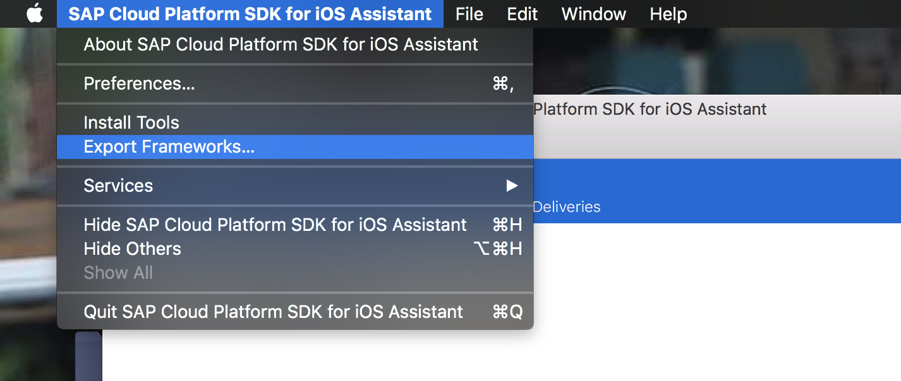

## Prerequisites  
 - **Proficiency:** Beginner
 - **Development environment:** Apple iMac, MacBook or MacBook Pro running Xcode 9 or higher
 - **SAP Cloud Platform SDK for iOS:** Version 2.0

## Next Steps
 - [Enable SAP Cloud Platform mobile service for development and operations](https://developers.sap.com/tutorials/fiori-ios-hcpms-setup.html)

## Details
### You will learn  
In this small tutorial, you will learn to add the SAP Cloud Platform for iOS SDK framework files to your project, and set the correct references.

> **NOTE: If you plan to use the *SDK Assistant* tool, you can skip this tutorial. The *SDK Assistant* will set the correct SDK configuration and references in the generated Xcode project**

### Time to Complete
**5 Min**.

---

[ACCORDION-BEGIN [Step 1: ](Store SDK files locally)]

Download the `SAP-CP-SDK-for-iOS.dmg` disk image file. Double-clicking the file will mount it as a drive. Open the mounted image, and you will see it the following:

Drag the folder `SAP CP SDK for iOS` to the local `Applications` folder.

The folder you just copied contains one application, the **SAP Cloud Platform SDK for iOS Assistant**:

The **SAP Cloud Platform SDK for iOS Assistant** will be covered in detail in one of the next tutorials.

> **Note**: If you have used version 1.0 of the **SAP Cloud Platform for iOS SDK** before, you may have noticed the `Frameworks`, `Tools` and `Documentation` folders are no longer available. These can now all be accessed from the SDK Assistant's **App menu**:

> 

[VALIDATE_1]
[ACCORDION-END]

