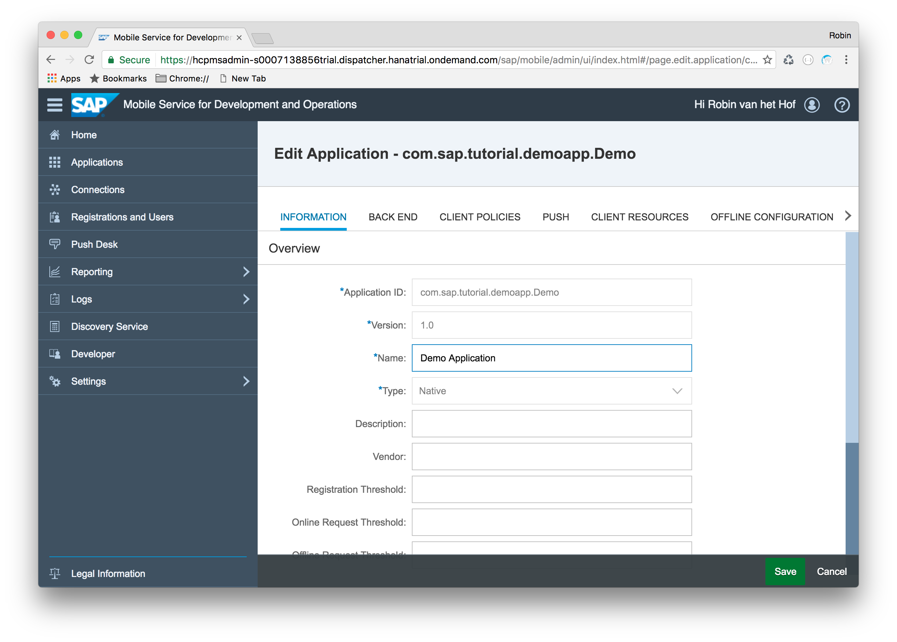
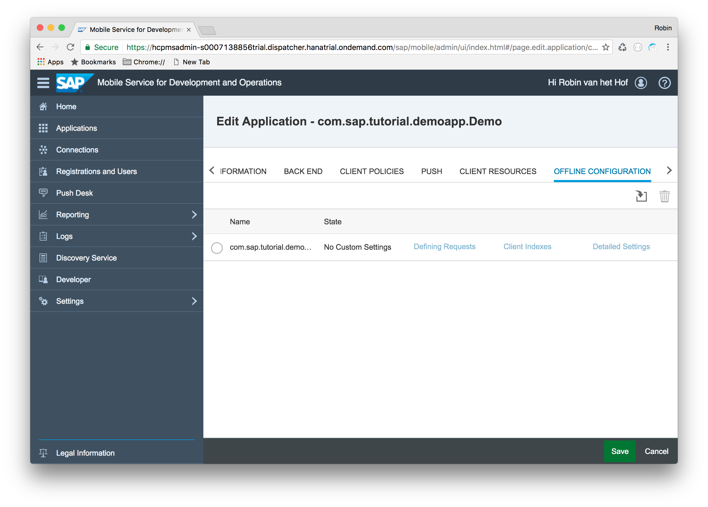
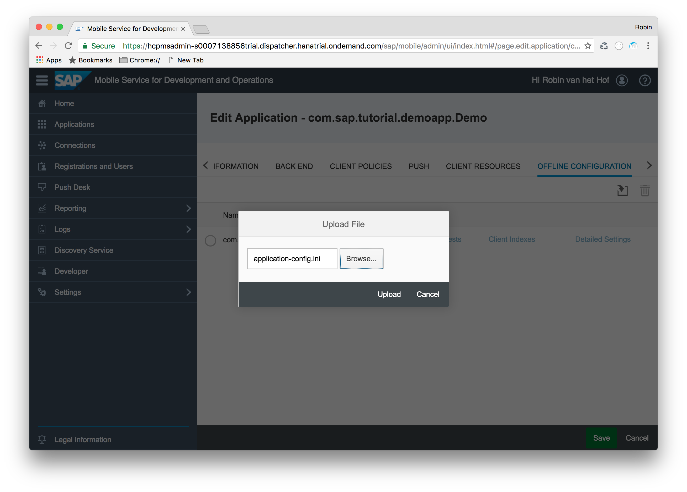
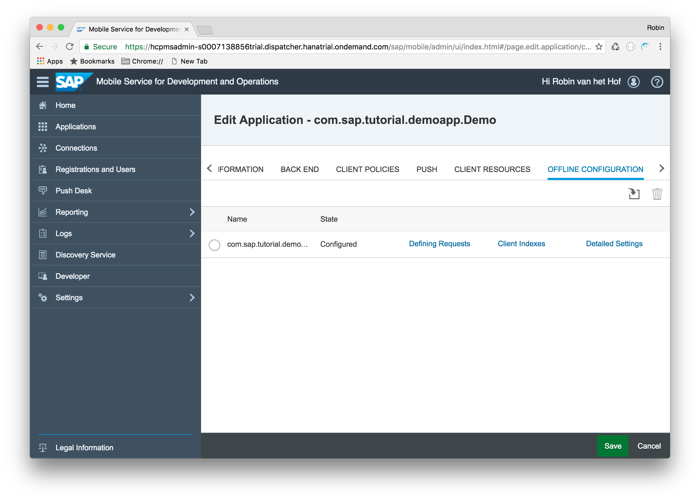
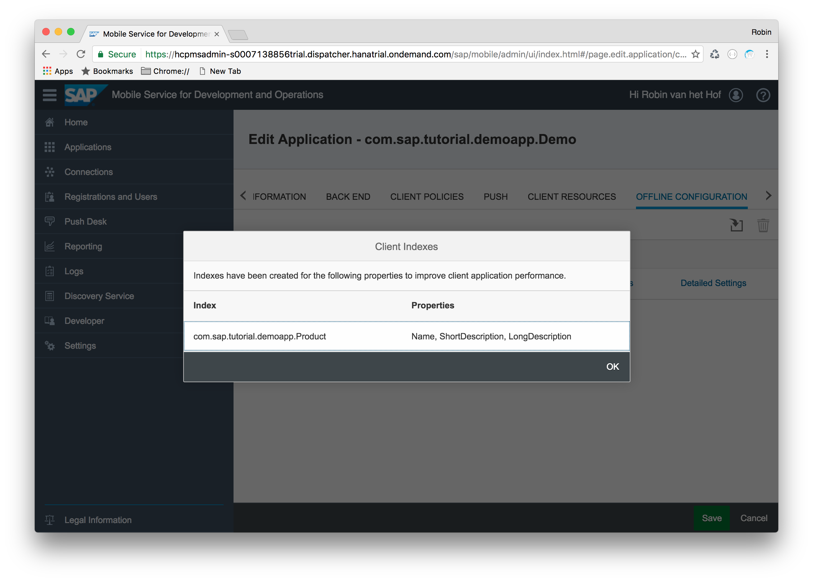

## Prerequisites  
 - **Proficiency:** Intermediate
 - **Development machine:** Access to a Mac computer
 - **Tutorials:** [Introduction to Offline OData](https://www.sap.com/developer/tutorials/fiori-ios-hcpms-offline-odata-introduction.html)


## Next Steps
- [Offline OData - Implementation](https://www.sap.com/developer/tutorials/fiori-ios-hcpms-offline-odata-implementation.html)

## Details
### You will learn  
In this tutorial, you will learn to use configure your application and SAP Cloud Platform mobile service for development and operations to utilize the offline OData functionality.

### Time to Complete
**15 Min**.

---

To use the Offline OData service, it is not necessary to to add any specific configuration to your application. In that case, SAP Cloud Platform mobile service for development and operations will apply defaults that will make a good amount of applications run smoothly.

However, the Offline OData service can be configured to best meet the needs of your use cases.

- Configure indexes on properties
- Configure data to be cached on server
- Change delta determination

>Note: Offline configuration is created in a file and uploaded to SAP Cloud Platform mobile service for development and operations application configuration and is only required to change default behavior

The Offline OData service configuration file is made up of one or more end point configurations, each of
which has one or more defining request configuration.

End point configuration allows:

- Set indexes on entity properties
- Configure what data will be allowed in the database initially sent to device
- Configure if data is cached or not
- Refresh interval on cached data

Defining request configuration allows:

- Set if data is cached or not
- Refresh interval on cached data
- Delta tracking behavior

A full list of Offline Data configuration options is available on https://help.sap.com/saphelp_smp307sdk/helpdata/en/f5/a25877c16f4fc384c44fcf0b92dab8/content.htm.

To define what to use offline, you now create an **Application Configuration File**

[ACCORDION-BEGIN [Step 1: ](Create Application Configuration File)]

On your laptop, create a file `application-config.ini`.

Add the following content to this file:

```ini
[endpoint]
Name=com.sap.tutorial.demoapp.Demo
prepopulate_offline_db=SHARED-ONLY
prepopulate_offline_db_interval=1440

[defining_request]
name=Product
is_shared_data=Y
refresh_interval=15

[defining_request]
name=ProductCategory
is_shared_data=Y
refresh_interval=15
```

> Note: It is not necessary to specify all defined requests in your configuration file. You only need to specify the defined request for which you want to change default behavior.

In this configuration file, you have specified the following:

End point configuration:

| Properties (endpoint) | Description |
|----|----|
| `name` | The name of the OData connection, as specified in SAP Cloud Platform mobile service for development and operations |
| `prepopulate_offline_db` | Indicated what data to include in database delivered to device when it if first created |
| `prepopulate_offline_db_interval` | Database refresh interval for the shared data. The default value is 1440 minutes (one day) |

Defining request configuration:

| Properties (`defining_request`) | Description |
|----|----|
| `name` | The name of the entity set query `Product` |
| `is_shared_data` | Specifies if data is shared between users or not and prevents sending the same query to the originating OData service for each user if it is set to Y |
| `download_interval` | Database refresh interval for the shared data. It is set to 15 minutes, meaning that SAP Cloud Platform mobile service for development and operations will try to update the products data every 15 minutes |

>Note: Since the purchase orders and sales orders are more subject to change than for instance products and customers, you have set the refresh interval for these to 15 minutes; the other entities will be refreshed each day by default.

[DONE]
[ACCORDION-END]

[ACCORDION-BEGIN [Step 2: ](Configure application definition)]

In SAP Cloud Platform mobile service for development and operations, navigate to **Application > `com.sap.tutorial.demoapp`** and select **Configure**.



Navigate to **Offline Configuration**. The links next to the connection name should be disabled, since no offline configuration exist yet. Click the **Import** button.



[DONE]
[ACCORDION-END]

[ACCORDION-BEGIN [Step 3: ](Upload Application  Configuration File)]

Browse to the `application-config.ini` file you created earlier.



Click **Upload**. If everything goes well, the formerly disabled links are now enabled.



[DONE]
[ACCORDION-END]

[ACCORDION-BEGIN [Step 4: ](Examine uploaded configuration)]

Click through the now-enabled links, and you should be able to review the setting you have supplied in the `application-config.ini` file:




[DONE]
[ACCORDION-END]

[ACCORDION-BEGIN [Step 5: ](Finalize upload)]

Click **OK** to close the dialog, and click **Save** to store the changes.

[DONE]
[ACCORDION-END]

## Next Steps
- [Offline OData - Implementation](https://www.sap.com/developer/tutorials/fiori-ios-hcpms-offline-odata-implementation.html)
