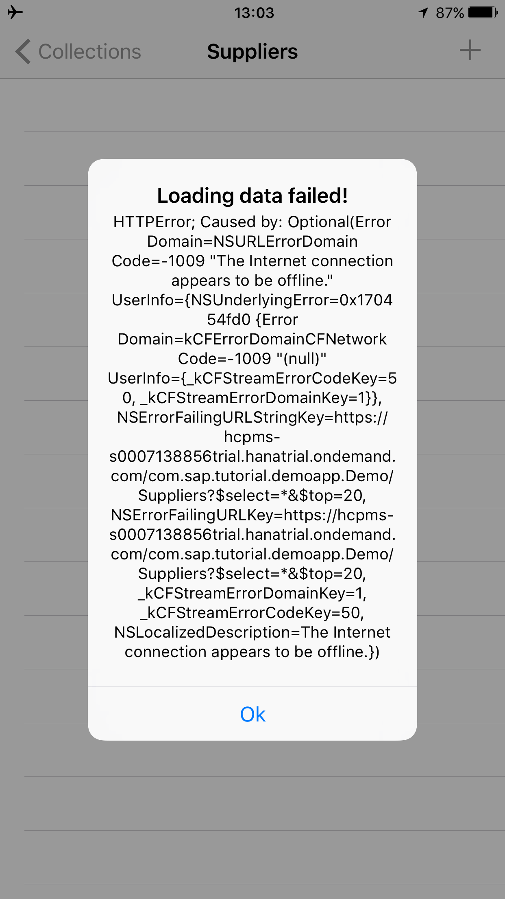
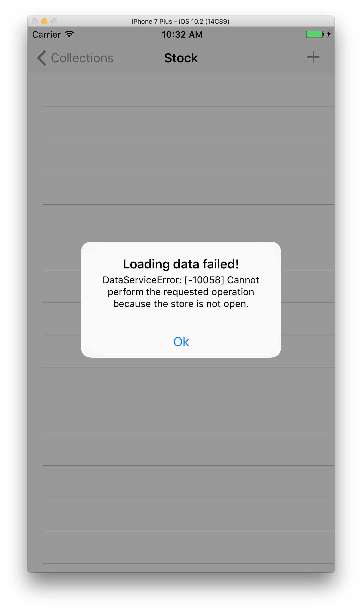
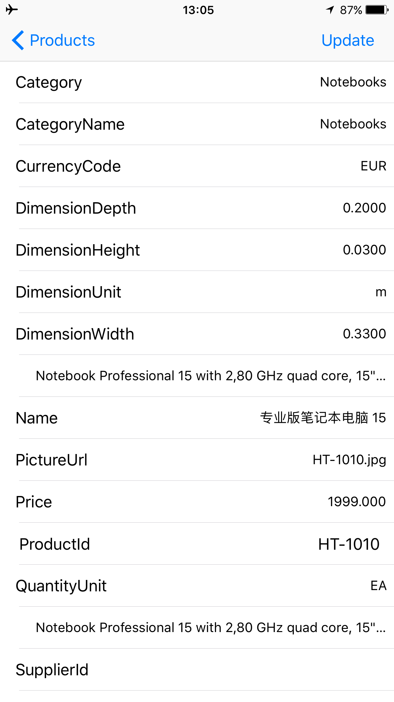

## Prerequisites  
 - **Proficiency:** Intermediate
 - **Development environment:** Apple iMac, MacBook or MacBook Pro running Xcode 9 or higher
 - **SAP Cloud Platform SDK for iOS:** Version 2.0
 - **Tutorials:** [Offline OData - Configuration](https://www.sap.com/developer/tutorials/fiori-ios-hcpms-offline-odata-config.html)

## Next Steps
 - [Offline OData - Error handling](https://www.sap.com/developer/tutorials/fiori-ios-hcpms-offline-odata-errorhandling.html)

## Details
### You will learn  
In this tutorial, you will implement the coding for use with offline OData into your application, and use the SAP Cloud Platform mobile service for development and operations offline configuration settings.

### Time to Complete
**15 Min**.

---

In the previous tutorial, you have finalized the offline configuration in SAP Cloud Platform mobile service for development and operations. In this tutorial, you will implement the necessary coding so your application can use OData while offline.

If you now switch on Airplane mode, and try opening a collection from the app, you will see a message similar to this:



After you have followed the implementation below, your application should now work offline as well.

[ACCORDION-BEGIN [Step 1: ](Add import statement)]

Now, you need to change the **Online** behavior to **Offline** usage. Open the `ESPMContainerDataAccess.swift` file under `Demo > Model`.

Add the import declaration for `SAPOfflineOData` just below the already existing `SAPOData` import declaration:

```swift
// other imports
import SAPOfflineOData

class ESPMContainerDataAccess {
    // code
}
```


[ACCORDION-END]

[ACCORDION-BEGIN [Step 2: ](Change Service Declaration to Offline)]

Since the data service is used offline, you need to change the service declaration for offline usage. In order to do so, change the type of the `ESPMContainer` variable `service` to `OfflineODataProvider`:

```swift
var service: ESPMContainer<OfflineODataProvider>
```


[ACCORDION-END]

[ACCORDION-BEGIN [Step 3: ](Add Offline OData Provider)]

To instantiate the above service, an offline OData provider is needed. Below the field `service`, add a field `offlineODataProvider` of type `OfflineODataProvider`:

```swift
var offlineODataProvider: OfflineODataProvider
```


[ACCORDION-END]

[ACCORDION-BEGIN [Step 4: ](Change initializer)]

Replace the `init()` initializer with the following:

```swift
init(urlSession: SAPURLSession) {
    var offlineParameters = OfflineODataParameters()

    offlineParameters.storeName = "OFFLINE_STORE"
    offlineParameters.enableRepeatableRequests = true

    // create offline data provider
    self.offlineODataProvider = try! OfflineODataProvider(
        serviceRoot: Constants.appUrl,
        parameters: offlineParameters,
        sapURLSession: urlSession
    )

    // define offline defining query
    try! self.offlineODataProvider.add(
        definingQuery: OfflineODataDefiningQuery(
            name: CollectionType.products.rawValue,
            query: "/\(CollectionType.products.rawValue)?$top=5",
            automaticallyRetrievesStreams: false
        )
    )

    self.service = ESPMContainer(provider: self.offlineODataProvider)
}
```

> To initialize the offline OData provider, you first set up an instance of `OfflineODataParameters`. With this instance, you set the custom header, provide a name and path for the offline store, and ensure an OData request is applied only once in case of multiple executions.

> Then, a reference to the offline data provider is set to the field `offlineODataProvider`.

> The line which defines the offline defining query is used for the `Products` defining query you created in the previous tutorial.

> Finally, the `service` field is set to reference the `ESPMContainer` based on the offline data provider.


[ACCORDION-END]

[ACCORDION-BEGIN [Step 5: ](Build and run the application)]

Try to build and run the app. If all goes well, the build will succeed and you will be asked to enter your SAP Cloud Platform mobile service for development and operations login credentials at the authentication screen. Once logged in, click on any of the entities to show the master data. Most likely you will receive the following response:



This error is shown because in order to perform any operations in the offline OData store, you first need to open it. And after you have performed the operation, you need to close the store again.


[ACCORDION-END]

[ACCORDION-BEGIN [Step 6: ](Maintain State of the Offline Store)]

First, we add a new field which holds the state of the store, whether it's open or not. Open class `ESPMContainerDataAccess`, and locate the line `var service: ESPMContainer<OfflineODataProvider>` you wrote at step 5. Just below it, add the following boolean field:

```swift
var isStoreOpened = false
```


[ACCORDION-END]

[ACCORDION-BEGIN [Step 7: ](Change request methods for offline usage)]

Locate the `executeRequest<T>` method which returns an array `[T]`, and replace its implementation with the following:

```swift
private func executeRequest<T>(_ request: @escaping(DataQuery) throws -> [T],
                                 completionHandler: @escaping([T]?, Error?) -> Void) {
    DispatchQueue.global().async {

        if (!self.isStoreOpened) {

            // try opening the store
            self.service.open { error in
                guard error == nil else {
                    self.logger.error("Offline store could not be opened", error: error)
                    return;
                }

                // set flag indicating store is open
                self.isStoreOpened = true

                // download data
                self.service.download { error in
                    guard error == nil else {
                        // in case of error, close store and reset flag
                        self.logger.info("Could not download store", error: error)
                        self.close()
                        self.isStoreOpened = false
                        return
                    }

                    let query = DataQuery().selectAll().top(20)

                    do {
                        // perform query
                        let result = try request(query)
                        completionHandler(result, nil)
                    } catch let error {
                        self.logger.info("Error happened in the downloading process. Error: \(error)")
                        completionHandler(nil, error)
                    }

                    // once finished, close store and reset flag
                    self.close()
                    self.isStoreOpened = false
                }
            }
        }
    }
}
```

> The code above looks a bit more complex compared to the original implementation of the method. This is because the `executeRequest` method now also takes care of the opening of the store, downloading of the store and closing the store, each with their error handlers and fallbacks.

> In addition, a method or function generally should perform only one single task (the "single responsibility" principle, the first and most important principle of the SOLID object-oriented design guidelines), in this case, execute the request. But to get a better understanding of the flow of the code, it is chosen to combine the above multiple responsibilities into one method.


[ACCORDION-END]

[ACCORDION-BEGIN [Step 8: ](Build and run the application again)]

Deploy your application to your iOS device, and once loaded, log on to it.


[ACCORDION-END]

[ACCORDION-BEGIN [Step 9: ](Run the application in offline mode)]

Switch on Airplane mode, and try open a collection and an entity. It should work without errors:




[ACCORDION-END]

## Next Steps
- [Offline OData - Error handling](https://www.sap.com/developer/tutorials/fiori-ios-hcpms-offline-odata-errorhandling.html)
