## Prerequisites  
- **Development environment:** Apple Mac running macOS Catalina or higher with Xcode 11 or higher
- **SAP BTP SDK for iOS:** Version 5.0 or higher
- [Set Up the SAP BTP SDK for iOS](group.ios-sdk-setup)
- **Apple ID:** A paid Apple developer account is required

## Details
### You will learn  
- How to setup your Xcode project and SAP Mobile Services to send/receive notifications.

---

You can use the Apple push notification Service to propagate information from the backend to the device. In this tutorial you use the native iOS push services to enable APNS for your iOS app. To enable your app for push notifications, you need to carry out the following tasks:

*  Create an App ID (automated)
*  Create provisioning profile (automated)
*  Create CSR (Certificate Signing Request) file
*  Create a CER file
*  Install the CER file and create a p12 file
*  Update your application to use push notifications
*  Configure APNS in SAP BTP cockpit

> In order to implement push notifications, a paid Apple developer account is required. Students or other developers with a personal Apple ID for their team will not be able to use push notifications, because they won't have access to the Developer Portal to generate the required certificate.

[ACCORDION-BEGIN [Step 1: ](Use Xcode to create an App ID and Provisioning Profile)]

The App ID is used to identify your app and ensures the Apple push notification Servers will properly send push notifications to your app. The Provisioning Profile will be used to sign your app later on.

With the help of Xcode we don't have to do much manually to create those two things.
Open up your Tutorial Sample App project in Xcode.

We make sure everything is set up correctly.

1. First let's see if the project is configured correctly. Click on the `.xcodeproj` file to open the project configuration of your app. Make sure you are on the **General** tab.

    

    Make sure your **Bundle Identifier** is correct in the **Identify** section.

2. Switch to the **signing & Capabilities** tab to make sure **Automatically manage signing** is activated and you chose the correct **Signing Certificate** & **Team**.

    

3. Next we make sure the app uses the push notification capability. For that click on the **+ Capability** button and enable **Push Notifications**.

    

    You should see the **Push Notifications** capability show up in the capability list for your project.

    

    Our App Project is now configured.

[DONE]
[ACCORDION-END]

[ACCORDION-BEGIN [Step 2: ](Create the Certificate Signing Request file)]

In order to use the **Apple Push Notification service**, we need to create a **CSR file**.

1. On your Mac, open the **Keychain Access** application, and navigate to **Keychain Access > Certificate Assistant > Request a Certificate From a Certificate Authority...**

    

2. Click on **Continue**.

    

3. Click on **Done**.

    The certificate is now saved to you hard drive and added to your Keychain as well as a public and private.

[DONE]
[ACCORDION-END]

[ACCORDION-BEGIN [Step 3: ](Create .CER file in your Apple Developer Account)]

1. Go to your [Apple Developer Account](https://developer.apple.com) and click on **Certificates, IDs & Profiles**.

    

2. From there click on **Identifiers** to get the list of all your apps.

    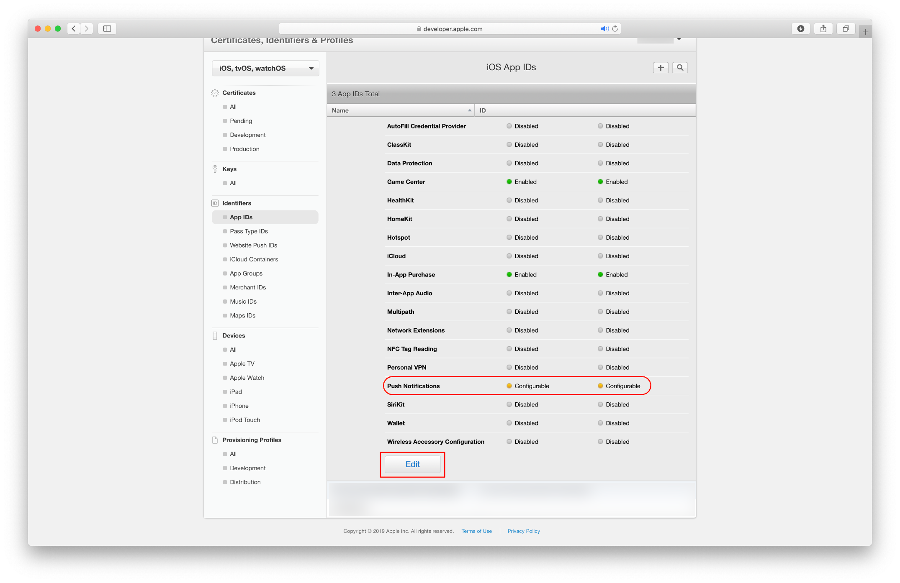

3. Now locate the `com.sap.example.TutorialApp`. Click on it to see the details.

    > If by any chance you've used a different App name or/and bundle identifier, select that one in the list.

    > If in any case you can't see your app listed here please go ahead and follow the creation process of an App ID with the **Plus** icon. Make sure the app name and identifier are the same as your Xcode project.

    

4. In the upcoming detail screen please scroll down until you see the **Push Notifications** in the list.

    You can see Xcode also made sure that **Push Notifications** is enabled for your app. Now you have to configure this app feature.

5. Click on **Configure**.

    

6. Click on **Create Certificate** to start the workflow for creating the needed `.CER` file.

    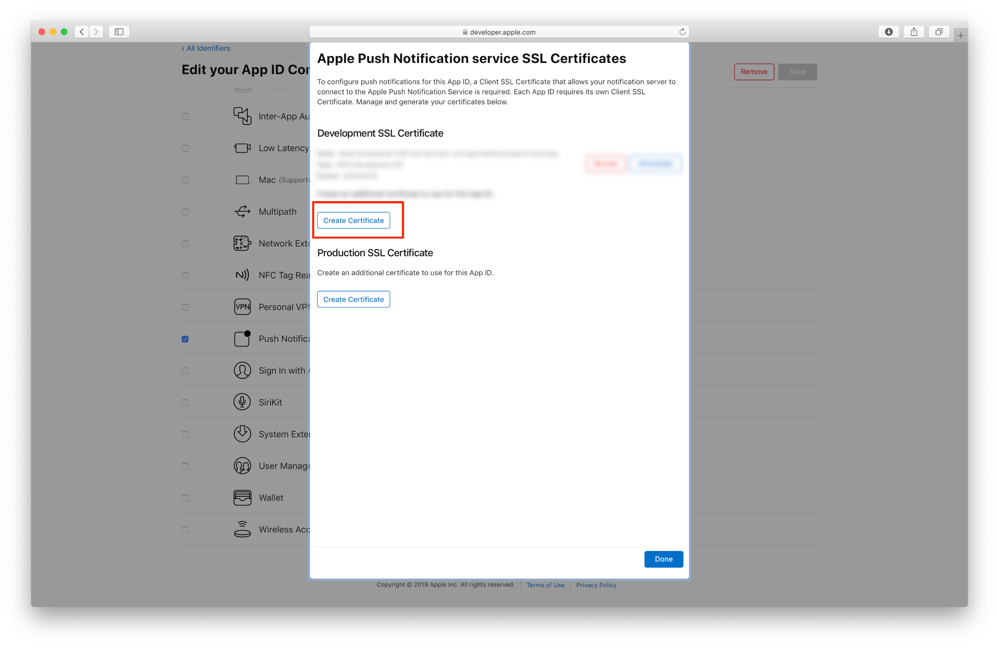

7. The workflow asks you to upload the previously created `CSR` file. Please click on **Choose File** to upload the file. To download your `CER` please click on **Continue**.

    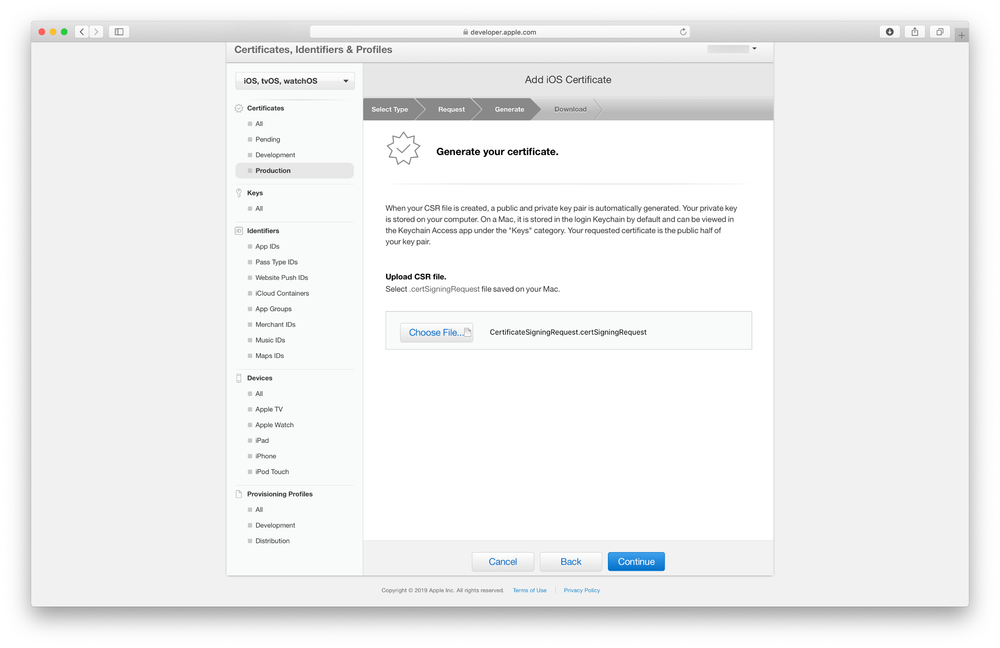

    Apple will now create a `.CER` file for you which is issued by the **Apple Worldwide Developer Relations Certification Authority**.

8. Click on the **Download** button to download your certificate.

    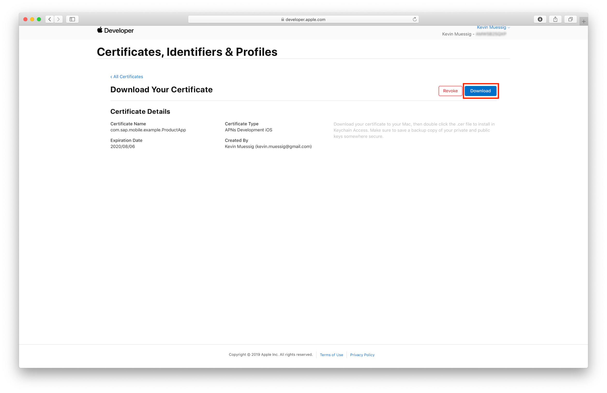

9. If you go back to the certificates list, you should see the just created certificate listed.

    

[DONE]
[ACCORDION-END]

[ACCORDION-BEGIN [Step 4: ](Install the .CER file and create the .p12 file)]

In order to configure the `APNS` on **SAP Mobile Services** we need to install the `.CER` file and create the needed `.p12` file.

> A `.p12` file is a encrypted container for the certificate and private key. This file is needed by Mobile Services for the `APNS` configuration.

1. Locate your downloaded **`.CER`** file and double click on it in order to install the certificate.

    > In case the **Add Certificate** dialog pops up make sure to choose **Login** from the dropdown and click on **Add**.

    If the certificate is added correctly to the Keychain you should see it in the `My Certificates` section, make sure you selected **login** as keychain.

    

2. Select the certificate ctrl-click to export those two items.

    

    Make sure that in the dropdown **Personal Information Exchange (.p12)** is selected and click on **Save**. You will be prompted to enter a password, please do that and click on **OK** to export the files.

    > While you have the option to leave the password empty, you must provide a password when configuring the certificate for use with SAP Mobile Services.

[DONE]
[ACCORDION-END]

[ACCORDION-BEGIN [Step 5: ](Add the Mobile Push Notification feature to your app)]

The Assistant automatically generates the necessary code for receiving and handling push notifications in your app but how do you actually send a notification to your users? - Using the **Mobile Push Notification** feature available on SAP Mobile Services.

1. Open your SAP Mobile Services instance on SAP BTP and navigate to the **Features** menu.

    

2. Locate the **Mobile Push Notification** feature tile and click on **Add to Application**.

    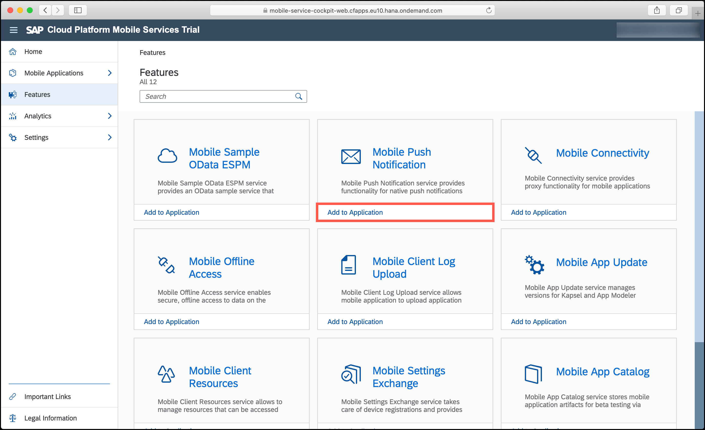

3. In the upcoming window, select your app and click on **OK**.

    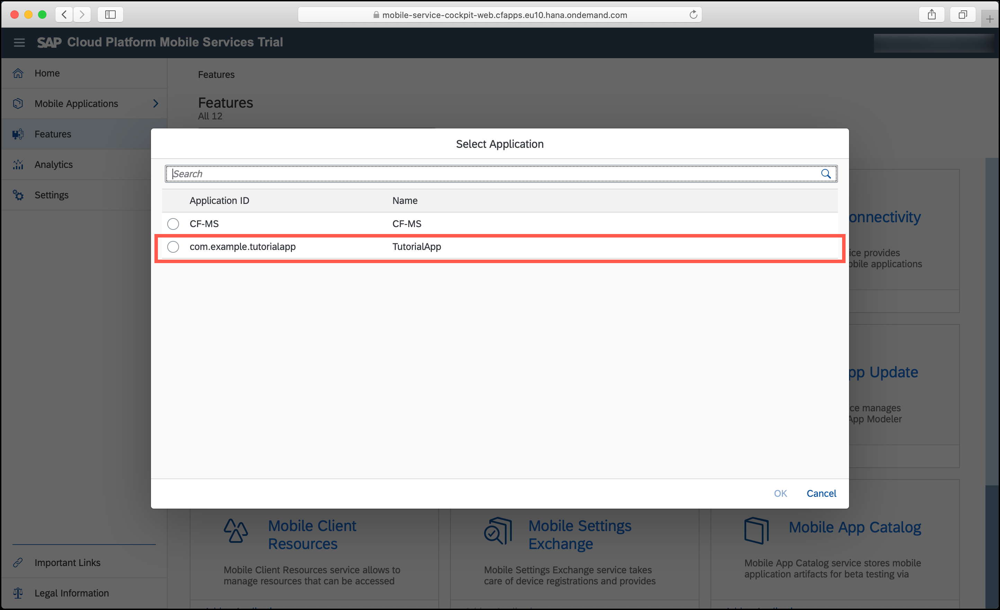

    Mobile Services will now add that feature to your mobile application.

    After the process is completed the **Mobile Push Notification** screen should appear. Here you can configure all sort of different push server, see all registered users and maintain Service Keys.

4. To send push notifications to an iOS app it is necessary to have an APNS Endpoint configured. Fortunately with the help of Mobile Services this is done for you.

    Choose **Sandbox** as **APNS Endpoint**, **Browse...** for your previously created `.p12` file and enter the given password.

    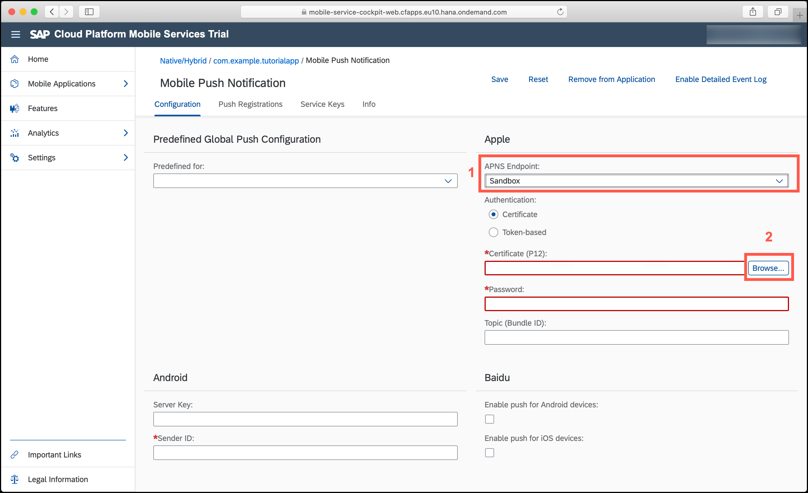

5. Click on **Save**.

    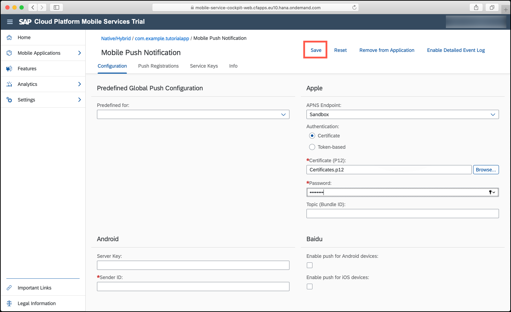

[DONE]
[ACCORDION-END]

[ACCORDION-BEGIN [Step 6: ](Add a new Service Key to the Mobile Push Notification feature)]

1. In Mobile Service click on **Service Keys** and click on the **+** to create a new key for your application.

    

2. In the upcoming dialog give the Service Key an **Alias** and add the following **Roles**:

    - `push_multiple`
    - `pushregistrations_read`

    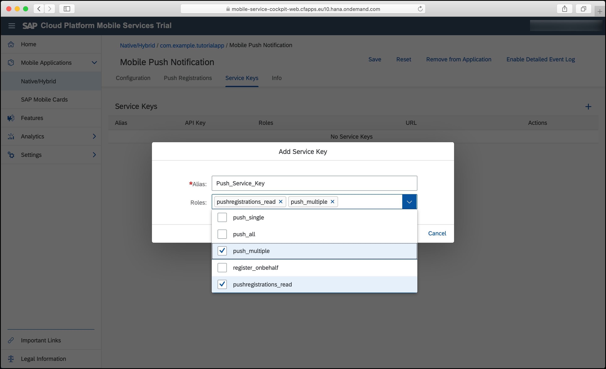

3. Click on **OK** to create the new Service Key.

    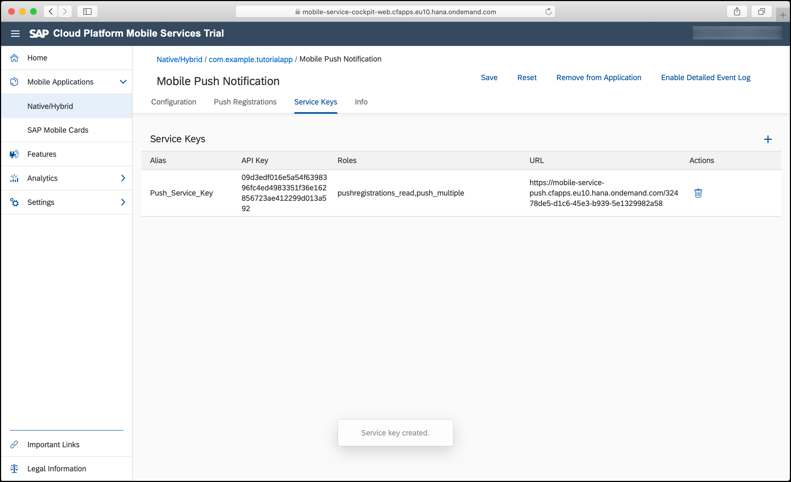

4. Before we save our new Service Key click on **Enable Detailed Event Log** in the top-right corner. Now we get more detailed event logs in Mobile Services.

    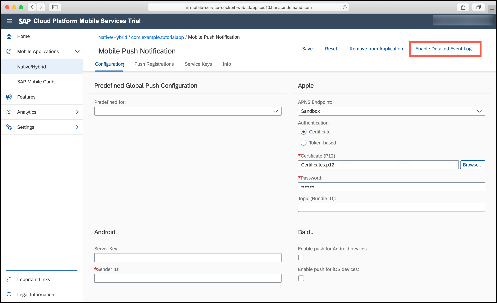

5. Click on **Save**.

[DONE]
[ACCORDION-END]

[ACCORDION-BEGIN [Step 7: ](Examine your application's Push Notifications code)]

1. The generated code will have all push notifications code in the `AppDelegate.swift` file.
    Open the `AppDelegate.swift` file to inspect the notifications code.

    First, the device registers for remote notifications by calling the method `registerForRemoteNotifications(:)`. Then, you have specified the types of notifications your app will support, as well as added a reference to the notification settings class, which enables your application for the push notifications to be received. This will result in your application to display the **"App Name" Would Like to Send You Notifications** confirmation dialog.

    Let's look at the `initializeRemoteNotification(:)` method. This method will take care of registering the app for receiving remote notifications and it will trigger the authorization request.

    ```swift
    func initializeRemoteNotification() {
       // Registering for remote notifications
       UIApplication.shared.registerForRemoteNotifications()
       let center = UNUserNotificationCenter.current()
       center.requestAuthorization(options: [.alert, .badge, .sound]) { _, _ in
           // Enable or disable features based on authorization.
       }
       center.delegate = self
    }

    ```

    The `uploadDeviceTokenForRemoteNotification(_:Data)` will take care of uploading the app's device token to the SAP Mobile Services.

    ```swift
    func uploadDeviceTokenForRemoteNotification(_ deviceToken: Data) {
           guard let session = sessionManager.onboardingSession else {
               // Onboarding not yet performed
               return
           }
           let parameters = SAPcpmsRemoteNotificationParameters(deviceType: "iOS")
           session.registerDeviceToken(deviceToken: deviceToken, withParameters: parameters) { error in
               if let error = error {
                   self.logger.error("Register DeviceToken failed", error: error)
                   return
               }
               self.logger.info("Register DeviceToken succeeded")
           }
       }

    ```

    The next methods located under the **`AppDelegate` method implementations for remote notification handling** mark, are delegate methods for all remote notification handling.

    ```swift
    func application(_: UIApplication, didRegisterForRemoteNotificationsWithDeviceToken deviceToken: Data) {
            self.uploadDeviceTokenForRemoteNotification(deviceToken)
        }

    func application(_: UIApplication, didFailToRegisterForRemoteNotificationsWithError error: Error) {
        self.logger.error("Failed to register for Remote Notification", error: error)
    }

    // Called to let your app know which action was selected by the user for a given notification.
    func userNotificationCenter(_: UNUserNotificationCenter, didReceive response: UNNotificationResponse, withCompletionHandler completionHandler: @escaping () -> Void) {
        self.logger.info("App opened via user selecting notification: \(response.notification.request.content.body)")
        // Here is where you want to take action to handle the notification, maybe navigate the user to a given screen.
        completionHandler()
    }

    // Called when a notification is delivered to a foreground app.
    func userNotificationCenter(_: UNUserNotificationCenter, willPresent notification: UNNotification, withCompletionHandler completionHandler: @escaping (UNNotificationPresentationOptions) -> Void) {
        self.logger.info("Remote Notification arrived while app was in foreground: \(notification.request.content.body)")
        // Currently we are presenting the notification alert as the application were in the background.
        // If you have handled the notification and do not want to display an alert, call the completionHandler with empty options: completionHandler([])
        completionHandler([.alert, .sound])
    }

    ```

2. If you now run the app on your physical device you have to first walk through the onboarding process to see the main screen of your app.

    You will notice the app will ask permission to receive push notifications:

    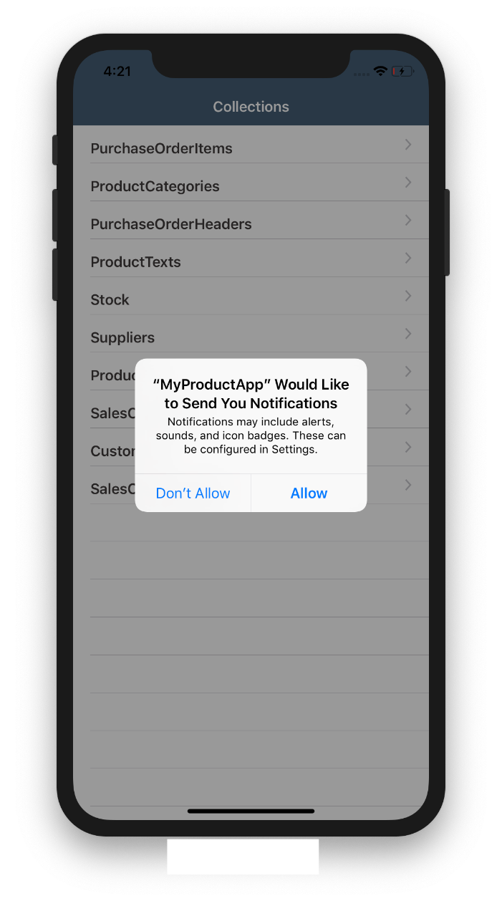

3. Click on **Allow**.

    If you look at the log outputs in Xcode you will notice that all the `registerDeviceToken(_:withParameters:completionHandler:)` got called and registered your phone's device token.

    ```Swift
    2020-02-11 12:59:05.643632-0800 TutorialApp[27153:3287930] [general] # SAP.Foundation.RemoteNotificationClient.RemoteNotificationClient - INFO - (0x283415f00) - SAPcpmsRemoteNotificationClient.swift.registerDeviceToken(_:withParameters:completionHandler:) - Device token registration was successful
    adDeviceTokenForRemoteNotification(_:) - Register DeviceToken succeeded

    ```

[VALIDATE_7]
[ACCORDION-END]

[ACCORDION-BEGIN [Step 8: ](Send push notifications to your phone)]

It is time now to send the first push notification from the **SAP Mobile Services** push notification feature.

1. Please login to your Mobile Services account and you will notice you can see your device being registered in the **Event Logs Today (UTC-0800)** section.

    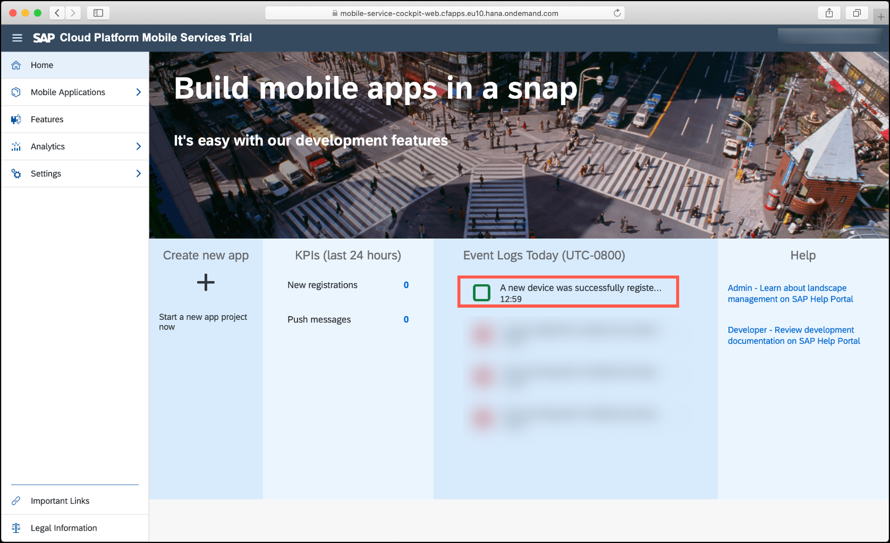

2. Click on **Mobile Applications**, and then **Native/Hybrid** to get an overview of your existing apps.

3. Select your app and then click on **Mobile Push Notification** under the **Assigned Features** section.

4. Click on the **Push Registrations (1)** tab to see all the registered users. Right now the number should be one, and the one is your device.

    > NOTE: In case that you walked through the onboarding process from different devices, you will have multiple **Device IDs**.

5. Click on **Send Notification**.

    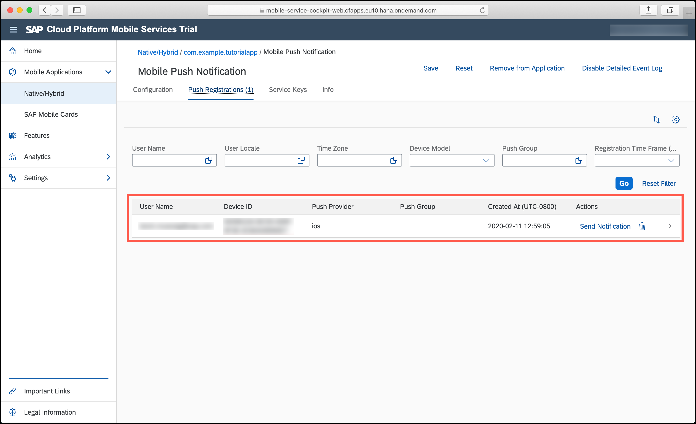


6. In the upcoming dialog you can now send a **Message** directly to your device.

    Enter a message and click **Send**. The message should now be send to your device and displayed as notification.

    

    > If you happen to have an Apple Watch, and have it configured to display push notifications received on your iPhone, the push notification you have sent via Mobile Services will also be displayed on your Apple Watch.

[DONE]
[ACCORDION-END]

[ACCORDION-BEGIN [Step 9: ](Quick Look on the Advanced Option for Sending Push Notifications)]

When you send a push notification over Mobile Services you can send it in a **General** way and in an **Advanced** one.

The advanced option will provide you with the `JSON` payload of the notification you're about to send. This will give you more freedom on how the notification is going to be constructed.

You can set icons, sound, change the title as well as the body message you want to send. For more information about push notification payloads, please take a look at the official documentation [Generating a Remote Notification](https://developer.apple.com/documentation/usernotifications/setting_up_a_remote_notification_server/generating_a_remote_notification).

Congratulations you successfully setup your app, Mobile Services and send/received a push notification.

[DONE]
[ACCORDION-END]
