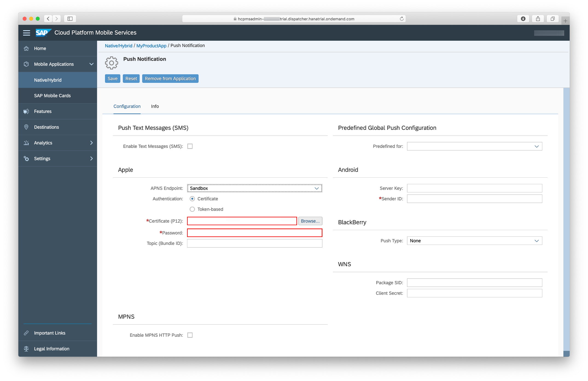
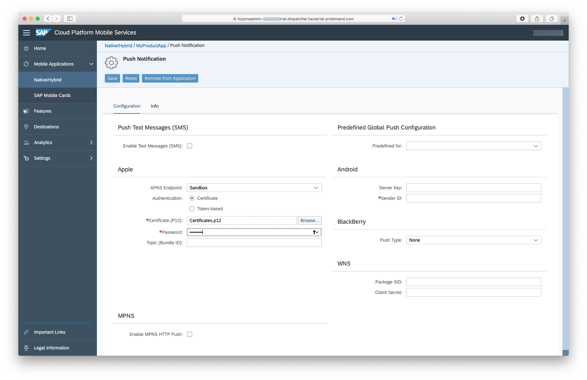
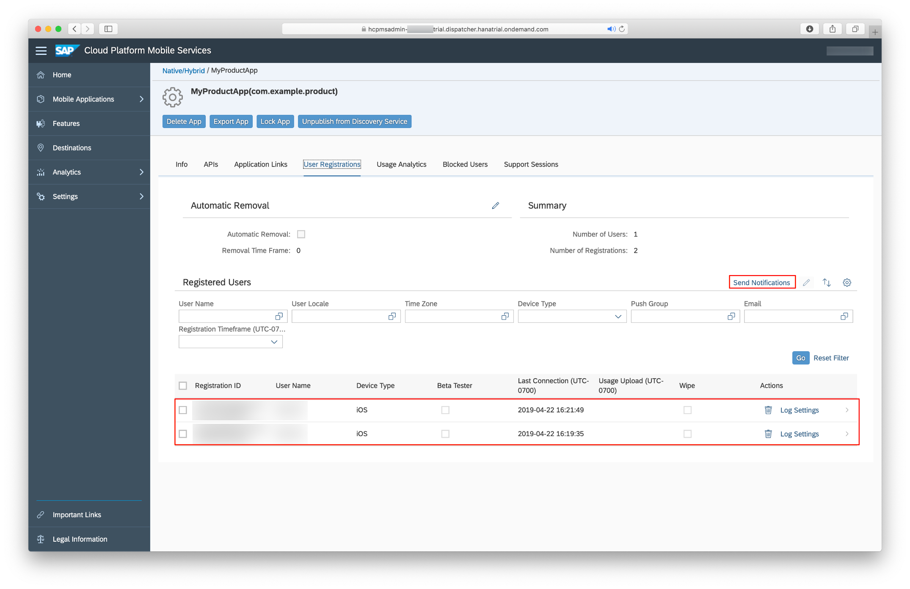

## Prerequisites  
 - **Proficiency:** Intermediate
 - **Development environment:** Apple iMac, MacBook or MacBook Pro running Xcode 10 or higher
 - **SAP Cloud Platform SDK for iOS:** Version 3.0 SP01
 - **Apple ID:** A paid Apple developer account is required
 - **Completed** [Set Up the SAP Cloud Platform SDK for iOS](http://developers.sap.com/group.ios-sdk-setup.html)

## Details
### You will learn  
In this tutorial you will learn how to setup Push Notifications on SAP Cloud Platform Mobile Service and Apple Developer account.

### Time to Complete
**30 Min**.

---

You can use the Apple Push Notification Service to propagate information from the backend to the device. In this tutorial you use the native iOS push services to enable APNS for your iOS app. To enable your app for push notifications, you need to carry out the following tasks:

*  Create an App ID (automated)
*  Create provisioning profile (automated)
*  Create CSR (Certificate Signing Request) file
*  Create a CER file
*  Install the CER file and create a p12 file
*  Update your application to use Push Notifications
*  Configure APNS in SAP Cloud Platform cockpit

> In order to implement Push Notifications, a paid Apple developer account is required. Students or other developers with a personal Apple ID for their team will not be able to use push notifications, because they won't have access to the Developer Portal to generate the required certificate.

[ACCORDION-BEGIN [Step 1: ](Use Xcode to create an App ID and Provisioning Profile)]

The App ID is used to identify your app and ensures the Apple Push Notification Servers will properly send push notifications to your app. The Provisioning Profile will be used to sign you app later on.

With the help of Xcode we don't have to do much manually to create those two things.
Open up your Product Sample App project in Xcode.

We make sure everything is set up correctly. First let's see if the project is configured correctly. Click on the `xcodeproj` file to open the project configuration of your app. Make sure you are on the **General** tab.


Make sure your **Bundle Identifier** is correct in the **Identify** section. Check if **Automatically manage signing** is activated and you chose the correct **Signing Certificate** in the **Signing** section.

Next we make sure the app uses the Push Notification capability. For that click on the **Capabilities** tab and enable **Push Notifications**. If two grey check marks appear in the section then the enablement was successful.


Our App Project is now configured.

[DONE]
[ACCORDION-END]

[ACCORDION-BEGIN [Step 2: ](Create the Certificate Signing Request file)]

In order to use the **Apple Push Notification service**, we need to create a **CSR file**.

On your Mac, open the **Keychain Access** application, and navigate to **Keychain Access > Certificate Assistant > Request a Certificate From a Certificate Authority...**


In the dialog, enter the email address you use which is associated with your Apple Developer account. Also, make sure you tick the **Request is saved to disk** and the **Let me specify key pair information** option.


Click **Continue**.

Choose a folder to store the certificate -- it is good practice to store generated files in a separate folder for each project -- and click **Save**.

Once you see a dialog saying the certificate is saved successfully, click **Done** to finish.


The certificate is now saved to you hard drive and added to your Keychain as well as a public and private.


[DONE]
[ACCORDION-END]

[ACCORDION-BEGIN [Step 3: ](Create .CER file in your Apple Developer Account)]

Go to your [Apple Developer Account](https://developer.apple.com) and click on **App IDs**. Your app should appear here because we made sure Xcode will take care of adding an App ID to your profile.

> If in any case you can't see your app listed here please go ahead and follow the creation process of an App ID with the **Plus** icon. Make sure the app name and identifier are the same as your Xcode project.


Select your app from the list to expand the view to see more information.


YOu can see Xcode also made sure that **Push Notifications** are enabled for your app. Now you have to configure this app feature. Click on **Edit**.


Click on **Create Certificate** to start the workflow for creating the needed `.CER` file.


Click on **Continue** after you read the information provided by Apple.


Now click on **Choose** to upload the previously created `CSR` file. This will create a `.CER` file for you which is issued by the **Apple Worldwide Developer Relations Certification Authority**.


Now click on **Continue** to download your certificate.


Click on the **Download** button to download your certificate.
Click **Done** to see the overview of all your Certificates.


Under the **Certificates** section you can see the just created certificate.


If you go back to you App ID and select the app you will see that under **Push Notifications** we enabled the service.

[DONE]
[ACCORDION-END]

[ACCORDION-BEGIN [Step 4: ](Install the .CER file and create the .p12 file)]

In order to configure the `APNS` on **SAP Cloud Platform Mobile Services** we need to install the `.CER` file and create the needed `.p12` file.

Locate your downloaded `.CER` file and double click on it in order to install the certificate.

> In case the **Add Certificate** dialog pops up make sure to choose **Login** from the dropdown and click on **Add**.

If the certificate is added correctly to the Keychain you should see it in the `MyCertificates` section, make sure you selected **login** as keychain.


Select the certificate as well as the private key and right-click to export those two items.


Make sure in the dropdown **Personal Information Exchange (.p12)** is selected and click on **Save**. You will be prompted to enter a password, click on **OK** to export the files.

> While you have the option to leave the password empty, you must provide a password when configuring the certificate for use with SAP Cloud Platform mobile service for development and operations.


[DONE]
[ACCORDION-END]

[ACCORDION-BEGIN [Step 5: ](Assign Notification User Role to your Cloud Platform account)]

To later send push notifications to your app it is necessary to assign yourself to the **Notification User** role.

Open up the [SAP Cloud Platform Cockpit](http://hanatrial.ondemand.com/) and select **Neo Trial** to go to the Neo landscape.


Assign your user the **Notification User** role


After you have assigned the role, navigate back to to **Development & Operations** and click **Go to Service** to open **SAP Cloud Platform mobile service for development and operations**

Navigate to **Applications**, select your application and from the context menu select **Configure** and switch to the **Push** tab.

Scroll down a bit to the **Apple** panel and provide the following details:

| Field | Value |
|----|----|
| APNS Endpoint | Select `Sandbox` |
| Certificate | Browse to the `.p12` certificate you just exported |
| Password | Enter the password you provided during the export |


Next on the right hand side you will see **Roles**. Click to configure additional roles.


Now look for the **Notification User** and select it. At the bottom you can now click on **Assign** to assign a new user to that role.


In the popup, please enter your P- or S-User and click on **Assign**.


You know assigned yourself to the role of **Notification User**. This will allow you to send notifications to your app later on.


[ACCORDION-BEGIN [Step 6: ](Import .p12 file into SAP Cloud Platform Mobile Services)]

In order to have an `APNS` up and running an import of the `.p12` file to SAP Cloud Platform Mobile Services is necessary.

Please login to your Mobile Services account and click on **Mobile Applications** and then **Native/Hybrid** to get an overview of your existing apps. Select the `MyProductApp` to configure the **Push Notification** feature.

> It could be that you named the app differently. If you followed the **Create a Sample App** tutorial mentioned in the prerequisites that is the name used.


On the right-hand side you'll see the **Push Notification** feature listed. Click on it to configure the `APNS`.


On this configuration screen you can configure the needed `APNS`. You also have the option maintain different configurations for different platforms.


In the `APNS` section please select **Sandbox** as `APNS Endpoint`.



For the `Certificate (P12)` field please browse for the previously created `Certificates.p12` file. Enter the password you chose while creating the `Certificates.p12` file.



Click on **Save** at the top. We successfully configured the `APNS Endpoint`, we now have the server side setup.

[DONE]
[ACCORDION-END]

[ACCORDION-BEGIN [Step 7: ](Examine your application's Push Notifications code)]

The generated code will have all push notifications code in the `AppDelegate.swift` file. Open the `AppDelegate.swift` file to inspect the notifications code.

First, the device registers for remote notifications by calling the method `registerForRemoteNotifications(:)`. Then, you have specified the types of notifications your app will support, as well as added a reference to the notification settings class, which enables your application for the push notifications to be received. This will result in your application to display the **"App Name" Would Like to Send You Notifications** confirmation dialog.

Let's look at the `initializeRemoteNotification(:)` method. This method will take care of registering the app for receiving remote notifications and it will trigger the authorization request.

```swift
func initializeRemoteNotification() {
       // Registering for remote notifications
       UIApplication.shared.registerForRemoteNotifications()
       let center = UNUserNotificationCenter.current()
       center.requestAuthorization(options: [.alert, .badge, .sound]) { _, _ in
           // Enable or disable features based on authorization.
       }
       center.delegate = self
   }

```

The `uploadDeviceTokenForRemoteNotification(_:Data)` will take care of uploading the app's device token to the SAP Cloud Platform Mobile Services.

```swift
 func uploadDeviceTokenForRemoteNotification(_ deviceToken: Data) {
     guard let session = sessionManager.onboardingSession else {
         // Onboarding not yet performed
         return
     }
     let parameters = SAPcpmsRemoteNotificationParameters(deviceType: "iOS")
     session.registerDeviceToken(deviceToken: deviceToken, withParameters: parameters) { error in
         if let error = error {
             self.logger.error("Register DeviceToken failed", error: error)
             return
         }
         self.logger.info("Register DeviceToken succeeded")
     }
 }

```

The next methods located under the **`AppDelegate` method implementations for remote notification handling** mark, are delegate methods for all remote notification handling.

```swift
func application(_: UIApplication, didRegisterForRemoteNotificationsWithDeviceToken deviceToken: Data) {
        self.uploadDeviceTokenForRemoteNotification(deviceToken)
    }

func application(_: UIApplication, didFailToRegisterForRemoteNotificationsWithError error: Error) {
    self.logger.error("Failed to register for Remote Notification", error: error)
}

// Called to let your app know which action was selected by the user for a given notification.
func userNotificationCenter(_: UNUserNotificationCenter, didReceive response: UNNotificationResponse, withCompletionHandler completionHandler: @escaping () -> Void) {
    self.logger.info("App opened via user selecting notification: \(response.notification.request.content.body)")
    // Here is where you want to take action to handle the notification, maybe navigate the user to a given screen.
    completionHandler()
}

// Called when a notification is delivered to a foreground app.
func userNotificationCenter(_: UNUserNotificationCenter, willPresent notification: UNNotification, withCompletionHandler completionHandler: @escaping (UNNotificationPresentationOptions) -> Void) {
    self.logger.info("Remote Notification arrived while app was in foreground: \(notification.request.content.body)")
    // Currently we are presenting the notification alert as the application were in the background.
    // If you have handled the notification and do not want to display an alert, call the completionHandler with empty options: completionHandler([])
    completionHandler([.alert, .sound])
}

```

If you now run the app on your device, you will notice it will first ask permission to display notifications:


Walk through the onboarding process to see the actual app.

It is time now to send the first push notification from the **SAP Cloud Platform Mobile Services** push notification feature.

Please login to your Mobile Services account and click on **Mobile Applications** and then **Native/Hybrid** to get an overview of your existing apps. Select the your app to send a push notification.



In case that you walked through the onboarding process from different devices you will have multiple **Registration IDs** so make sure to select the correct one. Click on **Send Notifications** to send a notification to this device.


You can enter whatever you want and click on **Send** to send the notification to your device.


> If you happen to have an Apple Watch, and have it configured to display push notifications received on your iPhone, the push notification you have sent via SAP Cloud Platform mobile service for development and operations will also be displayed on your Apple Watch.


[VALIDATE_7]
[ACCORDION-END]
