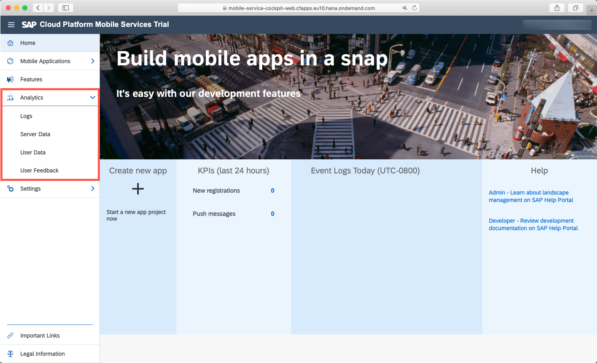
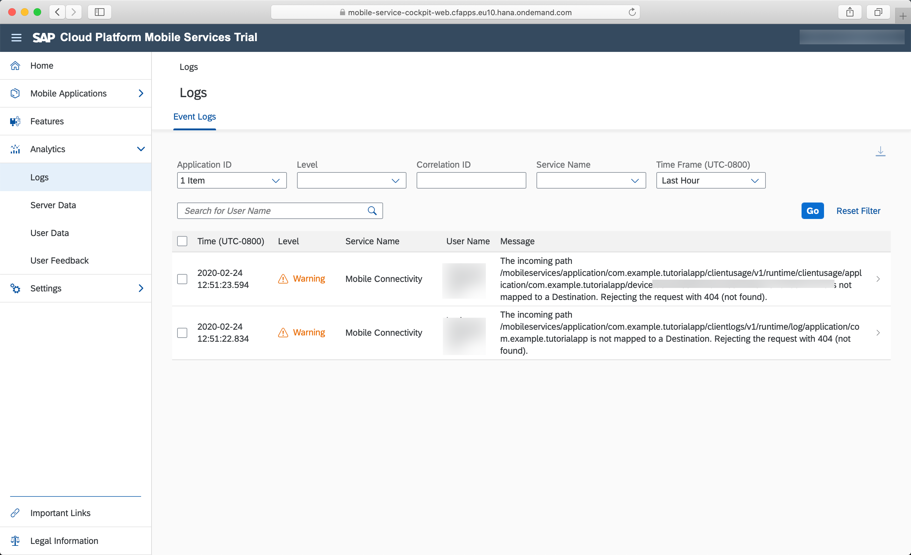
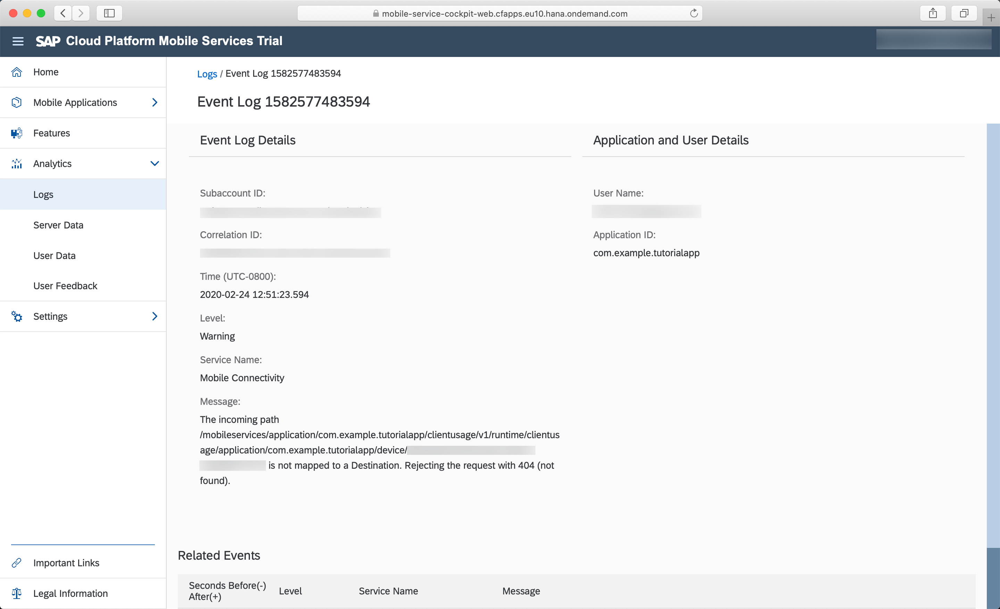
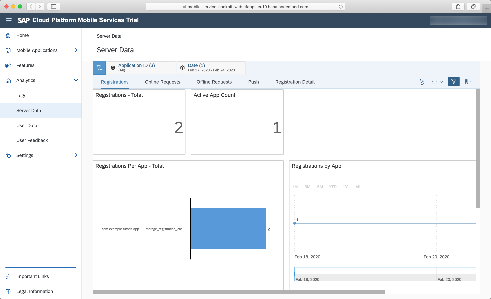
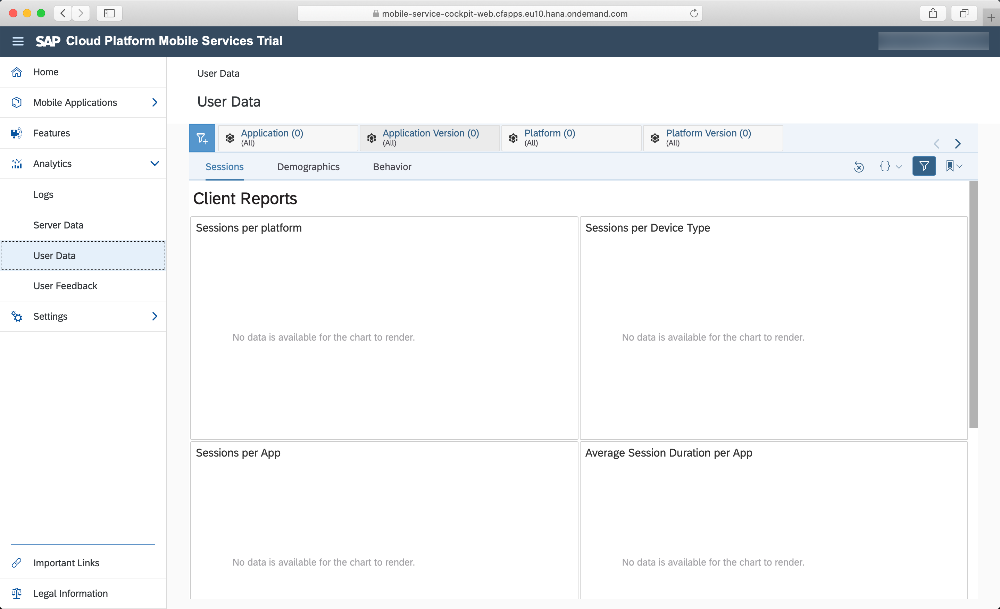
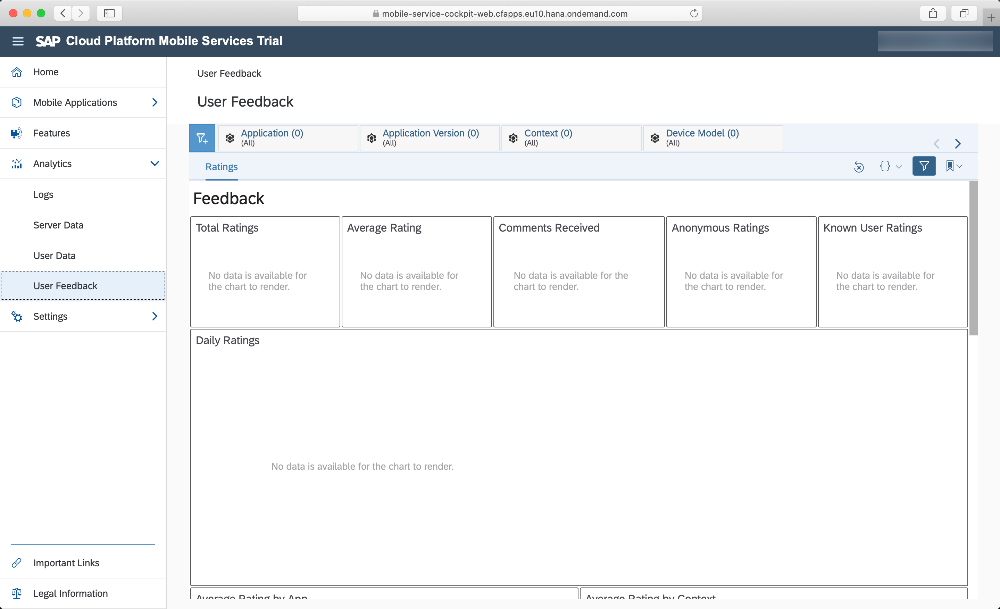

## Prerequisites  

- **Tutorials:** [Get a Free Trial Account on SAP BTP](hcp-create-trial-account) and [Set Up the SAP BTP SDK for iOS](group.ios-sdk-setup)
- **Development environment:** Apple Mac running macOS Catalina or higher with Xcode 11 or higher
- **SAP BTP SDK for iOS:** Version 4.0.10

## Details

### You will learn  

In this tutorial, you will learn the basics of the analytics features on SAP Mobile Services. You can view usage statistics for your iOS apps, information about push notifications, and get reports of server usage. You won't create or configure anything in this tutorial, but rather get familiar of the reporting capabilities.

> Please keep in mind, the screenshots you see here are from a sample app I've created with just a couple of sample users. If you have a productive app with a realistic amount of users the analytics features will have far more data to show. This tutorial will give you a simple overview of the available features and possibilities.

---

[ACCORDION-BEGIN [Step 1: ](The analytics features on SAP Mobile Services)]

Open your SAP Mobile Services instance on SAP BTP. On the left-hand side you can see the **Analytics** category in the side panel.

Mobile Services provides different types of analytical data which are separated like the following:

**Logs**

Logs will give you device log messages during runtime of your app. Those logs can be individually filtered to find very specific logs of a particular user, device or group of users.

**Server Data**

The server data is responsible for tracking user registrations against your system, Online- and Offline requests during runtime of the app, data about sent push notifications and user registration details.

**User Data**

With the user data you have great insight about user sessions which can help you understand how your app is being used, but also demographics and user behavior which give you all the information you need to analyze your app's success.

**User Feedback**

Tracking your app ratings and feedback of your users is crucial for the success of your application. Mobile Services gives you the perfect tooling to track these information.

[DONE]
[ACCORDION-END]

[ACCORDION-BEGIN [Step 2:](Logs)]
The SAP BTP SDK for iOS has it's own logging framework included in the `SAPCommon` framework. With that logging framework you can log crucial information during runtime not only inside the app but you can use the `log uploader` API to directly pass the logs through to Mobile Services.

In Mobile Services your app admins, support staff or developers can directly access the logs specifically for different users, devices or groups of users which enables you to provide better supportability for your app.

You can even see details to each log by clicking on the entry, this will open the log details screen for that specific log message.

[DONE]
[ACCORDION-END]

[ACCORDION-BEGIN [Step 3: ](Server data)]
If you want to have analytical data about backend access requests, user registrations against your system and other important data of your system you can use the server data capabilities of Mobile Service. You can make easy analytical queries to retrieve the information you need.

[DONE]
[ACCORDION-END]

[ACCORDION-BEGIN [Step 4: ](User data)]
All needed information regarding each and every single user using your app and system will be recorded in the user data section of Mobile Services. Use its analytical data to improve your app and make qualified decisions about the demographics of your user base.

[DONE]
[ACCORDION-END]

[ACCORDION-BEGIN [Step 5: ](User feedback)]
Tracking and analyzing feedback of your users is crucial for you to improve your app's user experience. It also gives you the possibility to indirectly interact with your user base.

For more information visit the official documentation [Managing and Monitoring Applications](https://help.sap.com/viewer/468990a67780424a9e66eb096d4345bb/Cloud/en-US/3761042151cc4e8999295dcc561454f2.html)

[VALIDATE_5]
[ACCORDION-END]
