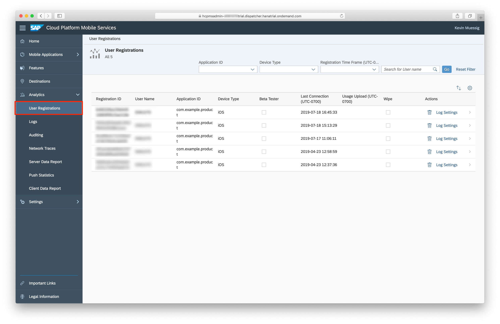
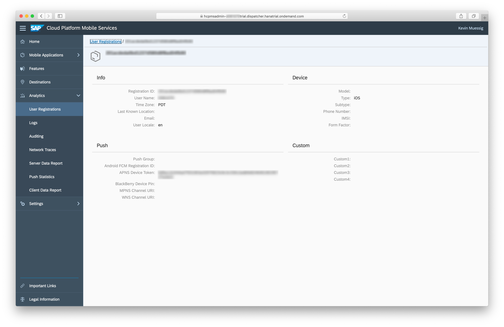
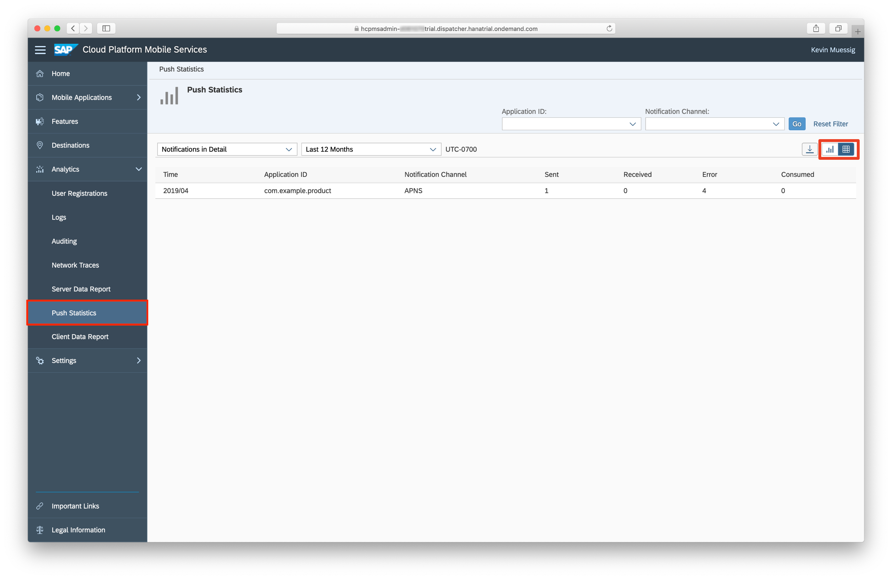
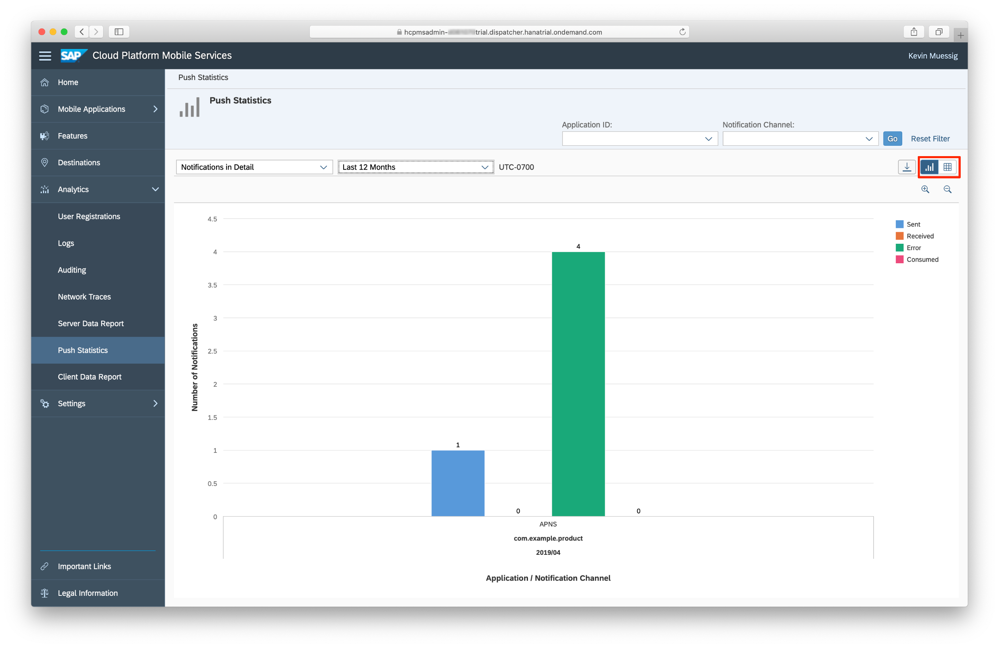
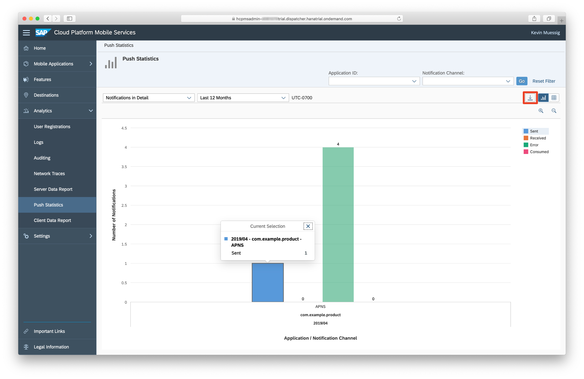
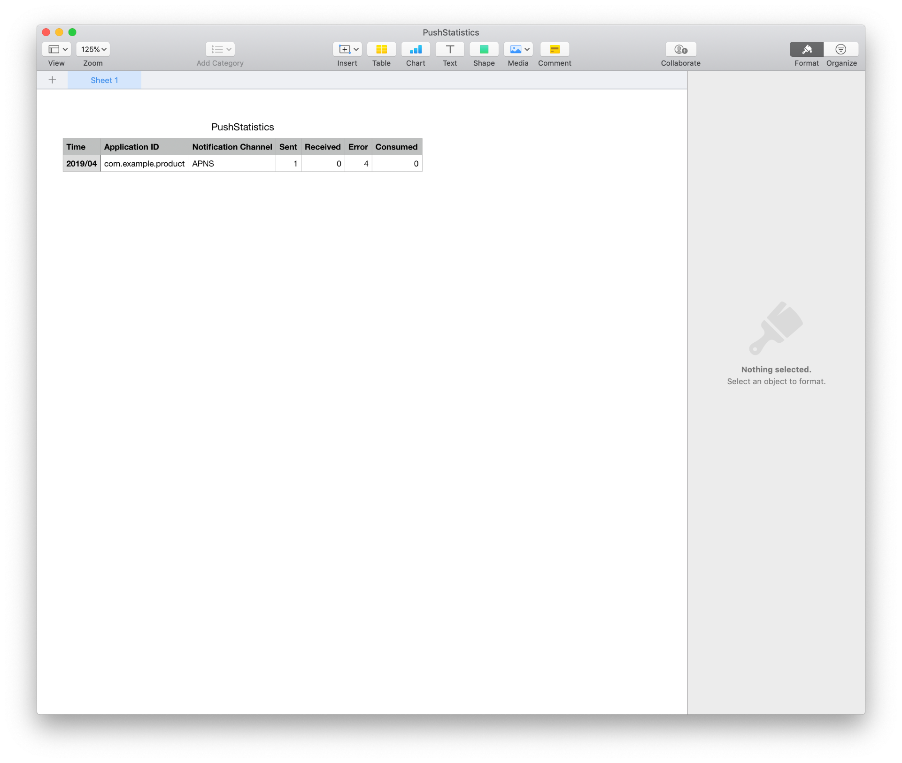
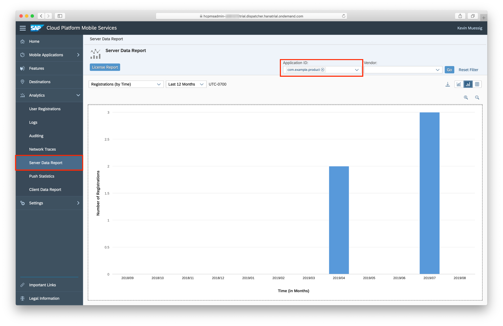
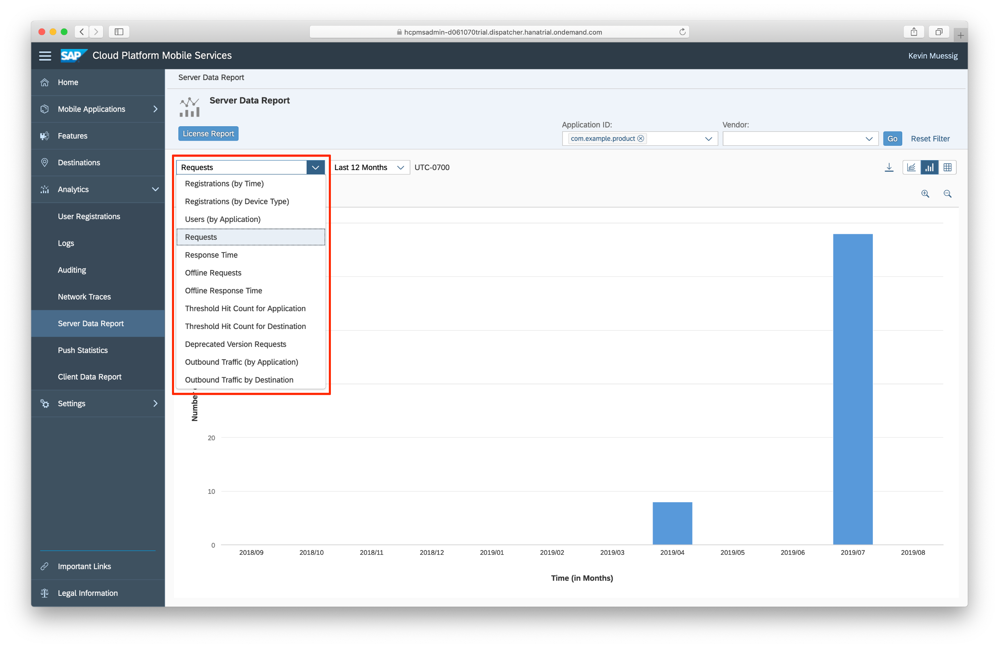

## Prerequisites  
- **Tutorials:** [Get a Free Trial Account on SAP Cloud Platform](https://developers.sap.com/tutorials/hcp-create-trial-account.html) and [Enable SAP Cloud Platform Mobile Services](https://developers.sap.com/tutorials/fiori-ios-hcpms-setup.html)

## Details
### You will learn  
In this tutorial, you will learn the basics of the analytics features on SAP Cloud Platform Mobile Services. You can view usage statistics for your iOS apps, information about Push Notifications, as also get a reports of different information about your used server. You won't create or configure anything in this part, but rather get familiar of the reporting possibilities.

>  Please keep in mind, the screenshots you see here are from a sample app I've created with just a couple of sample users. If you have a productive app with a realistic amount of users the analytics features will have far more data to show. This tutorial will give you a simple overview of the available features and possibilities.
---

[ACCORDION-BEGIN [Step 1: ](Overview of the analytics features on SAP Cloud Platform Mobile Services)]

SAP Cloud Platform Mobile Services provides you all different features which you can use to analyze certain aspects of your distributed app. It also let's you manage users, permission, connectivity and other great features. In this tutorial you will get an introduction to the **User Registrations**, **Push Statistics** and **Server Data Report** features.

To get started please login to your **SAP Cloud Platform Mobile Services** account.
> `https://hcpmsadmin-<P-/S-User>trial.dispatcher.hanatrial.ondemand.com/sap/mobile/admin/ui/index.html#/page.home`

On the left-hand side you can see the **Analytics** category in the side panel.

Under the **Analytics** category you can see all sort of analytics features. The two this tutorial is focusing on is the **User Registrations** and **Push Statistics** features.

With the **User Registrations** you get an overview of all registered users for your distributed app. You can see how many users are registered as also detailed information about each user himself.

The **Push Statistics** will give you an overview of how many notifications have been sent, how many succeeded and failed notifications there've been and it also provides you a statistics representation in a chart or text based view. It also allows you to export those statistics in a `CSV` format.

Using the **Server Data Report** you are able to get information about registrations, requests, response times, offline requests and more. You can also specify the application you want those information for and set a time frame for which you want the data.

[DONE]
[ACCORDION-END]

[ACCORDION-BEGIN [Step 2: ](User Registrations)]

Inside of the **User Registrations** you will find a list of all registered users of your distributed app. This list also displays the following information:

- Registration ID: The registration ID is an ID which is given to each registered user. Registered user means that this specific user has signed into your app and connected to Mobile Services.
- User Name: The user's name with which he registered/ authenticated against Mobile Services over your app.
- Application ID: The application ID is the ID you have given while creating the initial Mobile Services application definition.
- Device Type: The type of device like iOS or Android.
- Beta Tester: With the Beta Tester option you can mark specific users as beta testers for beta versions of your app.
- Last Connection: The last connection timestamp shows you when the user last connected against Mobile Services using your app.
- Wipe: With the wipe option you can mark specific users to wipe their app on device.
- Actions: The actions include a delete and log settings feature. With the delete action you can delete a specific user which includes signing them out of your app. The log settings action lets you configure log specific settings for that user.

If you look in the top you can see all sort of different filter settings. This is really helpful if you have a productive app out there with hundreds or thousands of users. You can filter for different device types, different applications (if you have more then one) or for specific users which makes sense if you got a support ticket from that user.

You can also get more detailed information about certain users, you're interested in. Please click on one of the users if you already have registered users.

Here you can see far more detailed information about that one user. If you have real productive users those details can be really helpful to support your users in case of a ticket or other support request.

[DONE]
[ACCORDION-END]

[ACCORDION-BEGIN [Step 3: ](Push Statistics)]

Another interesting feature is the **Push Statistics** service you can select on the left-hand side. With that you can get detailed information about all the notifications you've sent or tried to send.

In the initial overview you will see the push notification statistics per application. The overview gives you information like:

- Time: The timestamp of the month where you last send notifications to your users.
- Application ID: The application ID is the ID you have given while creating the initial Mobile Services application definition.
- Notification Channel: The notification channel where you've sent the notification. For example in case of iOS you would see `APNS` here.
- Sent: How many notifications you've sent.
- Received: How many of your users actually received those notifications.
- Error: How many failed notifications you've sent.
- Consumed: How many of the successfully sent and received notifications where actually consumed by users.

If you have a lot of data here it might make sense to have them represented in a graphical way. Fortunately Mobile Services let's us switch between a textual and graphical view. You can click the **Chart** icon on the right-hand side to switch to the graphical overview.

You can also click on one of the bars to get a pop-up with additional information.

For reporting purpose Mobile Services allows you to export those statistics in a `CSV` format.

[DONE]
[ACCORDION-END]

[ACCORDION-BEGIN [Step 4: ](Server Data Report)]

With the help of the **Server Data Report** feature you can get server specific information for your applications on Mobile Services.

You can define for which Application ID you want the server reports, also you can define the time frame between **Today** back to the **Last 12 Months**.
In the screenshot you can see the registrations against the server over the last 12 months for the `com.example.product` application. In the dropdown you can choose the data you want to see.

Here you can see the past requests against the server. Also the list of possible data is rich so you can get information about all the data you might need for monitoring your backend and it's performance.

[VALIDATE_4]
[ACCORDION-END]
