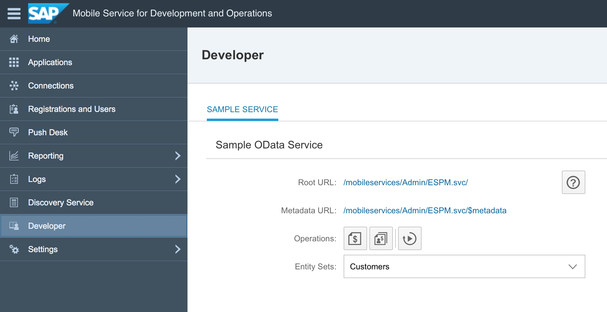
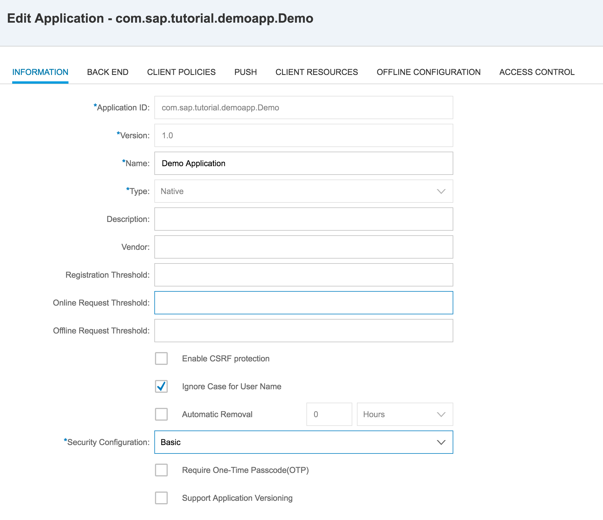
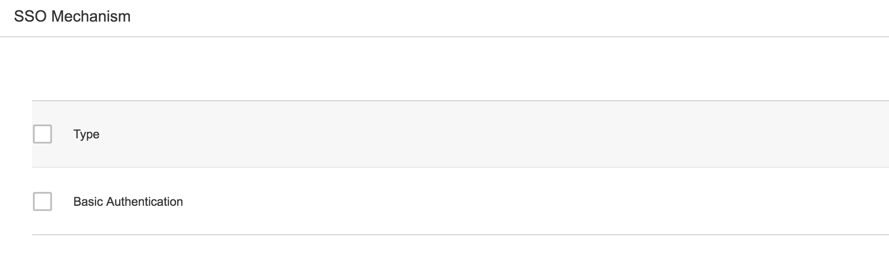
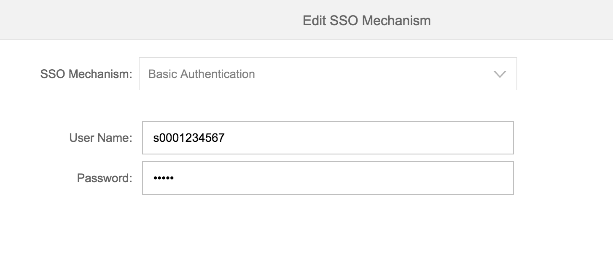

## Prerequisites  
 - **Proficiency:** Beginner
 - **Development machine:** Access to a Mac computer
 - **Tutorials:** [Create an application definition](https://www.sap.com/developer/tutorials/fiori-ios-hcpms-sdk-application-setup.html)

## Next Steps
 - [Create an app using the SDK Assistant](https://www.sap.com/developer/tutorials/fiori-ios-hcpms-sdk-assistant.html)

## Details
### You will learn  
As part of the SAP Cloud Platform mobile service for development and operations, a sample OData service is available to both developers as well as administrators. You will learn how to access this sample OData service, and generate sample data for use in your application.

### Time to Complete
**10 Min**.

---

A sample OData service is available for developers to use during development and testing. Administrators can configure the sample service via the cockpit. You can view the root service and metadata URLs, and generate sample sales orders and purchase orders for multiple entity sets. You can also view the data for each entity in a separate text file, and reset the sample data.

> NOTE: You can configure **only one** sample OData service per tenant.

The following roles are required to use this service:

| Role | Service URL | Description
|---|---|---|
| Developer | `<JAVA application URL>/mobileservices/SampleServices/ESPM.svc/` | Access the sample OData service |
| Administrator | `/mobileservices/Admin/ESPM.svc/` | Administrators configure an application in the cockpit to enable the service for the developer |

[ACCORDION-BEGIN [Step 1: ](Open Developer tab)]

In SAP Cloud Platform mobile service for development and operations cockpit, navigate to **Developer**.

[DONE]
[ACCORDION-END]

[ACCORDION-BEGIN [Step 2: ](Examine the Service information)]

To view the service information, click the URL next to **Root URL**.

To view the schema metadata for the service, click the URL next to **Metadata URL**.

[DONE]
[ACCORDION-END]

[ACCORDION-BEGIN [Step 3: ](Generate sample data)]

In order to use the sample service, you need to generate some sample data first.

1. Click the **Generate sample sales order** button to generate 10 sample sales orders.

2. Click the **Generate sample purchase order** button to generate 10 sample purchase orders

> Every click on each button will add another 10 sample orders to the Sample OData service.

[DONE]
[ACCORDION-END]

[ACCORDION-BEGIN [Step 4: ](Configure the application definition)]

Navigate to **Applications**, and next to the `com.sap.tutorial.demoapp.Demo` application, click the **Action** button, and select **Configure**.

[DONE]
[ACCORDION-END]

[ACCORDION-BEGIN [Step 5: ](Set Security Configuration)]

Under the **Information** tab, make sure **Security Configuration** is set to **Basic**:

[DONE]
[ACCORDION-END]

[ACCORDION-BEGIN [Step 6: ](Setup Back End connection)]

Switch to the **Back End** tab and define a connection to the sample OData service URL:

| Field | Value |
|----|----|
| Back-End URL | `https://hcpms-<your-ID>trial.hanatrial.ondemand.com/SampleServices/ESPM.svc/` |
| Proxy Type | Internet |
| Rewrite Mode | Rewrite URL |

[DONE]
[ACCORDION-END]

[ACCORDION-BEGIN [Step 7: ](Configure SSO mechanism)]

At panel **SSO Mechanism**, set the authentication method to **Basic Authentication**:

> For the SSO Mechanism for the sample OData service, you can choose between `Basic Authentication` or `App2AppSSO`. In one of the next tutorials, we will use the **SDK Assistant** to create an application based on this Sample OData service, and since the SDK Assistant currently only supports Basic Authentication, we will use the **Basic Authentication** setting.

[DONE]
[ACCORDION-END]

[ACCORDION-BEGIN [Step 8: ](Enter SAP Cloud Platform credentials)]

Mark the checkbox next to **Basic Authentication**, and click the **Edit** button to the right. A dialog is shown, and enter your **SAP Cloud Platform mobile service for development and operations login credentials**

Click **Save** to close the dialog.

[DONE]
[ACCORDION-END]

[ACCORDION-BEGIN [Step 9: ](Save configuration)]

Click **Save** to store the back-end configuration.

For now, this complements this tutorial step. In the following tutorials, you will actually query the OData service and display the results.

[DONE]
[ACCORDION-END]

## Next Steps
 - [Create an app using the SDK Assistant](https://www.sap.com/developer/tutorials/fiori-ios-hcpms-sdk-assistant.html)
