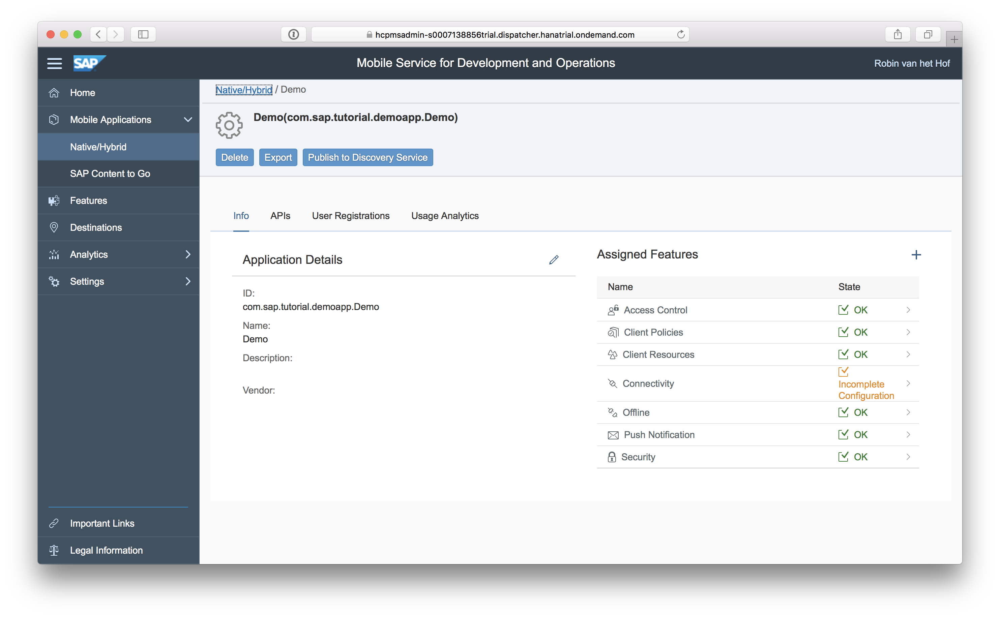
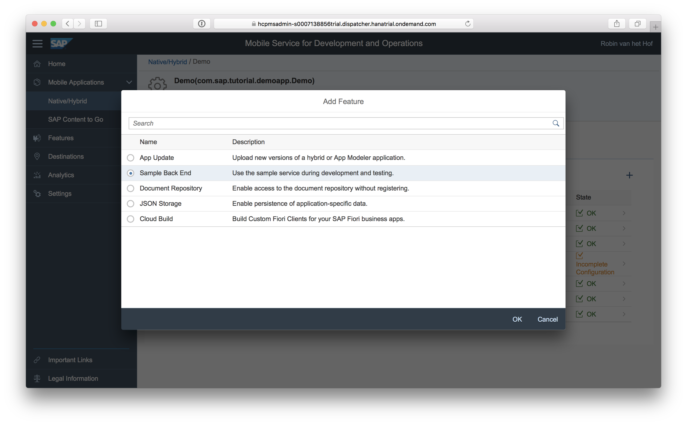
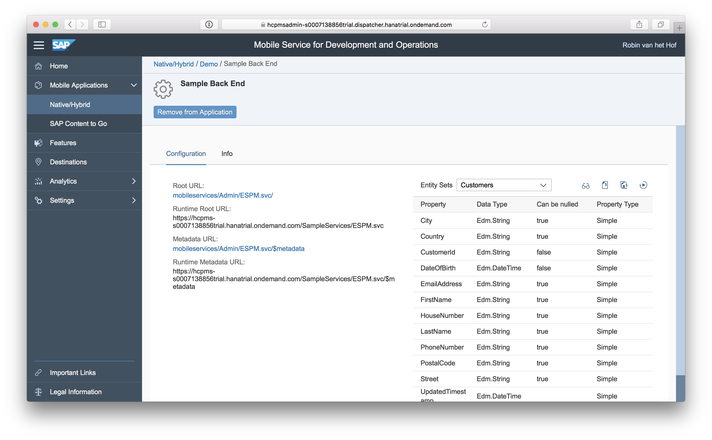
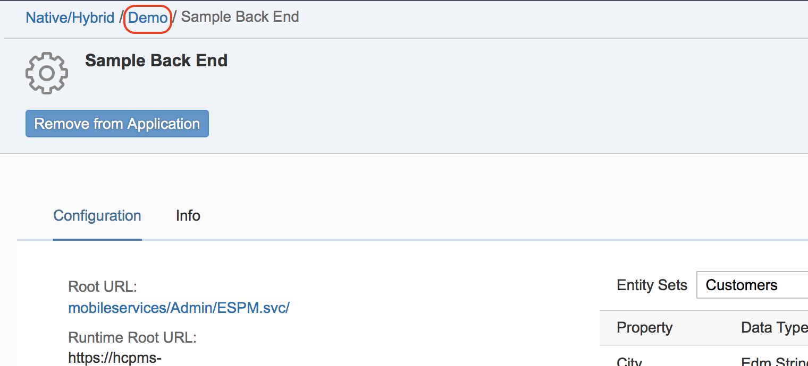
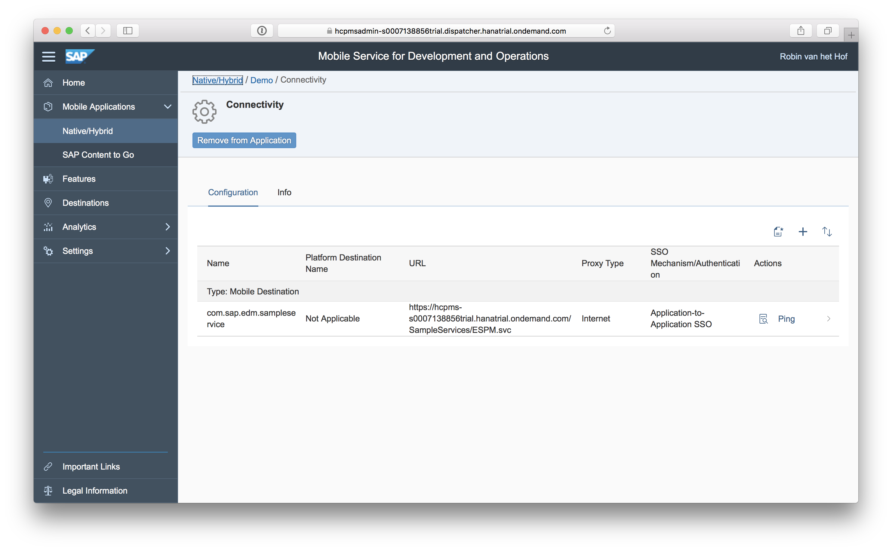

## Prerequisites  
 - **Proficiency:** Beginner
 - **Development environment:** Apple iMac, MacBook or MacBook Pro running Xcode 9 or higher
 - **SAP Cloud Platform SDK for iOS:** Version 2.0
 - **Tutorials:** [Enable SAP Cloud Platform mobile service for development and operations](https://www.sap.com/developer/tutorials/fiori-ios-hcpms-setup.html)

## Next Steps
 - [Creating an app using the SAP Cloud Platform SDK for iOS Assistant](https://www.sap.com/developer/tutorials/fiori-ios-hcpms-sdk-assistant.html)

## Details
### You will learn  
How to setup the application for a mobile application that allows you to manage the application, connections to the back-end data source, and optionally, other application-specific settings.

### Time to Complete
**15 Min**.

---

The SAP Cloud Platform mobile service for development and operations provides various mobile centric services, such as authentication, device registration, logging and proxying of back-end services. All these services are app specific. This allows having several that are setup using different settings.

Technically it would be possible to skip this step and access an OData services directly, but leveraging the SAP Cloud Platform mobile service for development and operations has several advantages:

- Your app is always communicating with the same Mobile Services end-point. If you want to use another service, you don't have to change the app, as the eventual end-point stays hidden for the app. It suffices to point your mobile services end-point to the new service.
- Mobile services contains a device registration feature that allows a device to be de-authorized when the device is e.g. lost.
- Mobile services have features that allow the user not to have to re-authenticate every time they launch the app, as long as a token is securely stored and re-used when the application is launched again.
- Mobile services provide out-of-the-box features to configure your app on an app-specific, user-specific or device-specific level. It is e.g. possible to set a particular device of a user to debugging-level to gain better insight into what is happening with the application
- Mobile services provides analytics features to monitor usage of your application per platform, device type or user group.

This tutorial described how you can configure a mobile app in SAP Cloud Platform mobile service for development and operations.

[ACCORDION-BEGIN [Step 1: ](Make sure mobile services are enabled in your account)]

Got to the SAP Cloud Platform cockpit and click on **Services** in the main menu. In the `Services` page, make sure that under `Mobile Services` the `Development & Operations` service is enabled. If it is not enabled, enable it by clicking on it an pressing the **Enable** button.

[ACCORDION-END]

[ACCORDION-BEGIN [Step 2: ](Go to the Mobile Services cockpit and bookmark it)]

After you clicked on the `Development & Operations` tile in the services list, you will see a link called **Go to Service**. Follow this link to go to the mobile services cockpit.

As it is likely that you need to return to this cockpit after you have created the application ID, it is advisable to bookmark the page by pressing **⌘D** (Control-D on Windows).

[ACCORDION-END]

[ACCORDION-BEGIN [Step 3: ](Create the application definition)]

Log on to your **SAP Cloud Platform mobile service for development and operations** cockpit, and navigate to **Mobile Applications > Native/Hybrid**. Click the **New** button, and in the dialog, add the following information:

| Field Name | Value |
|----|----|
| Configuration Templates | `Native` |
| ID | `com.sap.tutorial.demoapp.Demo` |
| Name | `Demo` |

[ACCORDION-END]

[ACCORDION-BEGIN [Step 4: ](Initial application definition created)]

After entering the application details press the **Save** button to save the new application. You now see the application definition details:

Take a note of the **Incomplete Configuration** message next to the **Connectivity** feature. This will be solved in the next step.

[ACCORDION-END]

[ACCORDION-BEGIN [Step 5: ](Add Sample Back End Feature)]

When the application is saved, you will be able to define more application configuration details. For this tutorial series, you will use a sample OData service included in SAP Cloud Platform mobile service for development and operations.

Click on the **Plus** button next to **Assigned Features** to the right. A dialog now opens:

Select **Sample Back End** from the list, and click **OK**.

The Sample Back End is now added:

As you can see from the **Entity Sets** drop-down, the sample service contains quite a few entities. You may click the **Generate sample sales orders** and **Generate sample purchase orders** a couple of times to generate dummy data for these entities.

[ACCORDION-END]

[ACCORDION-BEGIN [Step 6: ](Examine application definition)]

Click on the application name **Demo** in the breadcrumb at the top of the page:

You are navigated back to the **Demo** application overview page. You'll notice the **Incomplete Configuration** message next to the **Connectivity** feature is gone now.

Click on the **Connectivity** row, and you will notice the OData endpoint for the Sample Back End is configured:

[ACCORDION-END]

## Next Steps
- [Creating an app using the SAP Cloud Platform SDK for iOS Assistant](https://www.sap.com/developer/tutorials/fiori-ios-hcpms-sdk-assistant.html)
