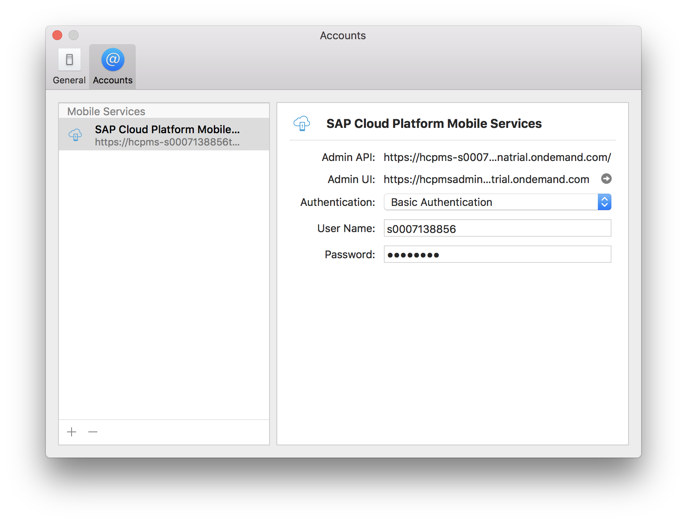
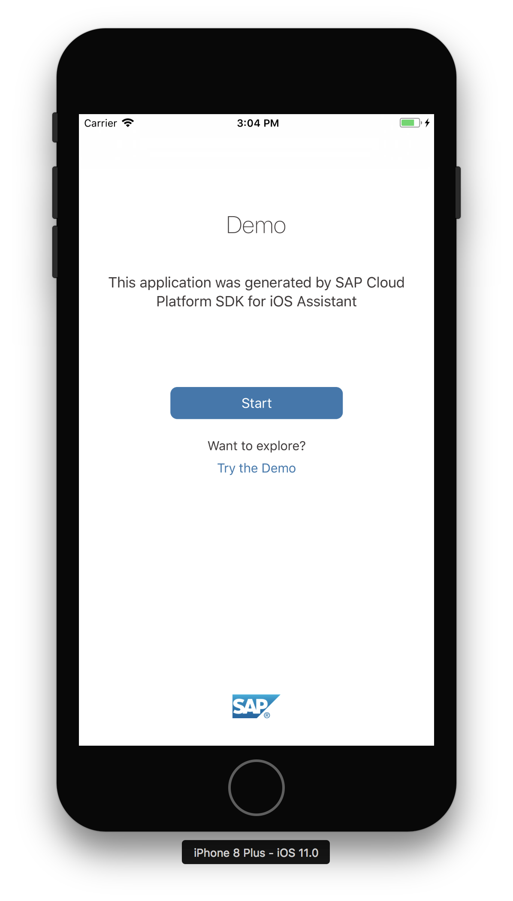
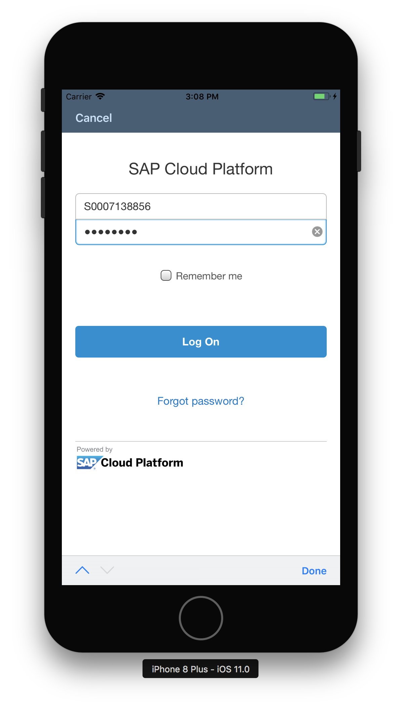
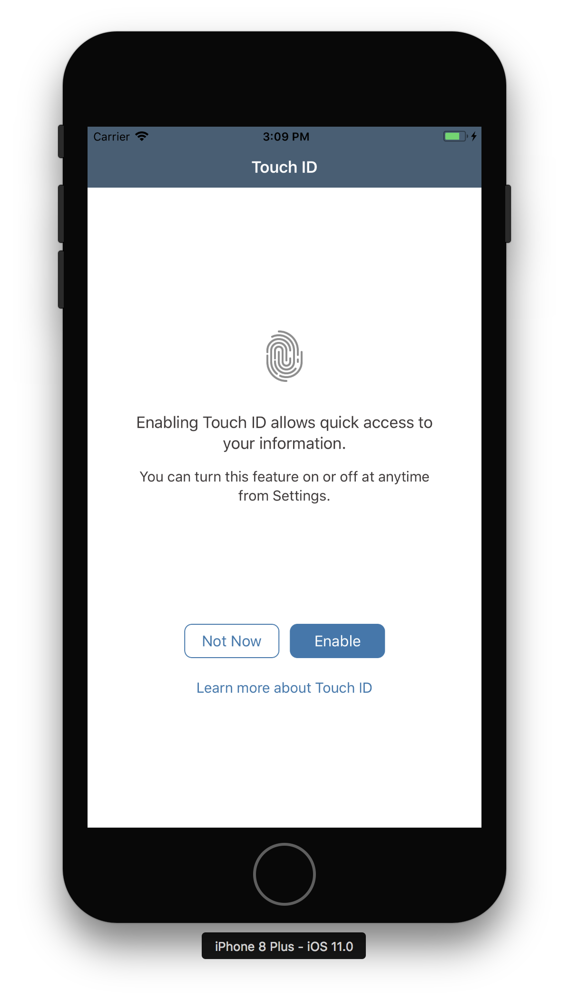
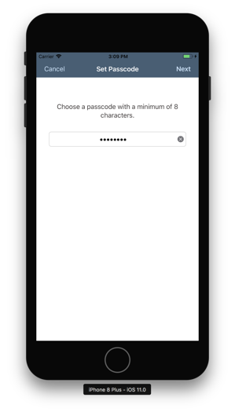

## Prerequisites  
 - **Development environment:** Apple iMac, MacBook or MacBook Pro running Xcode 9 or higher
 - **SAP Cloud Platform SDK for iOS:** Version 2.0

## Details
### You will learn  
In this tutorial, you will install and setup the SAP Cloud Platform SDK for iOS Assistant which comes as part of the SAP Cloud Platform SDK for iOS. After the initial setup, you generate a simple Xcode project using the Sample OData service, which can be run as an app.

The SAP Cloud Platform SDK for iOS Assistant ("SDK Assistant") is a macOS application that helps developing iOS applications which use the SAP Cloud Platform SDK for iOS frameworks. It speeds up development by generate code for accessing OData services, define authentication mechanism, enable remote push notifications and add logging statements.

---

[ACCORDION-BEGIN [Step 1: ](Configure the SDK for iOS Assistant)]

> If you have already configured the SAP Cloud Platform SDK for iOS Assistant, you can **skip this step** and proceed with "Step 2 - Run the SAP Cloud Platform SDK for iOS Assistant".

This step provides simplified steps to configure the SAP Cloud Platform SDK for iOS Assistant application using the SAP Cloud Platform mobile service for development and operations cockpit.

Log on to SAP Cloud Platform mobile service for development and operations at `https://hcpms-<your_user_id>trial.dispatcher.hanatrial.ondemand.com/` and click the **Important Links** tab in the lower left bottom. The **Important Links** section opens:

Locate the tile **SAP Cloud Platform SDK for iOS Assistant** and click the **Importing URLs directly into Assistant** link. You should now see the following pop-up:

Click the **Open SAP Cloud Platform SDK for iOS Assistant** button. The SAP Cloud Platform SDK for iOS Assistant application will start. The **New Account** settings dialog will open, and both **Admin API URL** and **Admin UI URL** parameters are pre-populated automatically:

Provide the following additional details:

| Field | Value |
|----|----|
| Name | A descriptive name for the configuration, for instance `SAP Cloud Platform Mobile Services` |
| Authentication Type | `Basic Authentication` |
| User | Your trial account user |
| Password | Password for your trial account user |

Click **Add** when finished. The account is now added to the SDK Assistant:

Close the **Accounts** dialog.

[DONE]
[ACCORDION-END]

[ACCORDION-BEGIN [Step 2: ](Run the SDK for iOS Assistant)]

Double-click the **SAP Cloud Platform SDK for iOS Assistant** icon to start the application. If no applications have been generated previously, you will see the initial screen:

[DONE]
[ACCORDION-END]

[ACCORDION-BEGIN [Step 3: ](Create an Xcode Project)]

Click the **Plus** button on the top-right of the SDK Assistant. The first page of the Xcode Project generation wizard lets you define the Project Properties.

Enter the following details:

| Field | Value |
|----|----|
| Product Name | `Demo` |
| Author | `<your name>` |
| Organization Name | `<your company name>` |
| Organization Identifier | `com.sap.tutorial.demoapp` |
| Destination | `<choose a local destination>` |

Click **Next** to advance to the **SAP Cloud Platform mobile service for development and operations Configuration** step.

[DONE]
[ACCORDION-END]

[ACCORDION-BEGIN [Step 4: ](View the service configuration)]

In the **SAP Cloud Platform mobile service for development and operations Configuration** page, select the **Use Existing** tab button. Then, click the **Select...** button next to **Application Identifier**. This will open a dialog displaying any predefined application definitions stored on SAP Cloud Platform mobile service for development and operations:

Select the `com.sap.tutorial.demoapp.Demo` entry, and click **OK** to dismiss the dialog.

Click **Next** to proceed to the **OData Services** step.

[DONE]
[ACCORDION-END]

[ACCORDION-BEGIN [Step 5: ](Select the back end connection)]

In the next screen, the available OData connection is displayed. Since you already defined an OData connection when creating the application on SAP Cloud Platform mobile service for development and operations, it is listed here and set as the primary.

Click **Next** to continue.

[DONE]
[ACCORDION-END]

[ACCORDION-BEGIN [Step 6: ](Select additional options)]

In the final screen, you have a few options.

You can choose whether or not you want to **Generate a Master-Detail application** based on the OData service linked with your application. If you uncheck the checkbox, the wizard will simply generate a placeholder Xcode project containing generated proxy classes for all entities in your OData service, allowing your application to communicate with the back-end system.

If you leave the checkbox checked, it will generate not only the proxy classes, but also create a data browser user interface for testing the configuration.

In addition, when you leave the **Generate Master-Detail Application** checked, you can also choose whether or not you want to enable the logging service, as well as allow your application to receive remote push notification.

For this tutorial, make sure you have all available checkboxes checked:

Click **Finish** to continue.

[DONE]
[ACCORDION-END]

[ACCORDION-BEGIN [Step 7: ](Examine the generated application project)]

The SDK Assistant now takes a few seconds to generate the application project, and once finished, it will open **Xcode** with the generated application project:

As you see, it has generated **Proxy Classes** for each entity of the specified OData service, generated **Views** and **View Controllers**, and tied them together in the `Main.storyboard` file as well as dedicated `<Entity>.storyboard` files in each `Demo/ViewControllers/<Entity>` folder.

[DONE]
[ACCORDION-END]

[ACCORDION-BEGIN [Step 8: ](Build and run the application)]

Click the **Build and Run** button in Xcode.

The **Simulator** now starts up, and launches your application.

[DONE]
[ACCORDION-END]

[ACCORDION-BEGIN [Step 9: ](Prepare the app for first launch)]

Once finished loading, you will get a confirmation message asking permission to allow push notifications:

Click the **Allow** button to allow receiving of push notifications.

> If you run the app in the **Simulator**, you can select any option, since the simulator does not support receiving push notifications.

> If you run the app on a physical iOS device, it then stores your preference in the settings. You can change these preferences later in the iOS device by navigating to **Settings > Notifications > Demo App** and enable/disable notifications from here.

.

You are now presented the generated app's on-boarding screen:

Click the blue **Start** button.

The **SAML** login screen of **SAP Cloud Platform mobile service for development and operations** is shown. Enter your login credentials for the SAP Cloud Platform and press the **Log On** button:

The app now gives you the option to enable Touch ID for quick access to your app. Since you are running from the simulator, you can click **Not Now**

Now, you should provide a passcode with a minimum of 8 characters. Enter a numeric passcode:

Click **Next**, confirm the passcode, and click **Done**.

The app starts with an overview of the available **Collections** of the OData service:

[DONE]
[ACCORDION-END]

[ACCORDION-BEGIN [Step 10: ](Examine the Suppliers Master view)]

Click on, for instance, **Suppliers**, it will now load the **Supplier** entities and display their name and ID:

[DONE]
[ACCORDION-END]

[ACCORDION-BEGIN [Step 11: ](Examine a Supplier Detail view)]

If you now click on one of the **Supplier** entities, it will display the **Detail** view for that entity:

[VALIDATE_11]
[ACCORDION-END]
