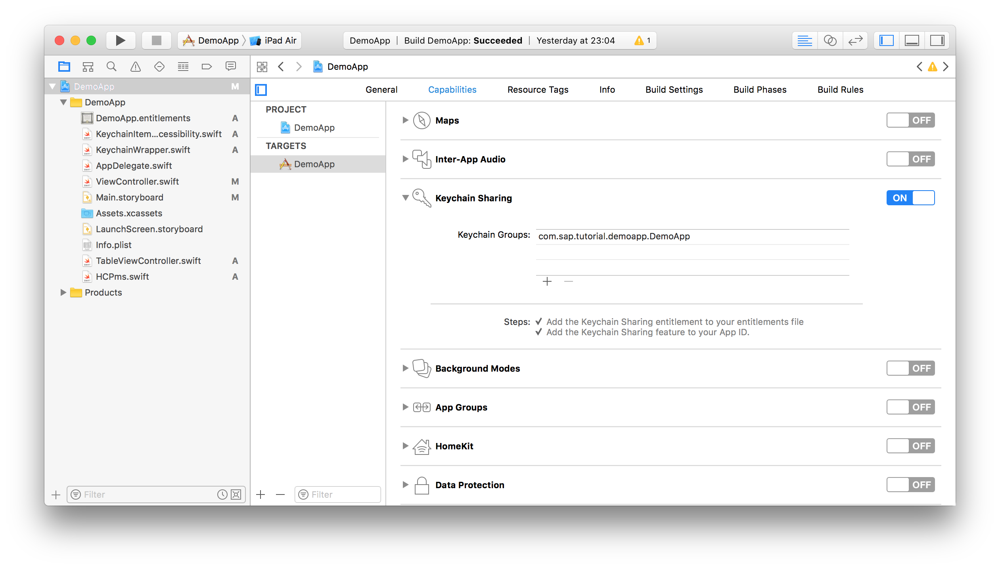
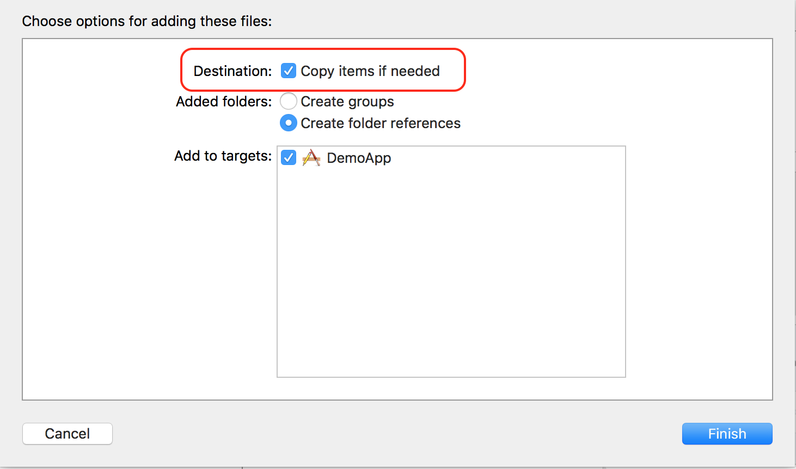
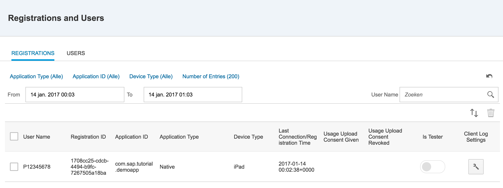

## Prerequisites  
 - [Device registration](https://www.sap.com/developer/tutorials/fiori-ios-hcpms-device-registration.html)


## Next Steps
 - [Verify whether your application has been registered](https://www.sap.com/developer/tutorials/fiori-ios-hcpms-verify-registration.html)

## Details
### You will learn  
You will learn how to securely store the user's credentials and Application Connection ID provided by the SAP Cloud Platform mobile service for development and operations in the iOS keychain.

### Time to Complete
**15 Min**

---

[ACCORDION-BEGIN [Introduction: ](Goal)]

This tutorial is part of a set of tutorials that will build an application that accesses an OData service leveraging the SAP Cloud Platform Mobile Service. Please find more information on the intended application in the introduction of the previous tutorial on [Device registration](http://www.sap.com/developer/tutorials/fiori-ios-hcpms-device-registration.html).

When an application retrieves data from a back-end connection, the SAP Cloud Platform mobile service for development and operations require a certain level of authentication and an Application Connection ID that was assigned to the device upon registration. However, this information should be classified as confidential and should be stored in an encrypted storage.

To store confidential information on an iOS device there are two very good options:

1. The iOS keychain
2. The secure store (`SecureKeyValueStore`), part of the SAP Fiori SDK for iOS

This tutorial will leverage the iOS keychain.

The keychain Services API provides a solution to this problem. By making a single call to this API, an app can store small bits of secret information on a keychain, from which the app can later retrieve the information—also with a single call. The keychain secures data by encrypting it before storing it in the file system, relieving you of the need to implement complicated encryption algorithms. The system also carefully controls access to stored items. The entire keychain can be locked, meaning no one can decrypt its protected contents until it is unlocked with a master password. Even with an unlocked keychain, the system's Keychain Access policy ensures that only authorized apps gain access to a given item in the keychain. In the simplest case, the app that created an item is the only one that can access it later. However, keychain services also provides ways to share secrets among apps.

The SAP secure store can be used when it is necessary to protect confidential data that doesn't fall under US law or when an second layer of security is required.

[DONE]
[ACCORDION-END]

[ACCORDION-BEGIN [Step 1: ](Add the keychain sharing capability to the app)]

iOS will only allow an app to gain access to the keychain API if the capability has been assigned to the app explicitly. This can be accomplished by clicking on the project in the **Project Navigator** and selecting the **Capabilities** pane. In the **Capabilities** pane, if **Keychain Sharing** isn't enabled, click the **switch** in the **Keychain Sharing** section.



[DONE]
[ACCORDION-END]

[ACCORDION-BEGIN [Step 2: ](Download SwiftKeychainWrapper)]

To make interaction with the iOS keychain really convenient and easy, a keychain wrapper has been created in the open source domain. This `SwiftKeychainWrapper` is available on GitHub on: https://github.com/jrendel/SwiftKeychainWrapper

There are two files needed from this library:

- [`KeychainWrapper.swift`](https://github.com/jrendel/SwiftKeychainWrapper/blob/develop/SwiftKeychainWrapper/KeychainWrapper.swift)
- [`KeychainItemAccessibility.swift`](https://github.com/jrendel/SwiftKeychainWrapper/blob/develop/SwiftKeychainWrapper/KeychainItemAccessibility.swift)

To download these two files, open them in your browser. Once the GitHub pages are open, right-click the **Raw** button and select **Download linked file**. This will save a copy of the Swift file in your `Downloads` folder.


[DONE]
[ACCORDION-END]

[ACCORDION-BEGIN [Step 3: ](Add the downloaded files to your project)]

Go to the `Downloads` folder using **Finder** and drag the downloaded swift files from the `Downloads` folder into the **Project Navigator** in Xcode:


When you dropped the two files into your project, Xcode will show a message box in which options can be set on how the files should be added. Please do check **Copy items if needed** in this dialog, so that copies of the two swift files are created in your project. After that, click the **Finish** button to actually copy the files.



[DONE]
[ACCORDION-END]

[ACCORDION-BEGIN [Step 4: ](Add helper functions for secure settings)]

To save, retrieve and delete values from the keychain, add a few helper functions to the `SAPcpms` class. Open the `SAPcpms.swift` file from the **Project Navigator** by clicking on it.

Add the code below to the bottom of the class, underneath the register function, just before the last closing bracket:

```swift
private func getSecureString(forKey: String) -> String? {
    return KeychainWrapper.standard.string(forKey: forKey)
}

private func saveSecureString(_ value: String, forKey key: String) {
    KeychainWrapper.standard.set(value, forKey: key)
}

private func deleteSecureObject(forKey key: String) {
    KeychainWrapper.standard.removeObject(forKey: key)
}
```

These functions allow setting of key-value pairs into the iOS keychain, leveraging the `KeychainWrapper` that was copied into the project in the previous step. It is convenient to do this through helper functions instead of calling the `KeyChain` class directly. This allows you to very easily change the implementation of these function in case the need arises to e.g. switch to `SecureKeyValueStore`.

[DONE]
[ACCORDION-END]

[ACCORDION-BEGIN [Step 5: ](Remove variable declaration userId and password)]

Instead of the keeping the user ID and password in a variable in the `SAPcpms` class, the keyring function should be used. As as result of this, the `userId` and `password` variable are not necessary anymore.

Remove the following two lines from the top parts of the `SAPcpms` class:

```swift
private var userId:String? = nil
private var password:String? = nil
```

As a result of removing these variable, you should see a few exclamation signs appear in your editor after you build your project using **⌘+B**. These are the spots that need attention and require modification, which is taken care of in the next steps.

[DONE]
[ACCORDION-END]

[ACCORDION-BEGIN [Step 6: ](Change function register to store credentials in the keyring)]

Replace these lines, marked with exclamation marks:

```swift
self.userId = userId
self.password = password
```

With:

```swift
saveSecureString(userId, forKey: "userid")
saveSecureString(password, forKey: "password")
```

The function should now look like this:

```swift
func register(userId: String, password: String, completion: @escaping (Bool, String) -> Void) {
    self.registered = true
    saveSecureString(userId, forKey: "userid")
    saveSecureString(password, forKey: "password")
    var request = URLRequest(url: URL(string: connectionRoot)!)
    let authString = createBasicAuthString()
    if (authString != nil) {
        request.setValue("Basic \(authString!)", forHTTPHeaderField: "Authorization")
    }
    request.setValue("application/json", forHTTPHeaderField: "Content-Type")
    request.setValue("application/json", forHTTPHeaderField: "Accept")
    request.httpMethod = "POST"
    request.httpBody = dicToJson(dic: registrationInfo)
    let task = URLSession.shared.dataTask(with: request) { data, response, error in
        guard let data = data, error == nil else {
            completion(false, "error=\(error)")
            return
        }

        if let httpStatus = response as? HTTPURLResponse, httpStatus.statusCode != 201 {
            print("statusCode should be 201, but is \(httpStatus.statusCode)")
            let responseString = String(data: data, encoding: .utf8)
            print("responseString = \(responseString!)")
            switch httpStatus.statusCode {
            case 401: completion(false, "The credentials you entered are incorrect")
            default: completion(false, "An unknown error occurred")
            }
        }

        let json = try? JSONSerialization.jsonObject(with: data, options: .allowFragments)
        guard let root = json as? [String: Any], let d = root["d"] as? [String: Any], let appcid = d["ApplicationConnectionId"] as? String else {
            return
        }
        print("ApplicationConnectionId: \(appcid)")
        completion(true, "Login successful")

    }
    task.resume()
}
```    

[DONE]
[ACCORDION-END]

[ACCORDION-BEGIN [Step 7: ](Change function createBasicAuthString to use credentials stored in the keyring)]

Add the following two lines to function `createBasicAuthString` just before the line with the red exclamation mark:

```swift
let userId = getSecureString(forKey: "userid")
let password = getSecureString(forKey: "password")
```

The function should now look like this:

```swift
func createBasicAuthString() -> String? {
    let userId = getSecureString(forKey: "userid")
    let password = getSecureString(forKey: "password")
    if (userId != nil && password != nil) {
        let loginString = String(format: "%@:%@", userId!, password!)
        let loginData = loginString.data(using: String.Encoding.utf8)!
        return loginData.base64EncodedString()
    }
    return nil
}
```

[DONE]
[ACCORDION-END]

[ACCORDION-BEGIN [Step 8: ](Remove any existing registrations for the app)]

In the previous tutorial, you have already registered the device. Go to the SAP Cloud Platform mobile service for development and operations cockpit to remove the registration, but clicking on the **Registrations and Users Tile**, selecting the existing registration and clicking the **Delete** button:


[DONE]
[ACCORDION-END]

[ACCORDION-BEGIN [Step 9: ](Run the app an check the new registration)]

Run the app by pressing the **Build and Run** button at the top left section of the toolbar. The simulator will start and will show the login screen of your application.

Once you have logged in, you should be seeing the table view again, similar to what happened at the end of the previous tutorial.

If you go back to the cockpit of SAP Cloud Platform mobile service for development and operations, you should see that the **Registrations and User** is back to 1.

When you click on the tile, you should see the list of registrations. Verify that the registration contains the user name that you logged in with:



If the registration is there and the user name is set properly, saving and retrieving the credentials from the keychain worked successfully.

[DONE]
[ACCORDION-END]

[ACCORDION-BEGIN [Step 10: ](Save the application connection ID in the keychain)]

Now the credentials are successfully stored in the keychain, do the same with the application connection ID (`appcid`).

Insert the line below into the `register` function, just before the call to the completion callback:

```swift
self.saveSecureString(appcid, forKey: "appcid")
```

This will make sure that once the `appcid` has been retrieved from the registration response, it is stored in the iOS keychain.

The `register` function should now look like this:

```swift
func register(userId: String, password: String, completion: @escaping (Bool, String) -> Void) {
    self.registered = true
    saveSecureString(userId, forKey: "userid")
    saveSecureString(password, forKey: "password")
    var request = URLRequest(url: URL(string: connectionRoot)!)
    let authString = createBasicAuthString()
    if (authString != nil) {
        request.setValue("Basic \(authString!)", forHTTPHeaderField: "Authorization")
    }
    request.setValue("application/json", forHTTPHeaderField: "Content-Type")
    request.setValue("application/json", forHTTPHeaderField: "Accept")
    request.httpMethod = "POST"
    request.httpBody = dicToJson(dic: registrationInfo)
    let task = URLSession.shared.dataTask(with: request) { data, response, error in
        guard let data = data, error == nil else {
            completion(false, "error=\(error)")
            return
        }

        if let httpStatus = response as? HTTPURLResponse, httpStatus.statusCode != 201 {
            print("statusCode should be 201, but is \(httpStatus.statusCode)")
            let responseString = String(data: data, encoding: .utf8)
            print("responseString = \(responseString!)")
            switch httpStatus.statusCode {
            case 401: completion(false, "The credentials you entered are incorrect")
            default: completion(false, "An unknown error occurred")
            }
        }

        let json = try? JSONSerialization.jsonObject(with: data, options: .allowFragments)
        guard let root = json as? [String: Any], let d = root["d"] as? [String: Any], let appcid = d["ApplicationConnectionId"] as? String else {
            return
        }
        print("ApplicationConnectionId: \(appcid)")
        self.saveSecureString(appcid, forKey: "appcid")
        completion(true, "Login successful")

    }
    task.resume()
}
```

[DONE]
[ACCORDION-END]

## Next Steps
- [Verify whether your application has been registered](https://www.sap.com/developer/tutorials/fiori-ios-hcpms-verify-registration.html)
