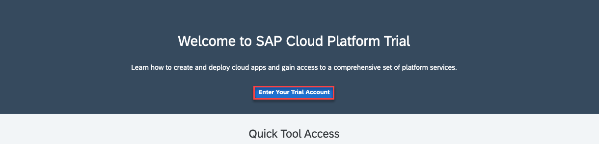
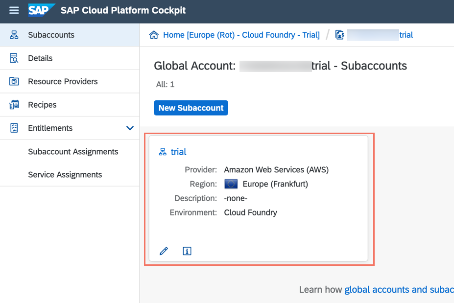
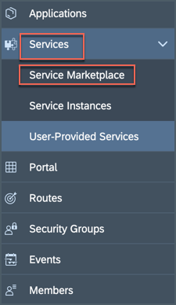
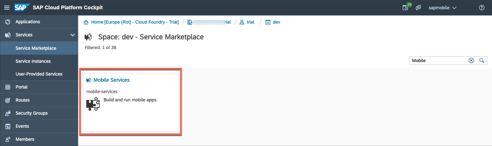
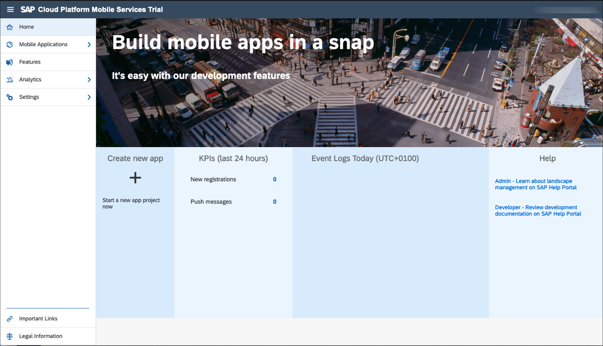
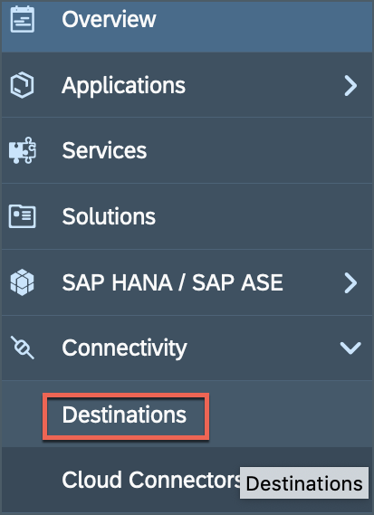
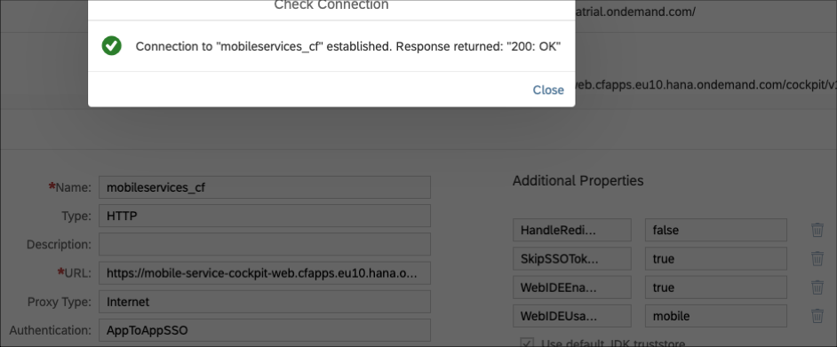
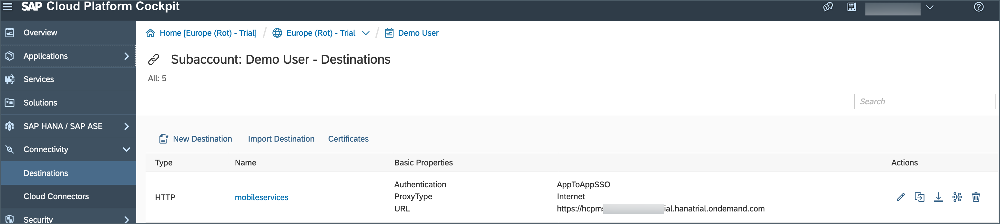

## Prerequisites  
 - **Tutorial:** If you're new to SAP Cloud Platform, follow the tutorial [View the SAP Cloud Platform from 10,000 Meters](cp-explore-cloud-platform).
 - **Tutorial:** If you don't have an SAP Cloud Platform account, follow the tutorial [Get a Free Trial Account on SAP Cloud Platform](hcp-create-trial-account).

## Details
### You will learn  
- How to enable SAP Cloud Platform Mobile Services in your Cloud Foundry or Neo trial account

---

>**This tutorial has been executed with Mobile Services in SAP Cloud Platform Cloud Foundry and Neo environment, please switch to either tab according to your environment.**

Once SAP Cloud Platform Mobile Services is available, you can use its features in your SAP Cloud Platform SDK for iOS, Android, Mobile development kit and Mobile Cards apps.

[ACCORDION-BEGIN [Step 1: ](Open the SAP Cloud Platform cockpit)]

>Make sure you are choosing the right environment platform tab above.

[OPTION BEGIN [Cloud Foundry]]

Go to your [SAP Cloud Platform cockpit landing page](https://cockpit.hanatrial.ondemand.com). Click on the **Enter Your Trial Account** to see your global account.

The global trial account contains **one** subaccount and space. Navigate to subaccount by clicking on the tile named **trial** (this name may vary if you created the subaccount manually).

To get to the space, in which your applications and services live, click on the **dev** space.

In the left pane, choose **Services** > **Service Marketplace**.

>The **Service Marketplace** is where you can find services to attach to any of your applications. These services are provided by SAP Cloud Platform to create, and produce applications quickly and easily. Once a service has been created, it is known as a `service instance`.

Search the **Mobile Services** and click on it.

Choose **Support** to open **SAP Cloud Platform Mobile Services Cockpit**.

>**Organization:** Organizations in CF enable collaboration among users and enable grouping of resources.

>**Space:** Cloud Foundry has a standard working environment for individual applications: it is called a space. Spaces are individual working areas, which normally contain a single application.

Choose the relevant **Organization** and **Space** from the dropdown list, and then select **Open**.

You have now logged in to the SAP Mobile Services cockpit.

Bookmark the **Mobile Services cockpit URL** for quick access.

[OPTION END]

[OPTION BEGIN [Neo]]

Go to your [SAP Cloud Platform cockpit landing page](https://cockpit.hanatrial.ondemand.com). Scroll down and click **Access Neo Trial**.

Click **Services** in the navigation bar, scroll down until you see the Mobile group then click on the **Mobile Services** tile.

If **Mobile Services** is not enabled, then enable it.

Click on **Go to Service** to open the Mobile Services cockpit.

Bookmark the **Mobile Services cockpit URL** for quick access.

[OPTION END]

[VALIDATE_3]
[ACCORDION-END]

[ACCORDION-BEGIN [Step 2: ](Optional: Setup a Connectivity between SAP Web IDE and Mobile Services)]

>Make sure you are choosing the right environment platform tab above.

[OPTION BEGIN [Cloud Foundry]]

If you want to use **SAP Web IDE Full-Stack** service to build **Mobile Cards** or **Mobile development kit** based apps connecting to Mobile Services running on Cloud Foundry environment, then you need to follow below step.

>Since SAP Web IDE Full-Stack is currently available only in SAP Cloud Platform Neo environment, in order to connect to SAP Cloud Platform Mobile Services on Cloud Foundry environment, you need to create a new destination.

On [SAP Cloud Platform cockpit landing page](https://cockpit.hanatrial.ondemand.com) scroll down and click **Access Neo Trial**.

Click **Destinations** on the left panel.

Click **New Destination** to open a new destination configuration form and provide below information:

| Field | Value |
|----|----|
Name           | `mobileservices_cf`
Type           | `HTTP`
Description    | `Mobile Services CF`
URL            | please check note below
Proxy Type     | `Internet`
Authentication | `BasicAuthentication`
User | `SCP user id`
password | `SCP password`

>For URL field, in Mobile Services Cockpit, click **Important links** on bottom-left side and copy from the section of SAP Cloud Platform SDK Tools the link of Copy `AdminAPI` to your destination.
>

Provide below information for **Additional Properties**:

| Field | Value |
|----|----|
`HandleRedirects`  | `false`
`SkipSSOTokenGenerationWhenNoUser`  | `true`
`WebIDEEnabled`  | `true`
`WebIDEUsage`  | `mobile`

>First two fields need to type manually.

Click **Save** and then click **Check Connection** on the newly created Destination to see if everything works.

[OPTION END]

[OPTION BEGIN [Neo]]

Once **Mobile Services** is enabled, there is a destination named `mobileservices` gets created in **Connectivity** under Neo environment.

[OPTION END]

[DONE]
[ACCORDION-END]
