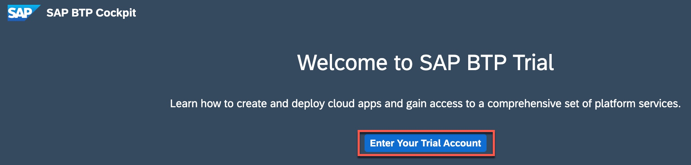
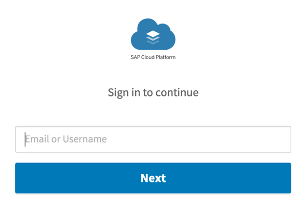

## Prerequisites  

- **Tutorial:** If you're new to SAP Business Technology Platform, follow the tutorial [View the SAP BTP from 10,000 Meters](cp-explore-cloud-platform).
- **Tutorial:** If you don't have an SAP BTP account, follow the tutorial [Get a Free Trial Account on SAP BTP trial](hcp-create-trial-account).

## Details

### You will learn  

- How to access SAP Mobile Services in your Cloud Foundry account

Once SAP Mobile Services is available, you can use its features in your Mobile development kit, Mobile Cards, SAP BTP SDK for iOS & Android apps.

---

[ACCORDION-BEGIN [Step 1: ](Open SAP Business Technology Platform (BTP) cockpit)]

1. Go to your [SAP BTP cockpit landing page](https://cockpit.hanatrial.ondemand.com). Click the **Enter Your Trial Account** to see your global account.

    !

2. The global trial account contains **one** subaccount and space. Navigate to subaccount by clicking the tile named **trial** (this name may vary if you created the subaccount manually).

    !

3. In the left pane, choose **Services** > **Service Marketplace**.

    >The **Service Marketplace** is where you can find services to attach to any of your applications. These services are provided by SAP BTP to create, and produce applications quickly and easily. Once a service has been created, it is known as a `service instance`.

    !

4. Search for **Mobile**, and click **Mobile Services** tile.  

    !

6. Choose **Support** to open **SAP Mobile Services Cockpit**.

    !

7. If you are asked to sign in then enter your Email or Username to continue and click **Next**.

    !

8. Choose the relevant **Organization** and **Space** from the dropdown list, and then select **Open**.

    >**Organization:** Organizations in CF enable collaboration among users and enable grouping of resources.

    >**Space:** Cloud Foundry has a standard working environment for individual applications: it is called a space. Spaces are individual working areas, which normally contain a single application.

    !

    You have now logged in to the SAP Mobile Services cockpit.

    !

    Bookmark the **Mobile Services cockpit URL** for quick access.

[DONE]
[ACCORDION-END]

[ACCORDION-BEGIN [Step 1: ](Test yourself)]

[VALIDATE_3]
[ACCORDION-END]
