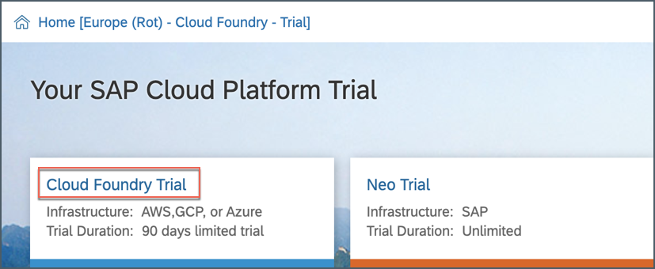
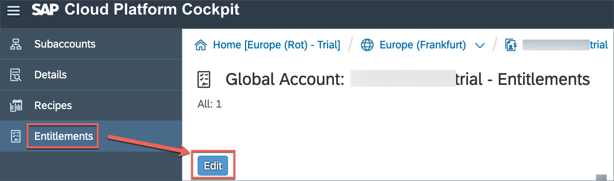
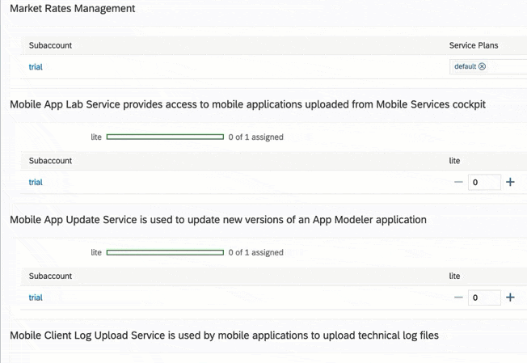
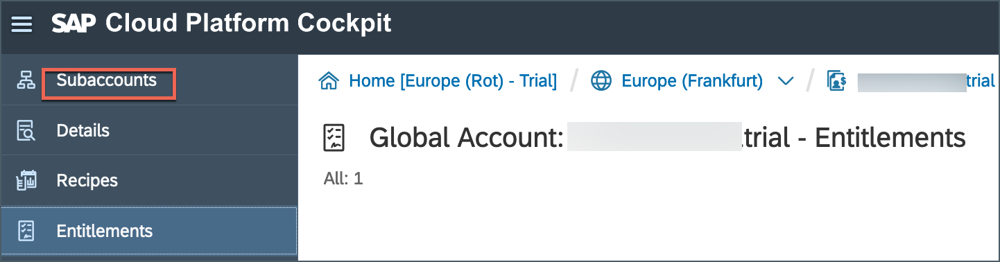
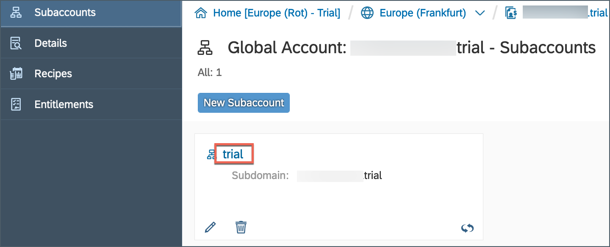
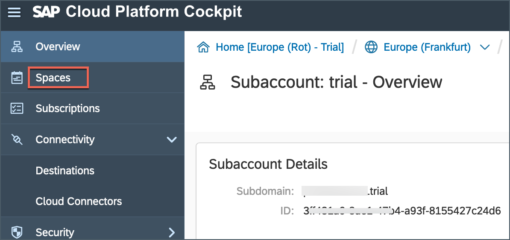
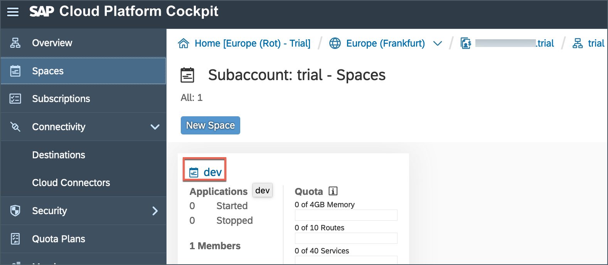

## Prerequisites  
 - **Tutorial:** If you don't have an SAP Cloud Platform account, follow the tutorial to [set up a free developer account](hcp-create-trial-account).
 - **Tutorial:** [Create a Cloud Foundry Sub-account](cp-cf-create-account), if you want to enable Mobile Services in Cloud Foundry environment.

## Details
### You will learn  
- How to enable SAP Cloud Platform Mobile Services in your Neo or Cloud Foundry trial account

---

>**This tutorial has been executed with Mobile Services in SAP Cloud Platform Neo and Cloud Foundry environment, please switch to either tab according to your environment.**

Once SAP Cloud Platform Mobile Services is enabled, you can use its features in your SAP Cloud Platform SDK for iOS, Android, Mobile development kit and Mobile Cards apps.

[ACCORDION-BEGIN [Step 1: ](Open SAP Cloud Platform cockpit)]

[OPTION BEGIN [Neo]]

Make sure that you have activated the [trial account](hcp-create-trial-account).

Go to your [SAP Cloud Platform cockpit](https://account.hanatrial.ondemand.com) and click **Log On**.

Click **Neo Trial**.

[OPTION END]

[OPTION BEGIN [Cloud Foundry]]

Make sure that you have activated the [trial account](cp-cf-create-account).

Go to your [SAP Cloud Platform cockpit](https://account.hanatrial.ondemand.com) and click **Log On**.

Click **Cloud Foundry Trial**.

[OPTION END]

[DONE]
[ACCORDION-END]

[ACCORDION-BEGIN [Step 2: ](Navigate to SAP Cloud Platform Mobile Services)]

[OPTION BEGIN [Neo]]

From the SAP Cloud Platform Cockpit page, click **Services** in the navigation bar, scroll down until you see the Mobile group then click on the **Mobile Services** tile.

If **Mobile Services** is not enabled, then enable it.

Once **Mobile Services** is enabled, there is a destination named `mobileservices` gets created in **Connectivity** under Neo environment.

[OPTION END]

[OPTION BEGIN [Cloud Foundry]]

Click **Entitlements** | **Edit**.

Scroll down and look for **Mobile** related services and click **+** icon to assign one entitlement to each feature, there are total 14 features for Mobile Services.  

Click **Save**.

[OPTION END]

[VALIDATE_3]
[ACCORDION-END]

[ACCORDION-BEGIN [Step 3: ](Open the Mobile Services cockpit)]

[OPTION BEGIN [Neo]]

Click on **Go to Service** to open the Mobile Services cockpit.

Bookmark the **Mobile Services cockpit URL** for quick access.

[OPTION END]

[OPTION BEGIN [Cloud Foundry]]

You will find Mobile related services in **Service Marketplace**.

Click `Subaccounts`.

>The trial account contains one `subaccount` and `space`.

Click **trial**.

Click **Spaces**.

>A Cloud Foundry space is the logical container of your runtime artefacts such as **Applications**, and **Service Instances**.

Click **dev**.

Click **Service Marketplace**.

>The **Service Marketplace** is where you can find services to attach to any of your applications. These services are provided by SAP Cloud Platform to make it easier to create, and produce, web applications quickly and easily. Once a service has been created, we call it a service instance.

Click any of **Mobile** tile.

Click **Support** to open **SAP Cloud Platform Mobile Services Cockpit**.

Make sure to select related **Organization** and **Space** information and then click **Open** to assign related .

Bookmark the **Mobile Services cockpit URL** for quick access.

**Optional**: If you want to use **SAP Web IDE Full-Stack** service to build Mobile Cards or Mobile development kit based applications connecting to Mobile Services running in Cloud Foundry environment, then you need to follow below step.

>Since SAP Web IDE Full-Stack is available only in SAP Cloud Platform Neo environment, in order to connect to SAP Cloud Platform Mobile Services running within Cloud Foundry environment, you need to create a new destination.

Go to your [SAP Cloud Platform cockpit home page](https://account.hanatrial.ondemand.com/cockpit/#/home/trialhome) | click **Neo Trial** tile.

Click **Destinations** button on the left panel.

Click **New Destination** to open a new destination configuration form and provide below information:

| Field | Value |
|----|----|
Name           | `mobileservices_cf`
Type           | `HTTP`
Description    | `Mobile Services CF`
URL            | ` https://<URL>/org/<organization name>/space/<space name>/`
Proxy Type     | `Internet`
Authentication | `BasicAuthentication`
User | `SCP user id`
password | `SCP password`

Provide below information for **Additional Properties**:

| Field | Value |
|----|----|
`HandleRedirects`  | `false`
`SkipSSOTokenGenerationWhenNoUser`  | `true`
`WebIDEEnabled`  | `true`
`WebIDEUsage`  | `mobile`

>Not all the values appear in the drop-down menu. For any values not appearing, type in the name of the property.

Click **Save** and then click **Check Connection** on the newly created Destination to see if everything works.

>For URL field, copy the Mobile Services cockpit URL till space name. e.g. <https://mobile-service-cockpit-web.cfapps.eu10.hana.ondemand.com/cockpit/v1/org/P123456789trial_trial/space/dev/>

[OPTION END]

[DONE]
[ACCORDION-END]
