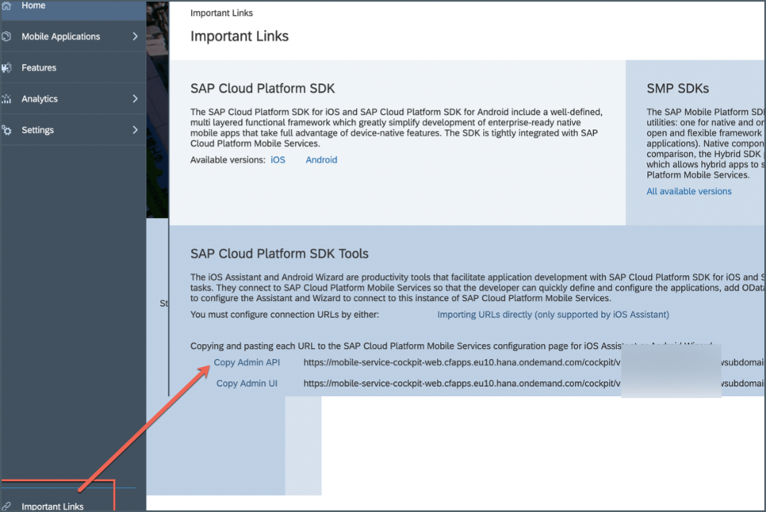
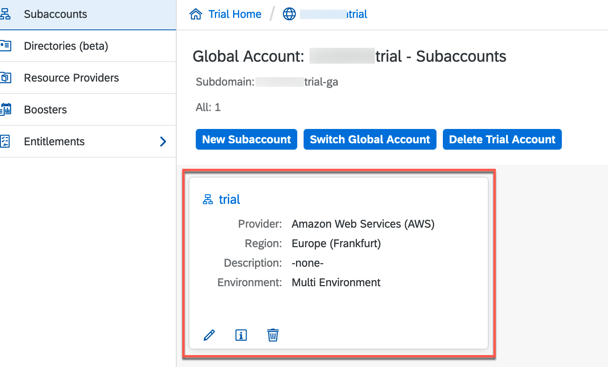
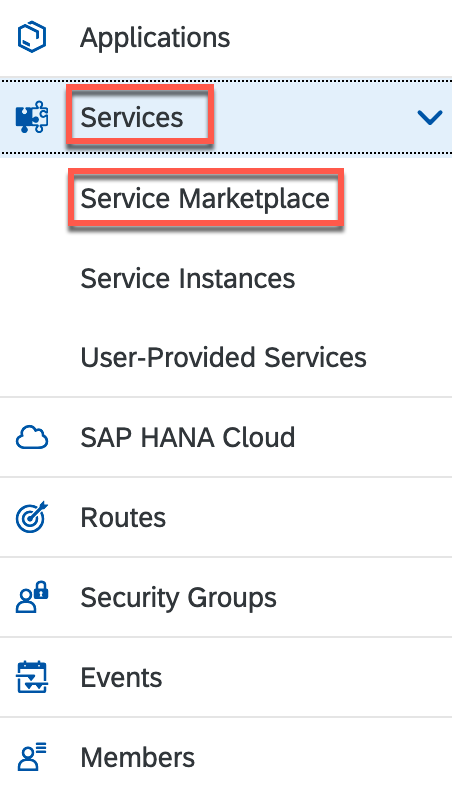
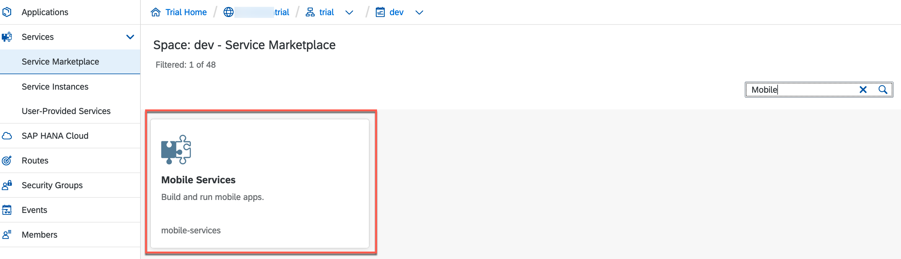
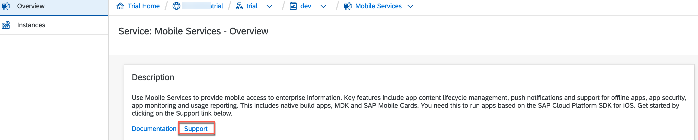
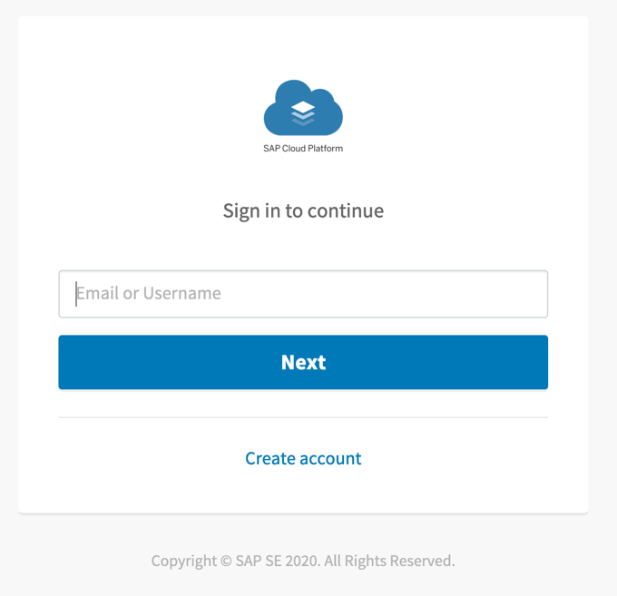
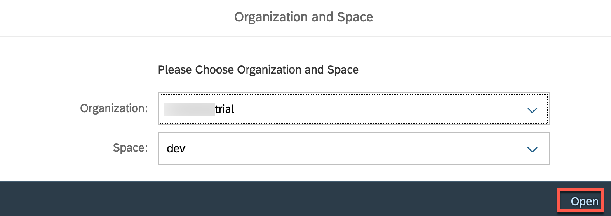
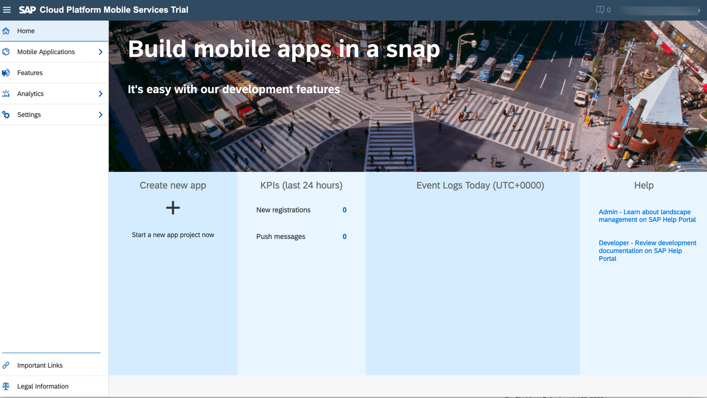

## Prerequisites  
 - **Tutorial:** If you're new to SAP Cloud Platform, follow the tutorial [View the SAP Cloud Platform from 10,000 Meters](cp-explore-cloud-platform).
 - **Tutorial:** If you don't have an SAP Cloud Platform account, follow the tutorial [Get a Free Trial Account on SAP Cloud Platform](hcp-create-trial-account).

## Details
### You will learn  
- How to access SAP Cloud Platform Mobile Services in your Cloud Foundry account

---

Once SAP Cloud Platform Mobile Services is available, you can use its features in your Mobile development kit, Mobile Cards, SAP Cloud Platform SDK for iOS & Android apps.

[ACCORDION-BEGIN [Step 1: ](Open the SAP Cloud Platform cockpit)]

1. Go to your [SAP Cloud Platform cockpit landing page](https://cockpit.hanatrial.ondemand.com). Click the **Enter Your Trial Account** to see your global account.

    !

2. The global trial account contains **one** subaccount and space. Navigate to subaccount by clicking the tile named **trial** (this name may vary if you created the subaccount manually).

    !

3. In the left pane, choose **Services** > **Service Marketplace**.

    >The **Service Marketplace** is where you can find services to attach to any of your applications. These services are provided by SAP Cloud Platform to create, and produce applications quickly and easily. Once a service has been created, it is known as a `service instance`.

    !

4. Search for **Mobile**, and click **Mobile Services** tile.  

    !

6. Choose **Support** to open **SAP Cloud Platform Mobile Services Cockpit**.

    !

7. Enter your Email or Username to sign in to continue and click **Next**.

    !

8. Choose the relevant **Organization** and **Space** from the dropdown list, and then select **Open**.

    >**Organization:** Organizations in CF enable collaboration among users and enable grouping of resources.

    >**Space:** Cloud Foundry has a standard working environment for individual applications: it is called a space. Spaces are individual working areas, which normally contain a single application.

    !

    You have now logged in to the SAP Mobile Services cockpit.

    !

    Bookmark the **Mobile Services cockpit URL** for quick access.

[VALIDATE_3]
[ACCORDION-END]
