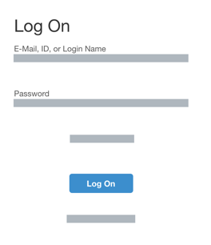
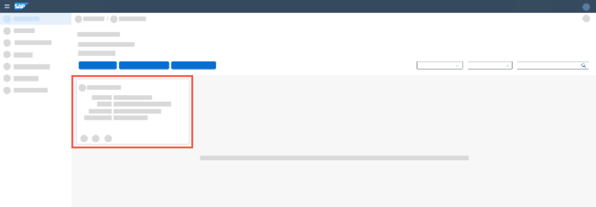
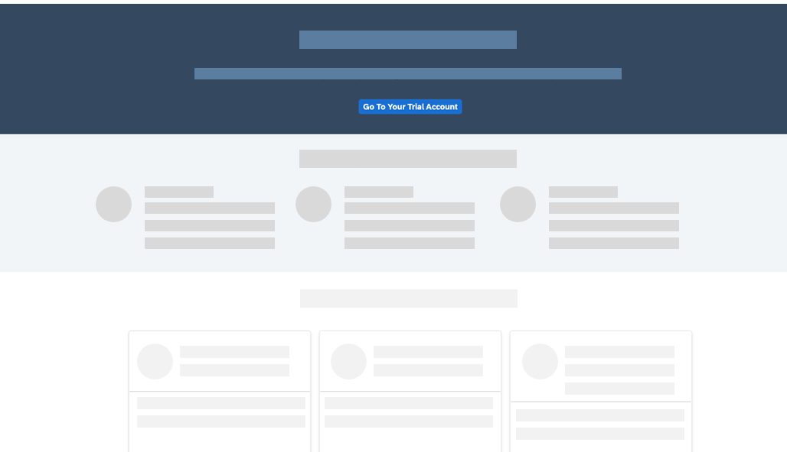
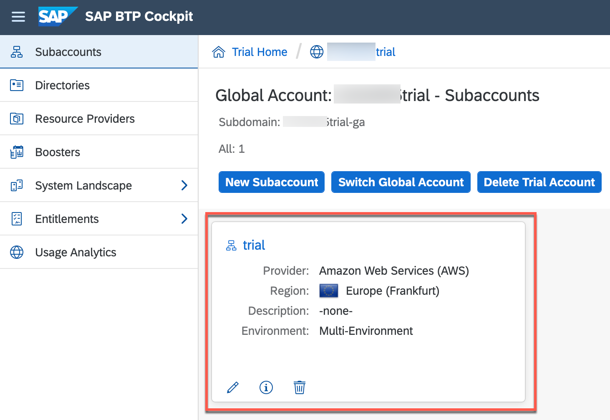
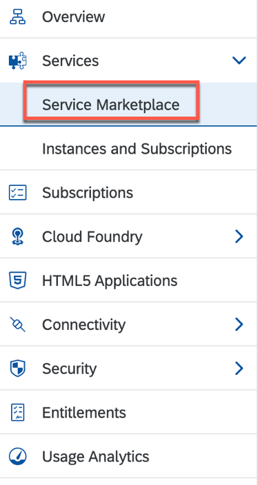
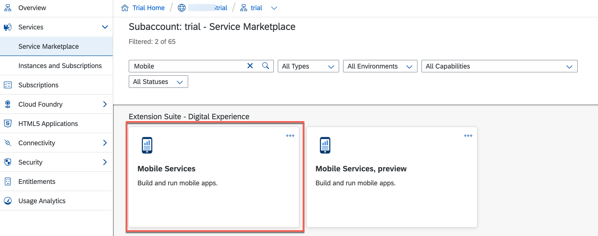
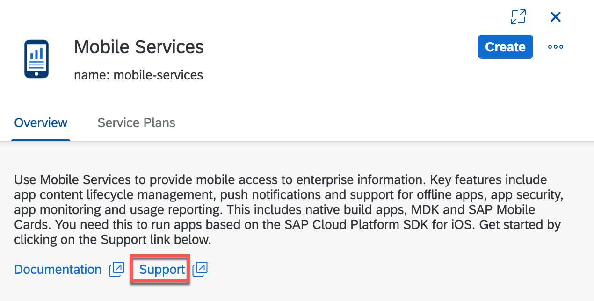
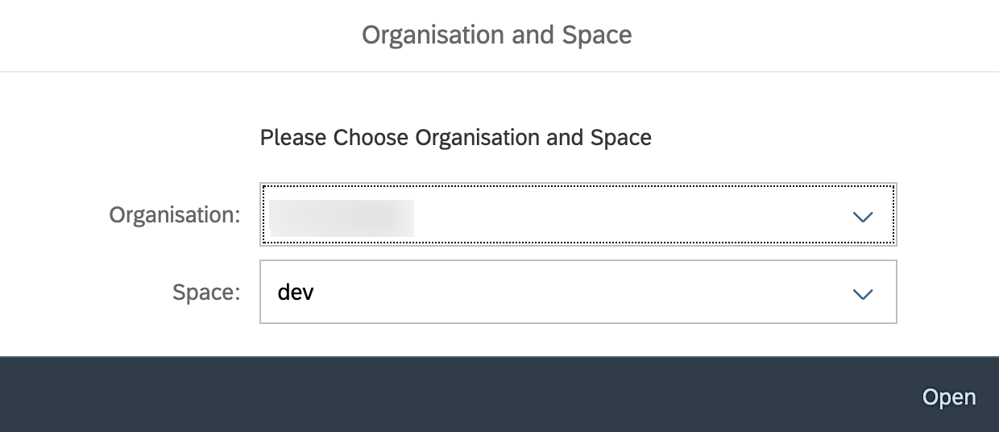
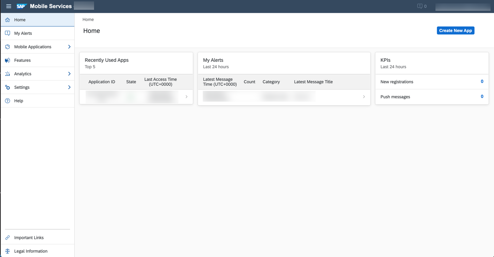

## Prerequisites  
- You have [Set Up a BTP Account for Tutorials](group.btp-setup). Follow the instructions to get an account, and then to set up entitlements and service instances for the following BTP services.
    - **SAP Mobile Services**

## Details
### You will learn
  - How to access SAP Mobile Services in your BTP account

Once SAP Mobile Services is available, you can use its features in your Mobile development kit, Mobile Cards, SAP BTP SDK for iOS & Android apps.

---

[ACCORDION-BEGIN [Step 1: ](Go to your global account on SAP BTP)]

> Make sure you are choosing the right BTP account type ( **Free Tier** or **Free Trial** ) in the tabs under Step 1.

[OPTION BEGIN [Free Tier]]

1. In your web browser, open the [SAP BTP cockpit](https://account.hana.ondemand.com/cockpit).

2. Provide the login details and click **Log On**.

    !

3. Enter your Global Account.

    !

[OPTION END]

[OPTION BEGIN [Free Trial]]

1. In your web browser, open the [SAP BTP Trial cockpit](https://account.hanatrial.ondemand.com/cockpit).

2. Provide the login details and click **Log On**.

    !

3. Navigate to the trial global account by clicking **Go To Your Trial Account**.

    !

[OPTION END]

[DONE]
[ACCORDION-END]

[ACCORDION-BEGIN [Step 2: ](Launch SAP Mobile Services cockpit)]

1. Click subaccount available in your global account.

    !

2. In the left pane, choose **Services** **&rarr;** **Service Marketplace**.

    >The **Service Marketplace** is where you can find services to attach to any of your applications. These services are provided by SAP BTP to create, and produce applications quickly and easily. Once a service has been created, it is known as a `service instance`.

    !

3. Search for **Mobile**, and click **Mobile Services** tile.  

    !

4. Choose **Support** to open **SAP Mobile Services Cockpit**.

    !

5. If you are asked to sign in then enter your Email or Username to continue and click **Next**.

6. Choose the relevant **Organization** and **Space** from the dropdown list, and then select **Open**.

    >**Organization:** Organizations in CF enable collaboration among users and enable grouping of resources.

    >**Space:** Cloud Foundry has a standard working environment for individual applications: it is called a space. Spaces are individual working areas, which normally contain a single application.

    !

    You have now logged in to the SAP Mobile Services cockpit.

    !

    Bookmark the **Mobile Services cockpit URL** for quick access.

[VALIDATE_3]
[ACCORDION-END]
