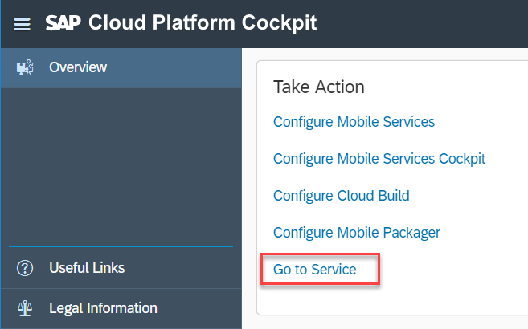

## Prerequisites  
 - **Tutorials:** [Sign up for an free trial account on SAP Cloud Platform](hcp-create-trial-account.html)

## Details
### You will learn  
In this tutorial, you will enable SAP Cloud Platform Mobile Services in your NEO trial account.  Once it is enabled, you can use the features of Mobile Services in your SAP Cloud Platform SDK for iOS and Android apps.

---

[ACCORDION-BEGIN [Step 1: ](Open SAP Cloud Platform cockpit)]

Go to your [SAP Cloud Platform cockpit](https://account.hanatrial.ondemand.com) and log on.

Click on Neo Trial.

[DONE]
[ACCORDION-END]

[ACCORDION-BEGIN [Step 2: ](Navigate to SAP Cloud Platform Mobile Services)]

From the SAP Cloud Platform Cockpit page, click **Services** in the navigation bar, scroll down until you see the Mobile group then click on the **Mobile Services** tile.

[DONE]
[ACCORDION-END]

[ACCORDION-BEGIN [Step 3: ](Enable Mobile Services)]

If **Mobile Services** is not enabled, click the blue **Enable** button and wait a few seconds until the green **Enabled** badge appears.

[VALIDATE_3]

[ACCORDION-END]

[ACCORDION-BEGIN [Step 4: ](Open the Management Cockpit)]

Click on **Go to Service** to open the Mobile Services Management Cockpit.

[DONE]
[ACCORDION-END]
