## Prerequisites  
 - [Introduction to iOS development resources and Xcode](https://www.sap.com/developer/tutorials/xcode-introduction.html)

## Next Steps
 - Select a tutorial from the [Tutorial Navigator](http://www.sap.com/developer/tutorial-navigator.html) or the [Tutorial Catalog](http://www.sap.com/developer/tutorials.html)

## Details
### You will learn  
In this tutorial you will learn how to separate your code from your texts, collect these text in string files and have them machine translated using the SAP Translation Hub

### Time to Complete
**20 Min**

---

[ACCORDION-BEGIN [Step 1: ](Create a small app to work with)]

To create your first project, click on **File > New > Project** in the menu bar. When you do so, you will be presented with a number of application templates. Choose **Single View Application**, and click the **Next** button. On the next screen, please enter the project options below and press **Next**:

|Field Name                 | Value                     |
|---------------------------|---------------------------|
|Product Name               | `DemoApp`                 |
|Organization Identifier    | `com.sap.tutorial.swift`  |
|Language                   | `Swift`                   |
|Devices                    | `Universal`               |

Choose an appropriate location for your project and click on the **Create** button.

[DONE]
[ACCORDION-END]

[ACCORDION-BEGIN [Step 2: ](Create a simple view containing two labels and a button)]

In the **Project Navigator** click on the **`Main.storyboard`** file. This should show a scene with just one View.

Add two labels to the view and make sure they are in the center and cover the entire width of the view. The text of the labels should be set to `Welcome!` and `English`. Make sure the Welcome label is slightly larger and set to bold, to make it appear as a title.

Also add a button and set the text attribute of the button to `Confirm`. Your view should look similar to this:

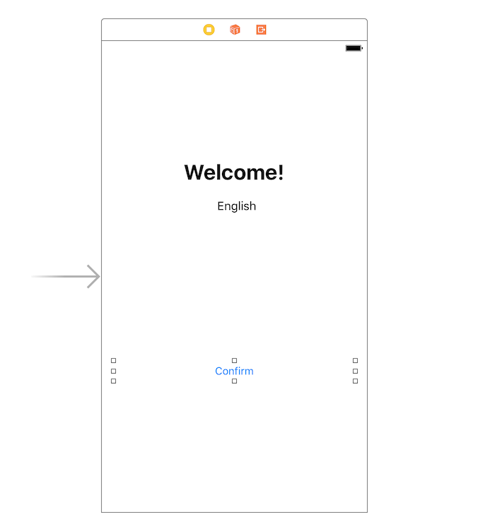

[DONE]
[ACCORDION-END]

[ACCORDION-BEGIN [Step 3: ](Run the application and inspect the screen)]

Run the app by pressing the **Build and Run** button at the top left section of the toolbar. The simulator will start and will show the view you just constructed.

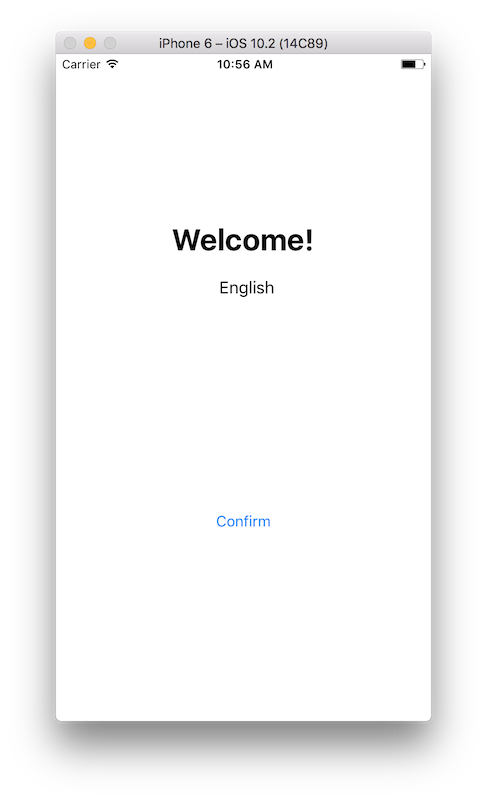

As you can see from the screenshot, you will need to localize 3 items:

- `Welcome!` title
- `English` label
- `Confirm` button

[DONE]
[ACCORDION-END]

[ACCORDION-BEGIN [Step 4: ](Set the application's target languages)]

Click on **`DemoApp`** in the **Project Navigator** and subsequently on the **`DemoApp`** project in the **Project and targets** list. Make sure the **Info** tab is selected in the editor section of the screen.

The **Info** tab contains a section called **Localizations**, in which all languages are listed that are supported by the app. To add a new language, click on the **+**-button near the bottom of this section and select 'German'.

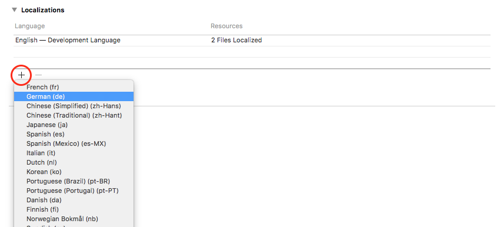

A dialog will appear showing the resource files that could be localized.

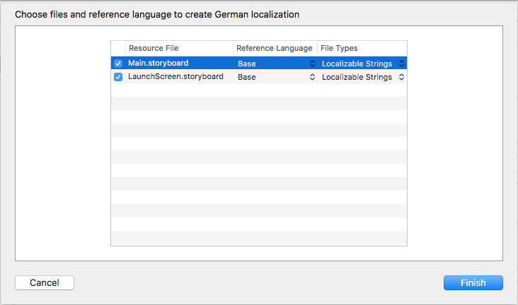

Keep both files checked and press the **Finish** button.

You should now see that German has been added:

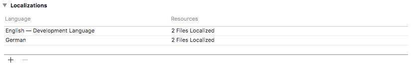

[DONE]
[ACCORDION-END]

[ACCORDION-BEGIN [Step 5: ](Inspect the main.storyboard's translations)]

If you have a look at the **Project Navigator**, you can see that there is now an expand-icon in on the left of the `main.storyboard` file. If you click on the **expand-icon** to expand the `main.storyboard` file, you will noticed that it now contains two translations. One for the original language, and one for the language you just added:

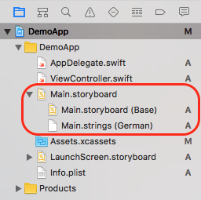

If you click on the `Main.strings (German)` file, a text-editor pops up, which is showing you all strings present in the application's storyboard. However, these strings are still in English, while this is supposed to be the German translation.

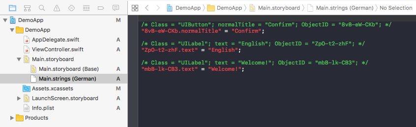

[DONE]
[ACCORDION-END]

[ACCORDION-BEGIN [Step 6: ](Enable the Translation Hub service)]

If you are using the Translation Hub for the first time, you will notice that the service is not enabled yet:

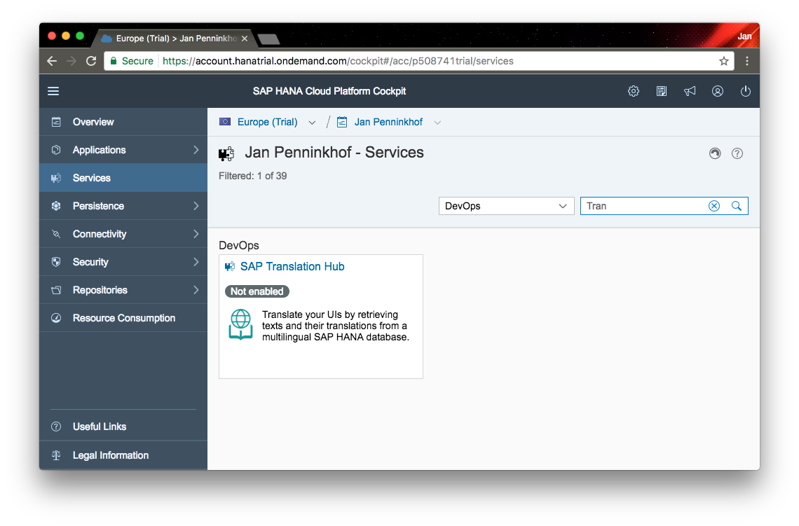

To find the Translation Hub service, select **Services** from the main menu, and look for **SAP Translation Hub** tile in the `DevOps` section. To enable the service, click on the **SAP Translation Hub** tile and click the **Enable** button.

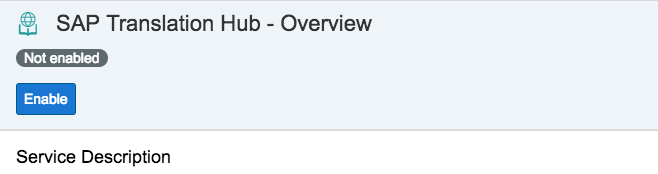

Once the service has been enabled, `Not Enabled` will change into `Enabled` and the **Enable** button will disappear.

[DONE]
[ACCORDION-END]

[ACCORDION-BEGIN [Step 7: ](Create a translation project for your app)]

To start the Translation Hub cockpit, click on the **Go to service** link in the service details page:

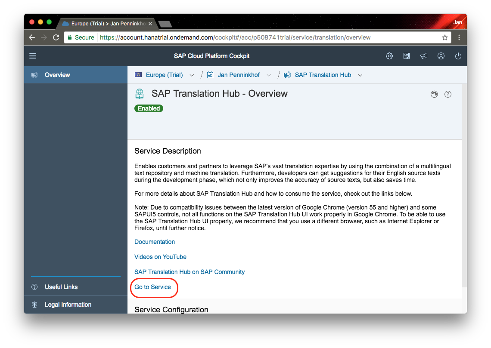

In the Translation Hub cockpit, create a new project by clicking on the **+**-button in the bottom of the screen. In the pop-up menu, pick the **File Upload** option:

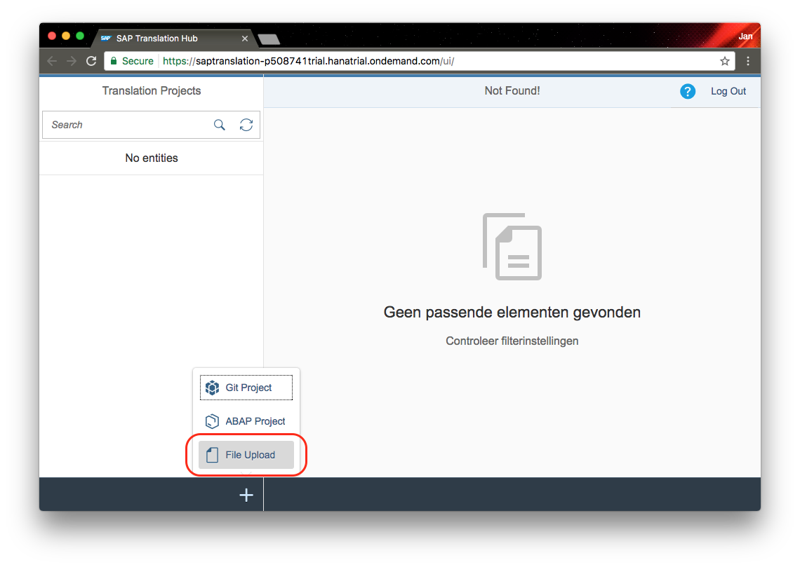

In the project details screen enter values below:

|Field Name                 | Value                     |
|---------------------------|---------------------------|
|Project Name               | `demoapp`                 |
|File Type                  | `iOS Strings File`        |
|Domain                     | `Basis`                   |
|Target Languages           | `German`                  |

After entering these values, click on the **Save** button.

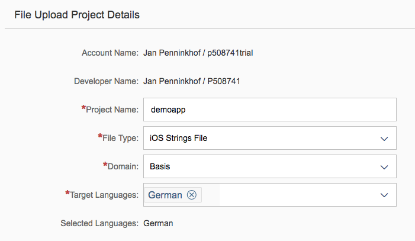

> Note: The domain that is entered here represents the context from which translations have to been taken. For example, the English word `Order` can have several meanings. To make sure the right meaning is selected for the translation, the context can be indicated by selecting the **Domain** value.

[DONE]
[ACCORDION-END]

[ACCORDION-BEGIN [Step 8: ](Upload the string file from the Xcode project)]

To upload a file, click on the **Upload File** button. In the file explorer you can then navigate to the project folder of your Xcode project. In the project structure you can selected file `de.lproj/Main.strings`, which is the file you opened in the editor in step 5.

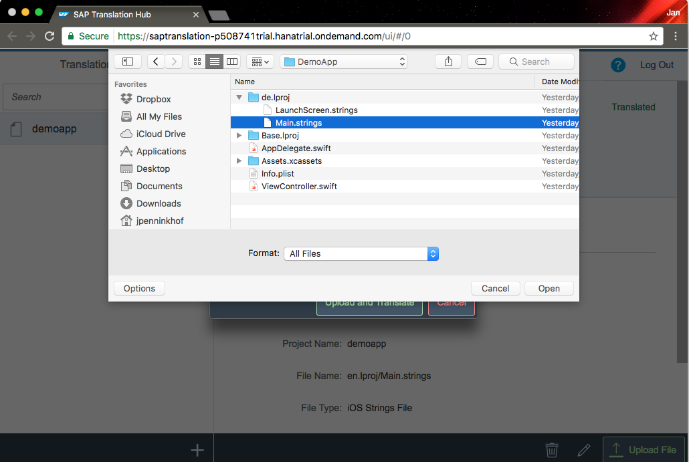

[DONE]
[ACCORDION-END]

[ACCORDION-BEGIN [Step 9: ](Inspect the translation)]

After uploading the file, the file is getting translated by the SAP Translation Hub. When this is done, you will be able to see the translations in the **Translations** tab:

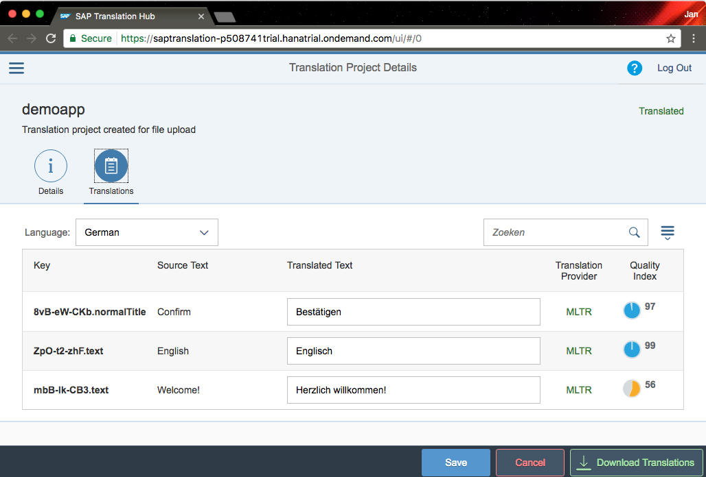

In this screen you will see the original text and the text has been translated to. On top of that, you will see a few additional columns.

> The **Translation Provider** indicates where the translation comes from . MLTR stands for the Central Multilingual Text Repository that has been accumulated by SAP in over 30 years, across multiple products and in up to 39 languages.

>The **Quality index** shows the estimated translation quality based on ratings that language specialists provide. The higher the number on a scale from 0-100, the better the quality.

If the translation is not correct and needs to be changed, you can make the changes from this screen as well.

Change the word `Englisch` to `Deutsch` as it should not be translated, but should indicate the language:

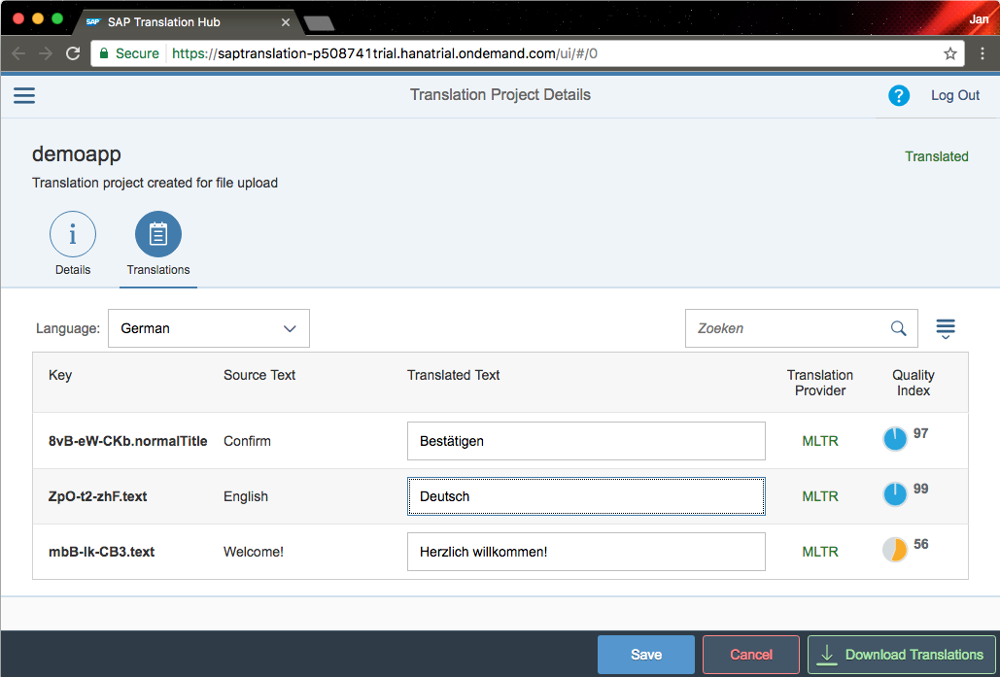

After changing the translation, press the **Save** button.

[DONE]
[ACCORDION-END]

[ACCORDION-BEGIN [Step 10: ](Download the translation and insert it into the project)]

To download the project, click on the **Download Translations** button. Your browser will then download the translated files as zip-file.

Once is it download, open it with the finder and copy the translated `Main.strings` file to your Xcode project, overwriting the file that was already present:

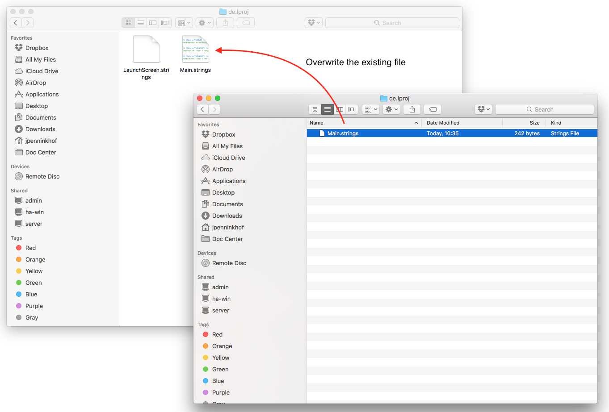

[DONE]
[ACCORDION-END]

[ACCORDION-BEGIN [Step 11: ](Switch back to Xcode and verify the result)]

When you copied the file, Xcode should have found out that the file changed, and the file should have been reloaded. Instead of the English translation, it should now show the German translation:

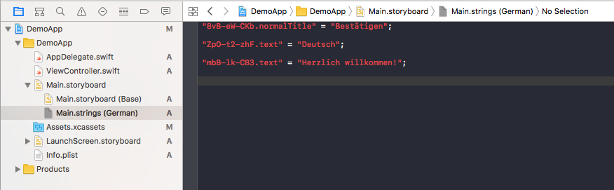

[DONE]
[ACCORDION-END]

[ACCORDION-BEGIN [Step 12: ](Run the application in German)]

When you run the app by pressing the **Build and Run** button at the top left section of the toolbar, the app will show in English. To make the German translation visible, click on the **Scheme** button (it says `DemoApp`), in the top left section of the toolbar, and click on **Edit Scheme**. Within the **Scheme editor** select **Run** from the master section and make sure tab **Options** is selected. Change the **Application Language** to **German** and press the **Close** button.

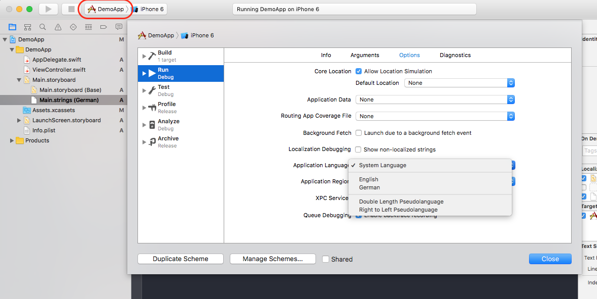

If you run the app by pressing the **Build and Run** button at the top left section of the toolbar, the app will be running in German.

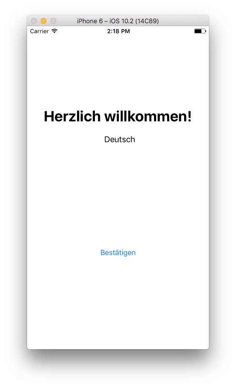

> Note: You could achieve a similar result by changing the system language of your emulator or iOS device to German in **Settings > General > Language & Region > iPhone Language** and relaunching the app.

[DONE]
[ACCORDION-END]

## Next Steps
- Select a tutorial from the [Tutorial Navigator](http://www.sap.com/developer/tutorial-navigator.html) or the [Tutorial Catalog](http://www.sap.com/developer/tutorials.html)
