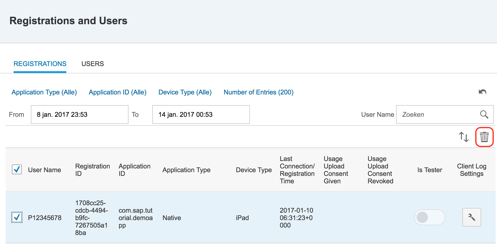
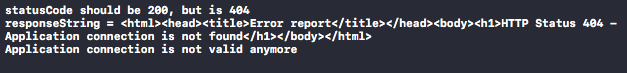
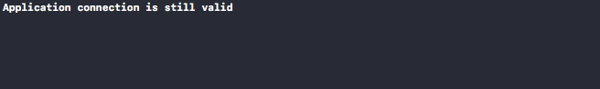

## Prerequisites  
 - [Securely store User Credentials and Application Connection ID in the iOS keychain](http://www.sap.com/developer/tutorials.html?fiori-ios-hcpms-secure-credentials-keychain.html)

## Next Steps
 - [Read data from the ES4 back-end and present it in the iOS app](http://www.sap.com/developer/tutorials.html?fiori-ios-hcpms-retrieve-odata-service.html)

## Details
### You will learn  
Your device only needs to be registered once. If the registration is still valid, a new registration does not need to be attempted. To verify whether the registration is in place, the the current status needs to be retrieved from the SAP Cloud Platform Mobile Services. In this tutorial you will learn how to call the SAP Cloud Platform Mobile service to validate the registration status of your device.

### Time to Complete
**15 Min**

---

[ACCORDION-BEGIN [Step 1: ](Check the status of the isRegistered function)]

In the **Project Navigator**, click on the `HCPms.swift` file. This file contains the `isRegistered` function which was inserted in a [previous tutorial](http://www.sap.com/developer/tutorials.html?fiori-ios-hcpms-device-registration.html). At the time it was inserted, it was a placeholder and returned the class instance variable `registered`. This variable was set to true when the `register` function completed successfully. However, when the application is relaunched, the registration may have been removed by an administrator, so it is recommended to check the registration status at least on application startup.

To verify the registration status, a service needs to be called on the SAP Cloud Platform. This call contains the Application Connection ID (`appcid` in short). The service will return HTTP status 200 is the `appcid` is still valid.

Replacing the current logic with logic that performs this service call is going to be the objective of this tutorial.

[DONE]
[ACCORDION-END]

[ACCORDION-BEGIN [Step 2: ](Add helper function getAppcid)]

For convenience, add helper function `getAppcid` to retrieve the `appcid` from the iOS keyring. To do this, insert the code below just above the `getSecureString` function:

```swift
func getAppcid() -> String? {
    return getSecureString(forKey: "appcid")
}
```

[DONE]
[ACCORDION-END]

[ACCORDION-BEGIN [Step 3: ](Add the serviceRoot variable)]

To check whether the device is registered, it will suffice to make a simple call to the OData back-end service. The service URL, without any additional parameter should return a list of entities. If you have followed these tutorials this may sound familiar, as you have seen this list in step 1 of tutorial [Configure back-end connection](http://www.sap.com/developer/tutorials.html?fiori-ios-hcpms-backend-connection.html).

To add the service Root to your application, insert the code below just before the definition of `connectionRoot`:

```swift
private lazy var serviceRoot: String = {
    return "https://hcpms-\(self.hcpAccountId).\(self.hcpLandscape)/\(self.hcpAppId)"
}()
```

This code will allow you to use `serviceRoot` similar to a variable in your code. Once the variable is being used, it is quickly calculated.

[DONE]
[ACCORDION-END]

[ACCORDION-BEGIN [Step 4: ](Add the appcidChecked variable)]

To check verify the `appcid` only once, a new class variable `appcidChecked` is introduced. This variable will be set to `false` by default. When the application connection has been verified, it will be set to true. This allows the `isRegistered` function to verify the connection status only once every time the application is started.

To introduce the `appcidChecked` variable, replace line:
```swift
private var registered = false
```
with
```swift
private var appcidChecked = false;
```

The `registered` variable won't be necessary anymore, because the application will now be using real registration and registration verification instead of returning a mocked-up value that was stored in this variable.

Press **⌘+B** to build the project. Once the project is built, you will see a few red exclamation marks in your code. These lines still refer to the `registered` variable, which doesn't exist anymore. Remove all these lines and build the project again by pressing **⌘+B**. All exclamation marks should have disappeared, except for the `isRegisted` function, which doesn't contain any logic anymore.

[DONE]
[ACCORDION-END]

[ACCORDION-BEGIN [Step 5: ](Replace the isRegistered function)]

The `isRegistered` function is now empty, please replace the current `isRegistered` function with the one below:

```swift
func isRegistered() -> Bool {
    if getAppcid() != nil && !appcidChecked {
        // If there is an AppCid, check whether it is still valid
        let semaphore = DispatchSemaphore(value: 0)
        var request = URLRequest(url: URL(string: serviceRoot)!)
        let authString = createBasicAuthString()
        if (authString != nil) {
            request.setValue("Basic \(authString!)", forHTTPHeaderField: "Authorization")
        }
        request.setValue(getAppcid(), forHTTPHeaderField: "X-SMP-APPCID")
        request.httpMethod = "GET"
        let dataTask = URLSession.shared.dataTask(with: request) { (data, response, error) in
            guard let data = data, error == nil else {
                print("error=\(error)")
                return
            }
            if let httpStatus = response as? HTTPURLResponse, httpStatus.statusCode != 200 {
                print("statusCode should be 200, but is \(httpStatus.statusCode)")
                let responseString = String(data: data, encoding: .utf8)
                print("responseString = \(responseString!)")
                switch httpStatus.statusCode {
                case 404:
                    print("Application connection is not valid anymore")
                    self.deleteSecureObject(forKey: "appcid")
                    self.deleteSecureObject(forKey: "userid")
                    self.deleteSecureObject(forKey: "password")
                default:
                    print("Unknown")
                }
            }
            self.appcidChecked = true;
            semaphore.signal()
        }
        dataTask.resume()
        _ = semaphore.wait(timeout: .distantFuture)
    }
    return getAppcid() != nil
}
```

After pressing **⌘+B** to build the project, you shouldn't see any exclamation marks anymore.

The `isRegistered` function will build a request performing a `GET` request from the service URL, containing the previously retrieved `appcid` and an basic authentication string in request headers.

When request results in a HTTP status `200 (OK)`, the `appcid` is still valid. If there is another status, an error occurred, or the application ID is not valid anymore. If the `appcid` is not valid anymore, the service will return http status `404 (not found)` in that case, the appcid and the credentials that were stored in the iOS keychain are invalidated by deleting them from the keychain.

> Note: As it doesn't make sense for the application to start retrieving data if the connection ID is invalid, the function is run synchronously and will only return when the connection status has been determined. Do encapsulate the asynchronous `dataTask` into a synchronous function, a semaphore is used. To find out more about semaphores, please refer to the [Apple API reference](https://developer.apple.com/reference/dispatch/dispatchsemaphore).

[DONE]
[ACCORDION-END]

[ACCORDION-BEGIN [Step 6: ](Remove any existing registrations for the app)]

In the previous tutorial, you have already registered the device. Go to the SAP Cloud Platform Mobile Services cockpit to remove the registration, but clicking on the **Registrations and Users Tile**, selecting the existing registration and clicking the **Delete** button:



[DONE]
[ACCORDION-END]

[ACCORDION-BEGIN [Step 7: ](Run the application for the first time)]

Run the app by pressing the **Build and Run** button at the top left section of the toolbar. The simulator will start and will show the login screen of your application.

At the same time, you will see the text below in your Xcode console:



Once you have logged in, you should be seeing the table view again, similar to what happened at the end of the previous tutorials. Your debug console should show your connection ID.

If you go back to the cockpit of SAP Cloud Platform Mobile Service for Development and Operations, you should see that the a new registration has been added again to **Registrations and User**.

[DONE]
[ACCORDION-END]

[ACCORDION-BEGIN [Step 8: ](Run the application for the second time)]

Run the app again by pressing the **Build and Run** button at the top left section of the toolbar. The app will be rebuilt and restarted.

As soon as the app starts, it will check whether the registration status is still valid. When if finds out that the registration status is valid, it won't show the login screen anymore and will stay in the table view.

At the same time, you will see the text below in your Xcode console:



[DONE]
[ACCORDION-END]

## Next Steps
- [Read data from the ES4 back-end and present it in the iOS app](http://www.sap.com/developer/tutorials.html?fiori-ios-hcpms-retrieve-odata-service.html)
